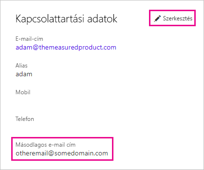

# <a name="use-an-alternate-email-address"></a>Másodlagos e-mail-cím használata

Ha regisztrál a Power BI-ra, meg kell adnia egy e-mail-címet. A Power BI alapértelmezés szerint erre az e-mail-címre küld frissítéseket a szolgáltatásbeli tevékenységeiről. Ha például valaki megosztási felkérést küld Önnek, az erre az e-mail-címre fog megérkezni.

Bizonyos esetekben ezeket az üzeneteket érdemes lehet a regisztrációkor megadott e-mail-cím helyett inkább egy másodlagos e-mail-címre kézbesíttetni. Ez a cikk ismerteti, hogyan adhat meg egy másodlagos e-mail-címet a Microsoft 365-ben és a PowerShell-ben. A cikk azt is bemutatja, hogyan oldja fel az e-mail-címeket az Azure Active Directory (Azure AD).

> [!NOTE]
> A másodlagos e-mail-cím megadása azt nem befolyásolja, hogy a Power BI melyik címre küldi a szolgáltatásfrissítéseket, hírleveleket és más promóciós értesítéseket. Ezeket az üzeneteket a rendszer mindig a Power BI-regisztrációnál megadott e-mail-címre küldi.

## <a name="use-microsoft-365"></a>A Microsoft 365 használata

Kövesse az alábbi lépéseket másodlagos e-mail-cím megadásához a Microsoft 365-ben.

1. Nyissa meg a fiókja [Személyes adatok](https://portal.office.com/account/#personalinfo) lapját. Ha az alkalmazás kéri, jelentkezzen be a Power BI-hoz használt e-mail-címmel és jelszóval.

1. A bal oldali menüben válassza a **Személyi adatok** lehetőséget.

1. A **Kapcsolattartási adatok** szakaszban válassza a **Szerkesztés** elemet.

    Ha nem tudja szerkeszteni az adatait, az azt jelenti, hogy az e-mail-címét a rendszergazdája kezeli. Forduljon a rendszergazdához az e-mail-cím frissítéséhez.

    

1. A **Másodlagos e-mail-cím** mezőbe írja be az e-mail-címet, amelyre a Power BI-tevékenységével kapcsolatos frissítéseket szeretné kapni a Microsoft 365-től.

## <a name="use-powershell"></a>A PowerShell használata

A PowerShellben a [Set-AzureADUser](/powershell/module/azuread/set-azureaduser/) paranccsal adhat meg másodlagos e-mail-címet.

```powershell
Set-AzureADUser -ObjectId john@contoso.com -OtherMails "otheremail@somedomain.com"
```

## <a name="email-address-resolution-in-azure-ad"></a>E-mail-cím feloldása az Azure AD-ben

Az Azure AD Power BI-hoz tartozó beágyazási tokenjének rögzítéséhez háromféle e-mail-címtípus használható:

* A felhasználó Azure AD-fiókjához tartozó fő e-mail-cím

* az egyszerű felhasználónévhez (UPN) tartozó e-mail-cím

* Az *egyéb e-mail-cím* tömbattribútum

A Power BI a következő sorrendben választja ki a használandó e-mail-címet:

1. Ha az Azure AD-bérlő felhasználói objektumának „mail” attribútuma létezik, akkor a Power BI ezt az attribútumot használja e-mail-címként.

1. Ha az UPN-hez tartozó e-mail-cím *nem* **\*.onmicrosoft.com** tartománybeli cím (ez a „\@” jelet követő részből derül ki), akkor a Power BI ezt az attribútumot használja e-mail-címként.

1. Ha az Azure AD-beli felhasználóobjektum *egyéb e-mail-cím* tömbattribútuma ki van töltve, akkor a Power BI az ebben a listában szereplő első e-mail-címet használja (mivel ez az attribútum e-mail-címek listáját is tartalmazhatja).

1. Ha a fenti feltételek egyike sem teljesül, akkor a Power BI az UPN-címet fogja használni.

További kérdései vannak? [Kérdezze meg a Power BI közösségét](https://community.powerbi.com/)