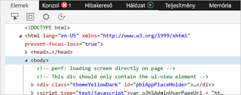
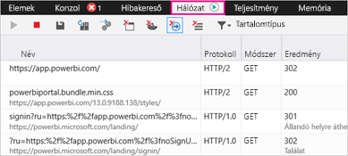
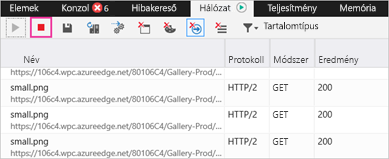
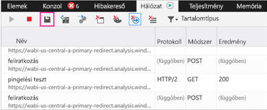

# További diagnosztikai adatok gyűjtése a Power BI számára

Ez a cikk két lehetséges módszert kínál további diagnosztikai adatok manuális begyűjtésére a Power BI-webügyféltől.

1. Nyissa meg a [Power BI](https://app.powerbi.com)-t a Microsoft Edge-ben vagy az Internet Explorerben.

1. Nyomja le az **F12** billentyűt a Microsoft Edge fejlesztői eszközeinek megnyitásához.

   

1. Válassza a **Hálózat** lapot. Itt látható az eddig rögzített forgalom.

   

    A következőket teheti:

    * Az ablakban böngészve minden felmerülő probléma reprodukálható.

    * A fejlesztői eszközök ablaka a munkamenet során bármikor megjeleníthető és elrejthető az F12 billentyű lenyomásával.

1. A munkamenet profilkészítésének leállításához válassza a piros négyzetet a fejlesztői eszközök terület **Hálózat** fülén.

   

1. Az adatok HTTP-archív (HAR-) fájlként való exportálásához válassza a lemez ikont.

   

1. Adjon nevet a HAR-fájlnak és mentse.

    A HAR-fájl minden információt tartalmaz a böngészőablak és a Power BI közötti hálózati kérelmekről, többek között a következőket:

    * Az egyes kérések tevékenységazonosítói.

    * Az egyes kérések pontos időbélyegzője.

    * Az ügyfélnek visszaadott hibaüzenetek.

    Tartalmazza a képernyőn megjelenő vizualizációk feltöltéséhez használt adatokat is.

1. A HAR-fájlt átadhatja vizsgálatra a támogatási szolgálatnak.

További kérdései vannak? [Kérdezze meg a Power BI közösségét](https://community.powerbi.com/)
