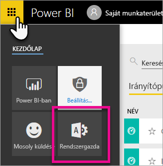
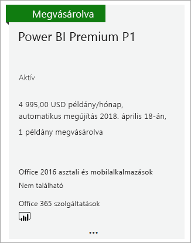

# A Power BI Premium megvásárlása

Ez a cikk azt ismerteti, hogyan vásárolhat Power BI Premium-kapacitást cége számára. A cikk két forgatókönyvet érint:

- P termékváltozatok használata a tipikus éles környezetekben. A P termékváltozatokhoz havi vagy éves kötelezettségvállalásra van szükség, és havi díjat számítunk fel.

- Az A termékváltozatok használata tesztelési forgatókönyvekhez, illetve olyan esetekhez, amikor nem rendelkezik a P termékváltozatok megvásárlásához szükséges engedélyekkel (Microsoft 365 globális rendszergazdai szerepkör vagy számlázási rendszergazdai szerepkör). Az A termékváltozatokhoz nem szükséges időalapú kötelezettségvállalás, és a számlázás óránként történik. Az A termékváltozatokat az [Azure Portalon](https://portal.azure.com) lehet megvásárolni.

További információt a Power BI Premiumról a [Mi az a Power BI Premium?](service-premium-what-is.md) című cikkben talál. A jelenlegi díjszabással kapcsolatos és további tervezési információkat a [Power BI díjszabását ismertető oldalon](https://powerbi.microsoft.com/pricing/) és a [Power BI Premium-kalkulátor](https://powerbi.microsoft.com/calculator/) oldalán talál. A tartalmak létrehozóinak továbbra is [Power BI Pro-licencre](service-admin-purchasing-power-bi-pro.md) lesz szükségük, abban az esetben is, ha vállalata a Power BI Premiumot használja. Legalább egy Power BI Pro-licencet meg kell vásárolnia cége számára. Az A termékváltozat használatakor a tartalmat használó _összes felhasználónak_ Pro-licenccel kell rendelkeznie.

> [!NOTE]
> Egy Premium-előfizetés lejárta után 30 napig a kapacitása még teljes mértékben a rendelkezésére áll. Ezután tartalmai megosztott kapacitásra állnak vissza. 1 GB-nál nagyobb méretű modellek nem támogatottak megosztott kapacitásban.

## P termékváltozatok vásárlása a tipikus éles környezetekhez

Létrehozhat egy új bérlőt a Power BI Premium P1 SKU-val konfigurálva, vagy megvásárolhat egy Power BI Premium kapacitást egy meglévő szervezet számára. Mindkét esetben lehetőség van további kapacitás hozzáadására, ha szüksége van rá.

### Új bérlő létrehozása a Power BI Premium P1 csomaggal

Ha nem rendelkezik meglévő bérlővel, és létre szeretne hozni egyet, ezzel egy időben megvásárolhatja a Power BI Premiumot. A következő hivatkozás végigvezeti egy új bérlő létrehozásának folyamatán, és a segítségével megvásárolhatja a Power BI Premiumot: [Power BI Premium P1 ajánlat](https://signup.microsoft.com/Signup?OfferId=b3ec5615-cc11-48de-967d-8d79f7cb0af1). Amikor létrehoz egy bérlőt, automatikusan hozzá lesz rendelve a bérlőhöz tartozó Microsoft 365 globális rendszergazdai szerepkörhöz.

A kapacitás megvásárlása után ismerje meg, hogyan [felügyelheti a kapacitásokat](service-admin-premium-manage.md#manage-capacity), és hogyan [rendelhet hozzá munkaterületeket](service-admin-premium-manage.md#assign-a-workspace-to-a-capacity) a kapacitáshoz.

### Power BI Premium-kapacitás vásárlása meglévő szervezet számára

Ha rendelkezik egy meglévő vállalattal (bérlővel), akkor előfizetések és licencek vásárlásához az Microsoft 365 globális rendszergazdai szerepkörrel vagy számlázási rendszergazdai szerepkörrel kell rendelkeznie. További információ: [A Microsoft 365 rendszergazdai szerepkörei](https://support.office.com/article/About-Office-365-admin-roles-da585eea-f576-4f55-a1e0-87090b6aaa9d).

Premium-kapacitás vásárlásához kövesse az alábbi lépéseket.

1. A Power BI szolgáltatásban válassza a Microsoft 365 alkalmazásválasztót, majd a **Rendszergazda** lehetőséget.

    

    Másik lehetőségként megnyithatja a Microsoft 365 Felügyeleti központját.

1. Válassza a **Számlázás** > **Szolgáltatások vásárlása** lehetőséget.

1. Az **Egyéb csomagok** területen keresse meg a Power BI Premium ajánlatait. Itt az alábbi lehetőségek közül választhat: P1-től P3-ig, valamint EM3 és P1 (havonta megújuló).

1. Helyezze a kurzort a három pont fölé ( **. . .** ), majd válassza a **Vásárlás** lehetőséget.

    

1. A vásárlás megerősítéséhez kövesse a lépéseket.

A vásárlás befejezése után a **Szolgáltatások vásárlása** oldalon a termék megvásároltként és aktívként jelenik meg.

A kapacitás megvásárlása után ismerje meg, hogyan [felügyelheti a kapacitásokat](service-admin-premium-manage.md#manage-capacity), és hogyan [rendelhet hozzá munkaterületeket](service-admin-premium-manage.md#assign-a-workspace-to-a-capacity) a kapacitáshoz.

### További kapacitások vásárlása

Most, hogy rendelkezik egy kapacitással, az igények növekedésének megfelelően hozzáadhat továbbiakat is. Cégében a Premium-kapacitások termékváltozatainak bármely kombinációját (P1-től P3-ig) használhatja. A különböző termékváltozatok különböző erőforrás-képességeket biztosítanak.

1. A Microsoft 365 Felügyeleti központjában válassza a **Számlázás** > **Szolgáltatások vásárlása** lehetőséget.

1. Keresse meg azt a Power BI Premium-elemet, amelyből további példányokat szeretne vásárolni az **Egyéb csomagok** területen.

1. Helyezze a kurzort a **További lehetőségek** (…) fölé, majd válassza a **Licencmennyiség módosítása** lehetőséget.

    

1. Adja meg az elemhez használni kívánt példányok számát. Ha kész, válassza a **Küldés** lehetőséget.

   > [!IMPORTANT]
   > A **Küldés** lehetőség választása megterheli a nyilvántartásba vett hitelkártyát.

A **Szolgáltatások vásárlása** lapon ekkor megjelenik a példányok száma. A Power BI felügyeleti portáljának **Kapacitásbeállítások** területén az elérhető virtuális magok megjelenítik az új kapacitást.

### Az előfizetés megszüntetése

Az előfizetést a Microsoft 365 Felügyeleti központjában szüntetheti meg. A Premium-előfizetés megszüntetéséhez végezze el az alábbi műveleteket.

1. Nyissa meg a Microsoft 365 Felügyeleti központot.

1. Válassza a **Számlázás** > **Előfizetések** lehetőséget.

1. Válassza ki a listából a Power BI Premium-előfizetését.

1. Válassza a **További műveletek** > **Előfizetés megszüntetése** lehetőséget.

1. Az **Előfizetés megszüntetése** lapon tájékoztatást kap arról, hogy kell-e [idő előtti megszüntetésért felszámolt díjat](https://support.office.com/article/early-termination-fees-6487d4de-401a-466f-8bc3-c0beb5cc40d3) fizetnie. Ezen a lapon azt is megtudhatja, hogy mikor törlődnek az előfizetés adatai.

1. Olvassa végig az adatokat, és ha folytatni kívánja, válassza az **Előfizetés megszüntetése** lehetőséget.

#### Törlésnél, vagy amikor lejár a licenc

Ha törli a Prémium előfizetést, vagy ha lejár a kapacitáslicenc, a törlés idejét vagy a licenc lejáratát követő 30 napon keresztül továbbra is hozzáférhet a prémium kapacitásokhoz. A 30 nap letelte után nem tudja majd elérni a prémium kapacitásokat és a bennük található munkaterületeket.

## Az A SKU megvásárlása tesztelési és egyéb forgatókönyvekhez

Az A SKU-k az Azure Power BI Embedded szolgáltatásán keresztül érhetők el. Az A SKU-kat a következő módokon használhatja:

- A Power BI harmadik féltől származó alkalmazásokban való beágyazásának engedélyezése. További információkat a [Power BI Embedded oldalán](../developer/embedded/azure-pbie-what-is-power-bi-embedded.md) találhat.

- A P SKU megvásárlása előtt tesztelje a prémium szintű funkciókat.

- Fejlesztési és tesztelési környezeteket hozhat létre a P SKU-t használó éles környezettel együtt.

- Megvásárolhatja a Power BI Premiumot még akkor is, ha Ön nem rendelkezik Microsoft 365 globális rendszergazdai szerepkörrel vagy számlázási rendszergazdai szerepkörrel.

> [!NOTE]
> Ha A4-es vagy magasabb szintű SKU-t vásárol, használhatja az összes prémium funkciót, kivéve a tartalom korlátlan megosztását. Az A termékváltozat használatakor a tartalmat használó _összes felhasználónak_ Pro-licenccel kell rendelkeznie.

A következő lépésekkel vásárolhat A SKU-kat az Azure Portalon:

1. Jelentkezzen be az [Azure Portalon](https://portal.azure.com) egy olyan fiókkal, amely legalább kapacitás-rendszergazdai engedélyekkel rendelkezik a Power BI-ban.

1. Keressen rá a _Power BI Embedded_ kifejezésre, és válassza ki a szolgáltatást a keresési eredmények között.

    

1. Válassza a **Power BI Embedded létrehozása** lehetőséget.

    

1. A **Power BI Embedded** létrehozás képernyőjén adja meg a következő adatokat:

    - Az az **előfizetés**, amelyben létre kívánja hozni a Power BI Embedded szolgáltatást.

    - Az a fizikai **hely**, amelyben létre kívánja hozni a szolgáltatást tartalmazó erőforráscsoportot. A jobb teljesítmény érdekében ennek a helynek a Power BI-hoz használt Azure Active Directory-bérlő helyéhez közel kell lennie.

    - A használni kívánt meglévő **erőforráscsoport**, vagy hozzon létre egy újat, ahogy az a példában látható.

    - A **Power BI kapacitásadminisztrátor**. A kapacitás-rendszergazdának az Azure AD-bérlőbeli tagnak vagy egyszerű szolgáltatásnévnek kell lennie.

    

1. Ha a Power BI Premium összes funkcióját szeretné használni (kivéve a korlátlan megosztást), legalább egy A4-es SKU-ra van szüksége. Válassza a **Méret módosítása** lehetőséget.

    

1. Válasszon ki egy A4-es, A5-ös vagy A6-os kapacitásméretet, amelyek a P1, a P2 és a P3 értékeknek felelnek meg.

    

1. Válassza az **Ellenőrzés és létrehozás** lehetőséget, tekintse át a kiválasztott beállításokat, majd válassza a **Létrehozás** lehetőséget.

    

1. A telepítés elvégzése néhány percet igénybe vehet. Ha befejeződött, válassza az **Ugrás az erőforrásra** lehetőséget.

    

1. A felügyeleti képernyőn tekintse át a szolgáltatás felügyeletéhez megadott beállításokat, beleértve a szolgáltatás szüneteltetését is arra az esetre, amikor nem használja azt.

    

A kapacitás megvásárlása után ismerje meg, hogyan [felügyelheti a kapacitásokat](service-admin-premium-manage.md#manage-capacity), és hogyan [rendelhet hozzá munkaterületeket](service-admin-premium-manage.md#assign-a-workspace-to-a-capacity) a kapacitáshoz.

## További lépések

[A Power BI Premium kapacitásainak konfigurálása és kezelése](service-admin-premium-manage.md)\
[A Power BI díjszabási oldala](https://powerbi.microsoft.com/pricing/)\
[Power BI Premium díjszámító](https://powerbi.microsoft.com/calculator/)\
[Power BI Premium – gyakori kérdések](service-premium-faq.md)\
[A Power BI Enterprise üzembehelyezési előkészületeit bemutató tanulmány ](https://aka.ms/pbienterprisedeploy)

Több kérdése van? [Kérdezze meg a Power BI-közösséget](https://community.powerbi.com/)
