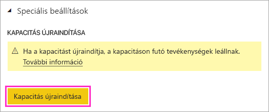

# Prémium szintű Power BI-kapacitás újraindítása

Megtörténhet, hogy Power BI-rendszergazdaként újra kell indítania egy prémium szintű kapacitást. Ez a cikk a kapacitások újraindításának módját ismerteti, és az újraindítással és teljesítménnyel kapcsolatos más kérdésekre is kitér.

## Miért kínálja a Power BI ezt a lehetőséget?

A Power BI óriási adattömegeken végzett összetett elemzések lehetőségét kínálja a felhasználóknak. Sajnos a felhasználók teljesítmény-problémákat is okozhatnak azzal, hogy túlterhelik a Power BI szolgáltatást feladatokkal, túlságosan bonyolult lekérdezések írásával, körkörös hivatkozások létrehozásával, és sok más módon is.

A megosztott Power BI-kapacitás azáltal nyújt némi védelmet az ilyen helyzetek ellen, hogy korlátozásokat érvényesít a fájlméretre, a frissítés ütemezésére, és a szolgáltatás más jellemzőire. Prémium szintű Power BI-kapacitásban azonban ezek a korlátok többnyire magasabbak. Ennek következtében egy helytelen DAX-kifejezést vagy nagyon összetett modellt tartalmazó egyetlen jelentés is jelentős teljesítménybeli problémákat okozhat. A feldolgozás során a jelentés akár a kapacitásban rendelkezésre álló összes erőforrást is felhasználhatja. 

A Power BI egyre fejlettebb módokon védi a prémium szintű kapacitások felhasználóit az ilyen problémákkal szemben. A rendszergazdákat is ellátjuk olyan eszközökkel, amelyekkel elemezni tudják a kapacitások túlterhelését és annak okait. Erről [rövid tanfolyamunkon](https://www.youtube.com/watch?v=UgsjMbhi_Bk&feature=youtu.be) és [hosszabb tanfolyamunkon](https://powerbi.tips/2018/07/) tudhat meg többet. Mindezek mellett a felmerülő súlyos problémák következményeinek mérséklésére is képesnek kell lennie. Az ilyen problémák leggyorsabb megoldása a kapacitás újraindítása.

## Biztonságos az újraindítási eljárás? Veszíthetek adatot?

A kapacitásában lévő összes mentett adat, definíció, jelentés és irányítópult teljesen sértetlen marad az újraindítás során. Egy kapacitás újraindításának idejére a frissítési motor a legtöbb esetben minden folyamatban lévő ütemezett vagy alkalmi frissítést ideiglenesen leállít, majd azok újraindulnak a Power BI beépített újrapróbálkozási logikája miatt. A szolgáltatás újra megkísérli a frissítéseket, amikor a kapacitás elérhetővé válik. Előfordulhat, hogy a frissítések állapota nem változik a felhasználói felületen az újraindítási folyamat során. 

Ha a felhasználók az újraindítási folyamat során használják a kapacitást, elveszítik majd a nem mentett munkát. Az újraindítást követően a felhasználóknak frissítenie kell a böngészőt.

## Hogyan indíthatok újra egy kapacitást?

Kapacitás az alábbi lépésekben indítható újra.

1. Keresse meg kapacitását a Power BI felügyeleti portáljának **Kapacitásbeállítások** lapján. 

1. A kapacitás URL-címéhez fűzze hozzá a **CapacityRestart** *funkciójelzőt*: `https://app.powerbi.com/admin-portal/capacities/<YourCapacityId>?capacityRestartButton=true`.

1. A **Speciális beállítások** > **KAPACITÁS ÚJRAINDÍTÁSA** alatt válassza a **Kapacitás újraindítása** lehetőséget.

    

1. A **Kapacitás újraindítása** párbeszédablakban válassza az **Igen, újraindítom a kapacitást** választ.

    

## Hogyan akadályozhatom meg a problémák jövőbeni keletkezését?

A problémák elkerülésének legjobb módszere hatékony adatmodellezésre tanítani a felhasználókat. További információt [képzési anyagunkban](https://powerbi.tips/2018/07/) talál.

Emellett javasoljuk a [kapacitások rendszeres figyelését](service-admin-premium-monitor-capacity.md) a mögöttes problémákra utaló trendek felismerése érdekébe. Tervezzük a figyelő alkalmazás és sok más eszköz rendszeres frissítését, hogy Ön még hatékonyabban figyelhesse és kezelhesse kapacitásait.

## További lépések

[Mi a Power BI Premium?](service-premium-what-is.md)

Több kérdése van? [Kérdezze meg a Power BI-közösséget](https://community.powerbi.com/)
