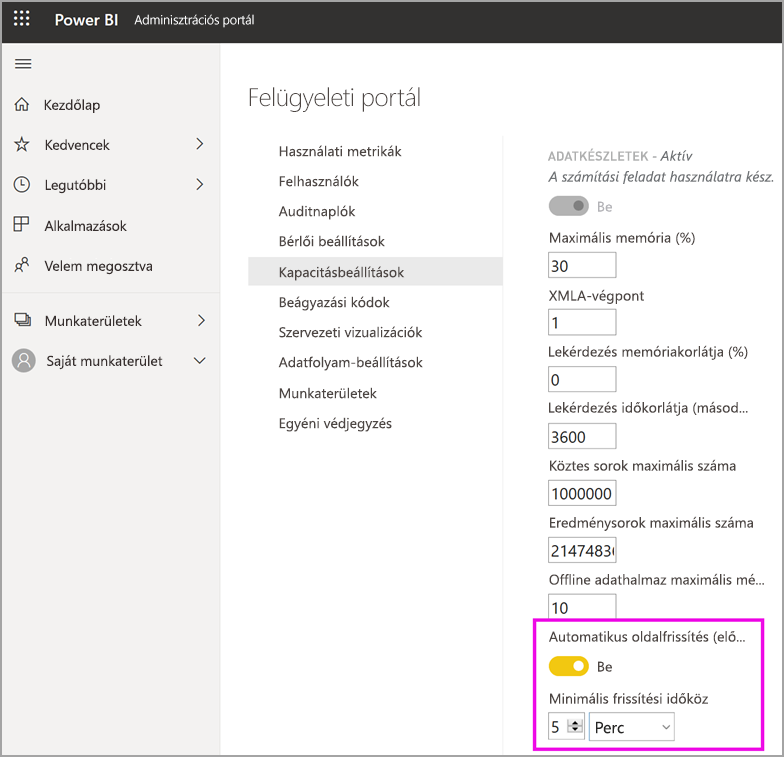

# Számítási feladatok konfigurálása egy Premium-kapacitásban

Ez a cikk azt ismerteti, hogy hogyan engedélyezhet és konfigurálhat számítási feladatokat Power BI Premium-kapacitásokban. A kapacitások alapértelmezés szerint csak a Power BI-lekérdezésekkel társított számítási feladatot támogatják. További számítási feladatokat engedélyezhet és konfigurálhat **[mesterséges intelligenciához (Cognitive Services)](../transform-model/service-cognitive-services.md)** , **[adatfolyamokhoz](../transform-model/service-dataflows-overview.md#dataflow-capabilities-on-power-bi-premium)** és **[lapszámozott jelentésekhez](../paginated-reports/paginated-reports-save-to-power-bi-service.md)** .

## Alapértelmezett memóriabeállítások

A lekérdezési számítási feladatok a Premium-kapacitás SKU-ja által meghatározott erőforrásokhoz vannak optimalizálva, valamint ez szabja meg azok korlátait. A Premium-kapacitások emellett kapacitás-erőforrások használatára képes, további számítási feladatokat is támogatnak. A számítási feladatok alapértelmezett memóriaértékei az SKU-ban elérhető kapacitás-csomópontokon alapulnak. A maximum memóriabeállítások nem halmozottak. A megadott maximum értékig terjedő memória mesterséges intelligenciához és adatfolyamokhoz dinamikusan, lapszámozott jelentésekhez viszont statikusan van lefoglalva.

|                   | EM1 / A1                  | EM2 / A2                  | EM3 / A3                  | P1 / A4                  | P2 / A5                  | P3 / A6                   |
|-------------------|---------------------------|---------------------------|---------------------------|--------------------------|--------------------------|---------------------------|
| Mesterséges intelligencia                | Nem támogatott               | Alapértelmezés szerint 40%; minimum 40%  | Alapértelmezés szerint 20%; minimum 20%  | Alapértelmezés szerint 20%; minimum 8%  | Alapértelmezés szerint 20%; minimum 4%  | Alapértelmezés szerint 20%; minimum 2%   |
| Adathalmazok          | Alapértelmezés szerint 100%; minimum 67% | Alapértelmezés szerint 100%; minimum 40% | Alapértelmezés szerint 100%; minimum 20% | Alapértelmezés szerint 100%; minimum 8% | Alapértelmezés szerint 100%; minimum 4% | Alapértelmezés szerint 100%; minimum 2%  |
| Adatfolyamok         | Alapértelmezés szerint 40%; minimum 40%  | Alapértelmezés szerint 24%; minimum 24%  | Alapértelmezés szerint 20%; minimum 12%  | Alapértelmezés szerint 20%; minimum 5%  | Alapértelmezés szerint 20%; minimum 3%  | Alapértelmezés szerint 20%; minimum 2%   |
| Oldalakra osztott jelentések | Nem támogatott               | Nem támogatott               | Nem támogatott               | Alapértelmezés szerint 20%; minimum 10% | Alapértelmezés szerint 20%; minimum 5%  | Alapértelmezés szerint 20%; minimum 2,5% |
|                   |                           |                           |                           |                          |                          |                           |

## Számítási feladat beállításai

### AI (előzetes verzió)

Az AI számítási feladataival kognitív szolgáltatásokat és automatizált gépi tanulást vehet igénybe a Power BI-ban. A számítási feladatok viselkedésének vezérléséhez használja a következő beállításokat.

| Beállítás neve | Leírás |
|---------------------------------|----------------------------------------|
| **Maximális memória (%)** | Az AI által a kapacitásban felhasználható, rendelkezésre álló memória maximális százalékos aránya. |
| **Power BI Desktopból történő használat engedélyezése** | Ez a beállítás jövőbeli használatra van fenntartva, és nem jelenik meg minden bérlőben. |
| **Gépi tanulási modellek fejlesztésének engedélyezése** | Meghatározza, hogy az üzleti elemzők betaníthatnak, érvényesíthetnek, és meghívhatnak-e gépi tanulási modelleket közvetlenül a Power BI-ban. További információ: [Automatizált gépi tanulás a Power BI-ban (előzetes verzió)](../transform-model/service-machine-learning-automated.md). |
| **AI-kérelmek párhuzamosságának engedélyezése** | Meghatározza, hogy az AI-kérelmek párhuzamosan futtathatók-e. |
|  |  |

### Adathalmazok

Az adathalmazok számítási feladat alapértelmezés szerint engedélyezve van, és nem tiltható le. A számítási feladatok viselkedésének vezérléséhez használja a következő beállításokat. Néhány beállításhoz további használati információt talál a táblázat alatt.

| Beállítás neve | Leírás |
|---------------------------------|----------------------------------------|
| **Maximális memória (%)** | Az adatkészletek által a kapacitásban felhasználható, rendelkezésre álló memória maximális százalékos aránya. |
| **XMLA-végpont** | Megadja, hogy a csatlakozó ügyfélalkalmazások figyelembe vegyék a munkaterület és az alkalmazás szintjén meghatározott biztonságicsoport-tagságot. További információ: [Csatlakozás adathalmazokhoz ügyfélalkalmazásokkal és -eszközökkel](service-premium-connect-tools.md). |
| **Köztes sorok maximális száma** | A DirectQuery által visszaadott köztes sorok maximális száma. Az alapértelmezett érték 1 000 000, a megengedett tartomány pedig 100 000-től 2 147 483 647-ig terjed. |
| **Offline adathalmaz maximális mérete (GB)** | A memóriában lévő offline adathalmaz maximális mérete. Ez a tömörített méret a lemezen. Az alapértelmezett érték 0, ami a legmagasabb SKU-val meghatározott korlát. A megengedett tartomány 0-tól a kapacitásméret korlátjáig tart. |
| **Eredménysorok maximális száma** | A DAX-lekérdezés által visszaadott sorok maximális száma. Az alapértelmezett érték -1 (nincs korlát), a megengedett tartomány pedig 100 000-től 2 147 483 647-ig terjed. |
| **Lekérdezés memóriakorlátja (%)** | Az MDX- vagy DAX-lekérdezések végrehajtásához használható számítási feladatban rendelkezésre álló memória maximális százalékaránya. Az alapértelmezett érték 0, amely az adott SKU-specifikus automatikus lekérdezési memória korlátozását eredményezi. |
| **Lekérdezés időkorlátja (másodpercben)** | A lekérdezés időtúllépéséig eltelt idő maximuma. Az alapértelmezett érték 3600 másodperc (1 óra). A 0 érték azt jelenti, hogy a lekérdezések lépik túl az időt. |
| **Automatikus oldalfrissítés (előzetes verzió)** | A be- és kikapcsolás váltógomb a prémium szintű munkaterületeken lehetővé teszi a jelentések automatikus frissítését. |
| **Minimális frissítési időköz** | Az oldalfrissítés minimálisan engedélyezett frissítési időköze, ha az automatikus oldalfrissítés be van kapcsolva. Az alapértelmezett érték öt perc, a minimálisan megengedett érték pedig egy másodperc. |
|  |  |  |

#### Köztes sorok maximális száma

A beállítással szabályozhatja az erőforrás-igényes vagy rosszul megtervezett jelentések hatásait. Ha egy DirectQuery-adatkészletben végzett lekérdezés nagyon sok eredményt ad vissza a forrásadatbázisból, az kiugrást okozhat a memóriahasználatban és többletterhelést a számításban. Ennek következtében előfordulhat, hogy más felhasználók és jelentések számára kevés erőforrás áll rendelkezésre. Ezzel a beállítással a kapacitásadminisztrátor megadhatja, hogy egy lekérdezés hány sort tudjon beolvasni az adatforrásból.

Abban az esetben, ha a kapacitás egy milliónál több sort is támogat alapértelmezés szerint, és nagy adatkészletet kezel, a beállítás növelésével több sort is beolvashat.

Vegye figyelembe, hogy ez a beállítás csak a DirectQuery-lekérdezésekre, míg az [Eredménysorok maximális száma](#max-result-row-set-count) a DAX-lekérdezésekre van hatással.

#### Offline adathalmaz maximális mérete

A beállítással megakadályozhatja, hogy a jelentéskészítők a kapacitást hátrányosan érintő, nagyméretű adathalmazt tegyenek közzé. Vegye figyelembe, hogy a Power BI mindaddig nem tudja meghatározni a tényleges memóriabeli méretet, amíg az adatkészlet be van töltve a memóriába. Előfordulhat, hogy egy kisebb offline méretű adatkészletnek nagyobb a memóriaigénye, mint egy nagyobb offline méretűnek.

Ha egy meglévő adatkészlet mérete túllépi az ehhez a beállításhoz megadott értéket, az adatkészlet nem fog tudni betöltődni, amikor egy felhasználó megkísérli elérni azt. Az adatkészlet betöltése meghiúsulhat abban az esetben is, ha az nagyobb az adatkészletek számítási feladatához konfigurált maximális memóriánál.

A rendszer teljesítményének védelme érdekében egy további, SKU-specifikus felső határt alkalmazunk az offline adatkészletek maximális méretére, a konfigurált értéktől függetlenül. Ez a határérték nem vonatkozik a nagyméretű adatokhoz optimalizált Power BI-adatkészletekre. További információ: [Nagyméretű modellek a Power BI Premiumban](service-premium-large-models.md).

|                                           | EM1 / A1 | EM2 / A2 | EM3 / A3 | P1 / A4 | P2 / A5 | P3 / A6 |   
|-------------------------------------------|----------|----------|----------|---------|---------|---------|
| Az offline adatkészletek maximális méretének felső határa | 3 GB     | 5 GB     | 6 GB     | 10 GB   | 10 GB   | 10 GB   |
|                                           |          |          |          |         |         |         |

#### Eredménysorok maximális száma

A beállítással szabályozhatja az erőforrás-igényes vagy rosszul megtervezett jelentések hatásait. Ha ezt a korlátot eléri egy DAX-lekérdezésben, a jelentés felhasználójánál az alábbi hibaüzenet jelenik meg. A felhasználónak a hiba részleteivel fel kell keresnie egy rendszergazdát.

Vegye figyelembe, hogy ez a beállítás csak a DAX-lekérdezésekre, míg a [Köztes sorok maximális száma](#max-intermediate-row-set-count) a DirectQuery-lekérdezésekre van hatással.

#### Lekérdezés memóriakorlátja

A beállítással szabályozhatja az erőforrás-igényes vagy rosszul megtervezett jelentések hatásait. Egyes lekérdezések és számítások olyan köztes eredményeket adhatnak vissza, amelyek sok memóriát fogyasztanak a kapacitáson. Ez a többi lekérdezés végrehajtásának nagyfokú lassulásához, továbbá a többi adatkészlet kapacitásból való kizárásához és memóriahiány okozta hibákhoz vezethet a kapacitás többi felhasználójánál.

Ez a beállítás vonatkozik minden DAX- és MDX-lekérdezésre, amelyeket Power BI-jelentések, Analyze Excel-jelentések, valamint más, az XMLA-végponton át csatlakozó eszközök hajtanak végre.

Vegye figyelembe, hogy az adatfrissítési műveletek az irányítópult-csempék és a vizuális gyorsítótárak frissítésének részeként is végrehajthatnak DAX-lekérdezéseket, miután megtörtént az adatok frissítése az adathalmazban. Ezek a lekérdezések emiatt a beállítás miatt is meghiúsulhatnak, ami az adatfrissítési művelet hibás állapotúként történő megjelenítéséhez vezethet, még akkor is, ha az adathalmazban az adatok frissítése sikeres volt.

Az alapértelmezett beállítás 0, amely az alábbi SKU-specifikus automatikus lekérdezési memória korlátozását eredményezi.

|                              | EM1 / A1 | EM2 / A2 | EM3 / A3 | P1 / A4 | P2 / A5 | P3 / A6 |   
|------------------------------|----------|----------|----------|---------|---------|---------|
| Lekérdezés automatikus memóriakorlátja | 1 GB     | 2 GB     | 2 GB     | 6 GB    | 6 GB    | 10 GB   |
|                              |          |          |          |         |         |         |

A rendszer teljesítményének védelme érdekében egy 10 GB-os felső határt alkalmazunk a Power BI-jelentések által elvégzett lekérdezésekre, a felhasználó által konfigurált lekérdezésimemória-korláttól függetlenül. Ez a határérték nem vonatkozik az Analysis Services-protokollt (XMLA-t) használó eszközök által kiadott lekérdezésekre. Ha a lekérdezés túl sok memóriát igényel, a felhasználóknak célszerű leegyszerűsíteni a lekérdezést vagy annak számításait.

#### Lekérdezés időkorlátja

Ezzel a beállítással hatékonyabban szabályozhatja a hosszan futó lekérdezéseket, aminek következtében előfordulhat, hogy a jelentések lassan töltődnek be a felhasználóknál.

Ez a beállítás vonatkozik minden DAX- és MDX-lekérdezésre, amelyeket Power BI-jelentések, Analyze Excel-jelentések, valamint más, az XMLA-végponton át csatlakozó eszközök hajtanak végre.

Vegye figyelembe, hogy az adatfrissítési műveletek az irányítópult-csempék és a vizuális gyorsítótárak frissítésének részeként is végrehajthatnak DAX-lekérdezéseket, miután megtörtént az adatok frissítése az adathalmazban. Ezek a lekérdezések emiatt a beállítás miatt is meghiúsulhatnak, ami az adatfrissítési művelet hibás állapotúként történő megjelenítéséhez vezethet, még akkor is, ha az adathalmazban az adatok frissítése sikeres volt.

Ez a beállítás egyetlen lekérdezésre vonatkozik, és nem az egy adatkészlet vagy jelentés frissítéséhez társított összes lekérdezés futtatásához szükséges időre. Tekintse meg a következő példát:

- A **Lekérdezés időkorlátja** beállítás értéke 1200 (20 perc).
- Öt lekérdezést kell végrehajtani, amelyek mindegyike 15 percig fut.

Az összes lekérdezés teljes futási ideje összesen ugyan 75 perc, de a beállítás korlátját nem éri el, mivel az egyes lekérdezések 20 percnél kevesebb ideig futnak.

Vegye figyelembe, hogy a Power BI-jelentések ezt az alapértelmezett beállítást felülbírálva sokkal rövidebb időtúllépést biztosítanak a kapacitásra vonatkozó egyes lekérdezések számára. Az egyes lekérdezések időtúllépése általában három perc.

#### Automatikus oldalfrissítés (előzetes verzió)

Ha engedélyezve van, az automatikus oldalfrissítés lehetővé teszi a prémium szintű felhasználók számára, hogy a jelentésben szereplő oldalakat a DirectQuery-források esetén meghatározott időközönként frissítse. Kapacitás-rendszergazdaként a következőket teheti:

- Az automatikus oldalfrissítés be- és kikapcsolása
- A minimális frissítési időköz meghatározása

Az alábbi képen az automatikus frissítési időköz beállításának helye látható:

Az automatikus oldalfrissítés által létrehozott lekérdezések közvetlenül az adatforráshoz kerülnek, ezért fontos, hogy az automatikus oldalfrissítés engedélyezésekor megfontolja a megbízhatóságot és a terhelést. 

### Adatfolyamok

Az adatfolyamok számítási feladattal az adatfolyamok önkiszolgáló adat-előkészítési funkciójával tölthet be, alakíthat át, integrálhat és bővíthet adatokat. A számítási feladatok viselkedésének vezérléséhez használja a következő beállításokat.

| Beállítás neve | Leírás |
|---------------------------------|----------------------------------------|
| **Maximális memória (%)** | Az adatfolyamok által a kapacitásban felhasználható, rendelkezésre álló memória maximális százalékos aránya. |
| **Enhanced Dataflows Compute Engine (Előzetes verzió)** | Ezzel a beállítással akár 20-szor gyorsabban számíthat ki számított entitásokat nagy méretű adatmennyiségek használatakor. **Az új motor aktiválásához újra kell indítania a kapacitást.** További információ: [Enhanced Dataflows Compute Engine](#enhanced-dataflows-compute-engine). |
| **Tároló mérete** | Az adatfolyamok által az entitásokhoz használt tároló maximális mérete. Az alapértelmezett érték 700 MB. További információ: [Tároló mérete](#container-size). |
|  |  |

#### Enhanced Dataflows Compute Engine

Az új számítási motor kihasználásához ossza külön adatfolyamokra az adatok betöltését, az átalakítási logikát pedig eltérő adatfolyamok számított entitásaiban helyezze el. Ezt azért célszerű megtennie, mert a számítási motor olyan adatfolyamokon működik, amelyek egy meglévő adatfolyamra hivatkoznak. Betöltési adatfolyamokon nem működik. Az útmutató követésével meggyőződhet arról, hogy az új számítási motor az optimális teljesítmény érdekében kezeli az átalakítási lépéseket, például az összekapcsolásokat és az egyesítéseket.

#### Tároló mérete

Adatfolyam frissítésekor az Adatfolyam számítási feladat az adatfolyam minden entitásához létrehoz egy tárolót. Minden tároló legfeljebb a Tárolóméret beállításban megadott mennyiségű memóriát foglalhat el. Az alapértelmezett érték minden termékváltozathoz 700 MB. Ezt a beállítást a következő esetekben lehet érdemes módosítani:

- Az adatfolyamok frissítése túl sokáig tart, vagy időtúllépés miatt meghiúsul.
- Az adatfolyam-entitások között számítási lépések, például összekapcsolás is szerepel.  

Az Adatfolyam számítási feladat teljesítményének elemzéséhez javasolt a [Power BI Premium-kapacitásmetrikák](service-admin-premium-monitor-capacity.md) alkalmazás használata.

Bizonyos esetekben a tárolóméret növelése nem feltétlenül javítja a teljesítményt. Ha az adatfolyam például csak egy jelentős számításokat végző forrásból nyer adatokat, a tárolóméret módosítása valószínűleg nem használ. A tárolóméret növelése akkor lehet előnyös, ha lehetővé teszi, hogy az Adatfolyam számítási feladat több memóriát foglaljon le az entitásfrissítési műveletekhez. Több memória lefoglalásával csökkenthető a sok számítást igénylő entitások frissítésének ideje.

A Tárolóméret érték nem haladhatja meg az Adatfolyam számítási feladat maximális memóriáját. Egy P1 kapacitás például 25 GB memóriával rendelkezik. Ha az Adatfolyam számítási feladat Maximális memória (%) beállítása 20%, a Tárolóméret (MB) nem haladhatja meg az 5000 értéket. A Tárolóméret még ennél magasabb érték beállításakor sem haladhatja meg a maximális memóriát.

### Oldalakra osztott jelentések

A lapszámozott jelentések számítási feladattal az SQL Server Reporting Services formátumán alapuló lapszámozott jelentéseket futtathat a Power BI szolgáltatásban. A számítási feladatok viselkedésének vezérléséhez használja a következő beállítást.

| Beállítás neve | Leírás |
|---------------------------------|----------------------------------------|
| **Maximális memória (%)** | A lapszámozott jelentések által a kapacitásban felhasználható, rendelkezésre álló memória maximális százalékos aránya. |
|  |  |

A többoldalas jelentések ugyanazokat a képességeket kínálják, mint jelenleg az SQL Server Reporting Services (SSRS) jelentései, beleértve a jelentéskészítőknek azt a képességét, hogy egyéni kódot adjanak hozzá.  A készítők ezáltal dinamikusan módosíthatják a jelentéseket, például kódkifejezések alapján változtathatják a szövegszíneket.  A megfelelő elkülönítés érdekében a többoldalas jelentések kapacitásonként védett környezetben vannak futtatva. Az egyazon kapacitásban futó jelentések befolyásolhatják egymás működését. Javasoljuk, hogy az SSRS egy példányába tartalmat közzétevő készítők korlátozásához hasonlóan a többoldalas jelentések esetében is így járjon el. Győződjön meg arról, hogy a tartalmat egy kapacitásban közzétevő készítők megbízhatók a vállalat számára. Még biztonságosabbá teheti a környezetet, ha több kapacitást alakít ki, és mindegyikhez más készítőt rendel. 

Bizonyos esetekben a lapszámozott jelentések számítási feladat elérhetetlenné válik. Ilyen esetben a számítási feladat hibás állapotot jelez a felügyeleti portálon, a felhasználók pedig időtúllépést tapasztalnak a jelentés renderelése során. A probléma megoldásához tiltsa le, majd engedélyezze újra a számítási feladatot.

## Számítási feladatok konfigurálása

Maximalizálhatja a kapacitás elérhető erőforrásait, ha a számítási feladatokat csak akkor engedélyezi, amikor használni szükséges őket. A memória- és más beállításokat csak akkor módosítsa, ha úgy értékelte, hogy az alapértelmezett beállítások nem felelnek meg az Ön erőforrásai kapacitásigényeinek.

### Számítási feladatok konfigurálása a Power BI felügyeleti portálján

1. A **Kapacitásbeállítások** > **PREMIUM-KAPACITÁSOK** területen válasszon kapacitást.

1. A **TOVÁBBI LEHETŐSÉGEK** alatt bontsa ki a **Számítási feladatok** elemet.

1. Engedélyezzen egy vagy több számítási feladatot, és állítsa be a **Maximális memória** és a többi beállítás értékét.

1. Kattintson az **Alkalmaz** elemre.

### REST API

Számítási feladatokat a [Kapacitások](https://docs.microsoft.com/rest/api/power-bi/capacities) REST API-kkal engedélyezheti és rendelheti hozzá kapacitásokhoz.

## Számítási feladatok monitorozása

A [Power BI Premium-kapacitásmetrikák alkalmazás](service-admin-premium-monitor-capacity.md) metrikákat tesz elérhetővé az adatkészletről, az adatfolyamokról és a lapszámozott jelentésekről, amelyekkel monitorozhatja a kapacitásokhoz engedélyezett számítási feladatokat. 

> [!IMPORTANT]
> Ha a Power BI Premium-kapacitásban magas erőforráshasználat tapasztalható, amely teljesítménnyel vagy megbízhatósággal kapcsolatos problémákat eredményez, e-mail-értesítést kaphat a probléma azonosítása és megoldása érdekében. Ez egyszerű módot kínálhat a kapacitások túlterheléséből eredő hibák elhárítására. További információ: [kapacitási és megbízhatósági értesítések](service-interruption-notifications.md#capacity-and-reliability-notifications).

## Következő lépések

[Power BI Premium-kapacitások optimalizálása](service-premium-capacity-optimize.md)
[Önkiszolgáló adat-előkészítés adatfolyamokkal a Power BI-ban](../transform-model/service-dataflows-overview.md)
[Mik az oldalakra osztott jelentések a Power BI Premiumban?](../paginated-reports/paginated-reports-report-builder-power-bi.md)
[Automatikus oldalfrissítés a Power BI Desktopban (előzetes verzió)](../create-reports/desktop-automatic-page-refresh.md)

További kérdései vannak? [Kérdezze meg a Power BI közösségét](https://community.powerbi.com/)
