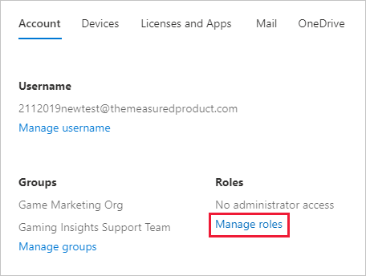

# <a name="understanding-power-bi-service-administrator-roles"></a>A Power BI-szolgáltatásadminisztrátor szerepkör ismertetése

A Power BI-bérlő rendszergazdai feladatainak ellátásához az alábbi szerepkörök egyikével kell rendelkeznie: Power BI-rendszergazda, Power Platform-rendszergazda vagy Microsoft 365 globális rendszergazda. A Microsoft 365 felhasználókezelő rendszergazdái a Microsoft 365 Felügyeleti központjában vagy egy PowerShell-szkripttel rendelhetnek felhasználókat a Power BI-rendszergazdai vagy a Power Platform-rendszergazdai szerepkörhöz. További információ: [Szerepkörök hozzárendelése felhasználói fiókokhoz a PowerShell-lel](/office365/enterprise/powershell/assign-roles-to-user-accounts-with-office-365-powershell).

A Power BI-rendszergazai és a Power Platform-rendszergazdai szerepkörrel rendelkező felhasználóknak teljes felügyeleti jogosultsága van a Power BI-bérlőre és annak felügyeleti funkcióira vonatkozóan (kivéve a licencelést). Miután a hozzárendelés megtörténik, a felhasználók hozzáférhetnek a [Power BI felügyeleti portáljához](service-admin-portal.md). A portálon hozzáférhetnek a bérlői szintű használati metrikákhoz, valamint képesek szabályozni a Power BI funkcióinak bérlői szintű használatát. Ezeket a szerepköröket olyan felhasználókhoz lehet hozzárendelni, akiknek szükségük van a Power BI felügyeleti portáljához való hozzáférésre, de nem kaphatnak egyéb rendszergazdai Microsoft 365-hozzáférést.

> [!NOTE]
> A Power BI dokumentációjában a „Power BI-rendszergazda” azokra a felhasználókra vonatkozik, akik vagy Power BI-rendszergazdai, vagy Power Platform-rendszergazdai szerepkörrel rendelkeznek. A dokumentáció egyértelművé teszi, ha a feladat elvégzéséhez Microsoft 365 globális rendszergazdai szerepkör szükséges.

## <a name="limitations-and-considerations"></a>Korlátozások és szempontok

A Power BI-szolgáltatásadminisztrátori és a Power Platform-rendszergazdai szerepkör nem teszi lehetővé az alábbiakat:

* A felhasználók és licencek módosításának képessége a Microsoft 365 Felügyeleti központjában.

* Hozzáférés az auditnaplókhoz. További információ: [Felhasználói tevékenységek nyomon követése a Power BI-ban](service-admin-auditing.md).

Ezekhez a funkciókhoz Microsoft 365 globális rendszergazdai szerepkörre van szükség.

## <a name="assign-users-to-an-admin-role-in-the-microsoft-365-admin-center"></a>Felhasználók hozzárendelése rendszergazdai szerepkörhöz a Microsoft 365 felügyeleti központban

Ha felhasználókat szeretne hozzárendelni rendszergazdai szerepkörhöz a Microsoft 365 Felügyeleti központban, kövesse az alábbi lépéseket.

1. A [Microsoft 365 Felügyeleti központjában](https://portal.office.com/adminportal/home#/homepage) válassza a **Felhasználók** > **Aktív felhasználók** elemet.

    

1. Válassza ki azt a felhasználót, akihez a szerepkört szeretné hozzárendelni.

1. A **Szerepkörök** területen válassza a **Szerepkörök kezelése** lehetőséget.

    

1. Bontsa ki **Az összes megjelenítése kategóriánként** lehetőséget, majd válassza a **Power BI-rendszergazda** vagy a **Power Platform-rendszergazda** lehetőséget.

    

1. Válassza a **Módosítások mentése** lehetőséget.

## <a name="assign-users-to-the-admin-role-with-powershell"></a>Felhasználók hozzárendelése a rendszergazdai szerepkörhöz a PowerShellben

Felhasználókat a PowerShell-lel is hozzárendelhet szerepkörökhöz. Őket az Azure Active Directoryban (Azure AD) kezelheti. Ha még nem rendelkezik az Azure AD PowerShell-modullal, [töltse le és telepítse a legújabb verziót](https://www.powershellgallery.com/packages/AzureAD/).

1. Első lépésként csatlakozzon az Azure AD-hez:
   ```
   PS C:\Windows\system32> Connect-AzureAD
   ```

1. Ezután kérje le a **Power BI-szolgáltatásadminisztrátor** szerepkörhöz tartozó **ObjectId** paramétert. Az **ObjectId** beszerzéséhez futtathatja a [Get-AzureADDirectoryRole](/powershell/module/azuread/get-azureaddirectoryrole) parancsot

    ```
    PS C:\Windows\system32> Get-AzureADDirectoryRole

    ObjectId                             DisplayName                        Description
    --------                             -----------                        -----------
    00f79122-c45d-436d-8d4a-2c0c6ca246bf Power BI Service Administrator     Full access in the Power BI Service.
    250d1222-4bc0-4b4b-8466-5d5765d14af9 Helpdesk Administrator             Helpdesk Administrator has access to perform..
    3ddec257-efdc-423d-9d24-b7cf29e0c86b Directory Synchronization Accounts Directory Synchronization Accounts
    50daa576-896c-4bf3-a84e-1d9d1875c7a7 Company Administrator              Company Administrator role has full access t..
    6a452384-6eb9-4793-8782-f4e7313b4dfd Device Administrators              Device Administrators
    9900b7db-35d9-4e56-a8e3-c5026cac3a11 AdHoc License Administrator        Allows access manage AdHoc license.
    a3631cce-16ce-47a3-bbe1-79b9774a0570 Directory Readers                  Allows access to various read only tasks in ..
    f727e2f3-0829-41a7-8c5c-5af83c37f57b Email Verified User Creator        Allows creation of new email verified users.
    ```

    Ebben az esetben a szerepkör **ObjectId** paramétere a következő: 00f79122-c45d-436d-8d4a-2c0c6ca246bf.

1. Ezután szerezze be a felhasználó **ObjectId** paraméterét. Ezt a [Get-AzureADUser](/powershell/module/azuread/get-azureaduser) parancs futtatásával szerezheti be.

    ```
    PS C:\Windows\system32> Get-AzureADUser -ObjectId 'tim@contoso.com'

    ObjectId                             DisplayName UserPrincipalName      UserType
    --------                             ----------- -----------------      --------
    6a2bfca2-98ba-413a-be61-6e4bbb8b8a4c Tim         tim@contoso.com        Member
    ```

1. A szerepkör taghoz való hozzárendeléséhez futtassa az [Add-AzureADDirectoryRoleMember](/powershell/module/azuread/add-azureaddirectoryrolemember) parancsot.

    | Paraméter | Leírás |
    | --- | --- |
    | ObjectId |A szerepkör objektumazonosítója (ObjectId). |
    | RefObjectId |A tag objektumazonosítója (ObjectId). |

    ```powershell
    Add-AzureADDirectoryRoleMember -ObjectId 00f79122-c45d-436d-8d4a-2c0c6ca246bf -RefObjectId 6a2bfca2-98ba-413a-be61-6e4bbb8b8a4c
    ```

## <a name="next-steps"></a>Következő lépések

[A Power BI felügyelete a munkahelyen](service-admin-administering-power-bi-in-your-organization.md)  
[Power BI felügyeleti portál](service-admin-portal.md)  

További kérdései vannak? [Kérdezze meg a Power BI közösségét](https://community.powerbi.com/)