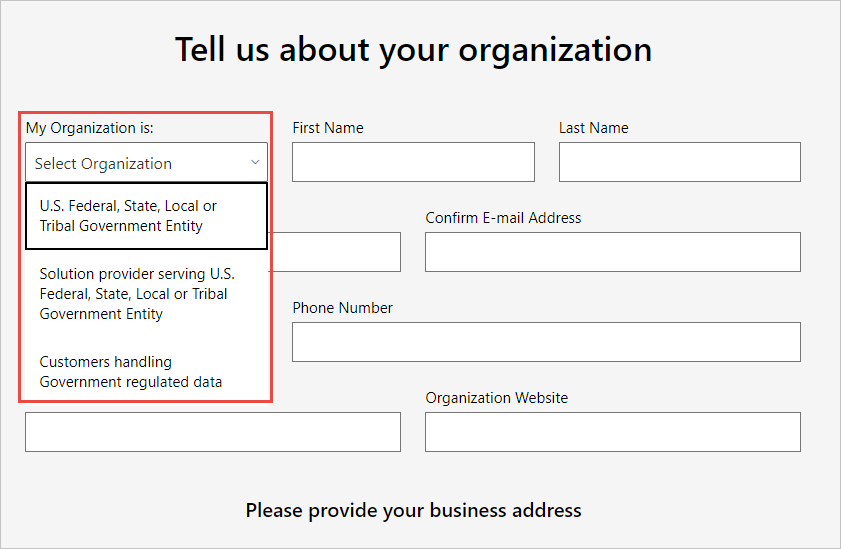

# USA-beli kormányzati szerv regisztrálása a Power BI szolgáltatásban

A Power BI szolgáltatásnak van egy verziója az [Office 365 kormányzati csomagjainak](https://www.microsoft.com/microsoft-365/government/compare-office-365-government-plans?rtc=1) részeként is. Ez a cikk az USA kormányzati ügyfeleinek szól, és az itt ismertetett regisztrálási folyamat más, mint amelyet a Power BI szolgáltatás kereskedelmi verzióinál kell alkalmazni.

Az Egyesült Államok kormányzati ügyfeleinek biztosított Power BI szolgáltatásról további információt az [A Power BI az USA kormányzati ügyfelei számára – áttekintés](service-govus-overview.md) című témakörben kaphat.

> [!NOTE]
> Ez a cikk olyan rendszergazdáknak szól, akik jogosultak regisztrálni az USA valamely kormányzati szervét a Power BI szolgáltatásra. Ha Ön végfelhasználó, kérje meg rendszergazdáját, hogy szerezze be az USA kormányzati szerveinek biztosított Power BI szolgáltatás előfizetését.
> 
> 

## Válassza ki a az USA kormányzati szervének biztosított regisztrációs folyamatot

Elképzelhető, hogy az adott egyesült államokbeli kormányzati szerv még nem használja a kormányzati felhőkörnyezetet, vagy már rendelkezik előfizetéssel. Az alábbi szakaszok a regisztrációs lépéseket ismertetik attól függően, hogy Ön milyen előfizetéssel rendelkezik az Office 365 kormányzati felhőkörnyezetéhez és a Power BI-hoz kapcsolódóan. A lépések a jelenlegi regisztrációtól függően eltérőek lesznek.

Miután feliratkozott az USA kormányzati szerveinek kínált Power BI-ra, a fiókcsapatával együttműködésben elkezdheti a jelen cikkben ismertetett [*engedélyezési* folyamatot](#additional-signup-information). Erre a lépésre azért van szükség, hogy a szervezet teljes mértékben engedélyezve legyen a kormányzati közösségi felhőben.

## Regisztráció egy új Office 365 Kormányzati csomagra

Ha a szervezete még nem használta a kormányzati közösségi felhőt, kövesse az alábbi lépéseket az Office 365 kormányzati csomag beszerzéséhez:

> [!NOTE]
> Ezeket a lépéseket a globális rendszergazdának kell elvégeznie.
>

1. Lépjen az [Office 365 Kormányzati csomagra](https://products.office.com/government/office-365-web-services-for-government).
2. Válassza az **Első lépések az ingyenes próbaverzióval** lehetőséget.
3. Töltse ki az űrlapot a cégével kapcsolatos információkkal. A legördülő listából válassza ki a szervezetének típusát.

   

4. Küldje el az űrlapot az előkészítési folyamat elindításához. A Microsoft-képviselője vagy partnere bármilyen kérdéssel kapcsolatban segítséget nyújthat Önnek.

A folyamat befejezése után kövesse az Office 365 kormányzati csomag meglévő ügyfeleinek szóló lépéseket a Power BI-előfizetés hozzáadásához.

## A Power BI hozzáadása az Office 365 Kormányzati verziós csomaghoz

Ha szervezete már rendelkezik Office 365 Kormányzati verziós csomaggal, a Power BI-előfizetés hozzáadásához kövesse az alábbi lépéseket:

> [!NOTE]
> Ezeket a lépéseket a globális rendszergazdának kell elvégeznie.
> 
> 

1. Jelentkezzen be a Microsoft 365 felügyeleti központba a globális rendszergazdai vagy a számlázási rendszergazdai hitelesítő adataival.
2. Válassza a **Számlázás** > **Szolgáltatások vásárlása** lehetőséget.
4. Keresse meg vagy görgessen a Power BI Pro Kormányzati ajánlat megkereséséhez, és válassza a **Kipróbálás** vagy a **Vásárlás most** lehetőséget.
5. Véglegesítse a megrendelést.
6. Rendeljen hozzá licenceket a felhasználói fiókokhoz.

## További regisztrációs információk

Az Egyesült Államok kormányzati szervei számára kínált Power BI-szolgáltatások használatba vétele előtt a Microsoft-fiók csapatával együttműködve el kell végeznie az *engedélyezési* folyamatot a szervezete számára. Az engedélyezés olyan folyamat, amelyet a Power BI mérnöki csapata használ az ügyfelek kereskedelmi felhőkörnyezetből biztonságos kormányzati közösségi felhőkörnyezetbe való áthelyezéséhez. Ez biztosítja azt, hogy az Egyesült Államok kormányzati felhőkörnyezetében elérhető funkciók a várt módon működjenek. 

Az engedélyezési folyamat elindításához forduljon a Microsoft-fiók csapatához segítségért. Az engedélyezési folyamatot csak a rendszergazdák kérhetik. A folyamat körülbelül három hétig tart. Ez alatt a Power BI mérnöki csapata elvégzi a saját bérlő az USA kormányzati felhőkörnyezetében való megfelelő működéséhez szükséges módosításokat.

## Következő lépések

* [Power BI az USA kormányzati szervei számára – áttekintés](service-govus-overview.md)
- [Hogyan vásárolható meg a Microsoft 365 kormányzati verziója?](https://docs.microsoft.com/office365/servicedescriptions/office-365-platform-service-description/office-365-us-government/microsoft-365-government-how-to-buy#how-do-i-buy-microsoft-365-government)