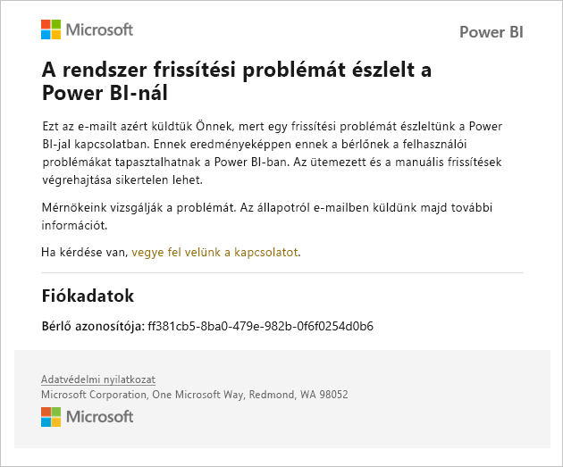
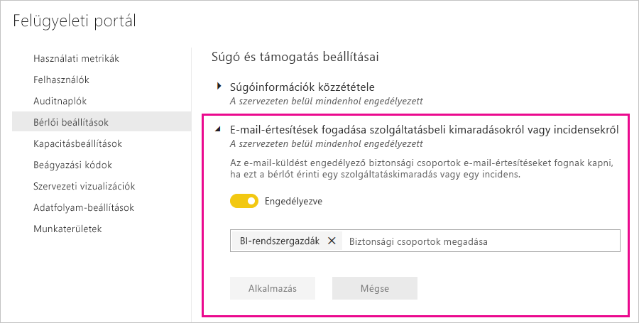

# Szolgáltatáskimaradásokkal kapcsolatos értesítések

Rendkívül fontos, hogy információt kapjon az üzletmenet szempontjából kritikus üzleti alkalmazások rendelkezésre állásáról. A Power BI értesítéseket küld az incidensekről, így Ön e-mailt kap a szolgáltatáskimaradásról és a teljesítménycsökkenésről. Habár a Power BI 99,9%-os szolgáltatói szerződést (SLA) kínál, így ez rendkívül ritkán fordul elő, szeretnénk garantálni, hogy Ön minden ilyen esetről értesüljön. Az alábbi képernyőképen láthatja, hogy milyen típusú e-maileket fog kapni, ha engedélyezi az értesítéseket:

Jelenleg a következő _megbízhatósági eseményekről_küld e-mailt a rendszer:

- Jelentés megnyitási megbízhatósága
- Modell frissítési megbízhatósága
- Lekérdezés frissítési megbízhatósága

Értesítések akkor lesznek elküldve, amikor _hosszabb késés_ tapasztalható olyan műveletekben, mint a jelentések megnyitása, az adathalmaz frissítése vagy a lekérdezés-végrehajtás. Ha az incidens megoldódott, arról is e-mailt küldünk.

> [!NOTE]
> Ez a funkció jelenleg csak a Power BI Premium dedikált kapacitásainak esetében érhető el. A megosztott vagy beágyazott kapacitások esetében nem érhető el.

## Kapacitási és megbízhatósági értesítések

Ha egy Power BI Premium-kapacitásban időnként tartósan magas erőforráshasználat tapasztalható, amely a megbízhatóságot is befolyásolhatja, a rendszer e-mail-értesítést küld. Ilyen következmény lehet az olyan műveletek késleltetése, mint a jelentések megnyitása, az adathalmazok frissítése és a lekérdezések végrehajtása. 

Az értesítő e-mail a magas erőforráshasználat okairól nyújt információt, többek között a következőket:

* A felelős adathalmaz azonosítója
* Művelettípus
* A magas erőforráshasználathoz kapcsolódó CPU-idő

A Power BI arról is e-mail-értesítést küld, ha egy Power BI Premium-kapacitásban túlterhelést észlel. Az e-mail leírja a terhelés feltételezhető okát, az utolsó 10 percben a terhelést okozó műveleteket, és az egyes műveletek által okozott terhelés mértékét. 

Ha egynél több prémium szintű kapacitással rendelkezik, az e-mail ezekről a kapacitásokról is tartalmaz a túlterhelés időszakára vonatkozó információkat, így Ön mérlegelheti a sok erőforrást felhasználó elemeket tartalmazó munkaterületek áthelyezését a legkevésbé terhelt kapacitásokba.

Túlterhelési e-mail-értesítéseket csak a túlterhelési küszöbérték átlépésekor küld a rendszer. Nem kap újabb e-mail-értesítést akkor, amikor a prémium szintű kapacitás terhelése a túlterhelési szint alá esik vissza.

Az alábbi ábra az értesítési e-mailre mutat egy példát:

## Értesítések engedélyezése

Az értesítéseket a Power BI bérlői rendszergazdája engedélyezheti a felügyeleti portálon:

1. Adjon meg vagy hozzon létre egy levelezési biztonsági csoportot, amelynek a rendszer elküldheti az értesítéseket.

1. A felügyeleti portálon válassza a **Bérlői beállítások** lehetőséget. A **Súgó és támogatás beállításai**területen bontsa ki az **E-mail-értesítések fogadása szolgáltatásbeli kimaradásokról vagy incidensekről** elemet.

1. Engedélyezze az értesítéseket, adjon meg egy biztonsági csoportot, majd válassza az **Alkalmazás** lehetőséget.

    

> [!NOTE]
> A Power BI a következő fiókból küldi ki az értesítéseket: no-reply-powerbi@microsoft.com. Ügyeljen rá, hogy ez a fiók felkerüljön az engedélyezési listára, mivel így elkerülheti, hogy az értesítések a levélszemét mappába kerüljenek.

## Következő lépések

[A Power BI Pro és a Power BI Premium támogatási lehetőségei](service-support-options.md)

További kérdései vannak? [Kérdezze meg a Power BI közösségét](https://community.powerbi.com/)
