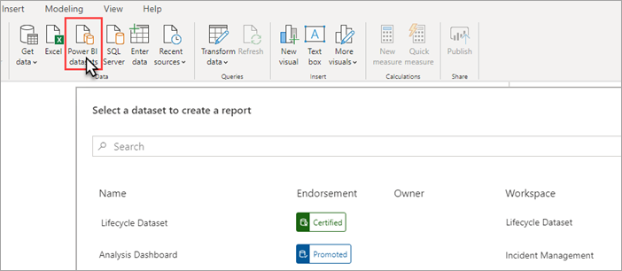

# Adatkészlet-kapcsolat az XMLA-végponttal (előzetes verzió)

A legalább 1500-es kompatibilitási szintű Power BI Premium-munkaterületek és -adathalmazok támogatják a microsoftos és a külső ügyfélalkalmazások és eszközök *XMLA-végpontot* használó platformközi kapcsolatait.

> [!NOTE]
> Ez a funkció **előzetes verzióban** érhető el. Az előzetes verziójú funkciók éles környezetben nem használhatók. A funkciók egy része, a támogatás és a dokumentáció is korlátozott.  A részleteket a [Microsoft online szolgáltatási feltételi (OST)](https://www.microsoft.com/licensing/product-licensing/products?rtc=1) tartalmazzák.

## Az XMLA-végpont fogalma

A Power BI Premium az [XML for Analysis](https://docs.microsoft.com/analysis-services/xmla/xml-for-analysis-xmla-reference?view=power-bi-premium-current) (XMLA) protokoll használja az ügyfélalkalmazások és a Power BI-munkaterületeket és -adathalmazokat kezelő motor közötti kommunikációhoz. Ez a kommunikáció az úgynevezett XMLA-végpontok között zajlik. Az XMLA ugyanaz a kommunikációs protokoll, amelyet a Microsoft Analysis Services motorja használ, a háttérben pedig ez működteti a Power BI-beli szemantikai modellezést, irányítást, életciklusokat és adatkezelést.

A végpontot használó *csak olvasási* kapcsolat alapértelmezés szerint engedélyezve van a kapacitásban lévő **Adathalmazok számítási feladathoz**. Csak olvasási kapcsolattal az adatvizualizációs alkalmazások és eszközök adathalmazmodell-adatokat, metaadatokat, eseményeket és sémákat kérdezhetnek le. A végpontot használó *olvasási/írási* műveletek is engedélyezhetők, további adathalmaz-felügyeleti és -irányítási, fejlett szemantikai modellezési, hibakeresési és figyelési lehetőségeket biztosítva. Az olvasás és írás engedélyezése esetén a Power BI Premium-adathalmazok jobban megfelelnek az Azure Analysis Services és az SQL Server Analysis Services nagyvállalati szintű táblázatos modellezési eszközeinek és folyamatainak.

## Adatmodellezési és -felügyeleti eszközök

Az alábbiak az Azure Analysis Servicesszel és az SQL Server Analysis Servicesszel leggyakrabban használt, most már a Power BI Premium-adathalmazok által is támogatott eszközök közé tartoznak:

**Visual Studio az Analysis Services-projektek bővítménnyel** – SQL Server Data Tools, röviden **SSDT** néven is ismert nagyvállalati szintű modellkészítő eszköz az Analysis Services táblázatos modelljeihez. Az Analysis Services-projektek bővítmények a Visual Studio 2017 és újabb kiadásaiban is támogatott, az ingyenes Közösségi kiadást is beleértve. Táblázatos modellek Premium-munkaterületen való üzembe helyezéséhez a bővítmény 2.9.6-os vagy újabb verziója szükséges. Premium-munkaterületen való üzembe helyezéshez a modell kompatibilitási szintjének legalább 1500-asnak kell lennie. Az Adathalmazok számítási feladathoz olvasási/írási XMLA szükséges. További tudnivalók: [Eszközök az Analysis Serviceshez](https://docs.microsoft.com/analysis-services/tools-and-applications-used-in-analysis-services?view=power-bi-premium-current).

**SQL Server Management Studio (SSMS)**  – Támogatja a DAX-, MDX- és XMLA-lekérdezéseket. Részletes frissítési műveleteket és az adathalmaz-metaadatok szkriptelését végzi a [Táblázatos modell parancsnyelve](https://docs.microsoft.com/analysis-services/tmsl/tabular-model-scripting-language-tmsl-reference) (TMSL) használatával. A lekérdezési műveletekhez csak olvasási kapcsolat szükséges. A metaadat-szkripteléshez olvasási/írási kapcsolat szükséges. Követelmény az SSMS 18.4-es vagy újabb verziója.  [Itt](https://docs.microsoft.com/sql/ssms/download-sql-server-management-studio-ssms) tölthető le.

**SQL Server Profiler** – Ez az SSMS-szel együtt telepített eszköz az adathalmaz-események nyomon követését és hibakeresését biztosítja. Bár az SQL Serverhez hivatalosan elavult, a Profiler továbbra is az SSMS része, és támogatott az Analysis Serviceshez és a Power BI Premiumhoz. Csak olvasási XMLA-kapcsolat szükséges. További tudnivalók:  [Az Analysis Serviceshez használható SQL Server Profiler](https://docs.microsoft.com/analysis-services/instances/use-sql-server-profiler-to-monitor-analysis-services?view=power-bi-premium-current).

**Analysis Services Deployment Wizard** – Ez az SSMS-szel együtt telepített eszköz a Visual Studióval készült táblázatos modellprojektek Analysis Services- és Power BI Premium-munkaterületeken történő üzembe helyezését biztosítja. Futtatható interaktívan, vagy automatizáláshoz a parancssorból. Olvasási/írási XMLA-kapcsolat szükséges. További tudnivalók: [Analysis Services Deployment Wizard](https://docs.microsoft.com/analysis-services/deployment/deploy-model-solutions-using-the-deployment-wizard?view=power-bi-premium-current).

**PowerShell-parancsmagok** – Analysis Services-parancsmagokkal olyan adathalmaz-felügyeleti feladatok automatizálhatók, mint a frissítési műveletek. Olvasási/írási XMLA-kapcsolat szükséges. Követelmény az [SqlServer PowerShell-modul](https://www.powershellgallery.com/packages/SqlServer/) legalább **21.1.18221** verziója. Az Azure Analysis Services-parancsmagok az Analysis Services modulban a Power BI Premiumhoz nem támogatottak. További tudnivalók: [Analysis Services PowerShell-referencia](https://docs.microsoft.com/analysis-services/powershell/analysis-services-powershell-reference?view=power-bi-premium-current).

**Power BI Jelentéskészítő** – Többoldalas jelentések készítéséhez használható eszköz. Létrehoz egy jelentésdefiníciót, amely megszabja, hogy milyen adatok legyenek lekérve, honnan, és hogy azok hogyan legyenek megjelenítve. A jelentés előnézetét megtekintheti a Jelentéskészítőben, majd közzéteheti a jelentést a Power BI szolgáltatásban. Csak olvasási XMLA-kapcsolat szükséges. További tudnivalók:  [Power BI Jelentéskészítő](https://docs.microsoft.com/power-bi/report-builder-power-bi).

**Tabular Editor** – Táblázatos modellek létrehozásához, karbantartásához és kezeléséhez használható, nyílt forráskódú eszköz intuitív, egyszerű szerkesztővel. Hierarchikus nézetben jeleníti meg a táblázatos modell összes objektumát. Az objektumokat megjelenítési mappákba rendezi, és támogatja a tulajdonságok szerkesztését többszörös kijelöléssel, valamint a DAX-szintaxiselemek kiemelését. A lekérdezési műveletekhez csak olvasási XMLA-kapcsolat szükséges. A metaadat-műveletekhez olvasási/írási kapcsolat szükséges. További tudnivalók: [tabulareditor.github.io](https://tabulareditor.github.io/).

**DAX Studio** – Nyílt forráskódú eszköz DAX-kifejezések írásához, diagnosztizálásához, a teljesítményük optimalizálásához és elemzéshez. Funkciói közé tartozik többek között az objektumok tallózása, az integrált nyomkövetés, a lekérdezés lebontásos végrehajtása részletes statisztikával és a DAX-szintaxiselemek kiemelése és formázása. A lekérdezési műveletekhez csak olvasási XMLA-kapcsolat szükséges. További tudnivalók:  [daxstudio.org](https://daxstudio.org/).

**ALM Toolkit** – Nyílt forráskódú sémaösszehasonlító eszköz Power BI-adathalmazokhoz, amelyet többnyire alkalmazások életciklus-felügyeletéhez (ALM) használnak. Üzembe helyezést hajt végre több környezetben, és megőrzi a növekményes frissítések előzményadatait. Metaadat-fájlok, ágak és adattárak különbözetét határozza meg, é egyesítését végzi el. Újra felhasználja az adathalmazok közös definícióit. A lekérdezési műveletekhez csak olvasási kapcsolat szükséges. A metaadat-műveletekhez olvasási/írási kapcsolat szükséges. További tudnivalók:  [alm-toolkit.com](http://alm-toolkit.com/).

**Microsoft Excel** – Az Excel-kimutatások a Power BI-adathalmazokból származó összesítő adatok összegzésére, elemzésére, vizsgálatára és bemutatására leggyakrabban használt eszközök egyike. A lekérdezési műveletekhez csak olvasási kapcsolat szükséges. Az Office Kattintásra 16.0.11326.10000 vagy újabb verzióját igényli.

**Külső eszközök** – Ide tartoznak azok az adatvizualizációs alkalmazások és eszközök, amelyek képesek kapcsolódni, lekérdezéseket végezni és adatokat használni Power BI Premium-beli adathalmazokban. Az eszközök többsége az MSOLAP-ügyfélkönyvtárak legújabb verzióit igényli, néhány viszont az ADOMD-t használja. Az, hogy az XMLA-végpont csak olvasási, vagy olvasási/írási, a műveletektől függ.

### Ügyfélkódtárak

Az ügyfélalkalmazások nem kommunikálnak közvetlenül az XMLA-végponttal. Ehelyett *ügyfélkódtárakat* használnak absztrakciós rétegként. Ezek ugyanazok az ügyfélkódtárak, amelyeket az alkalmazások az Azure Analysis Serviceshez és az SQL Server Analysis Serviceshez való kapcsolódáshoz használnak. Az olyan Microsoft-alkalmazások, mint az Excel, az SQL Server Management Studio (SSMS) és a Visual Studio Analysis Services-projektek bővítménye mindhárom ügyfélkódtárat telepítik és a rendszeres alkalmazás- és bővítményfrissítésekkel együtt frissítik. A fejlesztők egyéni alkalmazások készítéséhez is felhasználhatják az ügyfélkódtárakat. Bizonyos esetekben, főleg külső alkalmazásoknál, amelyekkel ezek nincsenek telepítve, szükség lehet az ügyfélkódtárak újabb verzióinak telepítésére. Az ügyfélkódtárak havonta vannak frissítve. További információt az  [Ügyfélkódtárak az Analysis Serviceshez való csatlakozáshoz](https://docs.microsoft.com/azure/analysis-services/analysis-services-data-providers) című cikkben talál.

## Támogatott írási műveletek

Az adathalmaz-metaadatok a Táblázatos objektummodell (TOM) alapján, az ügyfélkódtárakon keresztül vannak elérhetővé téve az egyéni alkalmazásokat készítő fejlesztők számára. Ez lehetővé teszi, hogy a Visual Studio és az olyan nyílt forráskódú közösségi eszközök, mint Tabular Editor további adatmodellezési és üzembe helyezési képességeket nyújtsanak, amelyeket az Analysis Services-motor támogat, de a Power BI Desktop egyelőre nem. Ilyen további adatmodellezési funkciók például a következők:

- [Számítási csoportok](https://docs.microsoft.com/analysis-services/tabular-models/calculation-groups?view=power-bi-premium-current) a számítások újrafelhasználásához és az összetett modellek egyszerűbb felhasználásához.

- [Metaadat-fordítás](https://docs.microsoft.com/analysis-services/tabular-models/translations-in-tabular-models-analysis-services?view=power-bi-premium-current) többnyelvű jelentések és adathalmazok támogatásához.

- [Perspektívák](https://docs.microsoft.com/analysis-services/tabular-models/perspectives-ssas-tabular?view=power-bi-premium-current) az adathalmaz-metaadatok célzott, meghatározott üzleti területre vonatkozó nézeteihez.

Power BI Premium-adathalmazokban az objektumszintű biztonság (OLS) egyelőre nem támogatott.

## Adathalmazok optimalizálása írási műveletekhez

Ha XMLA-végpontokat használ írási műveletekkel végzett adathalmaz-felügyelethez, ajánlott nagyméretű modellekhez engedélyezni az adathalmazt. Ezzel csökken az írási műveletekkel járó többletmunka, ez pedig érezhetően gyorsabbá teszi azokat. 1 GB-nál nagyobb (tömörített) méretű adathalmazok esetében a különbség már jelentős lehet. További tudnivalók: [Nagyméretű modellek a Power BI Premiumban](service-premium-large-models.md).

## XMLA-olvasás/írás engedélyezése

A prémium szintű kapacitásokban alapértelmezés szerint az XMLA-végpont tulajdonság csak olvasási beállítása van engedélyezve. Ez azt jelenti, hogy az alkalmazások csak lekérdezni tudják az adathalmazt. Ahhoz, hogy az alkalmazások írási műveleteket végezhessenek, engedélyezni kell az XMLA-végpont olvasási/írási tulajdonságát. Az XMLA-végpont tulajdonság kapacitásra vonatkozó beállítása az **Adathalmazok számítási feladatban** konfigurálható. Az XMLA-végpont beállítása a kapacitáshoz rendelt *összes munkaterületre és adathalmazra* vonatkozik.

### Olvasás/írás engedélyezése kapacitáshoz

1. A Felügyeleti portálon kattintson a **Kapacitás-beállítások** > **Power BI Premium** lehetőségre, majd a kapacitás nevére.
2. Bontsa ki a **Számítási feladatok** elemet. Az **XMLA-végpont** beállításnál válassza az **Olvasás/Írás** értéket.

    

## Csatlakozás Premium-munkaterülethez

A dedikált kapacitáshoz rendelt munkaterületeknek van egy URL-formátumú, a következőhöz hasonló kapcsolati sztringje: `powerbi://api.powerbi.com/v1.0/[tenant name]/[workspace name]`.

A munkaterülethez csatlakozó alkalmazások úgy használják az URL-címet, mintha az egy Analysis Services-kiszolgáló neve volna. Például: `powerbi://api.powerbi.com/v1.0/contoso.com/Sales Workspace`.

Az egy bérlőn belüli (nem B2B) egyszerű felhasználónevekkel rendelkező felhasználók a bérlő nevét a következővel helyettesíthetik: `myorg`. Például:  `powerbi://api.powerbi.com/v1.0/myorg/Sales Workspace`.

### Munkaterület kapcsolati URL-címének megállapítása

A munkaterület **Beállítások** > **Prémium** > **Munkaterület-kapcsolat** menüjében kattintson a **Másolás** elemre.

## Kapcsolati követelmények

### Kezdeti katalógus

Egyes eszközöknek, például az SQL Server Profilernek esetleg *kezdeti katalógust* kell megadnia. Adja meg a munkaterületen lévő adathalmazok (adatbázisok) egyikét. A **Kapcsolódás kiszolgálóhoz** párbeszédpanelen kattintson a **Beállítások** > **Kapcsolat tulajdonságai** > **Csatlakozás adatbázishoz** elemre, majd adja meg az adathalmaz nevét.

### Kettős munkaterületnevek

A Power BI-ban az (új munkaterületi felület használatával létrehozott) [új munkaterületek](../collaborate-share/service-new-workspaces.md) ellenőrzést végeznek, hogy megakadályozzák az kettős munkaterületnevek létrehozással vagy átnevezéssel történő előállítását. A nem migrált munkaterületek a nevek megkettőzését okozhatják. Ha egy munkaterülethez egy másik munkaterületével megegyező névvel próbál csatlakozni, a következő hibaüzenetet kaphatja:

**Nem lehet csatlakozni a következőhöz: powerbi://api.powerbi.com/v1.0/[bérlőnév]/[munkaterületnév].**

A hiba kiküszöbölése érdekében az URL-címben a munkaterület neve mellett adja meg az ObjectIDGuid értékét is, amely az munkaterület ObjectID értékéből másolhat ki. Fűzze hozzá az objectID-t a kapcsolati URL-címhez. Példa:  
„powerbi://api.powerbi.com/v1.0/myorg/Contoso Sales - 9d83d204-82a9-4b36-98f2-a40099093830”.

### Kettős adathalmaznév

Ha egy adott munkaterületen belüli másik adathalmazéval megegyező nevű adathalmazhoz csatlakozik, az adathalmaz nevéhez fűzze hozzá annak GUID-azonosítóját. Az adathalmaz nevét és GUID-azonosítóját is megkaphatja, miután az SSMS-szel csatlakozik a munkaterülethez.

### A megjelenített adathalmazok késése

Munkaterülethez csatlakozáskor az új, törölt és átnevezett adathalmazok módosításainak megjelenéséig néhány perc is eltelhet.

### Nem támogatott adathalmazok

Az alábbi adathalmazok nem érhetők el az XMLA-végponttal. Ezek az adathalmazok nem jelennek meg a munkaterület alatt az SSMS-ben vagy más eszközben:

- Az Azure Analysis Services vagy az SQL Server Analysis Services szolgáltatással való élő kapcsolaton alapuló adathalmazok. 
- Más munkaterületen lévő Power BI-adathalmazzal való élő kapcsolaton alapuló adathalmazok. További tudnivalók: [Adathalmazok használata több munkaterületen](../connect-data/service-datasets-across-workspaces.md).
- A REST API használatával leküldött adatokat tartalmazó adathalmazok.
- Excel-munkafüzet adathalmazok.

## Biztonság

Amellett, hogy a kapacitás-rendszergazda engedélyezi az XMLA-végpont tulajdonság olvasás/írás beállítását, a Power BI Felügyeleti portálján engedélyezni kell a bérlői szintű **Adatexportálás** beállítást is, amely az Elemzés az Excelben funkcióhoz is szükséges.

Az XMLA-végponton keresztüli hozzáférés figyelembe veszi a munkaterület/alkalmazás szintjén beállított biztonságicsoport-tagságot.

A munkaterületen a közreműködői és magasabb jogosultsággal rendelkezőknek írási hozzáférésük van az adathalmazhoz, ezért az Analysis Services-adatbázis rendszergazdáival egyenértékűek. Új adathalmazokat helyezhetnek üzembe a Visual Studióból és TMSL-szkripteket hajthatnak végre az SSMS-ben.

Azok a műveletek, amelyekhez Analysis Services kiszolgáló-rendszergazdai (és nem adatbázis-rendszergazdai) engedélyek szükségesek, például a kiszolgálói szintű nyomkövetés és a felhasználóknak az [EffectiveUserName](https://docs.microsoft.com/analysis-services/instances/connection-string-properties-analysis-services?view=power-bi-premium-current#bkmk_auth) kapcsolatisztring-tulajdonsággal történő megszemélyesítése, jelenleg nem támogatottak a Power BI Premiumban.

Más felhasználók, akik [Összeállítási engedéllyel](../connect-data/service-datasets-build-permissions.md) rendelkeznek egy adathalmazhoz, az Analysis Services adatbázis-olvasóival egyenértékűek. Csatlakozhatnak az adathalmazokhoz, és tallózhatják azokat az adatok felhasználásához és megjelenítéséhez. A sorszintű biztonsági (RLS) szabályok érvényben vannak, ezért az adathalmaz belső metaadatait nem láthatják.

### Modell-szerepkörök

Az adathalmaz-metaadatok az XMLA-végponton keresztül modell-szerepköröket hozhatnak létre módosíthatnak vagy törölhetnek egy adathalmazban, beleértve a sorszintű biztonsági (RLS) szűrők beállítását is. A Power BI-beli modell-szerepkörök csak a sorszintű biztonsághoz használatosak. Az engedélyek RLS-en kívüli szabályzásához használja a Power BI biztonsági modelljét.

Az adathalmaz-szerepkörökkel az XMLA-végponton keresztül végzett munka során az alábbi korlátozások vannak érvényben:

- **A nyilvános előzetes verzió időtartama alatt adathalmaznak nem adható szerepkör-tagság az XMLA-végpont használatával**. A szerepkör-tagokat ehelyett az adathalmaz Sorszintű biztonság oldalán adhatja meg a Power BI szolgáltatásban.
- A szerepköröknek egyedül az Olvasási engedély állítható be Power BI-adathalmazokhoz. Az adathalmazok XMLA-végponton keresztüli olvasási eléréséhez az adathalmaz-szerepkörök meglététől függetlenül Összeállítási engedély szükséges. Az engedélyek RLS-en kívüli szabályzásához használja a Power BI biztonsági modelljét.
- Az objektumszintű biztonsági (OLS) szabályok a Power BI-ban jelenleg nem támogatottak.

### Adatforrásbeli hitelesítő adatok beállítása

Az XMLA-végponton keresztül megadott metaadatok létrehozhatnak adatforrás-kapcsolatokat, de az adatforrásbeli hitelesítő adatokat nem állíthatják be. A hitelesítő adatokat ehelyett az adathalmaz Beállítások oldalán lehet beállítani a Power BI szolgáltatásban.

### Szolgáltatásnevek

A nyilvános előzetes verzió időtartama alatt még nem támogatott az XMLA-végponttal való kapcsolódás [szolgáltatásnév](https://docs.microsoft.com/azure/active-directory/develop/app-objects-and-service-principals) használatával, automatizálási megoldásokhoz.

## Modellprojektek üzembe helyezése a Visual Studióból (SSDT)

Táblázatos modell a Visual Studióból szinte ugyanúgy helyezhető üzembe Power BI Premium-munkaterületen, mint egy Azure- vagy egy SQL Server Analysis Services-kiszolgálón. A különbség csak a projekthez megadott Üzembe helyezési kiszolgáló tulajdonság, valamint az adatforrásbeli hitelesítő adatok megadásának módja, hogy  a feldolgozási műveletek adatokat importálhassanak az adatforrásokból a munkaterületen lévő új adathalmazba.

> [!IMPORTANT]
> A nyilvános előzetes verzió időtartama alatt szerepkörtagságok nem adhatók meg az XMLA-végpontot használó eszközökkel. Ha a modellprojekt üzembe helyezése sikertelen, ellenőrizze, hogy nincsenek szerepkörben megadott felhasználók. A modell sikeres üzembe helyezése után a Power BI szolgáltatásban adhat meg felhasználókat az adathalmaz-szerepkörökhöz. További információkat a cikk korábbi, [Modell-szerepkörök](#model-roles) című szakaszában talál.

Egy Visual Studióban készült táblázatos modellprojekt üzembe helyezéséhez először a munkaterület kapcsolati URL-címét kell beállítania a projekt **Üzembe helyezési kiszolgáló** tulajdonságában. A Visual Studio **Megoldáskezelőjében** kattintson a jobb gombbal a projektben a **Tulajdonságok** lehetőségre. A **Kiszolgáló** tulajdonságba illessze be a munkaterület kapcsolati URL-címét.

Ha az Üzembe helyezési kiszolgáló tulajdonság meg van adva, a projekt üzembe helyezhető.

**Az első üzembe helyezéskor** egy adathalmaz lesz létrehozva a munkaterületen a model.bim fájlból származó metaadatok használatával. Az üzembe helyezési művelet velejárója, hogy miután az adathalmaz létre lett hozva a munkaterületen a modell metaadataiból, az adatoknak az adatforrásokból az adathalmazba való betöltési folyamata sikertelen lesz.

A feldolgozás azért sikertelen, mert eltérően az Azure-ban vagy SQL Server Analysis Services-példányban végzett üzembe helyezéstől, ahol a rendszer a művelet során bekéri az adatforrásbeli hitelesítő adatokat, a Premium-munkaterületre való üzembe helyezéskor az adatforrásbeli hitelesítő adatok nem adhatók meg az üzembe helyezési művelet részeként. Az adatforrásbeli hitelesítő adatok ehelyett a metaadatok üzembe helyezése és az adathalmaz létrehozása után adhatók meg a Power BI szolgáltatásban az adathalmaz beállításainál. A munkaterületen kattintson az **Adathalmazok** > **Beállítások** > **Adatforrásbeli hitelesítő adatok** > **Hitelesítő adatok szerkesztése** lehetőségre.

Ha meg vannak adva az adatforrásbeli hitelesítő adatok, már frissítheti az adathalmazt a Power BI szolgáltatásban, ütemezett frissítést konfigurálhat, vagy az SQL Server Management Studióban végzett feldolgozással (frissítéssel) adatokat tölthet be az adathalmazba.

A rendszer figyelembe veszi az üzembe helyezésnek a Visual Studio-beli projektben megadott **Feldolgozási beállítás** tulajdonságát. Ha azonban az adatforráshoz még nincsenek megadva hitelesítő adatok a Power BI szolgáltatásban, akkor a feldolgozás még a metaadatok üzembe helyezésének sikere esetén is sikertelen lesz. Ezt a tulajdonságot a **Feldolgozás mellőzés** értékre beállítva megakadályozható az üzembe helyezés során tett feldolgozási próbálkozás, de ezt a tulajdonságot ajánlott az **Alapértelmezett** értékre visszaállítani, ugyanis miután az adatforrásbeli hitelesítő adatok meg lettek adva az új adathalmaz adatforrás-beállításainál, a további üzembe helyezési műveletek során végzett feldolgozás már sikeres lesz.

## Csatlakozás SSMS segítségével

Az SSMS szinte ugyanúgy használható egy munkaterülethez való csatlakozásra, mint egy Azure- vagy SQL Server Analysis Services-kiszolgálóhoz való kapcsolódásra. Az egyetlen eltérés az, hogy a kiszolgáló nevében a munkaterület URL-címét kell megadni, és az **Active Directory – Univerzális, MFA-támogatással** hitelesítési módot kell használni.

### Csatlakozás munkaterülethez az SSMS használatával

1. Az SQL Server Management Studióban kattintson a **Kapcsolódás** > **Kapcsolódás kiszolgálóhoz** lehetőségre.

2. A **Kiszolgáló típusa** beállításnál válassza az **Analysis Services** értéket. A **Kiszolgálónév** mezőben adja meg a munkaterület URL-címét. A **Hitelesítés** beállításnál válassza az **Active Directory – Univerzális, többtényezős hitelesítéssel** lehetőséget, majd a **Felhasználónév** mezőben adja meg vállalati felhasználói azonosítóját.

    

A csatlakoztatott munkaterület Analysis Services-kiszolgálóként jelenik meg, a munkaterületen belüli adathalmazok pedig adatbázisokként.  

Az SSMS metaadat-szkriptelésre való felhasználásáról az [Analysis Services-szkriptek létrehozása](https://docs.microsoft.com/analysis-services/instances/create-analysis-services-scripts-in-management-studio?view=power-bi-premium-current) és a [Táblázatos modell parancsnyelve (TMSL)](https://docs.microsoft.com/analysis-services/tmsl/tabular-model-scripting-language-tmsl-reference?view=power-bi-premium-current) című cikkekben talál bővebb információt.

## Adathalmaz-frissítés

Az XMLA-végpont az SSMS használatával elérhető részletes frissítési képességek, a PowerShell és az [Azure Automation](https://docs.microsoft.com/azure/automation/automation-intro) használatával megvalósított automatizálás és a TOM-mal használt [Azure Functions](https://docs.microsoft.com/azure/azure-functions/functions-overview) sokféle felhasználását teszi lehetővé. Bizonyos [növekményes frissítésű](service-premium-incremental-refresh.md) előzménypartíciókat például anélkül frissíthet, hogy újra be kellene tölteni a összes előzményadatot.

A frissítések Power BI szolgáltatásbeli konfigurálásától eltérően az XMLA-végpontokon keresztül végezhető frissítési műveletekre nem vonatkozik a naponta 48 frissítést megengedő korlátozás, és nem érvényes az [ütemezett frissítések időtúllépési korlátja](../connect-data/refresh-troubleshooting-refresh-scenarios.md#scheduled-refresh-timeout).

## Dinamikus felügyeleti nézetek (DMV-k)

Az Analysis Services [Dinamikus felügyeleti nézetei](https://docs.microsoft.com/analysis-services/instances/use-dynamic-management-views-dmvs-to-monitor-analysis-services) láthatóvá teszik az adathalmaz metaadatait, életútját és erőforrás-használatát. A Power BI-ban XMLA-végponton keresztüli lekérdezéshez rendelkezésre álló DMV-k azokra korlátozódnak, amelyekhez legfeljebb adatbázis-rendszergazdai engedélyek szükségesek. Egyes DMV-k például azért nem érhetők el, mert Analysis Services kiszolgáló-rendszergazdai engedélyeket igényelnek.

## Power BI Desktoppal készített adathalmazok

### Bővített metaadatok

A Power BI Desktopban készült és Premium-munkaterületen közzétett adathalmazok XMLA-írási műveleteihez a bővített metaadatok engedélyezése szükséges. További tudnivalók: [Bővített adathalmaz-metaadatok](../connect-data/desktop-enhanced-dataset-metadata.md).

> [!CAUTION]
> A Power BI Desktopban készített adathalmazokon végzett írási műveletek jelenleg megakadályozzák azok PBIX-fájlként való letöltését. Mindig őrizze meg az eredeti PBIX-fájlt.

### Adatforrás-deklaráció

Az adatforrásokhoz való csatlakozás és az adatlekérdezés során a Power BI Desktop Power Query M-kifejezéseket használ beágyazott adatforrás-deklarációkként. Bár a Power BI Premium-munkaterületeken ez támogatott, a Power Query M beágyazott adatforrás-deklarációját az Azure Analysis Services és az SQL Server Analysis Services nem támogatja. Az olyan Analysis Services adatmodellezési eszközök, mint a Visual Studio ehelyett *strukturált* és/vagy *szolgáltatói* adatforrás-deklarációkat használnak. Az XMLA-végponttal a Power BI Premium a strukturált és szolgáltatói adatforrásokat is támogatja, de nem Power BI Desktop-modellekben beágyazott Power Query M adatforrás-deklarációk részeként. További tudnivalók: [Szolgáltatók ismertetése](https://docs.microsoft.com/azure/analysis-services/analysis-services-datasource#understanding-providers).

### Power BI Desktop élő kapcsolati módban

A Power BI Desktop csatlakozhat egy Power BI Premium-adatkészlethez élő kapcsolattal. Élő kapcsolat használata esetén nem kell helyileg replikálni az adatokat, így a felhasználók könnyebben használhatják a szemantikai modelleket. A felhasználók kétféleképpen csatlakozhatnak:

**Power BI-adatkészletek** kiválasztásával, majd egy jelentést létrehozó adatkészlet kiválasztásával. Ez az adatkészletekhez való élő kapcsolódás **ajánlott** módja. Ez a módszer hatékonyabb feltárási élményt nyújt, és megjeleníti az adatkészletek ajánlási szintjét. A felhasználóknak nem kell megkeresniük és nyomon követniük a munkaterületi URL-címeket. Egy adatkészlet megkereséséhez egyszerűen beírhatják az adatkészlet nevét, vagy görgetéssel megkereshetik.

A másik lehetőség a csatlakozásra az **Adatok lekérése** > **Analysis Services** használata, egy Power BI Premium-munkaterület megadása URL-ként, a **Élő csatlakozás** lehetőség kiválasztása, majd egy adatkészlet kijelölése a Navigátorban. Ebben az esetben a Power BI Desktop az XMLA-végponttal hoz létre élő kapcsolatot az adatkészlethez, mintha az egy Analysis Services-adatmodell lenne. 

Az Analysis Services-adatmodellekhez élő kapcsolattal rendelkező jelentésekkel bíró szervezeteknek csak a kiszolgálónév URL-címét kell módosítaniuk az **Adatátalakítás** > **Adatforrás-beállítások** területen a Power BI Premium-adatkészletekbe való migráláshoz.

> [!NOTE]
> Az XMLA olvasási-írási nyilvános előzetes verziójában, ha a Power BI Desktoppal csatlakozik egy Power BI Premium-adatkészlethez az **Adatok lekérése** > **Analysis Services** használatával, majd az **Élő csatlakozás** opcióval, nem tehet közzé jelentést a Power BI szolgáltatásban.

## Auditnaplók

A munkaterülethez csatlakozó alkalmazások XMLA-végponton keresztüli hozzáférése a Power BI auditnaplóiban az alábbi műveletekkel van naplózva:

|Művelet felhasználóbarát neve   |Művelet neve   |
|---------|---------|
|Csatlakozás külső alkalmazásból Power BI-adathalmazhoz      |  ConnectFromExternalApplication        |
|Power BI-adathalmaz frissítésének kérése külső alkalmazásból      | RefreshDatasetFromExternalApplication        |
|Power BI-adathalmaz létrehozása külső alkalmazásból      |  CreateDatasetFromExternalApplication        |
|Power BI-adathalmaz szerkesztése külső alkalmazásból     |  EditDatasetFromExternalApplication        |
|Power BI-adathalmaz törlése külső alkalmazásból      |  DeleteDatasetFromExternalApplication        |

További tudnivalók:  [Naplózás a Power BI-ban](service-admin-auditing.md).

## További információ

További kérdései vannak? [Kérdezze meg a Power BI közösségét](https://community.powerbi.com/)

