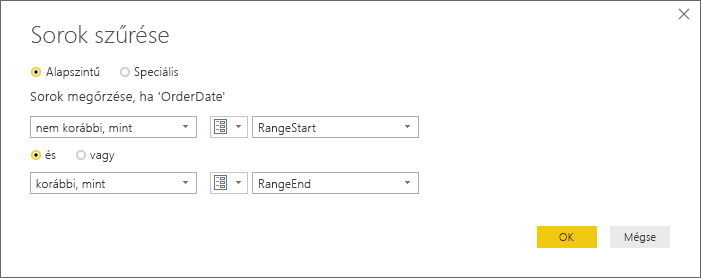
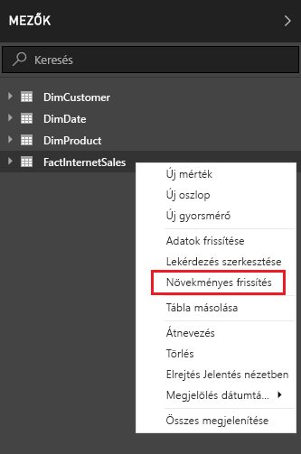

# <a name="incremental-refresh-in-power-bi"></a>Növekményes frissítés a Power BI-ban

A növekményes frissítés rendkívül nagyméretű adathalmazok használatát teszi lehetővé a Power BI-ban, ez pedig az alábbi előnyökkel jár:

> [!div class="checklist"]
> * **Gyorsabb frissítés** – Csak a módosult adatokat szükséges frissíteni. Frissítheti például egy 10 éves adatkészletnek csak az utolsó öt napját.
> * **Megbízhatóbb frissítés** – Nem szükséges a továbbiakban hosszú futású kapcsolatokat fenntartani alacsony megbízhatóságú forrásrendszerekkel.
> * **Csökkentett erőforrás-felhasználás** – A kevesebb frissítendő adat csökkenti a frissítési művelet által igényelt memóriamennyiséget és más erőforrásokat.

> [!NOTE]
> A növekményes frissítés már elérhető Power BI Pro, Prémium és közös előfizetésekben és adathalmazokban. 

## <a name="configure-incremental-refresh"></a>A növekményes frissítés konfigurálása

A növekményes frissítési szabályzatok a Power BI Desktopban definiálhatók, majd az alkalmazásukhoz közzé kell tenni azokat a Power BI szolgáltatásban.


### <a name="filter-large-datasets-in-power-bi-desktop"></a>Nagyméretű adatkészletek szűrése a Power BI Desktopban

A potenciálisan több milliárd sort tartalmazó nagyméretű adatkészletek nem biztos, hogy betölthetők egy Power BI Desktop-modellbe, mivel a PBIX-fájl a felhasználó asztali számítógépének memória-erőforrásai által korlátozott. Ezeket az adatkészleteket ezért gyakran szűrjük az importáláskor. Ez a fajta szűrés független attól, hogy növekményes frissítést használ-e vagy sem. Növekményes frissítés esetén a Power Query dátum/idő paramétereinek segítségével végez szűrést.

#### <a name="rangestart-and-rangeend-parameters"></a>RangeStart és RangeEnd paraméter

A növekményes frissítés esetén az adatokat dátum/idő típusú Power Query-paraméterekkel szűrheti, amelyeknek a **RangeStart** és a **RangeEnd** fenntartott nevet kell adnia, a kis- és nagybetűk különbségére is ügyelve. Ezekkel a paraméterekkel szűrhetők a Power BI Desktopba importált adatok, valamint dinamikusan tartományokba particionálhatók, miután közzétette őket a Power BI szolgáltatásban. A paraméterértékeket a szolgáltatás helyettesíti az egyes partíciók szűréséhez. Nem szükséges a szolgáltatásban az adatkészlet beállításainál megadnia őket. A közzététel után a paraméterek értékét automatikusan felülbírálja a Power BI szolgáltatás.

A Power Query-szerkesztőben válassza a **Paraméterek kezelése** lehetőséget a paraméterek alapértelmezett értékkel való definiálásához.


A paraméterek definiálása után alkalmazhatja a szűrőt úgy, hogy az **Egyéni szűrő** menüpontot választja a kívánt oszlopnál.


A sorokat úgy kell szűrnie, hogy az oszlopérték *nem korábbi, mint* szűrőjéhez a **RangeStart** paramétert választja, a *korábban, mint* szűrőjéhez pedig a **RangeEnd** paramétert. Egyéb szűrőkombinációk a sorok kétszer számolását eredményezhetik.



> [!IMPORTANT]
> Ellenőrizze, hogy a lekérdezések **RangeStart** vagy **RangeEnd** eleme tartalmaz-e egyenlőségjelet (=). Mindkettőben nem szerepelhet. Ha az egyenlőségjel (=) mindkét paraméterben szerepel, egy sor két partíció feltételeinek is megfelelhet, amely ismétlődő adatokat eredményez a modellben. Példa:  
> A \#"Filtered Rows" = Table.SelectRows(dbo_Fact, each [OrderDate] **>= RangeStart** and [OrderDate] **<= RangeEnd**) ismétlődő adatokat eredményezhet.

> [!TIP]
> A paraméterek adattípusának dátum/időnek kell lennie, de átkonvertálhatja őket, hogy megfeleljenek az adatforrás követelményeinek. Az alábbi Power Query-függvény például átkonvertálja a dátum/idő értéket oly módon, hogy az egész szám típusú helyettes kulcsot alkosson *ééééhhnn* formátumban, melynek használata elterjedt gyakorlat az adatraktárakban. A függvényt a szűrési lépéssel hívhatja meg.
>
> `(x as datetime) => Date.Year(x)*10000 + Date.Month(x)*100 + Date.Day(x)`

Válassza a **Bezárás és alkalmazás** lehetőséget a Power Query-szerkesztőben. Ezután az adatkészlet egy alkészletével dolgozhat a Power BI Desktopban.

#### <a name="filter-date-column-updates"></a>A dátum oszlop frissítéseinek szűrése

A dátum oszlop szűrőjének használatával dinamikusan tartományokra bontja az adatokat a Power BI szolgáltatásban. A növekményes frissítés nem támogat olyan eseteket, amelyekben a szűrt dátum oszlop a forrásrendszerben van frissítve. A frissítés beszúrásként és törlésként lesz értelmezve (nem tényleges frissítésként). Ha a törlés az előzménytartományban és nem a növekményes tartományban történik, az nem lesz kiválasztva. Ez a partíciókulcs-ütközés miatt adatfrissítési hibákat okozhat.

#### <a name="query-folding"></a>Lekérdezésdelegálás

Fontos elküldeni a partíciószűrőket a forrásrendszernek, amikor elküldi a lekérdezéseket a frissítési műveletekhez. A szűrés elküldéséhez az adatforrásnak támogatnia kell a lekérdezésdelegálás használatát. A legtöbb SQL-lekérdezéseket támogató adatforrás támogatja a lekérdezésdelegálást. Bizonyos adatforrások, például az egybesimított fájlok, a blobok és a webes hírfolyamok viszont általában nem támogatják a használatát. Ha az adatforrás háttérfolyamata nem támogatja a szűrőt, akkor az nem küldhető tovább. Ilyen esetben az adategyesítési motor a szűrő helyi alkalmazásával kompenzál, amelyhez valószínűleg a teljes adatkészletet le kell kérni az adatforrásból. Ez jelentősen lelassíthatja a növekményes frissítést, és a folyamat kifogyhat az erőforrásokból a Power BI szolgáltatásban vagy a helyszíni adatátjárón (ha azt használja).

Mivel az egyes adatforrások különböző szinten támogatják a lekérdezésdelegálást, ajánlott ellenőrizni azt, hogy a szűrési logika szerepel-e a forráslekérdezésekben. Az egyszerűbb folyamat érdekében a Power BI Desktop ezt elvégezheti Ön helyett. Ha ez nem sikerül, egy figyelmeztetés jelenik meg a növekményes frissítés párbeszédpanelén a növekményes frissítés szabályzatának definiálásakor. Ez a figyelmeztetés SQL-alapú adatforrások számára lehet hasznos, például az SQL, az Oracle és a Teradata számára. Előfordulhat, hogy más adatforrások nem tudják elvégezni az ellenőrzést a lekérdezések követése nélkül. Ha a Power BI Desktop nem tudja megerősíteni a műveletet, a következő figyelmeztetés jelenik meg. Ha ezt a figyelmeztetést látja és ellenőrizni szeretné, hogy megtörténik a szükséges lekérdezésdelegálás, használhatja a Lekérdezési diagnosztika funkciót, vagy nyomon követheti a forrás-adatbázis által kapott lekérdezéseket.

 

### <a name="define-the-refresh-policy"></a>Frissítési szabályzat definiálása

A növekményes frissítést a táblák helyi menüjében érheti el, kivéve az élő kapcsolatú modellek esetében.



#### <a name="incremental-refresh-dialog"></a>Növekményes frissítés párbeszédpanel

Ekkor megjelenik a Növekményes frissítés párbeszédpanel. A párbeszédpanelt az alábbi váltógombbal engedélyezheti.


> [!NOTE]
> Ha a tábla Power Query-kifejezése nem hivatkozik a fenntartott nevű paraméterekre, a váltógomb letiltva jelenik meg.

A fejlécszöveg rövid magyarázatot nyújt az alábbiakról:

- A frissítési szabályzatokat a Power BI Desktopban definiálhatja, és a frissítési művelet alkalmazza őket a szolgáltatásban.

- Ha sikerül is letöltenie a növekményes frissítési szabályzatot tartalmazó PBIX-fájlt a Power BI szolgáltatásból, az nem nyitható meg a Power BI Desktopban. A jövőben elképzelhető, hogy a rendszer támogatni fogja ezt a használati módot, de tartsa szem előtt, hogy ezek az adatkészletek akkorára nőhetnek, hogy problémákba ütközhet, ha átlagos asztali számítógépen próbálja letölteni és megnyitni őket.

#### <a name="refresh-ranges"></a>Tartományok frissítése

A következő példa egy frissítési szabályzatot mutat be az adatok öt naptári évig, valamint az aktuális év adatainak a jelenlegi dátumig tartó tárolásához és 10 nap adatainak növekményes frissítéséhez. Az első frissítési művelet az előzményadatokat tölti be. A további frissítések növekményesek lesznek, és (napi szinten történő futtatás mellett) az alábbi műveleteket végzik el:

- Új napnyi adatok hozzáadása.

- Az adatok frissítése az aktuális dátumtól számított 10 napra visszamenőleg.

- Az aktuális dátumtól számított öt évnél régebbi naptári évek eltávolítása. Ha például az aktuális dátum 2019. január 1., a 2013-as évet eltávolítja a rendszer.

A Power BI szolgáltatás által végzett első frissítés tovább tarthat, mert itt öt teljes naptári évet kell importálni. A későbbi frissítések végrehajtása már sokkal rövidebb időt fog igénybe venni.


#### <a name="current-date"></a>Aktuális dátum

Az *aktuális dátum* alapja a frissítés időpontjában érvényes rendszerdátum. Ha az adathalmazhoz engedélyezve van az ütemezett frissítés a Power BI szolgáltatásban, az aktuális dátum a megadott időzóna figyelembe vételével lesz meghatározva. Ha az időzóna rendelkezésre áll, a manuálisan kezdeményezett és az ütemezett frissítések is figyelembe veszik azt. Egy Csendes-óceáni idő (USA és Kanada) szerint este 8 órakor történő frissítés az időzóna megadása esetén például a Csendes-óceáni idő szerint határozza meg az aktuális dátumot, nem pedig a GMT alapján, amellyel már a következő napra esne.


> [!NOTE]
> Előfordulhat, hogy ezeknek a tartományoknak a definiálásán kívül semmilyen más teendője nincs. Ez esetben közvetlenül a lentebb lévő közzétételi lépésekhez ugorhat. A többi legördülő lista speciális funkciók használatához készült.

### <a name="advanced-policy-options"></a>Speciális szabályzabeállítások

#### <a name="detect-data-changes"></a>Adatváltozások észlelése

10 napnyi adat növekményes frissítése sokkal hatékonyabb, mint öt évnyi adat teljes frissítése. De lehet, hogy ennél többet is tudunk tenni. Az **Adatváltozások észlelése** jelölőnégyzet bejelölésével megadhat egy dátum/idő oszlopot, amely alapján a rendszer azonosítani tudja, hogy mely napokon történt adatváltozás, és csak ezeket a napokat frissíti. Ez azt feltételezi, hogy található ilyen oszlop a forrásrendszerben (mely jellemzően megtalálható, naplózási célokból). **Ez nem lehet ugyanaz az oszlop, amelyet az adatoknak a RangeStart/RangeEnd paraméterekkel való particionálására használt.** Ennek az oszlopnak a maximális értékét a rendszer kiértékeli a növekményes tartományban lévő minden egyes időszak esetében. Ha nem változott az utolsó frissítés óta, akkor nem szükséges frissíteni az időszakot. A jelen példában ez tovább csökkentheti a növekményesen frissített napok számát 10-ről körülbelül 2-re.


> [!TIP]
> A jelenlegi architektúra megköveteli az adatváltozás-észlelési oszlop megőrzését és memóriában való gyorsítótárazását. A számosság és a memóriahasználat csökkentéséhez tanácsos lehet megfontolnia az alábbi technikák egyikének használatát.
>
> Csak az oszlop maximális értékét őrizze meg frissítéskor, például egy Power Query-függvénnyel.
>
> Csökkentse a pontosságot egy olyan szintre, amely a frissítési gyakorisággal kapcsolatos követelmények vonatkozásában még elfogadható.
>
> Definiáljon egyéni lekérdezést az adatmódosításoknak az XMLA-végpont használatával történő észleléséhez és az oszlopérték megőrzésének teljes elkerüléséhez. Az alábbiakban további információkat találhat az adatváltozások észlelésére szolgáló egyéni lekérdezésekről.

#### <a name="only-refresh-complete-periods"></a>Csak teljes időszakok frissítése

Tegyük fel, hogy a frissítés mindennap hajnali 4 órára van ütemezve. Ha a forrásrendszerbe e 4 óra során adat kerül be, akkor elképzelhető, hogy azt nem szeretné figyelembe venni. Egyes üzleti mérőszámok – például a hordók száma naponta az olaj- és gáziparban – nem értelmezhetők részleges naponként.

További példaként tegyük fel, hogy az adatokat egy pénzügyi rendszerből frissítjük, ahol az elmúlt hónapra vonatkozó adatok a hónap 12. napján vannak jóváhagyva. Ilyen esetben beállíthatja a növekményes tartományt 1 hónapra, és a frissítést ütemezheti úgy, hogy a hónap 12. napján fusson le. Ennek a jelölőnégyzetnek a bejelölése esetén például a januári adatokat a rendszer csak február 12-én frissíti.


> [!NOTE]
> A szolgáltatás az UTC időzóna szerint hajtja végre a frissítési műveleteket. Ez befolyásolhatja az aktuális dátumot és a teljes időszakokat. Tervezzük egy olyan funkció hozzáadását, amellyel felülbírálható az aktuális dátum a frissítési műveletekben.

## <a name="publish-to-the-service"></a>Közzététel a szolgáltatásban

Ezután készen áll a modell frissítésére. Az első frissítés tovább tarthat az előzményadatok importálása miatt. A későbbi frissítések azonban sokkal gyorsabban lesznek a növekményes frissítésnek köszönhetően.

## <a name="query-timeouts"></a>Lekérdezési időtúllépések

A [frissítéssel kapcsolatos hibák elhárítását tárgyaló cikkünk](../connect-data/refresh-troubleshooting-refresh-scenarios.md) kitér rá, hogy a Power BI időtúllépés miatt leállíthatja a frissítési műveleteket. A lekérdezéseket emellett az adatforrás alapértelmezett időtúllépési beállítása is korlátozhatja. A legtöbb relációs forrás támogatja az időtúllépési érték M kifejezésben való felülbírálását. Az alábbi kifejezés például az [SQL Server data-access függvényével](https://docs.microsoft.com/powerquery-m/sql-database) 2 órára állítja az időtúllépést. A szabályzatban megadott tartomány minden egyes időszaka elküld egy lekérdezést, mely tartalmazza ezt az időtúllépési beállítást.

```powerquery-m
let
    Source = Sql.Database("myserver.database.windows.net", "AdventureWorks", [CommandTimeout=#duration(0, 2, 0, 0)]),
    dbo_Fact = Source{[Schema="dbo",Item="FactInternetSales"]}[Data],
    #"Filtered Rows" = Table.SelectRows(dbo_Fact, each [OrderDate] >= RangeStart and [OrderDate] < RangeEnd)
in
    #"Filtered Rows"
```

## <a name="xmla-endpoint-benefits-for-incremental-refresh"></a>Az XMLA-végpont előnyei a növekményes frissítés szempontjából

A prémium szintű kapacitáshoz tartozó [XMLA-végpontok](service-premium-connect-tools.md) engedélyezhetők az olvasási/írási műveletekhez, ami jelentős előnyökkel járhat a növekményes frissítésre nézve. Az XMLA-végpontokon keresztül végezhető frissítési műveletekre nem vonatkozik a [naponta 48 frissítést](../connect-data/refresh-data.md#data-refresh) megengedő korlátozás, és nem érvényes az [ütemezett frissítések időtúllépési korlátja](../connect-data/refresh-troubleshooting-refresh-scenarios.md#scheduled-refresh-timeout), ez pedig hasznos lehet növekményes frissítés esetén.

### <a name="refresh-management-with-sql-server-management-studio-ssms"></a>Frissítéskezelés az SQL Server Management Studio (SSMS) használatával

Az XMLA-végpontok olvasásának/írásának engedélyezezése esetén az SSMS felhasználható a növekményes frissítési szabályzatok által generált partíciók megtekintésére és kezelésére.


#### <a name="refresh-historical-partitions"></a>Előzménypartíciók frissítése

Ez lehetővé teszi például, hogy egy olyan adott előzménypartíció frissítése, amely nem a növekményes tartományban van, visszamenőleges frissítést végezzen anélkül, hogy az összes előzményadatot frissítenie kellene.

#### <a name="override-incremental-refresh-behavior"></a>Növekményes frissítési viselkedés felülbírálása

Az SSMS használatával emellett a növekményes frissítések meghívásának módja is jobban szabályozható a [Táblázatos modell parancsnyelve (TMSL)](https://docs.microsoft.com/analysis-services/tmsl/tabular-model-scripting-language-tmsl-reference?view=power-bi-premium-current) és a [Táblázatos objektummodell (TOM)](https://docs.microsoft.com/analysis-services/tom/introduction-to-the-tabular-object-model-tom-in-analysis-services-amo?view=power-bi-premium-current) használatával. Rákattinthat például a jobb gombbal egy táblára az SSMS Object Explorerben, majd kiválaszthatja a **Tábla feldolgozása** menüpontot. Ez után a **Szkript** gombra kattintva frissítési TMSL-parancsot generálhat.


A frissítési TMSL-parancsba beszúrhatja az alábbi paramétereket a növekményes frissítés alapértelmezett viselkedésének felülbírálásához.

- **applyRefreshPolicy** – Ha egy táblához növekményes frissítési szabályzat van definiálva, az applyRefreshPolicy paraméter határozza meg, hogy ez a szabályzat alkalmazva legyen-e. Ha a szabályzat nincs alkalmazva, a feldolgozás teljes folyamata változatlanul hagyja a partíció-definíciókat, és a tábla minden partíciója teljesen frissítve lesz. Az alapértelmezett érték true (igaz).

- **effectiveDate** – Egy növekményes frissítési szabályzatnak az alkalmazása esetén ismernie kell az aktuális dátumot az előzménytartomány és a növekményes tartomány mozgó intervallumainak meghatározásához. Az effectiveDate paraméter lehetővé teszi az aktuális dátum felülírását. Ez jól használható tesztelésre, bemutatókhoz és olyan üzleti helyzetekben, ahol az adatok egy múltbeli vagy jövőbeli dátumig vannak növekményesen frissítve (például a jövőre vonatkozó költségvetés esetében). Alapértelmezett értéke az [aktuális dátum](#current-date).

```json
{ 
  "refresh": {
    "type": "full",

    "applyRefreshPolicy": true,
    "effectiveDate": "12/31/2013",

    "objects": [
      {
        "database": "IR_AdventureWorks", 
        "table": "FactInternetSales" 
      }
    ]
  }
}
```

### <a name="custom-queries-for-detect-data-changes"></a>Egyéni lekérdezések adatváltozások észleléséhez

A TMSL és/vagy TOM használatával felülbírálható a viselkedés az adatváltozások észlelésekor. Azon felül, hogy ezzel elkerülhető az utoljára frissített oszlopnak a memóriabeli gyorsítótárban való megőrzése, olyan megoldások is lehetővé válnak, ahol ETL-folyamatok egy konfigurációs/utasítási táblát készítenek elő azzal a céllal, hogy csak a frissítést igénylő partíciók legyenek megjelölve. Ez sokkal hatékonyabb növekményes frissítési folyamatot eredményezhet, amelyben csak a szükséges időszakok vannak frissítve, függetlenül attól, hogy milyen régen történt adatfrissítés.

A pollingExpression lehet egy egyszerű M-kifejezés, vagy egy másik M-lekérdezés neve. Skalárértéket kell visszaadnia, és minden partícióhoz végre lesz hajtva. Ha a visszaadott érték eltér attól, ami az utolsó növekményes frissítéskor volt, a partíció teljes feldolgozásra lesz megjelölve.

A következő példa a teljes 120 hónapos előzménytartományban vizsgálja a visszamenőleges módosításokat. Amiatt, hogy 10 év helyett 120 hónap van megadva, az adattömörítés esetleg kevésbé lesz hatékony, de így nem szükséges egy teljes évi előzményt frissíteni, ami nagyobb költséggel járna, ha egy hónapot is elég lenne frissíteni a visszamenőleges változások miatt.

```json
"refreshPolicy": {
    "policyType": "basic",
    "rollingWindowGranularity": "month",
    "rollingWindowPeriods": 120,
    "incrementalGranularity": "month",
    "incrementalPeriods": 120,
    "pollingExpression": "<M expression or name of custom polling query>",
    "sourceExpression": [
    "let ..."
    ]
}
```

## <a name="metadata-only-deployment"></a>Üzembe helyezés csak metaadatokkal

Ha egy PBIX-fájlnak a Power BI Desktopból egy Power BI szolgáltatásbeli munkaterületre való közzétételekor már létezik azonos nevű adathalmaz, akkor a rendszer megerősítést kér a meglévő adathalmaz felülírásához.


Előfordulhat, hogy nem szeretné felülírni az adathalmazt, főleg növekményes frissítés esetén. Az adathalmaz a Power BI Desktopban sokkal kisebb lehet, mint a szolgáltatásban. Ha a szolgáltatásbeli adathalmazra növekményes frissítési szabályzat van alkalmazva, az több évnyi előzményadatot is tartalmazhat, amely elveszik, ha az adathalmazt felülírja. Az összes előzményadat frissítése órákig tarthat, és rendszerleállást okozhat a felhasználók számára.

Érdemesebb inkább csak metaadatokkal végrehajtani az üzembe helyezést. Így az új objektumok az előzményadatok elvesztése nélkül helyezhetők el. Ha például új mértékeket vett fel, elég az új mértékeket üzembe helyeznie anélkül, hogy frissítenie kellene az adatokat, ezzel pedig sok időt takarít meg.

Ha olvasásra/írásra van konfigurálva, az XMLA-végpont biztosítja a kompatibilitást az ezt megvalósító eszközökkel. Az ALM Toolkit például egy Power BI-adathalmazokhoz használható sémakülönbözeti eszköz, amely felhasználható arra, hogy csak metaadatokat helyezzen üzembe.

Az ALM Toolkit legújabb verzióját az [Analysis Services Git-adattárból](https://github.com/microsoft/Analysis-Services/releases) töltheti le és telepítheti. A dokumentációra mutató hivatkozások és a támogathatóságra vonatkozó információk a Súgó szalagon keresztül érhetők el. A csak metaadatokkal végzett üzembe helyezés végrehajtásához végezzen összehasonlítást, és jelölje ki forrásként a futó Power BI Desktop-példányt, célként pedig a szolgáltatásban meglévő adathalmazt. Vizsgálja meg a megjelenő különbségeket, és hagyja ki a növekményes frissítési partíciók frissítést, vagy használja a Lehetőségek párbeszédpanelt a partíciók táblafrissítésekhez való megtartásához. A kijelölés ellenőrzésével biztosítsa a célmodell integritását, majd hajtsa végre a frissítést.


## <a name="see-also"></a>További információ

[Adathalmaz-kapcsolat az XMLA-végponttal](service-premium-connect-tools.md)   
[Frissítési forgatókönyvekkel kapcsolatos hibák elhárítása](../connect-data/refresh-troubleshooting-refresh-scenarios.md)   
