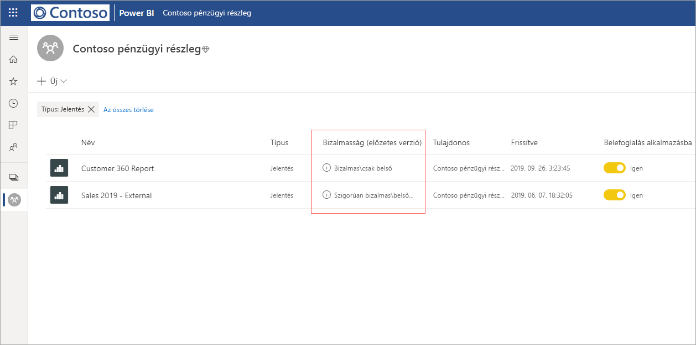
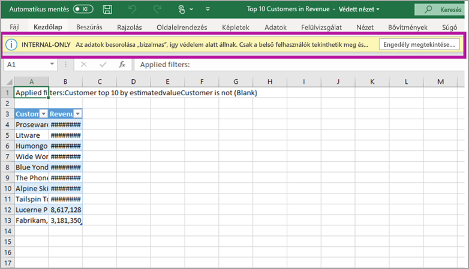

# Adatvédelem a Power BI-ban (előzetes verzió)

A modern vállalatokban szigorú üzleti előírások és követelmények vonatkoznak a bizalmas adataik kezelésére és védelemére. A Power BI integrálható a Microsoft Information Protection és a Microsoft Cloud App Security szolgáltatással, és így a bizalmas adatok jobban szabályozhatók és átláthatók a Power BI-ban. 

A Power BI-beli adatvédelemmel a következőkre van lehetősége:

* A Microsoft bizalmassági címkéivel osztályozhatja és címkézeti a Power BI szolgáltatásbeli tartalmakat (irányítópultokat, jelentéseket, adathalmazokat és adatfolyamokat), ugyanazzal a taxonómiával, mint amelyet a fájlok besorolásához és védelméhez használ az Office 365-ben. 

* Védelmi beállítások, például titkosítás vagy vízjelek használatát kényszerítheti az adatok a Power BI szolgáltatásból fájlokba való exportálásakor a tartalom bizalmassági címkéjének és védelmének alkalmazásával (Excel, PowerPoint és PDF). 

  Például a felhasználók Bizalmas címkét alkalmazhatnak Power BI-beli jelentésekre. Ezután, amikor az adatokat Excel-fájlba exportálják, a Power BI a fájlra is alkalmazza a Bizalmas címkét. A címkével titkosítható a tartalom és Bizalmas vízjel alkalmazható rá.

* A Microsoft Cloud App Security szolgáltatással figyelheti a Power BI-beli tevékenységeket, megvizsgálhatja a biztonsági problémákat, valamint a Microsoft Cloud App Security feltételes hozzáférést biztosító alkalmazás-vezérlőjével biztosíthatja a Power BI-beli tartalom védelmét. 

## Bizalmassági címkék a Power BI-ban

A bizalmassági címkéket a [Microsoft 365 Biztonsági központban](https://security.microsoft.com/) vagy a [Microsoft 365 Megfelelőségi központban](https://compliance.microsoft.com/) lehet létrehozni és kezelni.

A bizalmassági címkék bármely központban való eléréséhez válassza a **Besorolás > Bizalmassági címkék** lehetőséget. Ezeket a bizalmassági címkéket több Microsoft-szolgáltatás, például az Azure Information Protection, az Office-alkalmazások és az Office 365-szolgáltatások is tudják használni.

> [!IMPORTANT]
> Az Azure Information Protection-ügyfeleknek a fentebbiekben felsorolt szolgáltatások egyikébe kell migrálniuk a címkéket ahhoz, hogy a bizalmassági címkéket használni lehessen a Power BI-ban. Emellett a bizalmassági címkék használata csak nyilvános felhőkben támogatott, és felhőkben lévő bérlők, például szuverén felhők esetében nem támogatott.
>
> További információ [a bizalmassági címkék a Microsoft Information Protectionbe való migrálásáról](https://docs.microsoft.com/azure/information-protection/configure-policy-migrate-labels).

## A bizalmassági címkék működése

Amikor egy bizalmassági címkét alkalmaz egy Power BI-beli irányítópultra, jelentésre, adathalmazra vagy adatfolyamra, az ahhoz hasonló, mintha egy olyan *címkét* alkalmazna az adott erőforrásra, amely a következő előnyöket biztosítja:
* **Testreszabható** – olyan kategóriákat hozhat létre a szervezet bizalmas tartalmainak különböző szintjeihez, mint például a Személyes, a Nyilvános, az Általános, a Bizalmas és a Szigorúan bizalmas.
* **Nem titkosított szöveg** – mivel a címke szövege nem titkosított, a felhasználók könnyedén megtudhatják, hogyan kell kezelniük a tartalmat a bizalmassági címkékre vonatkozó irányelvek alapján.
* **Maradandó** – miután alkalmaztak egy bizalmassági címkét a tartalomra, együtt mozog az adott tartalommal a következő támogatott fájltípusokba való exportáláskor: Excel, PowerPoint és PDF. 

  Ez azt jelenti, hogy a bizalmassági címke követi a tartalmat, beleértve annak védelmi beállításait, és a szabályzatok alkalmazásának és érvényesítésének alapja lesz. 

## Példa bizalmassági címkére 

A következő egy gyors példa arra, hogyan működnek a bizalmassági címkék a Power BI-ban.

1. A Power BI szolgáltatásban a **szigorúan bizalmas – csak belső használatra** bizalmassági címkét alkalmazzák egy jelentésre.

   

2. Amikor a jelentésből egy Excel-fájlba exportálják az adatokat, a rendszer alkalmazza a bizalmassági címkét és a védelmet az exportált Excel-fájlra.

   

A Microsoft Office-alkalmazásokban a bizalmassági címke a fenti képhez hasonló módon jelenik meg címkeként az e-mailen vagy a dokumentumon.

Besorolást is hozzárendelhet a tartalomhoz (úgy, mint egy matricát), amely megmarad és követi a tartalmat annak használata és megosztása során. Ezen besorolás használatával jelentéseket generálhat és megtekintheti a bizalmas tartalom tevékenységadatait. Ezen információk alapján bármikor dönthet úgy a későbbiekben, hogy védelmi beállításokat alkalmaz.

## Bizalmassági címkék használata a Power BI-ban

Ahhoz, hogy engedélyezhesse a bizalmassági címkéket a Power BI-ban, teljesítenie kell a következő előfeltételeket: 

* Győződjön meg arról, hogy a bizalmassági címkék a [Microsoft 365 Biztonsági központban](https://security.microsoft.com/) vagy a [Microsoft 365 Megfelelőségi központban](https://compliance.microsoft.com/) lehettek definiálva. 
* [Bizalmassági címkék](service-security-enable-data-sensitivity-labels.md) (előzetes verzió) engedélyezése a Power BI-ban.
* Győződjön meg arról, hogy a felhasználók rendelkeznek a megfelelő licenccel;
  * A címkék Power BI-ban való alkalmazásához vagy megtekintéséhez a felhasználóknak Azure Information Protection Prémium P1- vagy Prémium P2-licenccel kell rendelkezniük Microsoft. A Microsoft Azure Information Protection önmagában és a Microsoft licencelési csomagjainak egyikében is megvásárolható. A részletekért tekintse meg az [Azure Information Protection díjszabását](https://azure.microsoft.com/pricing/details/information-protection/).
  * A címkék Power BI-erőforrásokra való alkalmazásához a felhasználóknak a fentebbiekben említett Azure Information Protection-licencek egyike mellett Power BI Pro-licenccel kell rendelkezniük. 

## Tartalom védelme a Microsoft Cloud App Securityvel

A Power BI-beli tartalmakat a Microsoft Cloud App Securityvel védheti meg a nem szándékos szivárgásokkal és visszaélésekkel szemben. A Microsoft Cloud App Security beállítását és konfigurálását követően a rendszergazdák figyelhetik a felhasználók hozzáférését és tevékenységeit, valós idejű kockázatelemzést hajthatnak végre, és címkékre vonatkozó vezérlőket állíthatnak be.

A szervezetek például olyan szabályzatot konfigurálhatnak a Microsoft Cloud App Securityvel, amely megakadályozza, hogy a felhasználók nem felügyelt eszközökre töltsenek le bizalmas adatokat a Power BI-ból. Egy ilyen konfigurációval a felhasználók továbbra is bárhonnan hatékonyan dolgozhatnak és csatlakozhatnak a Power BI-hoz, miközben a Microsoft Cloud App Security használata meggátolja a felhasználói műveletek biztonságának megsértését, mindezt valós időben. 

### Követelmények

A következő előfeltételeknek kell teljesülniük ahhoz, hogy a bizalmassági címkék használhassák a Microsoft Cloud App Securityt: 

* A Cloud App Securitynek és az Azure Information Protectionnek [engedélyezve kell lennie a bérlőben](https://docs.microsoft.com/cloud-app-security/azip-integration).
* Az alkalmazásnak [csatlakoznia kell a Microsoft Cloud App Securityhez](https://docs.microsoft.com/cloud-app-security/enable-instant-visibility-protection-and-governance-actions-for-your-apps).

## Megfontolandó szempontok és korlátozások

Az alábbi listában a Power BI bizalmassági címkéinek néhány korlátozása van felsorolva:

* A Microsoft Azure Information Protection bizalmassági címkéinek Power BI-ban való alkalmazásához és megtekintéséhez Azure Information Protection Prémium P1- vagy Prémium P2-licenc szükséges. A Microsoft Azure Information Protection önmagában és a Microsoft licencelési csomagjainak egyikében is megvásárolható. A részletekért tekintse meg az [Azure Information Protection díjszabását](https://azure.microsoft.com/pricing/details/information-protection/).
* A bizalmassági címkék csak irányítópultokra, jelentésekre, adathalmazokra és adatfolyamra alkalmazhatók.
* A címkék és védelmi vezérlők exportált fájlokra való érvényesítése csak Excel-, PowerPoint- és PDF-fájlok esetében támogatott. A rendszer nem érvényesíti a címkét és a védelmet, ha az adatokat .CSV-fájlokba, e-mailre való feliratkozással, vizualizációk beágyazásával vagy nyomtatással exportálják.
* A felhasználónak, aki exportál egy fájlt a Power BI-ból, a bizalmassági címke beállításainak megfelelően engedélye van az adott fájl elérésére és szerkesztésére. Az adatokat exportáló felhasználó nem kap tulajdonosi engedélyt a fájlhoz. 
* A bizalmassági címkék jelenleg [oldalakra osztott jelentésekhez]( https://docs.microsoft.com/power-bi/paginated-reports-report-builder-power-bi) és munkafüzetekhez nem érhetők el.
* A Power BI-objektumok bizalmassági címkéi csak a munkaterületek listájában és az életútnézetekben láthatók; a címkék jelenleg nem láthatók a Kedvencek, a Velem megosztva, a Legutóbbiak vagy az Alkalmazás nézetben. Azt azonban vegye figyelembe, hogy egy Power BI-objektumra alkalmazott címke minden esetben megmarad az Excel-, PowerPoint- vagy PDF-fájlokba exportált adatokon, még akkor is, ha nem látható.
* A bizalmassági címke *fájltitkosítási beállítása*, mely a [Microsoft 365 Biztonsági központban](https://security.microsoft.com/) vagy a [Microsoft 365 Megfelelőségi központban](https://compliance.microsoft.com/) lett konfigurálva, csak a Power BI-ból *exportált* fájlokra érvényes; a Power BI-on *belül* nem érvényesíti a rendszer.
* A [HYOK-védelem](https://docs.microsoft.com/azure/information-protection/configure-adrms-restrictions) a Power BI-ban alkalmazott címkék esetében nem támogatott.
* A címkék Office-alkalmazásokban való megtekintésére és alkalmazására [licencelési követelmények](https://docs.microsoft.com/microsoft-365/compliance/sensitivity-labels-office-apps#subscription-and-licensing-requirements-for-sensitivity-labels) vonatkoznak.
* A bizalmassági címkék használata csak a globális (nyilvános) felhőben található bérlők esetében támogatott. A bizalmassági címkék használata a más felhőkben található bérlők esetében nem támogatott.
* Az adatbizalmassági címkék nem támogatottak a sablonalkalmazásoknál.
* A Power BI nem támogatja a bizalmassági címkéket a **Nem továbbítható** és az **Ad-Hoc** védelmi típusokhoz.

## Következő lépések

Ebben a cikkben a Power BI adatvédelmi lehetőségeinek áttekintése található. A következő cikkek további részleteket tartalmaznak a Power BI-ban alkalmazható adatvédelemről. 

* [Bizalmassági adatcímkézés engedélyezése a Power BI-ban](service-security-enable-data-sensitivity-labels.md)
* [Bizalmassági címkék alkalmazása a Power BI-ban](../designer/service-security-apply-data-sensitivity-labels.md)
* [A Microsoft Cloud App Security vezérlőinek használata a Power BI-ban](service-security-using-microsoft-cloud-app-security-controls.md)
* [Adatvédelmi metrikák jelentése](service-security-data-protection-metrics-report.md)