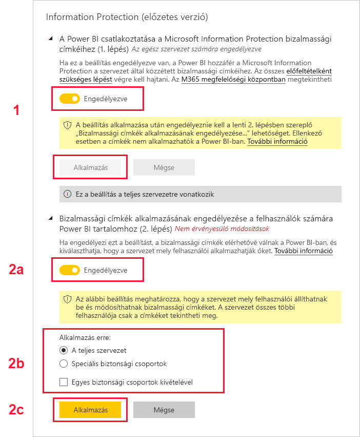

# Bizalmassági adatcímkézés engedélyezése a Power BI-ban (előzetes verzió)

Ha engedélyezve vannak a [Microsoft Information Protection bizalmassági adatcímkéi](https://docs.microsoft.com/microsoft-365/compliance/sensitivity-labels) a Power BI-ban, arra az alábbiak vonatkoznak:

* A szervezet bizonyos felhasználói és csoportja osztályozhatják és [alkalmazhatják a bizalmassági adatcímkéket](../designer/service-security-apply-data-sensitivity-labels.md) a Power BI-beli irányítópultjaikra, jelentéseikre, adathalmazaikra és adatfolyamaikra (a továbbiakban *adategységek*).
* Ezeket a címkéket a szervezet minden tagja láthatja.

A bizalmassági adatcímkék elősegítik az adatvédelmet azáltal, hogy felhívják a Power BI szerzőinek és fogyasztóinak a figyelmét az adatok bizalmas jellegére, valamint információt nyújtanak a besorolás jelentéséről, és hogy az adott besorolású adatokat miként kell kezelni.

Ha a bizalmassági adatcímkével rendelkező Power BI-adatokat egy Excel-, PowerPoint- vagy PDF-fájlba exportálja, az exportban a bizalmassági adatcímkék is szerepelnek. Ez azt jelent, hogy azok a felhasználók, akiknek a bizalmassági adatcímkékre vonatkozó szabályzatok miatt nincs engedélyük a címkézett adatok elérésére, nem fogják tudni megnyitni a fájlokat a Power BI-on *kívül* (Excel-, PowerPoint- vagy PDF-alkalmazásokban) sem.

A bizalmassági adatcímkék engedélyezéséhez Azure Information Protection-licenc szükséges. További részletekért lásd a [Licencelés](#licensing) szakaszt.

## Bizalmassági adatcímkézés engedélyezése

A Microsoft Information Protection bizalmassági adatcímkéinek engedélyezéséhez a Power BI-ban lépjen a Felügyeleti portálra, nyissa meg a Bérlő beállításai ablaktáblát, és keresse meg az Adatvédelem szakaszt.

Az **Adatvédelem** szakaszban kövesse az alábbi lépéseket:
1.  Az engedélyezéshez váltsa át **A Microsoft Information Protection bizalmassági címkéinek engedélyezése** kapcsolót, és nyomja meg az **Alkalmaz** gombot. Ezzel a lépéssel *csak* láthatóvá teszi a bizalmassági adatcímkéket az egész szervezetben, de nem alkalmaz semmilyen címkét. Annak meghatározásához, hogy ki alkalmazhat ilyen címkéket a Power BI-ban, a 2. lépést is el kell végeznie.
2.  Azoknak a személyeknek a meghatározása, akik bizalmassági adatcímkéket alkalmazhatnak a Power BI-adategységekre, és módosíthatják azokat. Ez a lépés három műveletet tartalmaz:
    1.  Az engedélyezéshez váltsa át a **Power BI-tartalom és -adatok bizalmassági címkéinek beállítása** kapcsolót.
    2.  Válassza ki a releváns biztonsági csoportokat. Alapértelmezés szerint a szervezetnél mindenki alkalmazhat bizalmassági adatcímkéket. Azonban választhatja azt is, hogy csak meghatározott felhasználók és biztonsági csoportok számára engedélyezi a bizalmassági adatcímkék beállítását. Ha ki van jelölve a teljes szervezet vagy adott biztonsági csoportok, kizárhatja a felhasználók vagy a biztonsági csoportok meghatározott részhalmazát.
    * Ha a bizalmassági adatcímkék a teljes szervezet számára engedélyezettek, a kivételek általában biztonsági csoportok.
    * Ha a bizalmassági adatcímkék csak meghatározott felhasználók vagy biztonsági csoportok számára engedélyezettek, a kivételek általában meghatározott felhasználók.  
    Ez a megközelítés megakadályozza, hogy bizonyos felhasználók bizalmassági adatcímkéket alkalmazzanak a Power BI-ban, még ha olyan csoporthoz tartoznak is, amely számára ez engedélyezett.
    
    3. Nyomja meg az **Alkalmaz** gombot.

> [!IMPORTANT]
> A bizalmassági adatcímkéket csak azok a Power BI Pro-felhasználók állíthatják be és szerkeszthetik, akik *létrehozási* és *szerkesztési* engedéllyel rendelkeznek az adategységhez, és akik annak a releváns biztonsági csoportnak a tagjai, amelyet ebben a szakaszban beállított. Azok a felhasználók, akik nem tagjai ennek a csoportnak, nem fogják tudni beállítani vagy szerkeszteni a címkét. 

## Megfontolandó szempontok és korlátozások

A Power BI a Microsoft Information Protection bizalmassági címkéit használja. Ezért, ha hibaüzenetet kap, amikor megpróbálja engedélyezni a bizalmassági adatcímkéket, annak az alábbi okai lehetnek:

* Nem rendelkezik Azure Information Protection-[licenccel](#licensing).
* A bizalmassági címkék nincsenek migrálva a Power BI által támogatott Microsoft Information Protection-verzióba. További információ a [bizalmassági adatcímkék migrálásáról](https://docs.microsoft.com/azure/information-protection/configure-policy-migrate-labels).
* A szervezetben nem határoztak meg Microsoft Information Protection bizalmassági címkéket. Ezen túlmenően a címkének egy közzétett szabályzat részének kell lennie ahhoz, hogy használható legyen. [Tudjon meg többet a bizalmassági adatcímkékről](https://docs.microsoft.com/Office365/SecurityCompliance/sensitivity-labels), vagy látogasson el a [Microsoft biztonsági és megfelelőségi központjába](https://sip.protection.office.com/sensitivity?flight=EnableMIPLabels), ahol elolvashatja, hogyan határozhat meg címkéket és tehet közzé szabályzatokat a szervezet számára.

## Licencelés

* A Microsoft Azure Information Protection címéinek Power BI-ban való megtekintéséhez a felhasználóknak Azure Information Protection Prémium P1 vagy Prémium P2 licenccel kell rendelkezniük. A Microsoft Azure Information Protection önmagában és a Microsoft licencelési csomagok egyikén belül is megvásárolható. A részletekért tekintse meg az [Azure Information Protection díjszabását](https://azure.microsoft.com/pricing/details/information-protection/).
* Azoknak a felhasználónak, akiknek címkéket kell alkalmazniuk a Power BI adategységeire, Power BI Pro-licenccel kell rendelkezniük.

## Következő lépések

Ez a cikk azt ismertette, hogyan engedélyezheti a bizalmasság adatcímkéket a Power BI-ban. A következő cikkek további részleteket tartalmaznak a Power BI-ban alkalmazható adatvédelemről. 

* [A Power BI adatvédelmi lehetőségeinek áttekintése](service-security-data-protection-overview.md)
* [Bizalmassági címkék alkalmazása a Power BI-ban](../designer/service-security-apply-data-sensitivity-labels.md)
* [A Microsoft Cloud App Security vezérlőinek használata a Power BI-ban](service-security-using-microsoft-cloud-app-security-controls.md)