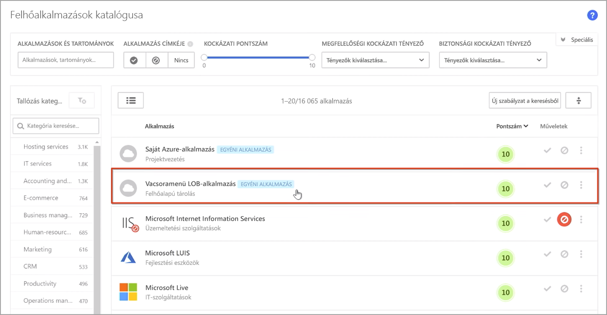
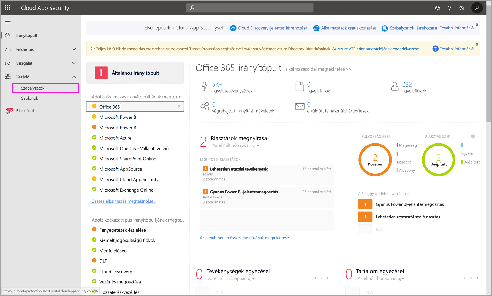
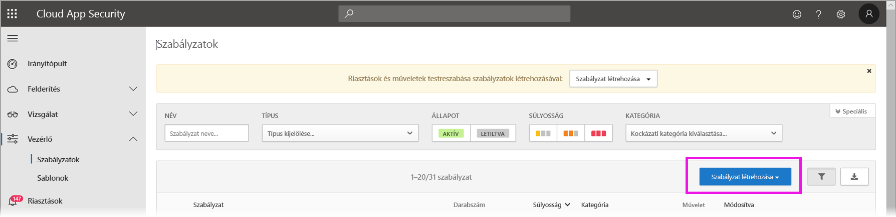
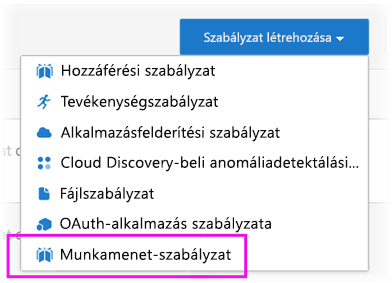
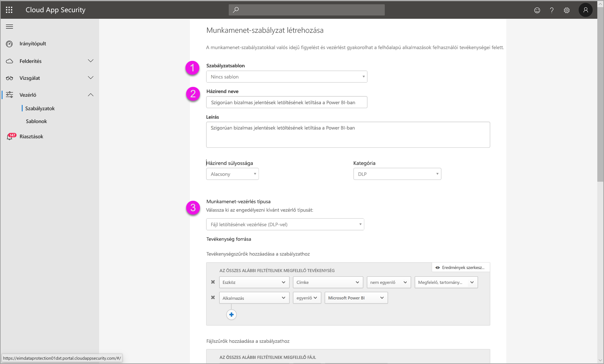
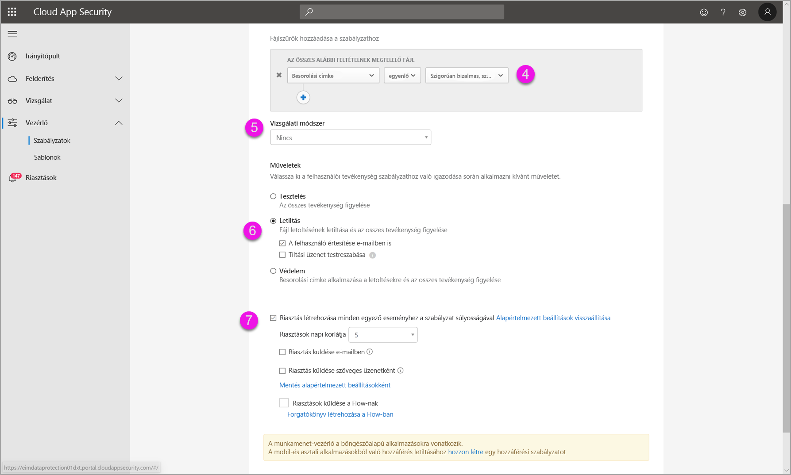
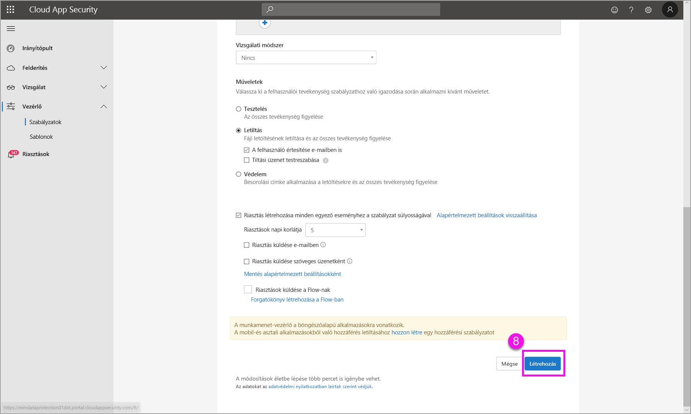

# A Microsoft Cloud App Security vezérlőinek használata a Power BI-ban (előzetes verzió)

A Microsoft Cloud App Security és a Power BI használatával megvédheti Power BI-jelentéseit, adatait és szolgáltatásait a nem kívánt szivárgásoktól és szabálysértésektől. A Cloud App Security használatával feltételes hozzáférési szabályzatokat hozhat létre a szervezet adataihoz az Azure Active Directory (Azure AD) valós idejű munkamenet-vezérlőinek segítségével, és ezzel biztosíthatja a Power BI-elemzések védelmét. A szabályzatok beállítását követően a rendszergazdák figyelhetik a felhasználók hozzáférését és tevékenységét, valós idejű kockázatelemzést hajthatnak végre, és címkékre vonatkozó vezérlőket állíthatnak be. 

A Microsoft Cloud App Security szolgáltatást nem csupán a Power BI-hoz, hanem az alkalmazások és szolgáltatások minden típusához igénybe veheti. A Cloud App Security egy alkalmazások és eszközök védelmére szolgáló, saját irányítópulttal kezelhető Microsoft-alkalmazás. Ahhoz, hogy a Cloud App Security segítségével védhesse a Power BI-ban kezelt adatait és elemzéseit, konfigurálnia kell a Cloud App Securityt a Power BI-jal való együttműködésre. A Cloud App Security szolgáltatásról, beleértve a működés áttekintését, az irányítópultot és az alkalmazás kockázati pontszámát, a [Microsoft Cloud App Security](https://docs.microsoft.com/cloud-app-security/) dokumentációjában talál további információt.

## A Microsoft Cloud App Security használata a Power BI-jal

A Microsoft Cloud App Security szolgáltatás Power BI-jal történő használatához igénybe kell vennie és konfigurálnia kell a Microsoft erre vonatkozó biztonsági szolgáltatásait, amelyek némelyike a Power BI-on kívül van beállítva.

### A Microsoft Cloud App Security licencelése

A Microsoft Cloud App Security szolgáltatás bérlőbe való felvételéhez a következő licencek egyikével kell rendelkeznie:
* MCAS: Az EMS E5 és az M365 E5 csomagok részeként OCAS-képességeket biztosít minden támogatott alkalmazáshoz.
* CAS-D: Csak az MCAS Discoveryt nyújtja.
* OCAS: Csak az Office 365-höz, az Office E5 csomagon belül nyújt MCAS-funkciókat.
* Választható: AAD P1 és AIP P1 a Microsoft Cloud App Security legtöbb funkciójának kihasználásához.

Az alábbi szakaszok a Microsoft Cloud App Security szolgáltatás Power BI-ban történő használatát írják le.

### Munkamenet-szabályzatok beállítása az Azure Active Directoryban (kötelező)
A munkamenet-vezérlők beállításához szükséges lépéseket az Azure AD és a Microsoft Cloud App Security portálján kell végrehajtani. Az Azure AD-portálon hozzon létre egy feltételes hozzáférési szabályzatot a Power BI-hoz, és a Microsoft Cloud App Security szolgáltatáson keresztül irányítsa át a Power BI-ban használt munkameneteket. 

A Microsoft Cloud App Security fordított proxyt használó architektúra révén működik, és integrálva van az Azure AD feltételes hozzáférésével a Power BI-ban zajló felhasználói tevékenység valós idejű figyelése érdekében. A szükséges lépések alábbi leírása segíti a folyamat megértését, és minden egyes lépéshez részletes útmutatás található a hivatkozott tartalmakban. A teljes folyamat megismeréséhez elolvashatja [a Cloud App Security szolgáltatásról szóló cikket](https://docs.microsoft.com/cloud-app-security/proxy-deployment-aad).

1.  [Szabályzat létrehozása az Azure AD feltételes hozzáférés ellenőrzéséhez](https://docs.microsoft.com/cloud-app-security/proxy-deployment-aad#add-azure-ad)
2.  [Bejelentkezés minden egyes alkalmazásba egy olyan felhasználóval, aki a szabályzat hatókörébe tartozik](https://docs.microsoft.com/cloud-app-security/proxy-deployment-aad#sign-in-scoped).
3.  [Annak ellenőrzése, hogy az alkalmazások konfigurálva vannak-e a hozzáférés és a munkamenet vezérlőinek használatához](https://docs.microsoft.com/cloud-app-security/proxy-deployment-aad#portal)
4.  [A központi telepítés ellenőrzése](https://docs.microsoft.com/cloud-app-security/proxy-deployment-aad#step-4-test-the-deployment)

A munkamenet-szabályzatok beállításának folyamatát a [Munkamenet-szabályzatok](https://docs.microsoft.com/cloud-app-security/session-policy-aad) című cikk írja le. 

### Anomáliadetektálási szabályzatok beállítása a PBI-tevékenységek figyeléséhez (ajánlott)
A Power BI-ban meghatározhat csak az adott szabályzatba befoglalt vagy letiltott felhasználókra vagy csoportokra vonatkozó, önállóan módosítható hatókörű anomáliadetektálási szabályzatokat. [További információ](https://docs.microsoft.com/cloud-app-security/anomaly-detection-policy#scope-anomaly-detection-policies).

A Cloud App Security két dedikált, beépített észlelést is tartalmaz a Power BI-hoz. [A részleteket a jelen dokumentum későbbi szakaszában tekintheti meg.](#built-in-microsoft-cloud-app-security-detections-for-power-bi)

### A Microsoft Information Protection bizalmasság címkéinek használata (ajánlott)

A bizalmasság címkék lehetővé teszik a bizalmas tartalmak besorolását és védelmét, így a cégen belüli személyek úgy működhetnek együtt a cégen kívüli partnerekkel, hogy továbbra is körültekintően és tájékozottan kezelhetik a bizalmas tartalmat és adatokat. 

A bizalmasság címkék Power BI-beli használatának részletes folyamatát a [bizalmassági címkék Power BI-beli alkalmazásáról](../designer/service-security-apply-data-sensitivity-labels.md) szóló cikkből ismerheti meg. Az alábbiakban [egy példa látható a bizalmasság címkéken alapuló Power BI-szabályzatra](#example).

## Beépített Microsoft Cloud App Security-észlelések a Power BI-ban

A Microsoft Cloud App Security által nyújtott észlelések révén a rendszergazdák a felügyelt alkalmazás adott tevékenységeit figyelhetik. A Power BI-ban jelenleg két dedikált, beépített Cloud App Security-észlelés érhető el: 

* **Gyanús megosztás** – észleli, ha egy felhasználó bizalmas jelentést oszt meg ismeretlen (cégen kívüli) e-mail-címmel. Bizalmasnak minősül az a jelentés, amelynek bizalmasság címkéje **CSAK BELSŐ HASZNÁLATRA** vagy annál magasabb értékre van állítva. 

* **Jelentések tömeges megosztása** – észleli, ha egy felhasználó ugyanabban a munkamenetben több jelentést oszt meg.

Az észlelések beállításait a Cloud App Security portálon kell konfigurálni. [További információ](https://docs.microsoft.com/cloud-app-security/anomaly-detection-policy#unusual-activities-by-user). 

## Power BI-rendszergazdai szerepkör a Microsoft Cloud App Security szolgáltatásban

Új szerepkör jött létre a Microsoft Cloud App Security-t Power BI-jal használó rendszergazdák számára. Ha Power BI-rendszergazdaként jelentkezik be a [Cloud App Security portálra](https://portal.cloudappsecurity.com/), korlátozott hozzáférést kap a Power BI fontos adataihoz, riasztásaihoz, veszélyeztetett felhasználóihoz, tevékenységnaplóihoz és egyéb információihoz.

## Megfontolandó szempontok és korlátozások 
A Microsoft Cloud App Security Power BI-jal történő használata a felhasználói munkamenetek és tevékenységek figyeléséből származó észlelések révén segíti a cég tartalmainak és adatainak védelmét. Ha a Power BI-jal használja a Microsoft Cloud App Security szolgáltatást, figyelembe kell vennie néhány szempontot és korlátozást:

* A Microsoft Cloud App Security csak az Excel-, a PowerPoint- és a PDF-fájlokban működik.
* Ha bizalmasság címkéket kíván használni a Power BI-beli munkamenet-szabályzatokhoz, Azure Information Protection Premium P1 vagy Premium P2 licenccel kell rendelkeznie. A Microsoft Azure Information Protection önmagában és a Microsoft licencelési csomagjainak egyikében is megvásárolható. A részleteket az [Azure Information Protection díjszabásában](https://azure.microsoft.com/pricing/details/information-protection/) tekintheti meg. Ezenkívül bizalmasság címkéket is alkalmazni kell a Power BI-eszközökre.
* A munkamenet-vezérlő bármely böngészőhöz rendelkezésre áll bármely elterjedt platformon és operációs rendszeren. A használatához ajánlott az Internet Explorer 11, Microsoft Edge (legfrissebb), Google Chrome (legfrissebb), Mozilla Firefox (legfrissebb) vagy Apple Safari (legfrissebb) böngésző használata. A Power BI nyilvános API-hívásai és a más nem böngészőalapú munkamenetek nem támogatottak a Microsoft Cloud App Security munkamenet-vezérlő részeként. [További részletek megtekintése](https://docs.microsoft.com/cloud-app-security/proxy-intro-aad#supported-apps-and-clients).

> [!CAUTION]
> * A Microsoft Cloud App Security *tartalom-ellenőrzési* szabályzata Excel-fájl szabályzat alkalmazása esetén jelenleg nem érhető el a Power BI-ban, ezért ezt a szabályzatot ne állítsa be a Power BI-ban.
> * A munkamenet-szabályzat „Művelet”-részében található „védelem” funkció csak akkor működik, ha az elemen nincsen címke. Már meglévő címke esetén a „védelem” művelet nem érvényes; a Power BI-ban nem írhatja felül az elemre alkalmazott meglévő címkét.

## Példa

Az alábbi példa egy új munkamenet-szabályzat létrehozását mutatja be a Power BI és a Microsoft Cloud App Security használatával.

Először hozzon létre egy új munkamenet-szabályzatot. A **Cloud App Security** portál bal oldali menüjében válassza a **Szabályzatok** lehetőséget.

A megjelenő ablakban válassza a **Szabályzat létrehozása** legördülő listát.

A legördülő listában válassza a **Munkamenet-szabályzat** lehetőséget.

A megjelenő ablakban hozza létre a munkamenet-szabályzatot. A számozott lépések leírják az alábbi képhez tartozó beállításokat.

  1. A **Szabályzat-sablon** legördülő menüben válassza a *Nincs sablon* lehetőséget.
  2. A **Szabályzat neve** mezőben adjon meg egy megfelelő nevet a munkamenet-szabályzatnak.
  3. A **Munkamenet-vezérlés típusa** részben válassza a *Letöltött vezérlőfájl (DLP-vel)* lehetőséget.

      A **Tevékenység forrása** szakaszban válassza ki a megfelelő letiltási szabályzatokat. Javasoljuk a nem felügyelt és nem megfelelő eszközök letiltását. Power BI-beli munkamenet esetén válassza a letöltések letiltását.

        

        Ha lefelé görget, további lehetőségeket is talál. Az alábbi képen ezek a lehetőségek és további példák láthatók. 

  4. A *Bizalmasság címkéhez* adja meg a *szigorúan bizalmas* vagy bármely, a cégnek megfelelő értéket.
  5. Módosítsa az **Ellenőrzési módszer** értékét *Nincs*-re.
  6. Válassza az igényeinek megfelelő **Letiltás** lehetőséget.
  7. Ne feledjen el riasztást létrehozni az ilyen műveletekhez.

        

        

  8. Végül kattintson a **Létrehozás** gombra a munkamenet-szabályzat létrehozásához.

        

> [!CAUTION]
> A Power BI-ban található Excel-fájlokhoz ne hozzon létre **Tartalom-ellenőrzési** szabályzatot. Ez a jelen *előzetes verzió* ismert korlátozása.

## Következő lépések
Ez a cikk azt ismertette, hogy a Microsoft Cloud App Security miképpen védi a Power BI-ban kezelt adatokat és tartalmakat. Hasznosak lehetnek a következő cikkek is, amelyek a Power BI adatvédelmi lehetőségeit és a hozzájuk kapcsolódó Azure-szolgáltatásokat ismertetik.

* [A Power BI adatvédelmi lehetőségeinek áttekintése](service-security-data-protection-overview.md)
* [Bizalmassági adatcímkézés engedélyezése a Power BI-ban](service-security-enable-data-sensitivity-labels.md)
* [Bizalmasság címkék alkalmazása a Power BI-ban](../designer/service-security-apply-data-sensitivity-labels.md)

Az Azure és a biztonság témájában érdekesnek találhatja az alábbi cikkeket is:

* [Alkalmazások védelme a Microsoft Cloud App Security feltételes hozzáférést biztosító alkalmazásvezérlőivel](https://docs.microsoft.com/cloud-app-security/proxy-intro-aad)
* [Feltételes hozzáférést biztosító alkalmazás telepítése kiemelt alkalmazásokhoz](https://docs.microsoft.com/cloud-app-security/proxy-deployment-aad)
* [Munkamenet-szabályzatok](https://docs.microsoft.com/cloud-app-security/session-policy-aad)
* [Bizalmasság címkék áttekintése](https://docs.microsoft.com/microsoft-365/compliance/sensitivity-labels)