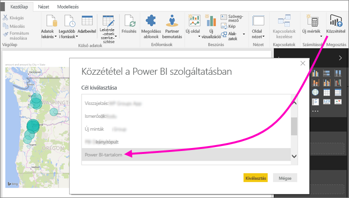
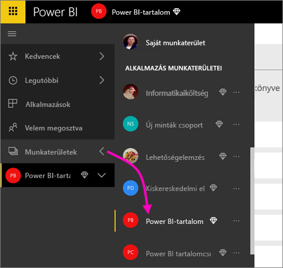
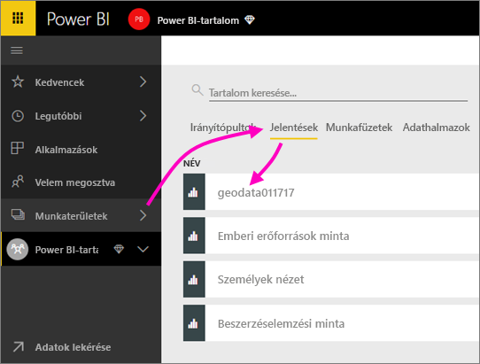
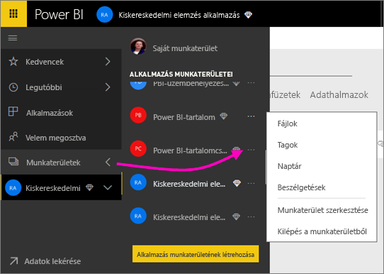
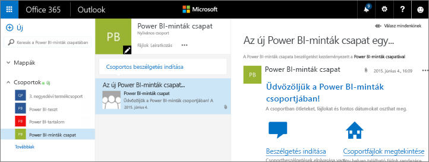
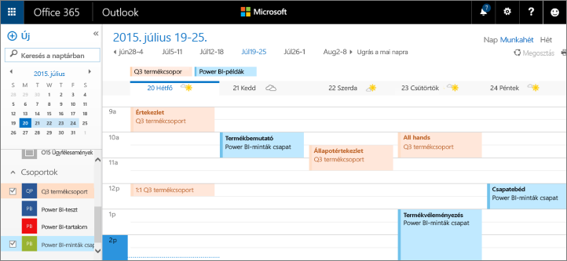

# Együttműködés klasszikus munkaterületen
A Power BI munkaterületek kitűnően alkalmasak arra, hogy munkatársaival irányítópultokon, jelentéseken és adatkészleteken együttműködve hozzanak létre *alkalmazásokat*. Ez a cikk az eredeti, *klasszikus* munkaterületekről szól.  

Az együttműködés a Power BI-ban nem csupán a munkaterületekre terjed ki. Amikor a Power BI-ban létrehozza a klasszikus munkaterületek egyikét, automatikusan egy Microsoft 365-csoportot is létrehoz a háttérben. A Microsoft 365 további csoportszolgáltatásokat is kínál, mint a fájlok megosztása a OneDrive Vállalati verziójában, az Exchange-beszélgetések, a megosztott naptár és feladatok és így tovább. További ismereteket is szerezhet a [Microsoft 365-csoportokról](https://support.office.com/article/Create-a-group-in-Office-365-7124dc4c-1de9-40d4-b096-e8add19209e9).

> [!NOTE]
> Az új felhasználói felületű munkaterületen megváltozik a Power BI-munkaterületek és a Microsoft 365-csoportok közötti kapcsolat. Amikor az új munkaterületek egyikét hozza létre a Power BI-ban, már nem jön létre automatikusan egy Microsoft 365-csoport a háttérben. További információk: [Új munkaterületek létrehozása a Power BI-ban](service-create-the-new-workspaces.md).

Munkaterület létrehozásához [Power BI Pro-licencre](../fundamentals/service-features-license-type.md) van szüksége.

## Együttműködés Power BI Desktop-fájlokon egy munkaterületen
Miután létrehoz egy Power BI Desktop-fájlt, közzéteheti azt egy munkaterületen, hogy ott mindenki közreműködhessen benne.

1. A Power BI Desktopban válassza a **Kezdőlap** menüszalag **Közzététel** elemét, majd válassza ki a munkaterületet a **Cél kiválasztása** mezőben.
   
    
2. A Power BI szolgáltatásban válassza a **Munkaterületek** melletti nyilat, majd jelölje ki a munkaterületet.
   
    
3. Válassza a **Jelentések** lapot, majd válassza ki a jelentést.
   
    
   
    Ettől kezdve ugyanúgy használható, mint bármely más Power BI-jelentés. A munkaterületen közreműködők Önnel együtt módosíthatják a jelentést, és csempéket menthetnek a választott irányítópultra.

## Együttműködés a Microsoft 365-ben
A Microsoft 365-beli együttműködés kiindulópontja a Power BI-beli klasszikus munkaterület.

1. A Power BI szolgáltatásban válassza a **Munkaterületek** > elem melletti nyilat, majd a munkaterület neve melletti **További lehetőségek** (...) elemet. 
   
   
2. Ebből a menüből több módon is együttműködhet a csoportjával: 
   
   * [Csoportbeszélgetést folytathat a Microsoft 365-ben](#have-a-group-conversation-in-microsoft-365).
   * [Eseményt ütemezhet](#schedule-an-event-on-the-group-workspace-calendar) a csoport-munkaterület naptárában.
   
   A csoport-munkaterület első megnyitása a Microsoft 365-ben eltarthat egy ideig. Várjon 15-30 percet, majd frissítse az oldalt.

## Csoportbeszélgetést folytathat a Microsoft 365-ben
1. Válassza a munkaterület neve melletti **További lehetőségek** (...) \> **Beszélgetések** menüpontot. 
   
    
   
   A munkaterület levelezésre és beszélgetésre szolgáló oldala a Microsoft 365 Outlookban nyílik meg.
   
   
2. További információ a [Microsoft 365 Outlook-csoportbeszélgetésekről](https://support.office.com/Article/Have-a-group-conversation-a0482e24-a769-4e39-a5ba-a7c56e828b22).

## Esemény ütemezése a csoport-munkaterület naptárában
1. Válassza a munkaterület neve melletti **További lehetőségek** (...) \> **Naptár** menüpontot. 
   
   
   
   Az csoport-munkaterület naptára a Microsoft 365 Outlookban nyílik meg.
   
   
2. További információ a [Microsoft 365 Outlook csoportnaptárairól](https://support.office.com/Article/Add-edit-and-subscribe-to-group-events-0cf1ad68-1034-4306-b367-d75e9818376a).

## Klasszikus munkaterület kezelése
Ha Ön egy munkaterület tulajdonosa vagy rendszergazdája, akkor fel is vehet vagy el is távolíthat munkaterülettagokat. További információ a [Power BI-munkaterület kezeléséről](service-manage-app-workspace-in-power-bi-and-office-365.md).

## Következő lépések
* [Alkalmazások közzététele Power BI-ban](service-create-distribute-apps.md).
* További kérdései vannak? [Kérdezze meg a Power BI közösségét](https://community.powerbi.com/).
* Visszajelzést szeretne küldeni? Keresse fel a [Power BI Ideas](https://ideas.powerbi.com/forums/265200-power-bi) fórumot.
