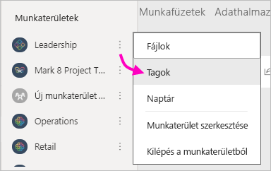
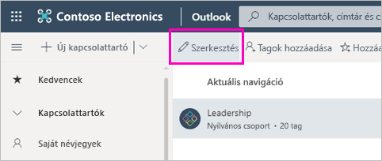
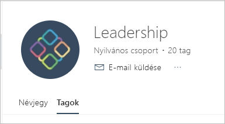

# Klasszikus munkaterületek létrehozása a Power BI-ban

A Power BI-ban létrehozhat *munkaterületeket*, amelyeken együttműködhet munkatársaival irányítópult-, jelentés- és lapszámozott jelentésgyűjtemények létrehozásán és finomításán. A gyűjteményt később olyan *alkalmazásokba* csomagolhatja, amelyeket a teljes szervezet vagy csak adott személyek vagy csoportok számára terjeszthet. 

**Tudta?** A Power BI új munkaterületekkel szolgál, amelyek mostantól az alapértelmezett beállítás részét képezik. Az új munkaterületekről a [Munka szervezése az új munkaterületeken](service-new-workspaces.md) című cikkből tájékozódhat részletesen. Készen áll a klasszikus munkaterülete migrálására? A részletekért lásd [a Power BI klasszikus munkaterületeinek új munkaterületekre frissítését](service-upgrade-workspaces.md) bemutató cikket.

Amikor létrehoz egy klasszikus munkaterületet, egy mögöttes, társított Microsoft 365-csoportot is létrehoz. A munkaterület felügyelete a Microsoft 365-ben zajlik. A kollégákat hozzáadhatja tagként vagy rendszergazdaként ezekhez a munkaterületekhez. A munkaterületen együttműködhetnek az irányítópultokon, jelentéseken és más cikkeken, amelyeket a szélesebb közönség elé szeretne tárni. A munkaterületekhez adott tagoknak Power BI Pro-licencre van szüksége.

## Videó: Alkalmazások és munkaterületek
<iframe width="640" height="360" src="https://www.youtube.com/embed/Ey5pyrr7Lk8?showinfo=0" frameborder="0" allowfullscreen></iframe>

## Klasszikus munkaterület létrehozása Microsoft 365-csoport alapján

Ha munkaterületet hoz létre, az egy Microsoft 365-csoportra épül.

[!INCLUDE [powerbi-service-create-app-workspace](../includes/powerbi-service-create-app-workspace.md)]

Az első létrehozáskor akár egy órát is kell várnia, hogy a rendszer propagálja a munkaterületet a Microsoft 365 szolgáltatásba.

### Kép hozzáadása a Microsoft 365-munkaterülethez (választható)
A Power BI alapértelmezés szerint egy kis színes kört hoz létre az alkalmazáshoz, benne az alkalmazás kezdőbetűivel. Ha szeretné, ezt testreszabhatja egy képpel. A kép felvételéhez Exchange Online-licenc szükséges.

1. Válassza a **Munkaterületek** lehetőséget, a munkaterület neve melletti **További lehetőségek** (...) elemet, majd a **Tagok** menüpontot. 
   
     
   
    Megnyílik a munkaterülethez tartozó Microsoft 365 Outlook-fiók egy új böngészőablakban.
2. Válassza a **Szerkesztés** ikont (ceruza).
   
     
3. Válassza a kamera képét, és keresse meg a használni kívánt képet.
   
     

     A képek .png, .jpg és .bmp kiterjesztésű fájlok lehetnek. Méretük nagy, akár 3 MB is lehet. 

4. Válassza az **OK**, majd a **Mentés** lehetőséget.
   
    A kép a Microsoft 365 Outlook ablakban szereplő színes kör helyére kerül.
   
     
   
    Néhány percen belül megjelenik az alkalmazásban is a Power BI-ban.

## Tartalom munkaterülethez adása

Miután létrehozta a munkaterületet, tartalmat is adhat hozzá. A tartalom hozzáadása úgy zajlik, mintha a Saját munkaterülethez adna hozzá tartalmat, azzal az eltéréssel, hogy mások is látják a munkaterületet, és használhatják is. A nagy különbség az, hogy amikor kész van, közzéteheti a tartalmakat alkalmazásként. Amikor a tartalmat egy munkaterület tartalomlistájában tekinti meg, a munkaterület neve van tulajdonosként feltüntetve.

### Csatlakozás külső szolgáltatásokhoz munkaterületeken

Az alkalmazások a Power BI által támogatott összes külső szolgáltatással használhatók, így könnyen lekérheti az Ön által használt szolgáltatások, például a Microsoft Dynamics CRM, a Salesforce vagy a Google Analytics adatait. Szervezeti alkalmazások közzétételével eljuttathatja a szükséges adatokat a felhasználóihoz.

A jelenlegi munkaterületeken emellett szervezeti, valamint külső tartalomcsomagokkal, például a Microsoft Dynamics CRM-mel, a Salesforce-szal és a Google Analyticsszel is csatlakozhat. Célszerű megfontolnia a szervezeti tartalomcsomagok alkalmazásokba való migrálását.

## Alkalmazások terjesztése

Ha a szervezeten belül nagy közönség számára szeretne hivatalos tartalmat terjeszteni, közzétehet egy alkalmazást a munkaterületről.  Ha a tartalom elkészült, kiválaszthatja a közzétenni kívánt irányítópultokat és jelentéseket, amelyeket közzétehet *alkalmazásként*. Minden munkaterületről létrehozhat egy alkalmazást.

A navigációs panel Alkalmazások listája megjeleníti az összes telepített alkalmazást. A munkatársai különböző módokon férhetnek hozzá az alkalmazáshoz. 
- Alkalmazását megtalálhatják a Microsoft AppSource-on, és onnan telepíthetik.
- Küldhet nekik közvetlen hivatkozást. 
- Ha a Power BI rendszergazda engedélyezi, automatikusan telepítheti az alkalmazást a munkatársai Power BI-fiókjába. 

A felhasználók számár automatikusan megjelenik a frissített alkalmazástartalom egy munkaterületről közzétett frissítés után. A munkaterület alkalmazástartalma által használt adatkészletek frissítési ütemtervének beállításával Ön szabhatja meg, hogy milyen gyakran frissüljenek az adatok. További információ: [Alkalmazás közzététele a Power BI új munkaterületeiről](service-create-distribute-apps.md).

## Klasszikus Power BI-alkalmazások – gyakori kérdések

### Miben különböznek az alkalmazások a vállalati tartalomcsomagoktól?
Az alkalmazások a vállalati tartalomcsomagokból fejlődtek ki. Ha már vannak vállalati tartalomcsomagjai, azok továbbra is működnek az alkalmazásokkal párhuzamosan. Az alkalmazások néhány fontos dologban eltérnek a tartalomcsomagoktól. 

* Miután az üzleti felhasználók telepítenek egy tartalomcsomagot, az elveszíti a csoportosított identitását: csupán más irányítópultokkal és jelentésekkel összekeveredett irányítópultok és jelentések listája. Az alkalmazások ezzel szemben telepítés után is megtartják a csoportosításukat és az identitásukat. Ezzel a csoportosítással az üzleti felhasználók egyszerűbben navigálhatnak közöttük az idők során.
* Létrehozhat több tartalomcsomagot is egy munkaterületről, az alkalmazás azonban egy-az-egyhez kapcsolatban áll a munkaterületével. 
* Terveink szerint a vállalati tartalomcsomagok idővel elavulttá válnak, ezért javasoljuk, hogy mostantól alkalmazásokat hozzon létre.  
* Az új munkaterületi felület bevezetésével megtettük az első lépéseket a vállalati tartalomcsomagok kivonása felé. Ezeket az új munkaterületeken már nem használhatja, és nem hozhatja létre.

A kettő összehasonlításához tekintse meg [az új és a klasszikus munkaterületek közötti különbségeket](service-new-workspaces.md#new-and-classic-workspace-differences). 

## Következő lépések
* [Alkalmazások telepítése és használata a Power BI-ban](service-create-distribute-apps.md)
- [Az új munkaterületek létrehozása](service-create-the-new-workspaces.md)
* Kérdése van? [Kérdezze meg a Power BI közösségét](https://community.powerbi.com/)
