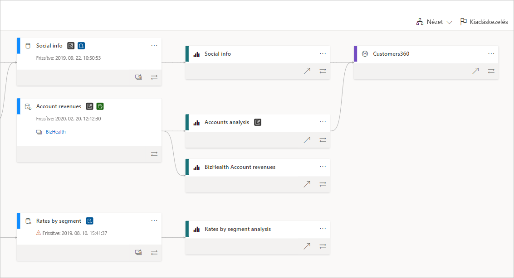
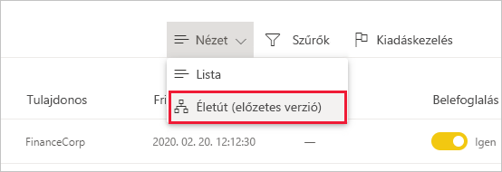
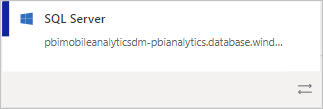
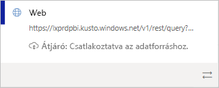
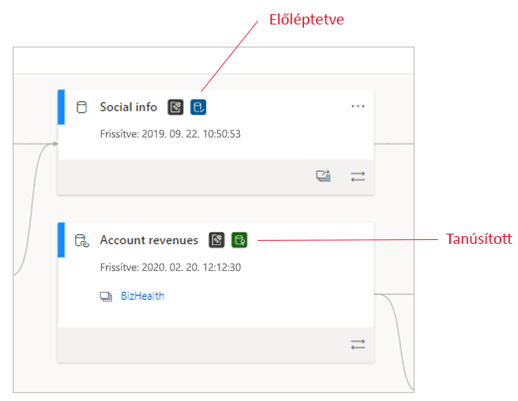
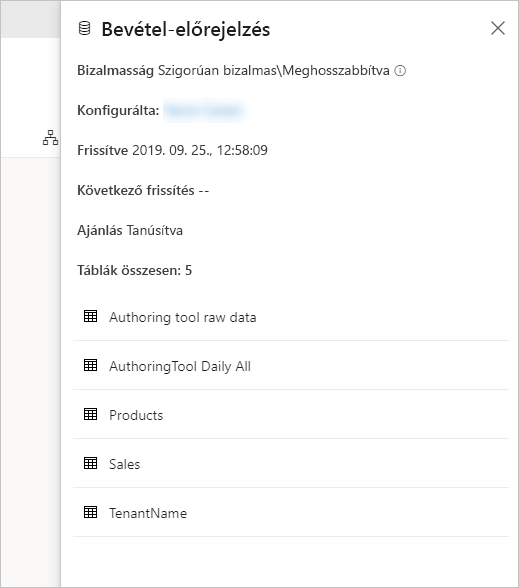
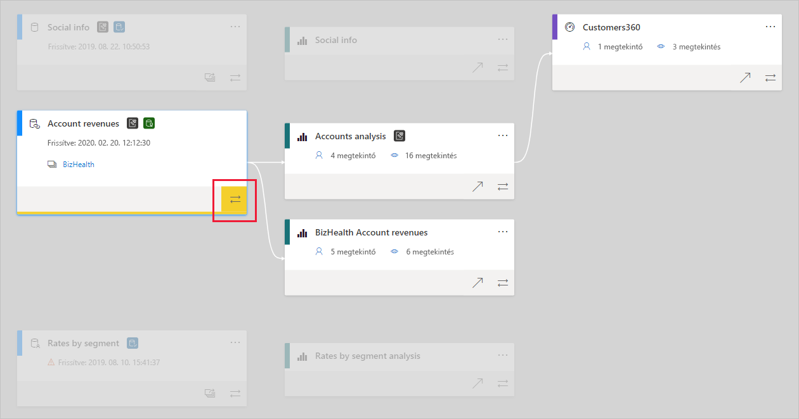

# Adatéletút
A modern üzletiintelligencia-projektekben az adatok adatforrásból a célba történő eljutásának megértése kihívást jelenthet. A kihívás még nagyobb a több adatforráson, összetevőn és függőségen átívelő speciális elemzési projektek esetén. Nehéz választ adni az olyan kérdésekre, hogy például mi történik egy adat módosításakor, vagy hogy miért nem naprakész egy jelentés. Ezek megértéséhez szakértői csapatokra vagy mélyreható vizsgálatra van szükség. A kérdések megválaszolásában egy adatéletút-nézet lesz a segítségére.

 
A Power BI számos különböző összetevőtípussal rendelkezik, például irányítópultokkal, jelentésekkel, adatkészletekkel és adatfolyamokkal. Számos adatkészlet és adatfolyam külső adatforrásokhoz (például SQL Server), illetve más munkaterületeken megtalálható külső adatkészletekhez csatlakozik. Az Ön tulajdonában álló munkaterületen kívüli adatkészletek az IT-részleg egy tagja vagy egy másik elemző birtokában lévő munkaterületen lehetnek. A külső adatforrások és adatkészletek végső soron megnehezíthetik az adatok származási helyének kiderítését. Ezért bevezettük az összetett és egyszerűbb projektekhez is használható származtatott nézetet.

A származtatott nézetben az egy munkaterületen lévő összes összetevő közötti adatéletút-kapcsolat látható, valamint azok minden külső függősége is. A nézetben az összes munkaterület-összetevő közötti kapcsolatok láthatók, a felfelé és lefelé irányuló adatfolyamokkal létesített kapcsolatokat is beleértve.

## A származtatott nézet felfedezése

Minden munkaterülethez (legyen az új vagy klasszikus) tartozik egy életútnézet, amelynek megtekintéséhez legalább Közreműködő szerepkörrel kell rendelkeznie az adott munkaterületen. Erről részletesen a jelen cikk [Engedélyek](#permissions) című szakaszában tájékozódhat.

* A származtatott nézet eléréséhez lépjen a munkaterület listanézetébe. Koppintson a **Listanézet** elemre, és válassza a **Származtatott nézet** lehetőséget.

   

Ebben a nézetben az összes munkaterület-összetevő, valamint az adatok egyik összetevőből másik összetevőbe áramlásának módja látható.

**Adatforrások**

Láthatja azokat az adatforrásokat, amelyekből az adatkészletek és az adatfolyamok nyerik az adatokat. Az adatforráskártyákon további információk jelennek meg, amelyek segítenek a forrás azonosításában. Az Azure SQL Server esetében például az adatbázis neve is látható.

 
**Átjárók**

Ha egy adatforrás egy helyszíni átjárón keresztül csatlakozik, az átjáró adatai is megjelennek az adatforráskártyán. Ha rendelkezik átjáró-rendszergazdaként vagy adatforrás-felhasználóként kapott engedélyekkel, további információkat is láthat (például az átjáró nevét).

**Adatkészletek és adatfolyamok**
 
Adatkészletek és adatfolyamok esetén a legutóbbi frissítés időpontján kívül azt is láthatja, hogy tanúsított vagy előléptetett-e az adatkészlet vagy az adatfolyam.

 
Ha a munkaterület valamelyik jelentése egy másik munkaterületen lévő adatkészletre vagy adatfolyamra épül, akkor a forrásoldali munkaterület nevét is láthatja az adatkészlet vagy az adatfolyam kártyáján. A forrásoldali munkaterületre ugráshoz válassza ki annak nevét.

* Az egyes összetevőkhöz rendelkezésre álló lehetőségek menüjének megnyitásához válassza a **További lehetőségek** (...) elemet. Ebben a menüben ugyanazokat a műveleteket találja, mint a listanézetben.

Ha további metaadatokat szeretne megjeleníteni bármely összetevőről, válassza ki az összetevő kártyáját. Az összetevő további adatai megjelennek egy oldalsó panelen. Az alábbi képen a kijelölt adatkészlet metaadatait mutató oldalsó panel látható.

 
## Egy tetszőleges összetevő adatéletútjának megjelenítése 

Tegyük fel, hogy meg szeretné tekinteni egy adott összetevő adatéletútját.

* Válassza az összetevő alatti dupla nyilat.

   

   A Power BI kiemeli az adott összetevőhöz kapcsolódó összetevőket, a többit pedig elhalványítja. 

## Navigálás és teljes képernyő 

A származtatott nézet egy interaktív vászon. Az egér és az érintőpad használatával lépegethet a vásznon, és nagyíthatja vagy kicsinyítheti is.

* A nagyításhoz vagy a kicsinyítéshez a jobb alsó sarokban lévő menüt, valamint az egeret vagy az érintőpadot használhatja.
* Ha több helyet szeretne a diagramnak, váltson teljes képernyőre a jobb alsó sarokban lévő gombbal. 

    

## Engedélyek

* A származtatott nézet megjelenítéséhez Power BI Pro-licencre van szüksége.
* A származtatott nézetet csak a munkaterülethez hozzáféréssel rendelkező felhasználók érhetik el.
* A felhasználóknak Rendszergazda, Tag vagy Közreműködő szerepkörrel kell rendelkezniük a munkaterületen. A Megtekintő szerepkörrel rendelkező felhasználók nem válthatnak adatéletút nézetre.

## Megfontolandó szempontok és korlátozások

- A származtatott nézet nem érhető el az Internet Explorerben. További információt [A Power BI használatát támogató böngészők](../power-bi-browsers.md) című cikkben talál.

## További lépések

* [Adathalmazok használata több munkaterületen (előzetes verzió)](../service-datasets-across-workspaces.md)
* [Adatkészletek hatáselemzése](service-dataset-impact-analysis.md)
