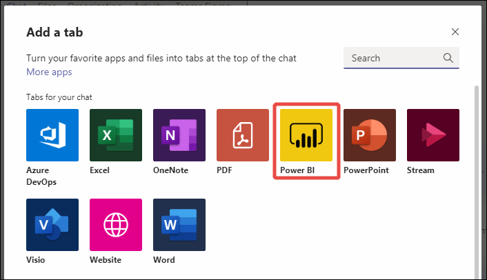
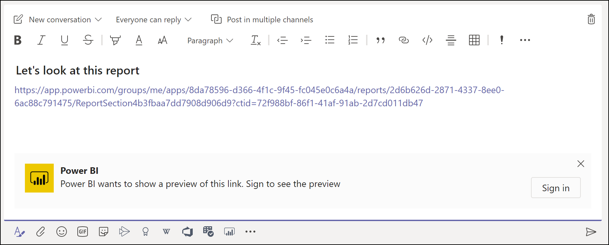
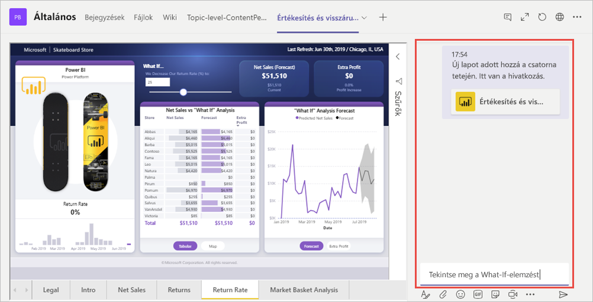

# Jelentések beágyazása a Microsoft Teamsbe a Power BI lappal

A Microsoft Teams frissített Power BI lapjával egyszerűen ágyazhat be interaktív jelentéseket Microsoft Teams-csatornákba és -csevegésekbe. A Microsoft Teams Power BI lapjának használatával segíthet munkatársainak a csapat által használt adatok megkeresésében és az adatok megvitatásában a csapat csatornáin.  Amikor jelentésekre, irányítópultokra és alkalmazásokra mutató hivatkozást illeszt be a Microsoft Teams üzenetmezőjébe, a hivatkozás előnézete az azokkal kapcsolatos információkat is megjelenít. A felhasználók így jobban átláthatják, hogy a hivatkozás melyik elemre mutat.

## Követelmények

A **Microsoft Teams Power BI lapjának** működéséhez a következők szükségesek:

- A felhasználóknak Power BI Pro-licenccel kell rendelkezniük, vagy a jelentésnek Power BI-licenccel rendelkező [Power BI Premium-kapacitásban (EM vagy P SKU)](../admin/service-premium-what-is.md) kell lennie.
- A Microsoft Teamsben meg kell lennie a Power BI lapnak.
- A jelentés használatához a felhasználóknak be kell jelentkezniük a Power BI szolgáltatásba, hogy aktiválják a Power BI-licencüket.
- A felhasználóknak rendelkezniük kell a jelentés megtekintéséhez szükséges engedéllyel.

A **hivatkozások előnézetének** működéséhez ezeken felül a következők szükségesek:
- A felhasználóknak eleget kell tenniük a Microsoft Teams Power BI lapjának használatára vonatkozó követelményeknek.
- A felhasználóknak be kell jelentkezniük a Power BI-robotszolgáltatásba. 

## A jelentés beágyazása

Jelentés az alábbi lépésekkel ágyazható be Microsoft Teams-csatornába vagy -csevegésbe.

1. Nyisson meg egy csatornát vagy csevegést a Microsoft Teamsben, és válassza a **+** ikont.

    

2. Válassza a Power BI lapot.

    

3. A felkínált lehetőségekkel válasszon ki egy jelentést egy munkaterületről, a Velem megosztva területről vagy egy Power BI-alkalmazásból.

    

4. A lap neve automatikusan frissül a jelentés nevének megfelelően, de módosítható. 

5. Kattintson a **Mentés** gombra.

## A Power BI lap általi beágyazáshoz támogatott jelentések
A Power BI lapon az alábbi jelentéstípusok ágyazhatók be:

- Interaktív és többoldalas jelentések.
- Jelentések a Saját munkaterületen, az új munkaterületi felületeken és klasszikus munkaterületeken.
- Jelentések Power BI-alkalmazásokban.

## Hivatkozás előnézetének beolvasása

A Power BI szolgáltatásbeli tartalom hivatkozáshoz tartozó előnézetét az alábbi lépésekkel alakíthatja ki.

1. Másoljon ki egy jelentésre, irányítópultra vagy alkalmazásra mutató hivatkozást a Power BI szolgáltatásban. A hivatkozást kimásolhatja például a böngésző címsorából.

2. Illessze be a hivatkozást a Microsoft Teams üzenetmezőjébe. Amikor a rendszer kéri, jelentkezzen be a hivatkozás-előnézeti szolgáltatásba. Lehetséges, hogy a hivatkozás előnézetének betöltésére néhány másodpercig várnia kell.

    

3. A sikeres bejelentkezés után megjelenik a hivatkozás egyszerű előnézete.

    

4. Válassza a kibontás ikont a bővített előnézet-kártya megjelenítéséhez.

    

5. A hivatkozás bővített előnézeti kártyáján a hivatkozás és a lényeges műveletek gombjai láthatók

    

6. Küldje el az üzenetet.

## Hozzáférés biztosítása a jelentésekhez

Egy jelentés beágyazása a Microsoft Teamsbe, vagy egy elemre mutató hivatkozás elküldése még nem ad automatikusan engedélyt a felhasználóknak arra, hogy megtekinthessék a jelentést – [a megtekintést a Power BI-ban kell engedélyeznie](service-share-dashboards.md). Az egyszerűség kedvéért használhat Office 365-csoportot a csapat számára. 

> [!IMPORTANT]
> Tekintse át kik láthatják a jelentést a Power BI szolgáltatásban, és adjon hozzáférést azoknak, akik még nem szerepelnek a listában.

Azt, hogy a csapat hozzáférjen a jelentésekhez úgy is biztosíthatja, hogy egyetlen munkaterületre helyezi a jelentéseket a Power BI-ban, majd a csapat Office 365-csoportjának hozzáférést ad a munkaterülethez.

## Hivatkozások előnézete 

A hivatkozások előnézete a következő Power BI-beli elemekhez érhető el:
- Jelentések
- Irányítópultok
- Alkalmazások

A felhasználóknak be kell jelentkezniük a hivatkozás-előnézeti szolgáltatásba. Kijelentkezni az üzenetmező alján található Power BI-ikont, majd a kijelentkezés lehetőséget választva tudnak.

## Beszélgetés indítása

Amikor Power BI-jelentéslapot vesz fel a Teamsbe, a Teams automatikusan létrehoz egy beszélgetést a jelentéshez. 

- Válassza a jobb felső sarokban található **Beszélgetés mutatása** ikont.

    

    Az első bejegyzés a jelentésre mutató hivatkozás. A Teams-csatornán a beszélgetés összes résztvevője láthatja és megvitathatja a jelentést.

    

## Ismert problémák és korlátozások

- A Power BI nem ugyanazokat a honosított nyelveket támogatja mint a Microsoft Teams. Emiatt előfordulhat, hogy a beágyazott jelentés nem megfelelően honosított nyelven jelenik meg.
- Power BI-irányítópultok nem ágyazhatók be a Microsoft Teams Power BI lapján.
- Power BI-licenccel vagy a jelentésre vonatkozó engedéllyel nem rendelkező felhasználók „A tartalom nem érhető el” üzenetet kapják.
- Ha Internet Explorer 10-es böngészőt használ, előfordulhat, hogy problémákba ütközik. <!--You can look at the [browsers support for Power BI](../consumer/end-user-browsers.md) and for [Office 365](https://products.office.com/office-system-requirements#Browsers-section). -->
- A Microsoft Teams Power BI lapja nem támogatja az [URL-szűrőket](service-url-filters.md).
- Az új Power BI lap országos felhőkben nem érhető el. Régebbi verziók elérhetők lehetnek, de azok nem támogatják az új munkaterületi felületeket és a Power BI-alkalmazásokban lévő jelentéseket. 
- A lap mentése után a lap neve már nem módosítható a lap beállításaiban. A módosításhoz használja az átnevezés lehetőséget.
- A hivatkozás-előnézeti szolgáltatáshoz nem támogatott az egyszeri bejelentkezés.
- A hivatkozások előnézete értekezleteken és privát csatornákon nem működik.

## Következő lépések
- [Irányítópult megosztása munkatársakkal és másokkal](service-share-dashboards.md)  
- [Alkalmazások létrehozása és terjesztése a Power BI-ban](service-create-distribute-apps.md)  
- [Mi a Power BI Premium?](../admin/service-premium-what-is.md)

További kérdései vannak? [Kérdezze meg a Power BI közösségét](https://community.powerbi.com/)
