# A Power Automate és a Power BI

A [Power Automate](https://docs.microsoft.com/power-automate/getting-started) egy olyan SaaS-ajánlat, amely a munkafolyamatok automatizálásához használható egyre több olyan alkalmazásban és SaaS-szolgáltatásban, amelyre a vállalati felhasználók támaszkodnak. A Power Automate használatával kedvenc alkalmazásait és szolgáltatásait (többek között a Power BI-t) integrálva feladatokat automatizálhat értesítések kéréséhez, fájlok szinkronizálásához, adatgyűjtéshez és még sok egyébhez. A munkafolyamatok automatizálásával egyszerűbben végezhetők el az ismétlődő feladatok.

[A Power Automate használatbavétele](https://docs.microsoft.com/power-automate/getting-started)

Megnézheti, hogy miként hoz létre Sirui egy olyan Power Automate-folyamatot, amely részletes e-mailt küld a munkatársaknak, amikor valami riasztást vált ki a Power BI-ban. Ha végzett, a videó alatti részletes útmutatást követve próbálja ki Ön is.

<iframe width="560" height="315" src="https://www.youtube.com/embed/YhmNstC39Mw" frameborder="0" allowfullscreen></iframe>

## Power BI-adatriasztás által indított folyamat létrehozása

### Előfeltételek
Ez az oktatóanyag bemutatja, hogyan hozzon létre két különböző folyamatot; az egyiket sablonból, a másikat teljesen az alapoktól. Ennek követéséhez [hozzon létre egy adatriasztást a Power BI-ban](../create-reports/service-set-data-alerts.md), hozzon létre egy ingyenes Slack-fiókot, majd [regisztráljon a Power Automate-re](https://flow.microsoft.com/#home-signup) (ingyenes!).

## Power BI-t használó folyamat létrehozása sablonból
Ebben a feladatban sablonnal létrehozunk egy egyszerű folyamatot, amelyet egy Power BI-adatokkal kapcsolatos riasztás (értesítés) vált ki.

1. Jelentkezzen be a Power Automate-be (flow.microsoft.com).
2. Kattintson a **Saját folyamatok** lehetőségre.
   
   
3. Kattintson a **Létrehozás sablonból** lehetőségre.
   
    
4. A keresőmezőt használva keressen Power BI-sablonokat, majd válassza ki az **Adatvezérelt Power BI-riasztás esetén e-mail értesítés küldése bárkinek > Folytatás** lehetőséget.
   
    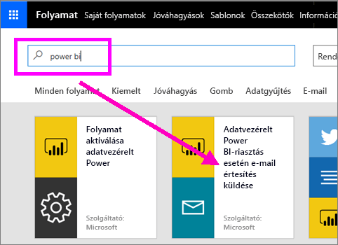

### A folyamat létrehozása
Ez a sablon egy triggerből (Power BI-adatriasztás újabb ír olimpiai érem megszerzésekor) és egy műveletből (e-mail küldése) áll. Amikor kiválaszt egy mezőt, a Power Automate megjelenít némi dinamikus tartalmat, amelyet belefoglalhat az üzenetbe.  Ebben a példában a csempe értékét és URL-címét foglaljuk bele az üzenettörzsbe.

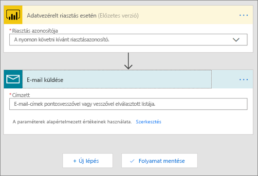

1. A triggerek legördülő menüjéből válassza ki a Power BI-adatriasztás lehetőséget. Válassza az **Új érem Írországnak** (New medal for Ireland) lehetőséget. A riasztások létrehozásával kapcsolatban tekintse meg a [Power BI-beli adatriasztásokról](../create-reports/service-set-data-alerts.md) szóló cikket.
   
   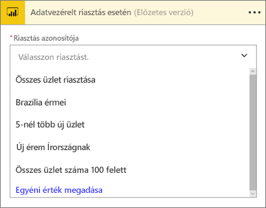
2. Adjon meg egy vagy több érvényes e-mail-címet, majd válassza a **Szerkesztés** lehetőséget (lásd alább) vagy a **Dinamikus tartalom hozzáadása** lehetőséget. 
   
   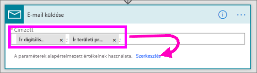

3. A Power Automate létrehoz egy címet és egy üzenetet, amelyet megtarthat vagy módosíthat. Minden olyan érték elérhető és használható, amelyet a riasztás létrehozásakor állított be a Power BI-ban. Használatukhoz mindössze a kiemelt szürke terület fölé kell vinnie a kurzort. 

   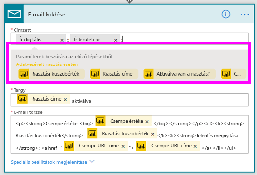

1.  Ha például a riasztás címekét beállította a **Újabb érmet nyertünk** szöveget, a **Riasztás címe** lehetőség kiválasztásával felhasználhatja ezt a szöveget az e-mail tárgyának szövegeként.

    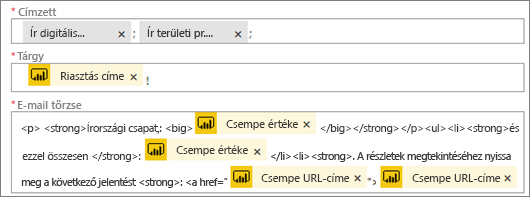

    Az e-mail törzseként elfogadhatja az alapbeállítás szerinti szöveget, de létrehozhat saját szöveget is. A fenti példában az alapértelmezett üzenetben néhány változtatás látható.

1. Ha elkészült, válassza a **Folyamat létrehozása** vagy a **Folyamat mentése** lehetőséget.  A rendszer létrehozza és ellenőrzi a folyamatot.  A Power Automate értesíteni fogja, ha hibát észlel.
2. Hibák esetén a **Folyamat szerkesztése** lehetőségre kattintva hárítsa el azokat. Ha nincsenek hibák, a **Kész** gombra kattintva futtathatja az új folyamatot.
   
   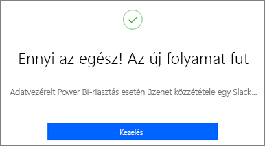
5. Ha az adatriasztás megtörténik, a rendszer a megadott e-mail-címekre üzenetet küld.  
   
   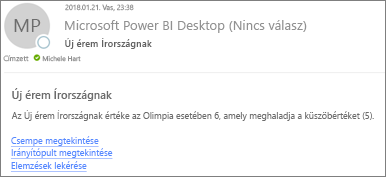

## Power BI-t használó, előzmények nélküli üres Power Automate-folyamat létrehozása
Ebben a feladatban egy előzmények nélküli egyszerű folyamatot hozunk létre, amelyet egy Power BI-adatokkal kapcsolatos riasztás (értesítés) vált majd ki.

1. Jelentkezzen be a Power Automate-be.
2. Kattintson a **Saját folyamatok** > **Üres folyamat létrehozása** lehetőségre.
   
   
3. A keresőmezőt használva keressen rá a Power BI-triggerekre, majd válassza a **Power BI – adatriasztás esetén** lehetőséget.

### Saját folyamat létrehozása
1. A legördülő listából válassza ki a riasztás nevét.  A riasztások létrehozásával kapcsolatban tekintse meg a [Power BI-beli adatriasztásokról](../create-reports/service-set-data-alerts.md) szóló cikket.
   
    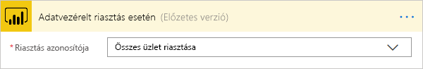
2. Válassza az **Új lépés** > **Művelet hozzáadása** lehetőséget.
   
   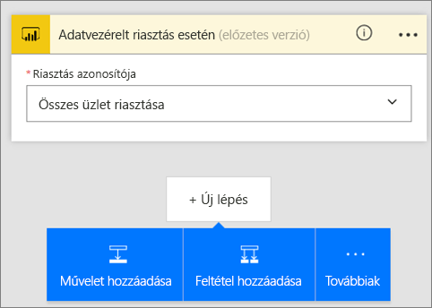
3. Keressen rá az **Outlook** kifejezésre, majd kattintson a **Create event** (Esemény létrehozása) lehetőséget tartalmazó találatra.
   
   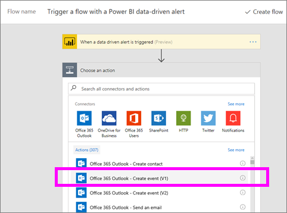
4. Töltse ki az eseményhez kapcsolódó mezőket. Amikor kiválaszt egy mezőt, a Power Automate megjelenít némi dinamikus tartalmat, amelyet belefoglalhat az üzenetbe.
   
   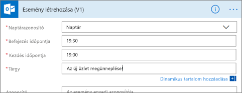
5. Ha elkészült, kattintson a **Folyamat létrehozása** lehetőségre.  A Power Automate menti és kiértékeli a folyamatot. Ha nincsenek hibák, a **Kész** gombra kattintva tudja futtatni a folyamatot.  Az új folyamatot a rendszer felveszi a **Saját folyamatok** lapra.
   
   
6. Amikor egy Power BI-adatriasztás elindítja a folyamatot, az alábbihoz hasonló Outlook-eseményértesítést fog kapni.
   
    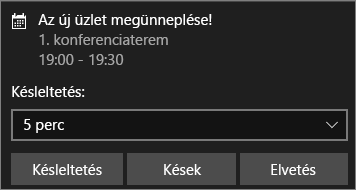

## További lépések
* [Első lépések a Power Automate-ben](https://docs.microsoft.com/power-automate/getting-started/)
* [Adatriasztások beállítása a Power BI szolgáltatásban](../create-reports/service-set-data-alerts.md)
* [Adatriasztások beállítása az iPhone-on](../consumer/mobile/mobile-set-data-alerts-in-the-mobile-apps.md)
* [Adatriasztások beállítása a Windows 10-hez készült Power BI mobilalkalmazásban](../consumer/mobile/mobile-set-data-alerts-in-the-mobile-apps.md)
* Több kérdése van? [Kérdezze meg a Power BI közösségét](https://community.powerbi.com/)
