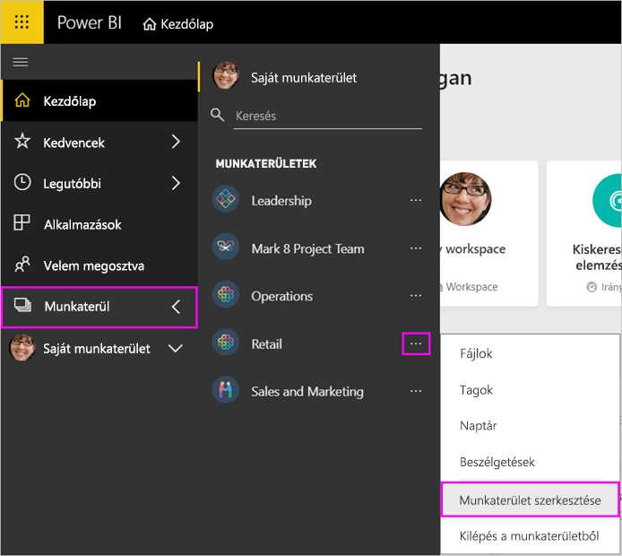
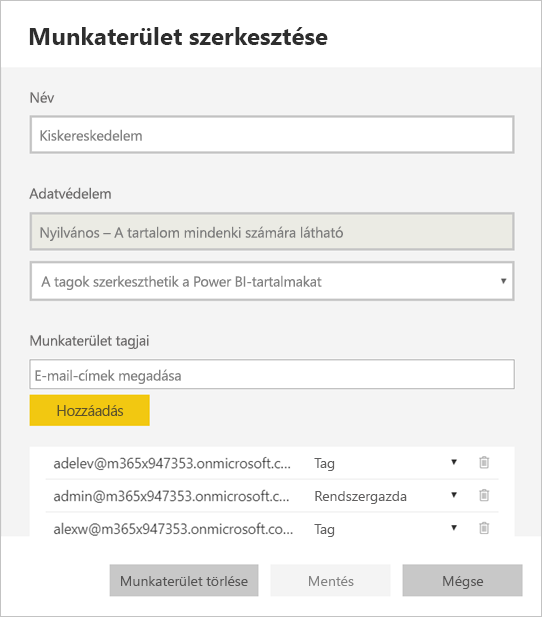
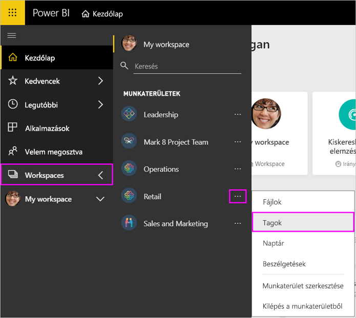
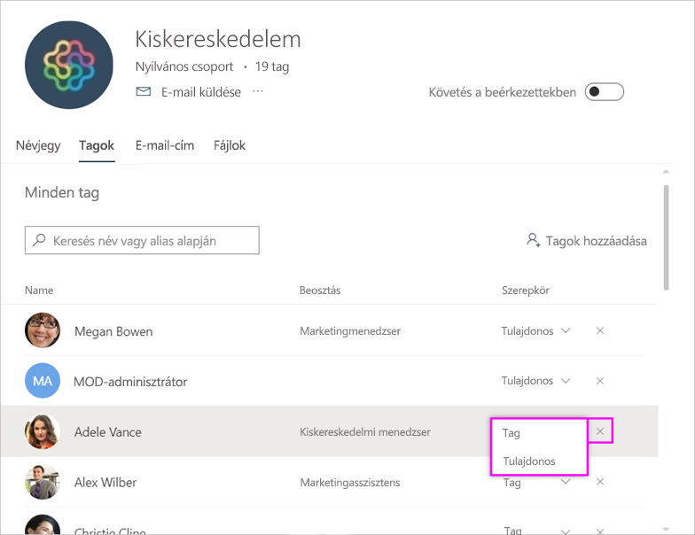
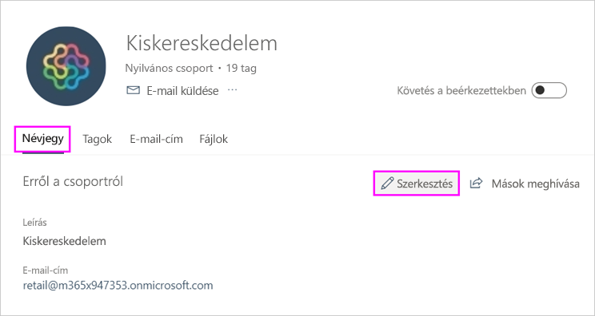
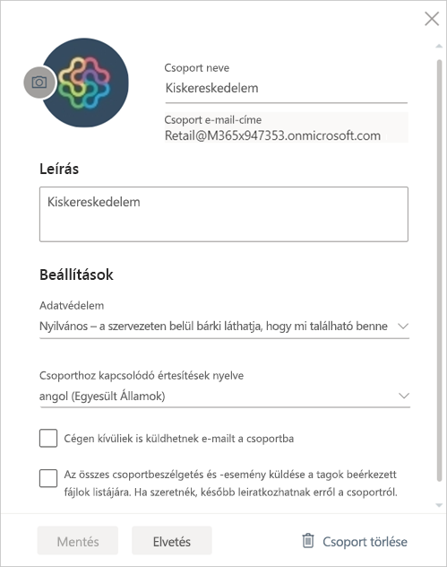

# A munkaterület kezelése a Power BI-ban és a Microsoft 365-ben

A Microsoft 365-ben vagy a [Power BI-ban a munkaterület](service-create-distribute-apps.md) létrehozójaként vagy rendszergazdájaként Ön kezeli a Power BI munkaterületének egyes funkcióit. Más funkciókat a Microsoft 365-ben kezelhet.

> [!NOTE]
> Az új felhasználói felületű munkaterületen megváltozik a Power BI-munkaterületek és a Microsoft 365-csoportok közötti kapcsolat. A rendszer nem hoz létre automatikusan Microsoft 365-csoportot minden alkalommal, amikor Ön új munkaterület hoz létre. Tudnivalók [az új munkaterületek létrehozásáról](service-create-the-new-workspaces.md).

A **Power BI-ban** a következőket teheti:

* A munkaterület tagjainak felvétele vagy eltávolítása, beleértve a munkaterület tagjainak rendszergazdává tételét.
* A munkaterület nevének szerkesztése.
* A munkaterület törlése, amely a Microsoft 365-csoportot is törli.

A **Microsoft 365-ben** a következőket teheti:

* A munkaterület csoporttagjainak felvétele vagy eltávolítása, beleértve a tagok tulajdonossá tételét.
* A csoport nevének, képének, leírásának és más beállításoknak a szerkesztése.
* A csoport e-mail-címének megtekintése.
* A csoport törlése.

Ahhoz, hogy egy munkaterület rendszergazdája vagy tagja lehessen, [Power BI Pro-licencre](../fundamentals/service-features-license-type.md) van szüksége. Az alkalmazás felhasználóinak szintén Power BI Pro-licenccel kell rendelkezniük, kivéve, ha a munkaterület Power BI Premium-kapacitásban található. Részletek: [Mi a Power BI Premium?](../admin/service-premium-what-is.md).

## A munkaterület szerkesztése a Power BI-ban

1. A Power BI szolgáltatásban válassza a **Munkaterületek** > elem melletti nyilat, majd a munkaterület neve melletti **További lehetőségek** (...) elemet, végül a **Munkaterület szerkesztése** menüpontot.

   

   > [!NOTE]
   > A **Munkaterület szerkesztése** csak akkor látható, ha Ön a munkaterület rendszergazdája.

1. Itt átnevezheti a munkaterületet, hozzáadhat és eltávolíthat tagokat, vagy törölheti a munkaterületet.

   

1. Kattintson a **Mentés** vagy a **Mégse** gombra.

## A Power BI-munkaterület tulajdonságainak szerkesztése a Microsoft 365-ben

Egy munkaterület jellemzőit közvetlenül a Microsoft 365 Outlookban is szerkesztheti.

### A munkaterületi csoport tagjainak szerkesztése

1. A Power BI szolgáltatásban válassza a **Munkaterületek** > elem melletti nyilat, majd a munkaterület neve melletti **További lehetőségek** (...) elemet, végül a **Tagok** menüpontot.

   

   Ezzel megnyílik a munkaterület Microsoft 365 Outlook csoportnézete. Lehet, hogy be kell jelentkeznie a vállalati fiókjába.

1. A csapattársa neve melletti szerepkör kijelölésével teheti az illetőt **Taggá** vagy **Tulajdonossá**. A csoportból való eltávolításhoz válassza az **×** jelet.

   

### Kép felvétele és más munkaterület-tulajdonságok beállítása

Amikor az alkalmazást a munkaterületről terjeszti, az itt hozzáadott kép lesz az alkalmazás képe. Olvassa el az **Új munkaterületek létrehozása** című cikk [Kép hozzáadása a Microsoft 365-munkaterülethez](service-create-workspaces.md#add-an-image-to-your-microsoft-365-workspace-optional) című szakaszát.

1. A munkaterület Microsoft 365 Outlook nézetében nyissa meg a **Névjegy** lapot, és válassza a **Szerkesztés** lehetőséget.

    
1. A csoporttal kapcsolatos értesítések neve, leírása és nyelve is beállítható. Ugyanitt képet is hozzáadhat, és további tulajdonságokat állíthat be.

   

1. Kattintson a **Mentés** vagy az **Elvetés** gombra.

## Következő lépések

* [Alkalmazás közzététele a Power BI-ban](service-create-distribute-apps.md)

* További kérdései vannak? [Kérdezze meg a Power BI közösségét](https://community.powerbi.com/)
