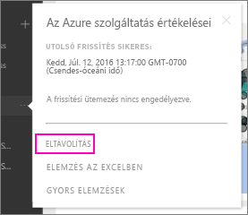

# Power BI szervezeti tartalomcsomaggal létesített kapcsolat eltávolítása

> [!NOTE]
> Az új munkaterületi felhasználói felületen nem lehet vállalati tartalomcsomagokat létrehozni vagy telepíteni. Ha még nem kezdte el, ideje frissítenie az alkalmazásokhoz tartozó tartalomcsomagokat. További információ az [új munkaterületi felhasználói felületről](service-create-the-new-workspaces.md).
> 

Egy munkatársa létrehozott egy tartalomcsomagot. Ön megnyitotta az AppSource-ban, és hozzáadta a Power BI-munkaterületéhez. Mostanra pedig már nincs rá szüksége.  Hogyan tudja eltávolítani?

A tartalomcsomagok eltávolításához el kell távolítania azok adatkészletét.  

* A navigációs panelen kattintson az adatkészlettől jobbra található három pontra, majd válasza az **Eltávolítás \> Igen** lehetőséget.  
  
  

Az adatkészlet eltávolítása minden hozzárendelt jelentést és irányítópultot is eltávolít. A tartalomcsomaggal létesített kapcsolat eltávolítása azonban nem törli a tartalomcsomagot a szervezeti AppSource-ból.  Az AppSource-ból később újra hozzáadhatja a tartalomcsomagot a munkaterülethez. Csak akkor [törölhet az AppSource-ból tartalomcsomagokat](service-organizational-content-pack-manage-update-delete.md), ha azokat Ön hozta létre.

## További lépések
* [Szervezeti tartalomcsomagok: bevezetés](service-organizational-content-pack-introduction.md) 
* [Alkalmazás létrehozása és terjesztése a Power BI-ban](service-create-distribute-apps.md) 
* [A Power BI szolgáltatás alapfogalmai tervezők számára](../fundamentals/service-basic-concepts.md)  
* Több kérdése van? [Kérdezze meg a Power BI közösségét](https://community.powerbi.com/)
