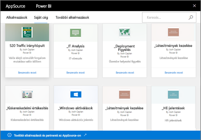

# Bevezetés a Power BI szervezeti tartalomcsomagjainak használatába
> [!NOTE]
> Az új munkaterületi felhasználói felületen nem lehet vállalati tartalomcsomagokat létrehozni vagy telepíteni. Ha még nem kezdte el, ideje frissítenie az alkalmazásokhoz tartozó tartalomcsomagokat. További információ az [új munkaterületi felhasználói felületről](service-create-the-new-workspaces.md).
> 

Rendszeresen oszt meg jelentéseket a csapatával e-mailben? Próbálja inkább így: csoportosítsa irányítópultjait, jelentéseit, Excel-munkafüzeteit és adatkészleteit, és tegye őket közzé a csapatában *szervezeti tartalomcsomagok* formájában. Az így létrehozott tartalomcsomagokat a csapattagok könnyen elérhetik az AppSource-katalógusban. A csomagok részét képezik a Power BI-nak, így minden funkcióját képesek kihasználni, beleértve az interaktív adatáttekintést, az új vizualizációs lehetőségeket, a Q&A szolgáltatást, a más adatforrásokkal történő integrációt, az adatfrissítést és egyebeket.

A tartalomcsomagok létrehozása nem azonos az irányítópultok megosztásával vagy az azokon egy munkaterületen végzett közös munkával. Az optimális megoldás kiválasztásához olvassa el az [Irányítópultok és jelentések közös használata és megosztása](service-how-to-collaborate-distribute-dashboards-reports.md) című cikket. 

Az AppSource-ban böngészheti és megkeresheti az egész szervezettel, valamint a terjesztési vagy biztonsági csoportokkal megosztott tartalomcsomagokat, és aztán [hozzáadhatja őket saját Office 365-csoportjaihoz](https://support.office.com/article/Create-a-group-in-Office-365-7124dc4c-1de9-40d4-b096-e8add19209e9). Ha nem tagja egy adott csoportnak, akkor nem láthatja a csoporttal megosztott tartalomcsomagokat. A csoport minden tagja csak olvasási hozzáféréssel rendelkezik a tartalomcsomaghoz, a jelentésekhez, a munkafüzetekhez és az irányítópultokhoz (hacsak az adatforrás nem SQL Server Analysis Services (SSAS) típusú, mert ez esetben az adatforrásra vonatkozó jogosultságok érvényesülnek).

Az irányítópultok, a jelentések és az Excel-munkafüzetek írásvédettek, de az irányítópultokat és a jelentéseket másolhatja, és kiindulási pontként használhatja személyre szabott tartalomcsomagok létrehozásában.

> [!NOTE]
> A szervezeti tartalomcsomagok csak akkor érhetők el, ha Ön és kollégái is rendelkeznek [Power BI Pro-licenccel](../fundamentals/service-features-license-type.md).
> 
> 

## Mi az az *AppSource*?
A közzétett szervezeti tartalomcsomagok az AppSource-ban jelennek meg.  Ebben a központi tárházban a tagok könnyen böngészhetik és megkereshetik a nekik szánt irányítópultokat, jelentéseket és adatkészleteket.  

* Az AppSource-ot a **Lekérdezés** > **Saját szervezet** > **Beolvasás** elemre kattintva nyithatja meg.

## A szervezeti tartalomcsomagok életciklusa
Minden Power BI Pro-felhasználó létrehozhat, közzétehet és elérhet szervezeti tartalomcsomagokat. Azonban a munkafüzet és az adatkészlet módosítására, a frissítés ütemezésére és a törlésre csak a tartalomcsomag létrehozója jogosult.

Az életciklus nagyjából így alakul:

1. Szabolcs létrehozza a tartalomcsomagot a Power BI Próban, és közzéteszi a Marketing terjesztési csoportban. A frissítési beállítások az adatkészlettel öröklődnek, és csak Szabolcs módosíthatja őket.
   
   > [!NOTE]
   > Ha Szabolcs olyan [Power BI-munkaterületen](service-create-distribute-apps.md) hozza létre a tartalomcsomagot, amelynek tagja, mások még akkor is átvehetik a csomag tulajdonjogát, ha Szabolcs elhagyja a munkaterületet.
   > 
   > 
2. Szabolcs e-mailben értesíti a terjesztési csoport tagjait az új tartalomcsomagról.
3. A Power BI Próban Borbála, a Marketing terjesztési csoport tagja rátalál erre a tartalomcsomagra, és kapcsolódik hozzá az AppSource-ban. Ezzel egy csak olvasható példányhoz jut hozzá. Borbála tisztában van vele, hogy a példány csak olvasható, mert a navigációs ablaktáblán a megosztást jelző ikon látható az irányítópult nevétől és a jelentés nevétől balra. És amikor kiválasztja az irányítópultot, egy lakatot ábrázoló ikon jelzi neki, hogy egy tartalomcsomag irányítópultjával van dolga. 
4. Tegyük fel, hogy testreszabja a csomagot. Így már saját példánya van az irányítópultból és a jelentésekből. A munkája nem érinti a forrást, sem az eredeti tartalomcsomagot, és a terjesztési csoport többi tagját sem. Ők már saját irányítópult- és jelentéspéldányukon dolgoznak.
5. Szabolcs módosítja az irányítópultot, és amikor elkészült, közzéteszi a tartalomcsomag új verzióját.
   
   * Géza, a terjesztési csoport egy másik tagja nem szabta testre az eredeti tartalomcsomagot. Az új módosítások így automatikusan érvénybe lépnek a tartalomcsomag Gézához tartozó verziójában.  
   * Borbála azonban testre szabta a tartalomcsomagot. Értesítést kap az új verzióról.  Ha megnyitja az AppSource-ot, akkor letöltheti a frissített tartalomcsomagot, de a saját verziója is megmarad. Így már két verziója lesz: a személyre szabott és a frissített tartalomcsomag.
6. Tegyük fel, hogy Szabolcs módosítja a biztonsági beállításokat. Géza és Borbála ettől kezdve nem fér hozzá a tartalomhoz. Vagy feltételezzük azt, hogy törlik őket a Marketing terjesztési csoportból.
   
   * Géza nem szabta testre az eredeti tartalomcsomagot, így a tartalom automatikusan törlődik. 
   * Borbála azonban testre szabta a tartalomcsomagot. Amikor legközelebb megnyitja az irányítópultot, már egyetlen csempe sem jelenik meg az eredeti tartalomcsomagból, de a más (számára még most is elérhető) jelentésekből általa rögzített csempék továbbra is láthatók. Az adathalmaz és a kapcsolódó jelentések már nem érhetők el (és nem jelennek meg a navigációs ablaktáblán).
7. Vagy például Szabolcs törli a tartalomcsomagot.
   
   * Géza nem szabta testre az eredeti tartalomcsomagot, így a tartalom automatikusan törlődik. 
   * Borbála azonban testre szabta a tartalomcsomagot. Amikor legközelebb megnyitja az irányítópultot, már egyetlen csempe sem jelenik meg az eredeti tartalomcsomagból, de a más jelentésekből általa rögzített csempék továbbra is láthatók. Az adathalmaz és a kapcsolódó jelentések már nem érhetők el (és nem jelennek meg a navigációs ablaktáblán).

## Adatbiztonság
A terjesztési csoport minden tagja ugyanolyan jogosultságokkal rendelkezik az adatokra vonatkozóan, mint a tartalomcsomag létrehozója. Ez alól csak a helyszíni táblázatos SQL Server Analysis Services-adatkészletek (SSAS-adatkészletek) adatkészletek képeznek kivételt. Mivel a jelentések és az irányítópultok élőben csatlakoznak a helyszíni SSAS-modellhez, ezért a terjesztési csoport egyes tagjainak hitelesítő adatai határozzák meg, hogy mely adatokhoz fér hozzá az adott felhasználó.

## További lépések
* [Szervezeti tartalomcsomag létrehozása és közzététele](service-organizational-content-pack-create-and-publish.md)
* [Alkalmazás létrehozása és terjesztése a Power BI-ban](service-create-distribute-apps.md) 
* [A Power BI szolgáltatás alapfogalmai tervezők számára](../fundamentals/service-basic-concepts.md)
* Több kérdése van? [Kérdezze meg a Power BI közösségét](https://community.powerbi.com/)
