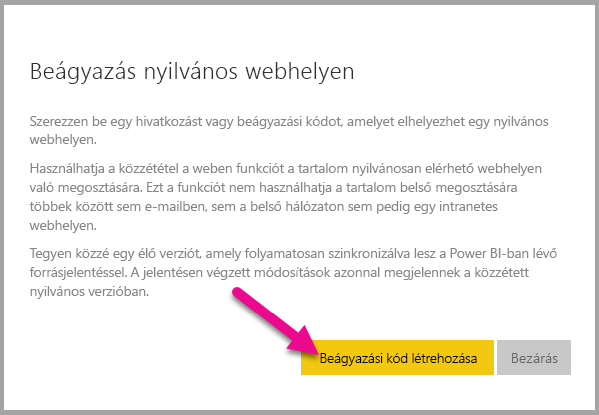
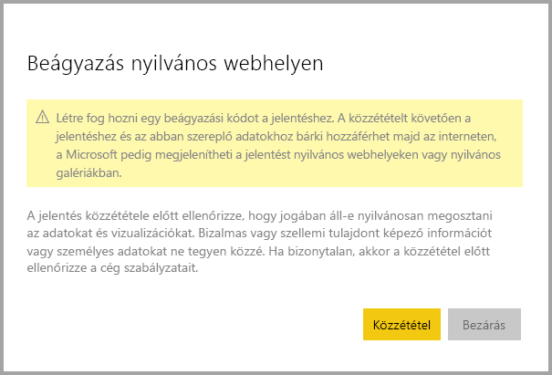
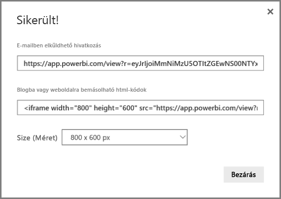
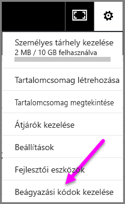
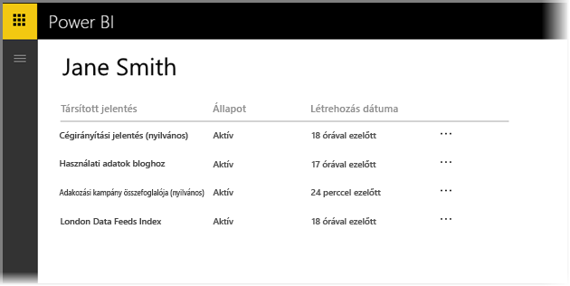
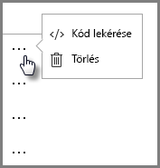

# Webes közzététel a Power BI-ból

A Power BI **Webes közzététel** lehetőségével egyszerűen ágyazhat be interaktív Power BI-tartalmat blogbejegyzésekbe, webhelyekre, e-mailekbe vagy közösségi médiába. A közzétett vizualizációkat egyszerűen szerkesztheti, módosíthatja, frissítheti, vagy akár vissza is vonhatja a megosztásukat.

> [!WARNING]
> A **Webes közzététel** használatával közzétett jelentést vagy vizualizációt bárki megtekintheti az Interneten. A megtekintéshez nincs szükség hitelesítésre. Ez vonatkozik a jelentésben összesített részletes adatok megtekintésére is. Jelentés közzététele előtt gondolja át, hogy megfelel-e Önnek az adatok és a vizualizációk nyilvános megosztása. Bizalmas vagy szellemi tulajdont képező információt ne tegyen közzé. Ha bizonytalan, akkor a közzététel előtt ellenőrizze a cég szabályzatait.

>[!Note]
>A tartalmat belső portálon vagy webhelyen biztonságosan ágyazhatja be. Használja a [Beágyazás](service-embed-secure.md) vagy a [Beágyazás SharePoint Online-ba](service-embed-report-spo.md) lehetőséget. Ezek biztosítják, hogy minden engedély és adatbiztonság kényszerítve legyen, amikor a felhasználók megtekintik a belső adatokat.

## Beágyazási kódok létrehozása a Webes közzététel lehetőséggel

A **Webes közzététel** a személyes vagy csoport-munkaterületein Ön által szerkeszthető jelentésekhez érhető el.  Nem érhető el Önnel megosztott, valamint az adatokat sorszintű biztonsággal védő jelentésekhez. A lenti [**Korlátozások**](#limitations) szakasz tartalmazza azoknak az eseteknek a teljes listáját, amelyeknél a **Webes közzététel** nem támogatott. A **Webes közzététel** használata előtt olvassa el figyelmesen a **Figyelmeztetést** a cikk elején.

Az alábbi rövid videó a funkció működését mutatja be. Ez után Ön is kipróbálhatja az alábbi lépésekben.

<iframe width="560" height="315" src="https://www.youtube.com/embed/UF9QtqE7s4Y" frameborder="0" allowfullscreen></iframe>

A következő útmutató a **Webes közzététel** használatát ismerteti.

1. Nyisson meg egy Ön által szerkeszthető jelentést egy munkaterületen, majd válassza a **További lehetőségek (...)**   > **Beágyazás** > **Webes közzététel (nyilvános)** lehetőséget.

   
   
2. Ha a Power BI-rendszergazda nem engedélyezte Önnek a beágyazási kódok létrehozását, hozzá kell fordulnia.

   
   
   Annak a személynek a megtalálásához, aki a vállalatnál engedélyezheti a Webes közzétételt, a cikk egy későbbi, [A Power BI-rendszergazda megkeresése](#find-your-power-bi-administrator) című szakaszában talál segítséget.

3. Olvassa el a párbeszédpanel tartalmát, majd válassza a **Beágyazási kód létrehozása** lehetőséget.

   

4. Olvassa el az itt megjelenő figyelmeztetést, és ellenőrizze, hogy az adatok szabadon beágyazhatók-e egy nyilvános weboldalba. Ha így van, válassza a **Közzététel** lehetőséget.

   

5. Megjelenik egy hivatkozást tartalmazó párbeszédpanel. E-mail küldéséhez válassza a hivatkozást, vagy másolja ki a HTML-kódot. Ezt kódba (például iFrame-be) ágyazhatja, vagy közvetlenül beillesztheti egy weboldalra vagy blogba.

   

6. Ha egy jelentéshez korábban már létrehozott beágyazási kódot, akkor a **Webes közzététel** választásakor nem jelennek meg a 2-4. lépésben ismertetett párbeszédpanelek. Helyettük a **Beágyazási kód** párbeszédpanel nyílik meg:

   

   Jelentésenként csak egy beágyazási kód hozható létre.

### Tippek a megtekintési módokhoz

Amikor egy blogbejegyzésbe ágyaz be tartalmat, akkor azt általában egy adott képernyőmérethez kell igazítania.  A magasságot és a szélességet az iFrame-címkében igény szerint beállíthatja. Ugyanakkor arról is gondoskodnia kell, hogy a jelentés elférjen az adott iFrame területén, ezért a jelentés szerkesztésekor a megfelelő Megtekintési módot is be kell állítania.

A következő táblázat a Megtekintési módokat és azok beágyazott megjelenését ismerteti.

| Megtekintési mód | Beágyazott megjelenés |
| --- | --- |
|  |A **Laphoz igazítás** figyelembe veszi a jelentésoldal magasságát és szélességét. Ha az oldalt *Dinamikus*, például 16:9 vagy 4:3 képarányúra állította be, akkor a tartalom úgy lesz átméretezve, hogy illeszkedjen az iFrame-keretbe. iFrame-keretbe ágyazva a **Laphoz igazítás** eredményeként *üres sávok*, szürke hátterű területek jelenhetnek meg az iFrame-ben a tartalom kerethez illeszkedő átméretezése után. Az üres sávok eltüntetéséhez állítsa át az iFrame-keret magasságát és szélességét a megfelelő értékre. |
|  |A **tényleges méret** módban a jelentés megtartja a jelentésoldalon megadott méretét. Emiatt az iFrame-keretben görgetősávok jelenhetnek meg. Görgetősávok megjelenése az iFrame-keret magasságának és szélességének beállításával kerülhető el. |
|  |A **szélességhez igazítás** beállítás biztosítja, hogy a tartalom vízszintesen kitöltse az iFrame-keretet. A szegély látható marad, de a tartalom úgy lesz átméretezve, hogy vízszintesen kitöltse a rendelkezésre álló területet. |

### Tippek az iFrame magassághoz és szélességhez

A **webes közzétételi** beágyazási kód az alábbi példához hasonló:

 
A szélességét és magasságát manuálisan is módosíthatja, hogy pontosan a kívánt módon illeszkedjen az oldalba, ahol beágyazza.

Tökéletesebb illeszkedés érdekében megpróbálhatja 56 képponttal megnövelni az iFrame magasságát, hogy helyet adjon az aktuális méretű alsó sávnak. Ha a jelentésoldala dinamikus méretezést használ, akkor az alábbi táblázatban talál néhány üres sávok nélküli illeszkedést biztosító méretet.

| Képarány | Méret | Méret (szélesség × magasság) |
| --- | --- | --- |
| 16:9 |Kicsi |640 × 416 képpont |
| 16:9 |Közepes |800 × 506 képpont |
| 16:9 |Nagy |960 × 596 képpont |
| 4:3 |Kicsi |640 × 536 képpont |
| 4:3 |Közepes |800 × 656 képpont |
| 4:3 |Nagy |960 × 776 képpont |

## Beágyazási kódok kezelése

Miután létrehozott egy **webes közzétételi** beágyazási kódot, a kódokat a Power BI szolgáltatás **Beállítások** menüjében tudja kezelni. A beágyazási kódok kezeléséhez tartozik a kód által hivatkozott vizualizáció vagy jelentés eltávolítása (ez használhatatlanná teszi a beágyazási kódot), vagy a beágyazási kód lekérése.

1. A **Webes közzétételi** beágyazási kódok kezeléséhez nyissa meg a **Beállítások** fogaskerék-ikont, és válassza a **Beágyazási kódok kezelése** lehetőséget.

   

2. Megjelennek a beágyazási kódok.

   

3. A beágyazási kódokat lekérheti vagy törölheti. A törléssel a jelentésre vagy vizualizációra mutató összes hivatkozást használhatatlanná teszi.

   

4. Ha a **Törlés** műveletet választja, a rendszer megerősítést kér.

   

## Jelentések és adatok frissítése

A **webes közzétételi** beágyazási kód létrehozása és megosztása után a jelentésben minden Ön által végzett változtatás frissülni fog, és a beágyazási kód hivatkozása azonnal aktívvá válik. Bárki megtekintheti, ha megnyitja a hivatkozást. Nem kizárt azonban, hogy ezt az első műveletet követően csak két-három óra elteltével jelennek meg a jelentések vagy a vizualizációk frissítései a felhasználóknak. További tudnivalókat ennek a cikknek a [**Hogyan működik?** ](#howitworks) című szakaszában talál. 

### Adatfrissítés

Az adatfrissítések automatikusan megjelennek a beágyazott jelentésben vagy vizualizációban. A frissített adatok körülbelül egy óra elteltével lesznek láthatók a beágyazási kódokon keresztül. Az automatikus frissítés letiltásához válassza a **ne frissüljön** lehetőséget a jelentés által használt adathalmaz ütemezésénél.  

## Power BI-vizualizációk

A **Webes közzététel** a Power BI-vizualizációkat is támogatja. A **Webes közzététel** használatakor azoknak a felhasználóknak, akik megosztják az Ön által közzétett vizualizációt, nem kell engedélyezniük a Power BI-vizualizációkat a jelentés megtekintéséhez.

## A beágyazási kód állapota oszlop ismertetése

>[!Note]
>Tekintse át a gyakran közzétett beágyazási kódokat. Távolítsa el azokat, amelyeknek már nem kell nyilvánosan elérhetőnek lenniük.

A **Beágyazási kódok kezelése** oldal tartalmaz egy állapotoszlopot. A beágyazási kódok alapértelmezés szerint **aktívak**, de az alább felsorolt állapotok valamelyikében is lehetnek.

| Állapot | Leírás |
| --- | --- |
| **Aktív** |A jelentés elérhető, megtekinthető és használható a felhasználók számára az Interneten. |
| **Blokkolva** |A jelentés tartalma sérti a [Power BI szolgáltatási feltételeit](https://powerbi.microsoft.com/terms-of-service). A Microsoft blokkolta azt. Ha úgy véli, hogy a tartalom blokkolása indokolatlan, akkor lépjen kapcsolatba a támogatási szolgálattal. |
| **Nem támogatott** |A jelentés adathalmaza sorszintű biztonságot vagy más nem támogatott konfigurációt használ. A teljes listát a [**Korlátozások**](#limitations) című szakaszban találja. |
| **Megsértve** |Ez a beágyazási kód a bérlői házirend hatókörén kívül esik. Ez az állapot jellemzően akkor áll fenn, ha egy beágyazási kód létrehozása után a bérlőben úgy módosítják a **Webes közzététel** beállítást, hogy a beágyazási kód tulajdonosa ki legyen zárva. Ha a bérlői beállítás Letiltva, vagy ha a felhasználó már nem jogosult beágyazási kódok létrehozására, akkor a meglévő beágyazási kódok állapota **Megsértve** lesz. Ennek részleteit a cikk [A Power BI-rendszergazda megkeresése](#find-your-power-bi-administrator) című szakasza ismerteti. |

## Webes közzététel tartalmával kapcsolatos észrevétel jelentése

Egy **Webes közzététel** útján egy weboldalba vagy blogba beágyazott tartalommal kapcsolatos észrevételét úgy jelentheti be, hogy a **weben közzétett** jelentés alsó sávjának **zászló** ikonját választja.

A rendszer felkéri, hogy küldjön az észrevételét leíró e-mailt a Microsoftnak. A Microsoft a [Power BI szolgáltatási feltételei](https://powerbi.microsoft.com/terms-of-service) alapján értékeli a tartalmat, és megteszi a megfelelő lépéseket.

## Licencelés

A **Webes közzétételt** csak Microsoft Power BI-felhasználók használhatják. Jelentése megtekintőinek nem kell Power BI-felhasználóknak lenniük.

## Hogyan működik? (technikai részletek)

Amikor a **Webes közzététel** használatával beágyazott kódot állít elő, akkor a jelentés láthatóvá válik az internetes felhasználók számára. Nyilvánosan elérhető, tehát számítani lehet rá, hogy a megtekintői egyszerűen meg tudják majd osztani a jelentést a közösségi médiában. Amikor a felhasználók a közvetlen nyilvános URL-cím megnyitásával vagy egy weboldalba vagy blogba beágyazottan megtekintik a jelentést, akkor a Power BI gyorsítótárazza a jelentés definícióját és a jelentés megtekintéséhez szükséges lekérdezések eredményeit. Ez a gyorsítótárazás biztosítja, hogy egyidejűleg felhasználók ezrei tekinthessék meg a jelentést a teljesítmény romlása nélkül.

A gyorsítótár hosszú ideig megőrzi tartalmát. Ha Ön módosítja a jelentés definícióját (ha például megváltoztatja a megtekintési módját), vagy frissíti a jelentés adait, akkor a módosítások körülbelül egy óra elteltével lesznek láthatók a jelentés felhasználók által megtekintett verziójában. Mivel a rendszer minden egyes elemet és adatértéket egymástól függetlenül gyorsítótáraz, adatfrissítés során aktuális és korábbi értékek is megjelennek a felhasználónak. Éppen ezért ajánlott előre elkészíteni a munkáját, és a **Webes közzétételi** beágyazási kódot csak akkor létrehozni, amikor már elégedett a beállításokkal. Ha az adatok frissülnek, csökkentse a frissítések számát, és munkaidőn kívül végezze el őket.

## A Power BI-rendszergazda megkeresése

A Power BI felügyeleti portálján található egy beállítás, amely azt szabályozza, hogy ki tehet közzé a weben. Ha módosítani szeretné a felügyeleti portálon a [webes közzététel bérlői beállításait](../admin/service-admin-portal.md#publish-to-web), akkor a vállalat [Power BI-rendszergazdájával](../admin/service-admin-role.md) kell felvennie a kapcsolatot.

A Power BI-ra regisztrált kisebb szervezetek vagy magánszemélyek esetében előfordulhat, hogy nem rendelkeznek Power BI-rendszergazdával. Kövesse a [bérlő rendszergazdai átvételének folyamatát](https://docs.microsoft.com/azure/active-directory/users-groups-roles/domains-admin-takeover). Ha már rendelkezik Power BI-rendszergazdával, akkor ő engedélyezheti a beágyazási kódok létrehozását.

A nagyobb szervezeteknek általában már van Power BI-rendszergazdája. Power BI-rendszergazda lehet olyan személy, aki az alábbi szerepkörök valamelyikével rendelkezik:

- Office 365-rendszergazda
- Azure Active Directory-rendszergazda
- A Power BI szolgáltatás rendszergazdai szerepkörével rendelkező felhasználó az Azure Active Directoryben

[Ezen személyek egyikét](https://docs.microsoft.com/office365/admin/admin-overview/admin-overview#who-has-admin-permissions-in-my-business) kell megtalálnia a vállalatnál, és megkérnie, hogy módosítsa a [webes közzététel bérlői beállításait](../admin/service-admin-portal.md#publish-to-web) a felügyeleti portálon.

## Korlátozások

A **Webes közzététel** a Power BI szolgáltatásban az adatforrások és jelentések túlnyomó többségéhez támogatott. Az alábbi jelentésfajták azonban jelenleg nem támogatottak vagy nem érhetők el a **Webes közzétételhez**:

- Sorszintű biztonságot használó jelentések.
- Az élő kapcsolatos adatforrásokat (például a helyszíni Analysis Services táblázatost, az Analysis Service Multidimensionalt és az Azure Analysis Servicest) használó jelentések.
- A jelentésétől eltérő munkaterületen tárolt [megosztott adathalmazt](../connect-data/service-datasets-across-workspaces.md) használó jelentések.
- [Megosztott és minősített adathalmazok](../connect-data/service-datasets-share.md).
- Közvetlenül Önnel vagy céges tartalomcsomagon keresztül megosztott jelentések.
- Olyan munkaterülethez tartozó jelentések, amelynek Ön nem szerkesztési joggal bíró tagja.
- Az „R” vizualizációk **webes közzétételű** jelentésekben jelenleg nem támogatottak.
- Adatok exportálása weben közzétett jelentésben szereplő vizualizációkból.
- ArcGIS Maps for Power BI-vizualizációk.
- Jelentésszintű DAX-mértékeket tartalmazó jelentések.
- Egyszeri bejelentkezési adatlekérdezési modellek.
- Gondoskodjon a bizalmas vagy saját információk biztonságáról.
- A **Beágyazás** lehetőség automatikus hitelesítés funkciója nem működik a Power BI JavaScript API-jával. A Power BI JavaScript API-hoz a [felhasználó az adatok tulajdonosa](../developer/embedded/embed-sample-for-your-organization.md) módszert kell használnia.

## Következő lépések

- [SharePoint Online jelentéskijelző](service-embed-report-spo.md) 

- [Jelentés beágyazása egy biztonságos portálon vagy webhelyen](service-embed-secure.md)

További kérdései vannak? [Kérdezze meg a Power BI közösségét](https://community.powerbi.com/)

