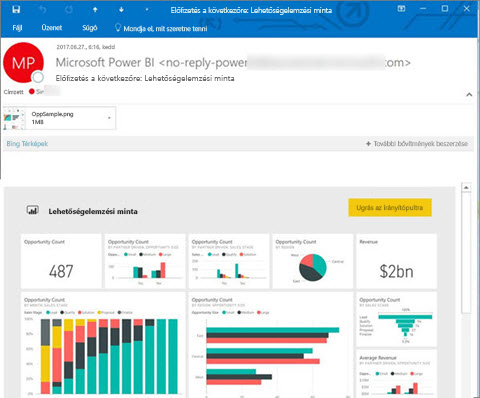
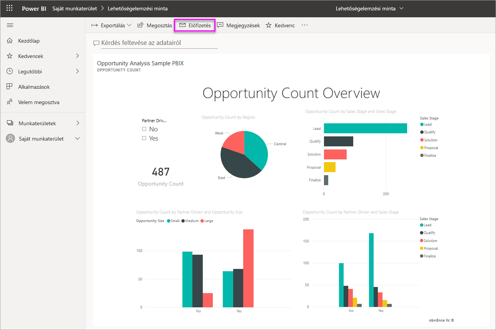
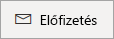
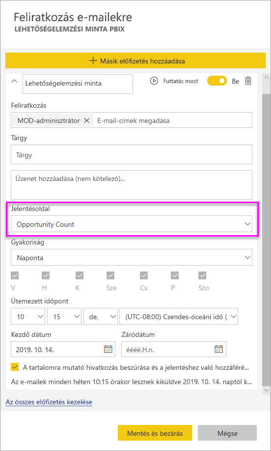
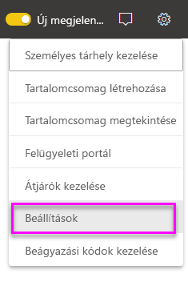
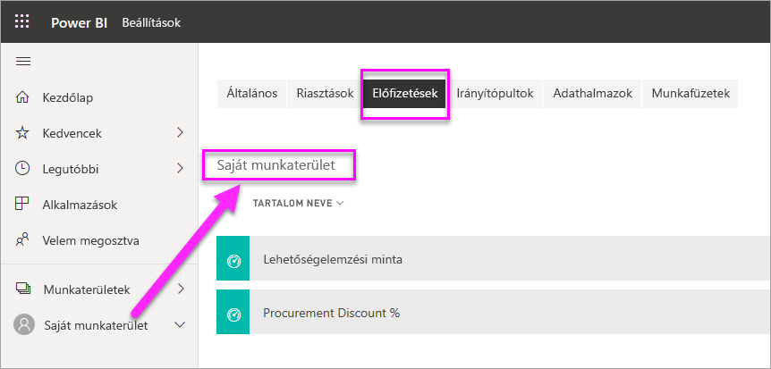

# Feliratkozás és mások feliratkoztatása jelentésekre és irányítópultokra a Power BI szolgáltatásban

Feliratkoztathatja önmagát és munkatársait a legfontosabbnak ítélt jelentésoldalakra, irányítópultokra és lapszámozott jelentésekre. A Power BI e-mailes feliratkozásai a következőket teszik lehetővé:

- Eldöntheti, hogy milyen gyakran szeretne ilyen e-mailt kapni: naponta, hetente, óránként, havonta vagy naponta egyszer, az adatok első frissítése után.
- Megadhatja az e-mail beérkezésének időpontját, ha napi, heti, óránkénti vagy havi szintű e-mailt választ.
- 24 különböző feliratkozást állíthat be Power BI-jelentésenként és -irányítópultonként.  A lapszámozott jelentésekre nem vonatkozik feliratkozási korlát.
- E-mailt kaphat a jelentés képével és a szolgáltatás jelentésének hivatkozásával.  Olyan mobileszközökön, melyeken telepítve van a Power BI alkalmazás, a hivatkozás választásakor a Power BI alkalmazás indul el a jelentésnek vagy az irányítópultnak a Power BI webhelyén való megnyitása helyett.
- Ha lapszámozott jelentésre iratkozik fel, csatolhatja a teljes jelentést.
- E-mailt küldhet a bérlőn kívüli felhasználóknak, amennyiben a Power BI-tartalmat egy Premium kapacitásban üzemelteti.  A rendszergazdák a Power BI felügyeleti központjának meglévő külső megosztásvezérlési beállításaival megadhatják, hogy ki küldhet e-mailes feliratkozásokat külső felhasználóknak.

 

## Követelmények

Feliratkozás a következőképp **hozható létre**:

- Power BI Pro-licenccel rendelkező felhasználók által 
- A Premium-munkaterületeken vagy -alkalmazásokban található tartalmat megtekintő felhasználók is feliratkozhatnak a tartalomra, akár Power BI Pro-licenc nélkül is. 

A tartalomra (irányítópultra vagy jelentésre) nem kell szerkesztési jogosultsággal rendelkeznie ahhoz, hogy önmagának hozzon létre feliratkozást, másnak viszont csak akkor tud létrehozni egyet, ha szerkesztési jogosultsággal rendelkezik.

## Feliratkozás irányítópultra, jelentésoldalra vagy lapszámozott jelentésre

Függetlenül attól, hogy irányítópultra, jelentésre vagy lapszámozott jelentésre iratkozik fel, a folyamat hasonló. Ugyanazzal a gombbal iratkozhat fel a Power BI szolgáltatás irányítópultjaira és jelentéseire.

A lapszámozott jelentésekre való feliratkozás egy kissé eltér ettől. A részletekről a [Feliratkozás és mások feliratkoztatása egy lapszámozott jelentésre a Power BI szolgáltatásban](../consumer/paginated-reports-subscriptions.md) című cikkből tájékozódhat.
 
.

1. Nyissa meg az irányítópultot vagy a jelentést.
2. A felső menüsávon válassza a **Feliratkozás** lehetőséget vagy a boríték ikont .
   
    

1. A feliratkozást a sárga csúszkával kapcsolhatja be és ki. A csúszkával történő **kikapcsolás** nem törli a feliratkozást. A feliratkozás törléséhez válassza a kuka ikont.

2. E-mail-címe már szerepel a **Feliratkozás** mezőben. A feliratkozáshoz is megadhat egy további e-mail-címet, azonos tartományban. Ha a jelentést és az irányítópultot [prémium szintű kapacitásban](https://docs.microsoft.com/power-bi/service-premium-what-is) üzemelteti, akkor más egyéni e-mail-címeket és csoportos aliasokat is felírathat, akár az Ön tartományában találhatók, akár nem. Ha a jelentést és az irányítópultot nem prémium szintű kapacitásban üzemelteti, akkor is feliratkoztathat másokat, de nekik is Power BI Pro-licenccel kell rendelkezniük. További részleteket az alábbi, [Megfontolandó szempontok és hibaelhárítás](#considerations-and-troubleshooting) című részben olvashat.

3. Töltse ki az e-mail **Tárgy7** és **Üzenet** adatait.

4. Válasszon **Gyakoriságot** feliratkozásához:  **Napi**, **Óránkénti**, **Heti**, **Havi** vagy **Adatfrissítések utáni (Napi)** . Ha az e-mailt, amelyre feliratkozott, csak bizonyos napokon szeretné megkapni, válassza az **Óránkénti** vagy **Heti** értéket, majd jelölje ki a napokat. Ha például az e-mailt csak hétköznapokon szeretné megkapni, válassza a **Heti** gyakoriságot, majd távolítsa el a jelölést a **szombat** és a **vasárnap** jelölőnégyzetéből. Ha a **Havi** lehetőséget választja, adja meg a hónap azon napját/napjait, amikor e-mailt szeretne kapni a feliratkozásokról.

5. Ha **Napi,** , **Óránkénti**, **Havi** vagy **Heti** gyakoriságot választ, akkor **Ütemezett időpontot** is megadhat a feliratkozáshoz. Futtathatja egész órakor, vagy 15, 30, 45 perccel az után. Választhat délelőtti (AM) vagy délutáni (PM) időpontot. Az időzónát is megadhatja. Ha az **Óránkénti** beállítást választotta, válassza ki az **Ütemezett időpontot**, amikorra a feliratkozás indítását szeretné beállítani, és azt követően óránként érkezik majd.

6. A feliratkozás kezdő dátuma alapértelmezés szerint az a nap, amelyen létrehozta. Lehetősége van a záró dátum beállítására. Ha nem állít be záró dátumot, az automatikusan az egy évvel a kezdő dátum utáni napra lesz beállítva. Ezt a feliratkozás lejárta előtt bármikor módosíthatja bármely jövőbeli dátumra (a 9999-es évig). Amikor egy feliratkozás záró dátuma elérkezik, a küldés leáll, amíg újra nem engedélyezi. Az ütemezett záró dátum előtt értesítés(eke)t kap, amelyek rákérdeznek a kiterjesztésére.

    Figyelje meg az alábbi képernyőfelvételen, hogy amikor feliratkozik egy jelentésre, akkor valójában egy jelentés_oldalra_ iratkozik fel. Ha egy jelentésben több oldalra is fel szeretne iratkozni, válassza a **Másik előfizetés hozzáadása** lehetőséget, és válasszon ki egy másik oldalt.
     
      

1. (Nem kötelező) Eldöntheti, hogy megad-e egy, a Power BI-tartalomra hivatkozó linket, és hogy ad-e hozzáférést a felhasználóknak a tartalomhoz, amelyre felíratja őket.  Ha megad egy hivatkozást, gondoskodjon arról, hogy minden felhasználó hozzáfér a jelentéshez.
2. Válassza a **Mentés és bezárás** lehetőséget. A feliratkozott személyek a választott gyakorisággal és időpontban e-mailt kapnak, és az irányítópult vagy jelentésoldal pillanatképét. Összesen legfeljebb 24 feliratkozást hozhat létre egy jelentéshez vagy irányítópulthoz, és mindegyikhez egyedi címzetteket, időpontokat és gyakoriságokat adhat meg. Minden olyan, irányítópultra vagy jelentésre való feliratkozás, amelynek gyakorisága **Adatfrissítések utáni**, csak az első ütemezett frissítés után küld e-mailt.

    > [!TIP]
    > Szeretné azonnal elküldeni az előfizetésből az e-mailt, vagy igény szerint küldeni azt bármely időpontban? Válassza ki a **Futtatás most** lehetőséget az előfizetésekhez a küldeni kívánt irányítópulthoz vagy jelentéshez. Megjelenik egy értesítés arról, hogy az e-mail úton van mindenkihez az adott előfizetésben. Ez a művelet nem számít bele az jelentésenkénti vagy irányítópultonkénti napi 24 ütemezett előfizetés-futtatási korlátba. Ez NEM vált ki adatfrissítést a mögöttes adathalmazban.
    >

## Feliratkozások kezelése

Csak az a személy kezelheti a feliratkozást, aki létrehozta. A feliratkozások kezelésére szolgáló képernyő két úton érhető el. Az első **Az összes előfizetés kezelése** lehetőség választása a **Feliratkozás e-mailekre** párbeszédpanelen (lásd a fenti 4. lépést). A második a Power BI a felső menüsávon lévő fogaskerék ikonjának , majd a **Beállítások** lehetőség választása.

Hogy mely feliratkozások jelennek meg, az attól függ, hogy éppen melyik munkaterület aktív. Ha az összes munkaterülethez tartozó feliratkozásokat szeretné megjeleníteni, győződjön meg arról, hogy a **Saját munkaterület** aktív. A munkaterületek működéséről a [Munkaterületek a Power BI-ban](service-create-workspaces.md) című cikkben olvashat bővebben.

A feliratkozás az alábbi esetek bármelyikében lejár:

- A Pro-licenc lejár.
- A tulajdonos törli az irányítópultot vagy a jelentést.
- Törlik a feliratkozás létrehozásához használt felhasználói fiókot.

A Power BI-rendszergazdák a Power BI auditnaplóival tekinthetik meg a feliratkozások adatait. Ezek a következők:

- Created By (Létrehozó)
- Létrehozás dátuma
- A feliratkozás tárgyául szolgáló tartalom
- Címzettek
- Gyakoriság
- Módosította/
- Módosítás dátuma

## Megfontolandó szempontok és hibaelhárítás

### Általános

- Ritkán előfordulhat, hogy az e-mail-feliratkozások kézbesítése 15 percnél többet is igénybe vesz. Ilyen esetben a megfelelő kézbesítési idő érdekében ajánlott más időpontokban futtatni az adatfrissítést és az e-mail-feliratkozását. Ha a probléma továbbra is fennáll, forduljon a Power BI-ügyfélszolgálathoz.
- Ha el szeretné kerülni, hogy a feliratkozással kapcsolatos e-mailek a levélszemétmappába kerüljenek, adja hozzá a Power BI e-mail-aliast ([no-reply-powerbi@microsoft.com](mailto:no-reply-powerbi@microsoft.com)) a névjegyeihez. Ha Microsoft Outlookot használ, kattintson a jobb gombbal az aliasra, és válassza a **Hozzáadás az Outlook-névjegykártyákhoz** parancsot.
- Jelenleg más felhasználók regisztrálásánál a jelentések és irányítópultok e-mailes megosztása nincs támogatva az élő kapcsolattal rendelkező adatkészleteket használatával, kivéve a lapszámozott jelentések esetében. Saját biztonsági környezetével felírathat másokat egy lapszámozott jelentésre. További információ a [lapszámozott jelentésekre való feliratkozásról](../consumer/paginated-reports-subscriptions.md).
- A Power BI automatikusan felfüggeszti a több mint két hónapja nem látogatott irányítópultokhoz vagy jelentésekhez társított adathalmazok frissítését. Ha azonban feliratkozik egy irányítópultra vagy jelentésre, az nem szünetel akkor sem, ha nem látogatják.
- Ha nem kapja meg az e-mail-értesítéseket, akkor ellenőrizze, hogy tud-e e-maileket fogadni az egyszerű felhasználónevével (UPN).
- Ha az irányítópultja vagy jelentése prémium szintű kapacitásban van, akkor használhat csoportos e-mail-aliasokat a feliratkozásokhoz, és nem kell a munkatársai számára e-mail-címenként elvégezni azt. Az aliasok a jelenlegi Active Directoryn alapulnak.

### Irányítópultok

- Előfordulhat, hogy a felhasználóknak küldött előfizetési e-mailekben a több mint 25 kitűzött csempével vagy négy kitűzött élő jelentésoldallal rendelkező irányítópultok nem jelennek meg teljes egészében. Az ennél több csempét tartalmazó irányítópultokra való feliratkozás nincs blokkolva. Ha azonban problémát tapasztal, nem támogatottnak minősülnek. Ajánlott ezeket úgy módosítani, hogy a támogatott tartományba essenek.
- Ritkán előfordulhat, hogy az e-mail-feliratkozások kézbesítése 15 percnél többet is igénybe vesz. Ilyen esetben a megfelelő kézbesítési idő érdekében ajánlott más időpontokban futtatni az adatfrissítést és az e-mail-feliratkozását. Ha a probléma továbbra is fennáll, forduljon a Power BI-ügyfélszolgálathoz.
- Az irányítópultok e-mail-feliratkozásai esetén, ha bármely csempe sorszintű biztonsággal (RLS) rendelkezik, ezek a csempék nem jelennek meg.
- Az irányítópultokra való feliratkozások esetében bizonyos csempetípusok még nem támogatottak. Ilyenek többek között a streamelési csempék, a videócsempék és az egyéni webes tartalomcsempék.
- Ha egy bérlőn kívüli munkatárssal oszt meg egy irányítópultot, akkor ezen munkatársa számára nem tud feliratkozást is létrehozni, *kivéve*, ha az irányítópult egy Premium-munkaterületen vagy alkalmazásban található. Ha tehát Ön aaron@contoso.com, akkor megoszthat irányítópultot a(z) anyone@fabrikam.com címmel, de nem hozhat létre feliratkozást anyone@fabrikam.com részére, és ő sem iratkozhat fel megosztott tartalomra.

### Jelentések

- A jelentésekhez kapcsolódó e-mail-feliratkozások esetén, ha az adatkészlet sorszintű biztonságot használ, nem hozhat létre feliratkozást saját magának. Nem írathat fel másokat sorszintű biztonsággal (RLS) rendelkező jelentésekre, kivéve a lapszámozott jelentéseket. Saját biztonsági környezetével felírathat másokat egy lapszámozott jelentésre. További információ a [lapszámozott jelentésekre való feliratkozásról](../consumer/paginated-reports-subscriptions.md).
- A jelentésoldalakra való feliratkozás a jelentésoldal nevéhez kapcsolódik. Ha feliratkozik egy jelentésoldalra, majd átnevezi azt, akkor újra létre kell hoznia a feliratkozást.
- Előfordulhat, hogy a szervezet konfigurált néhány beállítást az Azure Active Directory-ban, amelyek korlátozhatják a Power BI-ban az e-mail-előfizetések használatát. A korlátozások körébe a teljesség igénye nélkül beletartoznak az erőforrások elérésekor a többtényezős hitelesítés és az IP-címtartomány korlátozásai.
- Az e-mailekre való feliratkozások az [egyéni vizualizációk](../developer/power-bi-custom-visuals.md) többségét nem támogatják. Az egyetlen kivétel a [minősített](../developer/power-bi-custom-visuals-certified.md) egyéni vizualizációk esete.
- Az e-mailekre való feliratkozások jelenleg nem támogatják az R-alapú egyéni vizualizációkat.
- Az e-mail-értesítések a jelentés szűrőinek és szeletelőinek alapértelmezett állapotait alkalmazva lesznek elküldve. Az alapértelmezéseknek a feliratkozás után végzett módosításai nem jelennek meg az e-mailben. A lapszámozott jelentések viszont támogatják ezt a képességet, és lehetővé teszik a specifikus paraméterértékek feliratkozásonkénti beállítását.

## Következő lépések

- [Feliratkozás és mások feliratkoztatása egy lapszámozott jelentésre a Power BI szolgáltatásban](../consumer/paginated-reports-subscriptions.md)
- További kérdései vannak? [Kérdezze meg a Power BI közösségét](https://community.powerbi.com/)    
- [Olvassa el a blogbejegyzést](https://powerbi.microsoft.com/blog/introducing-dashboard-email-subscriptions-a-360-degree-view-of-your-business-in-your-inbox-every-day/)
