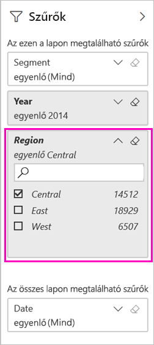

# Power BI-jelentés szűrése és megosztása
A *Megosztással* egyszerűen biztosíthatja néhány személy hozzáférését az irányítópultjaihoz és jelentéseihez. Mi történik olyankor, ha egy jelentésnek egy szűrt verzióját szeretné megosztani? Lehet, hogy azt szeretné, hogy a jelentésben csak egy adott város vagy üzletkötő vagy év adatai jelenjenek meg. Ez a cikk azt ismerteti, hogyan szűrheti a jelentéseket, és hogyan oszthatja meg a jelentés szűrt verzióját. A szűrt jelentések megosztásának egy másik módja, ha [lekérdezési paramétereket ad hozzá a jelentés URL-címéhez](service-url-filters.md). A jelentés mindkét esetben már szűrve lesz, amikor a címzettek először megnyitják. A felhasználók törölhetik a jelentésben szereplő szűrők kijelölését.

A Power BI-ban [több más módon is megvalósítható a jelentések közös használata és terjesztése](service-how-to-collaborate-distribute-dashboards-reports.md). A megosztáshoz Önnek és az összes címzetteknek is [Power BI Pro-licencre](../fundamentals/service-features-license-type.md) van szüksége, vagy pedig a tartalomnak kell egy [Prémium-kapacitásban](../admin/service-premium-what-is.md) lennie. 

## A folyamat követése a mintaadatok használatával

Ez a cikk a Marketing és értékesítés mintaalkalmazás-sablont használja. Szeretné kipróbálni? 

1. Telepítse az [Értékesítési és marketing minta alkalmazássablont](https://appsource.microsoft.com/product/power-bi/microsoft-retail-analysis-sample.salesandmarketingsample?tab=Overview).
2. Válassza ki az alkalmazást, és válassza az **Alkalmazás megismerése** lehetőséget.

   

3. Az alkalmazással telepített munkaterület megnyitásához válassza a ceruza ikont.

    

4. A munkaterület tartalmi listájában válassza a **Jelentések** lehetőséget, majd válassza ki az **Értékesítési és marketing minta PBIX** jelentést.

    

    Most már dolgozhat vele.

## Szűrő beállítása a jelentésben

Nyisson meg egy jelentést [Szerkesztés nézetben](../consumer/end-user-reading-view.md), és alkalmazzon egy szűrőt.

Ebben a példában az Értékesítési és marketing minta alkalmazássablon Folyó évi kategória oldalát fogjuk szűrni, hogy csak azokat az értékeket mutassa, ahol a **Régió** értéke **Central** (Középső). 
 

Mentse a jelentést.

## A szűrt jelentés megosztása

1. Válassza a **Megosztás** lehetőséget.

   

2. Törölje az **E-mail-értesítés küldése a címzetteknek** bejelölését, hogy ehelyett egy szűrt hivatkozást küldhessen, válassza a **Jelentés megosztása az aktuális szűrőkkel és szeletelőkkel**, majd a **Megosztás** lehetőséget.

    

4. Válassza újra a **Megosztás** lehetőséget.

   

5. Válassza a **Hozzáférés** lapot, majd válassza a **Megosztott jelentések nézeteinek kezelése** lehetőséget.

    

6. Kattintson a jobb gombbal a kívánt URL-címre, majd válassza a **Hivatkozás másolása** lehetőséget.

    

7. Ha ezt a hivatkozást megosztja, a címzettek a szűrt jelentést fogják látni. 

## További lépések
* [A munka megosztásának módjai a Power BI-ban](service-how-to-collaborate-distribute-dashboards-reports.md)
* [Irányítópult megosztása](service-share-dashboards.md)
* Több kérdése van? [Kérdezze meg a Power BI közösségét](https://community.powerbi.com/).
* Visszajelzés küldene? Mondja el javaslatait a [Power BI-közösség webhelyén](https://community.powerbi.com/).
