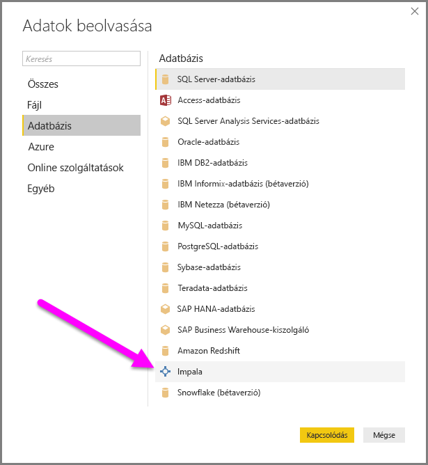
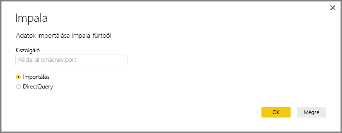
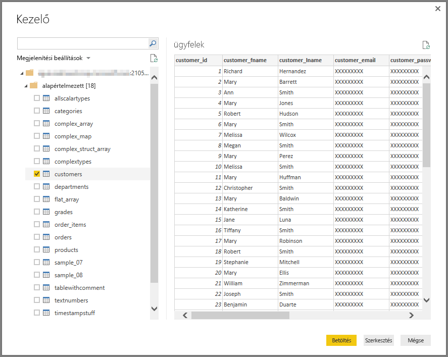

# Csatlakozás Impala-adatbázishoz a Power BI Desktopban
A Power BI Desktopban csatlakozhat egy **Impala**-adatbázishoz, és úgy használhatja az alapul szolgáló adatokat, mint a Power BI Desktop bármely más adatforrását.

## Kapcsolódás Impala-adatbázishoz
**Impala**-adatbázishoz való csatlakozáshoz végezze el a következő lépéseket: 

1. A Power BI Desktop **Kezdőlap** szalagján válassza az **Adatok lekérése** lehetőséget. 

2. A bal oldali kategóriák közül válassza az **Adatbázis** lehetőséget. Ekkor megjelenik az **Impala**.

    

3. A megjelenő **Impala** ablakban írja vagy illessze be az Impala-kiszolgáló nevét a mezőbe. Ezután válassza az **OK** gombot. Az adatokat közvetlenül is **importálhatja** a Power BI-ba, vagy használhatja a **DirectQueryt**. További információ a [DirectQuery használatáról](desktop-use-directquery.md).

    

4. Amikor a rendszer kéri, adja meg a hitelesítő adatait, vagy válassza a névtelen csatlakozást. Az Impala-összekötő a névtelen, az alapszintű (felhasználónév + jelszó) és a Windows-hitelesítési típusokat támogatja.

    

    > [!NOTE]
    > Ha egy adott **Impala**-kiszolgálóhoz megadta a felhasználónévét és a jelszavát, a Power BI Desktop ugyanazon hitelesítő adatokat fogja használni a későbbi csatlakozási kísérletekhez is. A hitelesítő adatokat a **Fájl > Lehetőségek és beállítások > Adatforrás-beállítások** szakaszában módosíthatja.

5. A csatlakozás után egy **kezelő** ablak jelenik meg, és megjeleníti a kiszolgálón elérhető adatokat. Válassza ki az importálandó és a **Power BI Desktopban** használni kívánt elemeket az adatokból.

    

## Megfontolandó szempontok és korlátozások
Az **Impala**-összekötő használatára vonatkozik néhány korlátozást és egyéb szempont:

* Az Impala-összekötőt támogatják a helyszíni adatátjárók, bármelyik hitelesítési módot is válassza a három támogatott közül.

## További lépések
A Power BI Desktop használatával számos adatforráshoz csatlakozhat. Az adatforrásokkal kapcsolatos információkért lásd az alábbi forrásanyagokat:

* [Mi az a Power BI Desktop?](../fundamentals/desktop-what-is-desktop.md)
* [Adatforrások a Power BI Desktopban](desktop-data-sources.md)
* [Adatok formázása és kombinálása a Power BI Desktoppal](desktop-shape-and-combine-data.md)
* [Kapcsolódás az Excelhez a Power BI Desktopban](desktop-connect-excel.md)   
* [Adatok közvetlen bevitele a Power BI Desktopba](desktop-enter-data-directly-into-desktop.md)   
