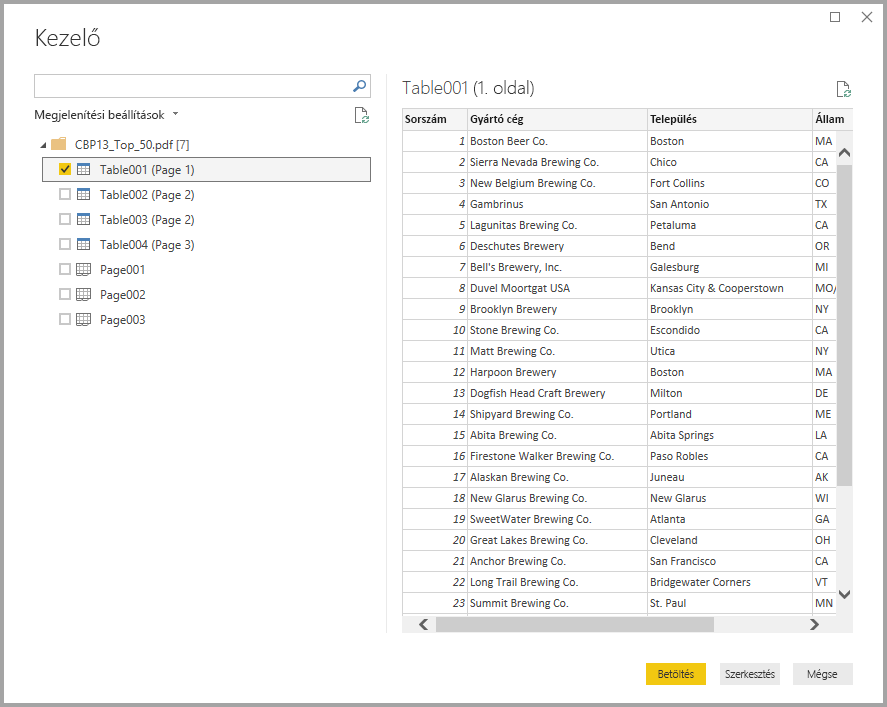

# Csatlakozás PDF-fájlokhoz a Power BI Desktopban
A Power BI Desktopban csatlakozhat egy **PDF-fájlhoz**, és úgy használhatja a fájlban lévő adatokat, mint a Power BI Desktop bármely más adatforrását.

A következő bekezdések a **PDF-fájlhoz** való csatlakozást, az adatok kijelölését és az adatoknak a **Power BI Desktopba** való beolvasását ismertetik.

Javasoljuk, hogy mindig frissítsen a **Power BI Desktop** legújabb verziójára, amelyet a [Power BI Desktop beszerzése](../fundamentals/desktop-get-the-desktop.md) hivatkozással érhet el. 

## Csatlakozás PDF-fájlhoz
Ha csatlakozni kíván egy **PDF-fájlhoz**, válassza az **Adatok lekérése** lehetőséget a Power BI Desktop **Kezdőlap** menüszalagján. A bal oldali kategóriák közül válassza az **Fájl** lehetőséget, ekkor megjelenik a **PDF**.

A rendszer megkéri, hogy adja meg a használni kívánt PDF-fájl helyét. Ha megadta a fájl helyét, és a PDF-fájl be lett töltve, megjelenik a **Kezelő** ablaka, és megjeleníti a fájlban elérhető adatokat. Ezek közül kiválaszthat egy vagy több importálni kívánt elemet, és használhatja őket a **Power BI Desktopban**.

A PDF-fájlban felderített elemek melletti jelölőnégyzet bejelölésével azok megjelennek a jobb oldali panelen. Ha kész az importálásra, válassza a **Betöltés** gombot az adatoknak a **Power BI Desktopba** töltéséhez.

A **Power BI Desktop** 2018. novemberi kiadásától kezdve a PDF-kapcsolat választható paramétereként megadható a **Start page** (kezdőoldal) és az **End page** (utolsó oldal). Ezek a paraméterek az M képletnyelven is megadhatók az alábbi formátumban:

`Pdf.Tables(File.Contents("c:\sample.pdf"), [StartPage=10, EndPage=11])`

## További lépések
A Power BI Desktop használatával számos adatforráshoz csatlakozhat. Az adatforrásokkal kapcsolatos információkért lásd az alábbi forrásanyagokat:

* [Mi az a Power BI Desktop?](../fundamentals/desktop-what-is-desktop.md)
* [Adatforrások a Power BI Desktopban](desktop-data-sources.md)
* [Adatok formázása és kombinálása a Power BI Desktoppal](desktop-shape-and-combine-data.md)
* [Kapcsolódás az Excelhez a Power BI Desktopban](desktop-connect-excel.md)   
* [Adatok közvetlen bevitele a Power BI Desktopba](desktop-enter-data-directly-into-desktop.md)   
