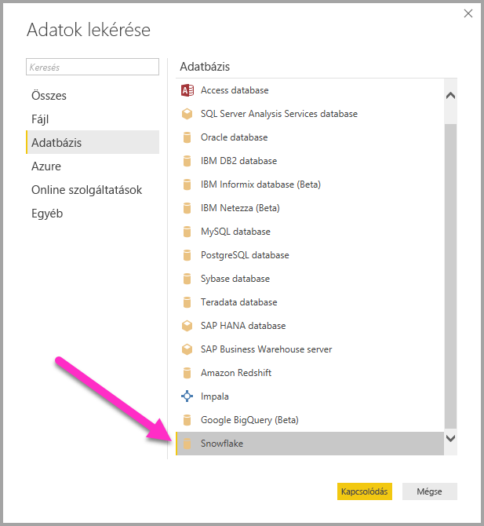
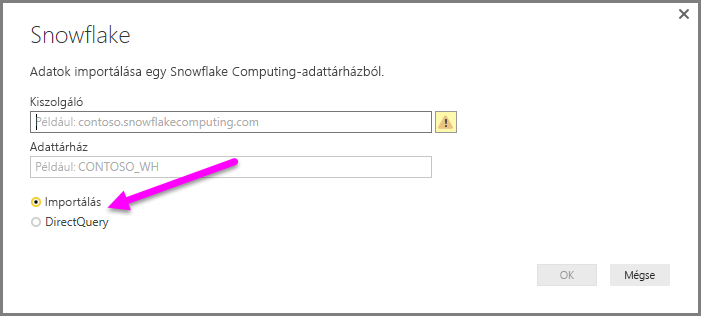
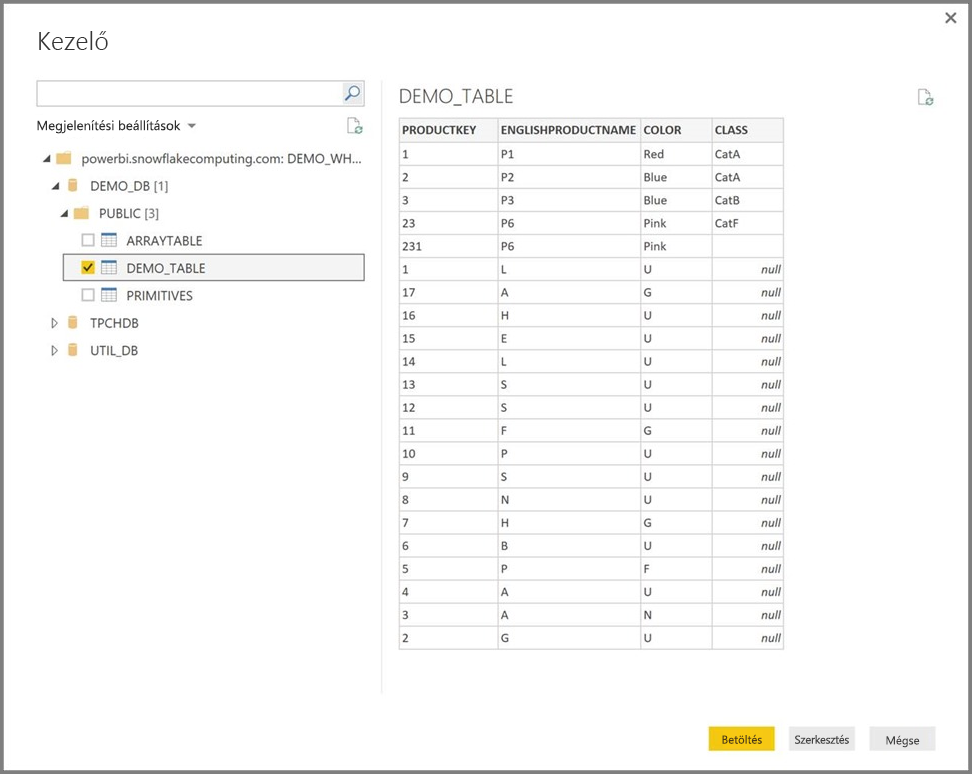

# Kapcsolódás Snowflake Computing-adattárházhoz a Power BI Desktopban
A Power BI Desktopban csatlakozhat egy **Snowflake** Computing-adattárházhoz, és úgy használhatja az alapul szolgáló adatokat, mint a Power BI Desktop bármely más adatforrását. 

## Kapcsolódás egy Snowflake Computing-adattárházhoz
Ha csatlakozni kíván egy **Snowflake** Computing-adattárházhoz, válassza a Power BI Desktop **Kezdőlap** menüszalagján az **Adatok lekérése** lehetőséget. A bal oldali kategóriák közül válassza az **Adatbázis** lehetőséget, ekkor megjelenik a **Snowflake**.

A megjelenő **Snowflake** ablakban írja vagy illessze be a Snowflake Computing-adattárház nevét a mezőbe, és válassza az **OK** gombot. Vegye figyelembe, hogy az adatokat közvetlenül is **importálhatja** a Power BI-ba, vagy használhatja a **DirectQueryt**. További információ a DirectQueryről: [A DirectQuery használata](desktop-use-directquery.md). Vegye figyelembe, hogy az AAD-beli SSO csak a DirectQueryt támogatja.

Ha a rendszer kéri, adja meg a felhasználónevét és a jelszavát.

> [!NOTE]
> Ha egy adott **Snowflake**-kiszolgálóhoz megadta a felhasználónévét és a jelszavát, a Power BI Desktop ugyanazon hitelesítő adatokat fogja használni a későbbi csatlakozási kísérletekhez is. A hitelesítő adatokat a **Fájl > Lehetőségek és beállítások > Adatforrás-beállítások** szakaszában módosíthatja.
> 
> 

Ha a Microsoft-fiókot szeretné használni, a Snowflake AAD-integrációt a Snowflake oldalán kell konfigurálni. Ehhez olvassa el a [Snowflake erre a témakörre vonatkozó dokumentációjának](https://docs.snowflake.net/manuals/user-guide/oauth-powerbi.html#power-bi-sso-to-snowflake) Első lépések szakaszát.

Ha sikeresen csatlakozott, megjelenik a **Kezelő** ablaka, és megjeleníti a kiszolgálón elérhető adatokat. Ezek közül kiválaszthat egy vagy több importálni kívánt elemet, és használhatja őket a **Power BI Desktopban**.

A kiválasztott táblát **betöltheti**, amellyel az egész tábla bekerül a **Power BI Desktopba**, vagy **szerkesztheti** is a lekérdezést. Ekkor megnyílik a **Lekérdezésszerkesztő**, amellyel szűrheti vagy finomíthatja a használni kívánt adatokat, majd a finomított adatkészletet betöltheti a **Power BI Desktopba**.

## Következő lépések
A Power BI Desktop használatával számos adatforráshoz csatlakozhat. Az adatforrásokkal kapcsolatos információkért lásd az alábbi forrásanyagokat:

* [Mi az a Power BI Desktop?](../fundamentals/desktop-what-is-desktop.md)
* [Adatforrások a Power BI Desktopban](desktop-data-sources.md)
* [Adatok formázása és kombinálása a Power BI Desktoppal](desktop-shape-and-combine-data.md)
* [Kapcsolódás az Excelhez a Power BI Desktopban](desktop-connect-excel.md)   
* [Adatok közvetlen bevitele a Power BI Desktopba](desktop-enter-data-directly-into-desktop.md)   
