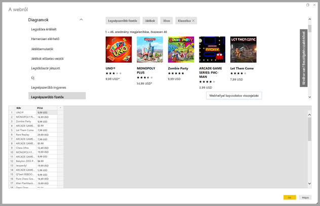

# Weblap adatainak lekérdezése mintákkal

A weboldalak adatainak letöltésével a felhasználók egyszerűen nyerhetnek ki és importálhatnak adatokat a *Power BI Desktopba*. Gyakran előfordul azonban, hogy a weboldalakon az adatok nem rendezett táblázatokban vannak, ahonnan könnyen kinyerhetők. Az ilyen oldalakról még akkor is nehéz adatokat betölteni, ha az adatok strukturáltak és konzisztensek.

Létezik megoldás. Az *Adatgyűjtés a webről példa alapján* funkcióval tulajdonképpen megmutathatja a Power BI Desktopnak, hogy mely adatokat szeretné kinyerni. Ehhez egy vagy több példát kell megadni az összekötő párbeszédablakban. A Power BI Desktop kigyűjti az oldal többi adatát, amelyek megfelelnek a példáknak. Ezzel a megoldással sokféle, így táblázatban rendezett *és* más, nem rendezett adat is kinyerhető a weboldalakról.

Az ábrákon látható árak csak példák.

## Az Adatgyűjtés a webről példa alapján funkció használata

A **Kezdőlap** menüszalagon válassza az **Adatok lekérése** lehetőséget. A megjelenő párbeszédpanel bal oldalán a kategóriák között válassza az **Egyéb**, majd a **Web** lehetőséget. A folytatáshoz válassza a **Csatlakozás** lehetőséget.

A **Webről** mezőben adja meg annak a weboldalnak az URL-címét, amelyről adatokat szeretne kinyerni. Ez a cikk a Microsoft Store weboldalát használja, és bemutatja ennek az összekötőnek a működését.

Ha követni kívánja, használhatja a cikkben is használt [Microsoft Store URL-címet](https://www.microsoft.com/store/top-paid/games/xbox?category=classics):

    https://www.microsoft.com/store/top-paid/games/xbox?category=classics

Az **OK** választásával átvált a **Navigátor** párbeszédablakra, ahol megjelennek a weboldal automatikusan észlelt táblázatai. Az alábbi ábrán látható példában nem találhatók táblázatok. Példák megadásához válassza a **Táblázat hozzáadása példákból** lehetőséget.

A **Táblázat hozzáadása példákból** interaktív ablakában megtekintheti a weboldal tartalmának előnézetét. Adjon meg példákat a kinyerni kívánt adatok értékeire.

Ebben az esetben az oldalon látható játékok *Nevét* és *Árát* fogjuk kigyűjteni. Ehhez néhány példát kell megadni az oldalról minden oszlopban. A példák beírásakor a *Power Query* intelligens adatkinyerési algoritmusokkal nyeri ki a példák mintázatának megfelelő adatokat.

> [!NOTE]
> Az ajánlott értékek legfeljebb 128 karakter hosszúságúak.

Ha elégedett a weboldalról kinyert adatokkal, válassza az **OK** lehetőséget a Power Query-szerkesztő megnyitásához. Alkalmazhat további átalakításokat vagy formázásokat, például kombinálhatja ezeket az adatokat a források más adataival.

Ez után már létrehozhat vizualizációkat, vagy másként is felhasználhatja a weboldal adatait Power BI Desktop-jelentései elkészítéséhez.

## További lépések

A Power BI Desktop használatával számos adatforráshoz csatlakozhat. Az adatforrásokkal kapcsolatos információkért lásd az alábbi forrásanyagokat:

* [Oszlop hozzáadása példából a Power BI Desktopban](../create-reports/desktop-add-column-from-example.md)
* [Csatlakozás weblapokhoz a Power BI Desktopból](desktop-connect-to-web.md)
* [Adatforrások a Power BI Desktopban](desktop-data-sources.md)
* [Adatok formázása és összevonása a Power BI Desktopban](desktop-shape-and-combine-data.md)
* [Kapcsolódás az Excelhez a Power BI Desktopban](desktop-connect-excel.md)
* [Csatlakozás CSV-fájlokhoz a Power BI Desktopban](desktop-connect-csv.md)
* [Adatok közvetlen bevitele a Power BI Desktopba](desktop-enter-data-directly-into-desktop.md)
