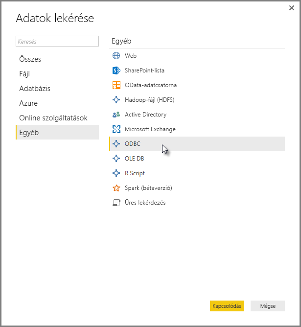
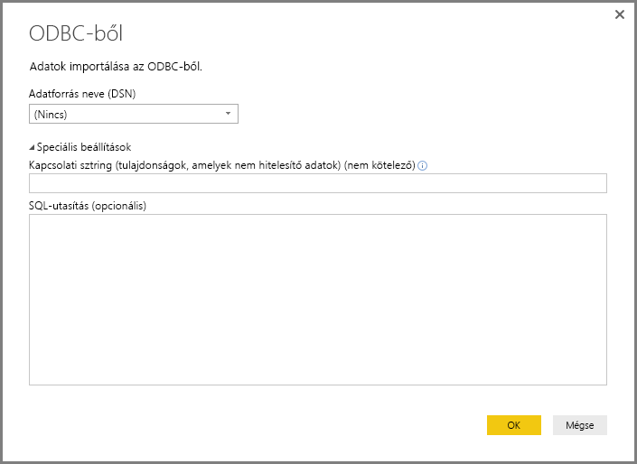
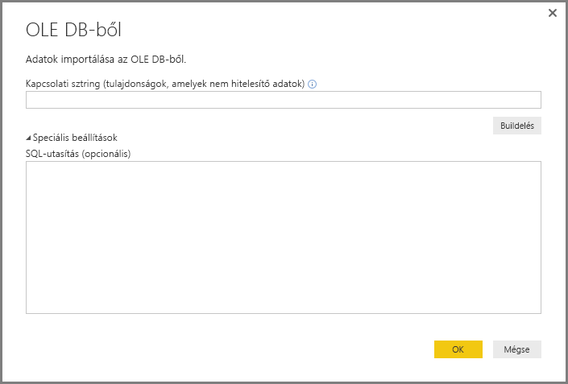
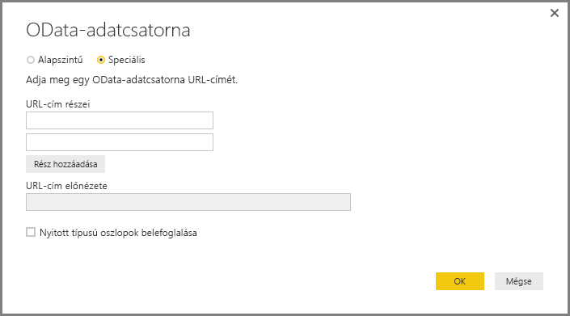

# Kapcsolódás az adatokhoz a Power BI Desktop általános interfészeinek használatával 

Számos különböző adatforráshoz csatlakozhat a **Power BI Desktopban** beépített adatösszekötők használatával, kezdve az **Access-adatbázisoktól** a **Zendesk-erőforrásokig**, ahogy ez az **Adatok lekérése** ablakban is látható. Továbbá a *Power BI Desktop* beépített általános illesztőinek használatával (pl.: **ODBC** vagy **REST API-k**) számos **egyéb** adatforráshoz is csatlakozhat, amelyek tovább bővítik kapcsolati lehetőségeit.

## A Power BI Desktop adatillesztői
A **Power BI Desktop** folyamatosan bővülő adatösszekötő-gyűjteménnyel rendelkezik, amelyek úgy lettek létrehozva, hogy egy bizonyos adatforráshoz csatlakozzanak. A **SharePoint-lista** adatösszekötő például kifejezetten a **SharePoint-listákhoz** tervezett mezőket és támogató információkat biztosít a csatlakozási folyamat során. Ez pedig igaz az összes adatforrásra, amely megtalálható az **Adatok lekérése > Továbbiak…** lehetőség kiválasztásakor megjelenő ablakban.

A **Power BI Desktop** emellett azt is lehetővé teszi, hogy az alábbi általános adatillesztők használatával az **Adatok lekérése** listákban nem szereplő adatforrásokhoz is csatlakozhasson:

* **ODBC**
* **OLE DB**
* **OData**
* **REST API-k**
* **R-szkriptek**

A megfelelő paramétereknek a fent említett általános illesztők által biztosított csatlakozási ablakban történő megadásával jelentősen bővítheti a **Power BI Desktopban** elérhető és használható adatforrások választékát.

Az alábbi szakaszokban megtalálhatja az általános illesztők segítségével elérhető adatforrások listáját.

Nem találja a **Power BI Desktopban** használni kívánt adatforrást? Javaslatait elküldheti a Power BI-csapatnak a [Javaslatok és kérések](https://ideas.powerbi.com/) listájában.

## ODBC-n keresztül elérhető adatforrások
A **Power BI Desktop** **ODBC**-összekötőjével egyszerűen egy **adatforrás nevének (DSN)** vagy egy *kapcsolati sztring* megadásával importálhat adatokat bármely harmadik féltől származó ODBC-illesztőből. Igény szerint megadhat egy, az ODBC-illesztőn végrehajtandó SQL-utasítást is.

Az alábbi lista néhány példát ismertet azon adatforrások közül, amelyekhez a **Power BI Desktop** az általános **ODBC**-illesztő használatával csatlakozni tud.

| A Power BI Desktop általános összekötője | Külső adatforrás | További információk hivatkozása |
| --- | --- | --- |
| ODBC |Cassandra |[Cassandra ODBC-illesztő](https://www.simba.com/drivers/cassandra-odbc-jdbc/) |
| ODBC |Couchbase DB |[Couchbase és Power BI](https://powerbi.microsoft.com/blog/visualizing-data-from-couchbase-server-v4-using-power-bi/) |
| ODBC |DynamoDB |[DynamoDB ODBC-illesztő](https://www.simba.com/drivers/dynamodb-odbc-jdbc/) |
| ODBC |Google BigQuery |[BigQuery ODBC-illesztő](https://www.simba.com/drivers/bigquery-odbc-jdbc/) |
| ODBC |HBase |[HBase ODBC-illesztő](https://www.simba.com/drivers/hbase-odbc-jdbc/) |
| ODBC |Hive |[Hive ODBC-illesztő](https://www.simba.com/drivers/hive-odbc-jdbc/) |
| ODBC |IBM Netezza |[Az IBM Netezzával kapcsolatos információk](https://www.ibm.com/support/knowledgecenter/SSULQD_7.2.1/com.ibm.nz.datacon.doc/c_datacon_plg_overview.html) |
| ODBC |Presto |[Presto ODBC-illesztő](https://www.simba.com/drivers/presto-odbc-jdbc/) |
| ODBC |Project Online |[A Project Online-nal kapcsolatos cikk](desktop-project-online-connect-to-data.md) |
| ODBC |Progress OpenEdge |[A Progress OpenEdge ODBC-illesztőre vonatkozó blogbejegyzés](https://www.progress.com/blogs/connect-microsoft-power-bi-to-openedge-via-odbc-driver) |

## OLE DB-n keresztül elérhető adatforrások
A **Power BI Desktop** **OLE DB**-összekötőjével egyszerűen egy *kapcsolati sztring* megadásával importálhat adatokat bármely harmadik féltől származó OLE DB-illesztőből. Igény szerint megadhat egy, az OLE DB-illesztőn végrehajtandó SQL-utasítást is.

Az alábbi lista néhány példát ismertet azon adatforrások közül, amelyekhez a **Power BI Desktop** az általános **OLE DB**-illesztő használatával csatlakozni tud.

| A Power BI Desktop általános összekötője | Külső adatforrás | További információk hivatkozása |
| --- | --- | --- |
| OLE DB |SAS OLE DB |[SAS-szolgáltató az OLE DB-hez](https://support.sas.com/downloads/package.htm?pid=648) |
| OLE DB |Sybase OLE DB |[Sybase-szolgáltató az OLE DB-hez](http://infocenter.sybase.com/help/index.jsp?topic=/com.sybase.infocenter.dc35888.1550/doc/html/jon1256941734395.html) |

## OData használatával elérhető adatforrások
A **Power BI Desktop** **OData**-összekötőjével egyszerűen az **OData** URL-cím beírásával vagy beillesztésével importálhat adatokat bármely **OData** URL-címről. Több URL-címrészt is megadhat, ha beírja vagy beilleszti azokat az **OData-csatorna** ablakban található szövegmezőkbe.

Az alábbi lista néhány példát ismertet azon adatforrások közül, amelyekhez a **Power BI Desktop** az általános **OData**-illesztő használatával csatlakozni tud.

| A Power BI Desktop általános összekötője | Külső adatforrás | További információk hivatkozása |
| --- | --- | --- |
| OData |Hamarosan elérhető |Térjen vissza később az OData-adatforrásokért |

## REST API-kon keresztül elérhető adatforrások
**REST API-k** segítségével is csatlakozhat adatforrásokhoz, így minden olyan adatforrást használhat, amely támogatja a **REST**-et.

Az alábbi lista néhány példát ismertet azon adatforrások közül, amelyekhez a **Power BI Desktop** a **REST API-k** általános illesztőjének használatával csatlakozni tud.

| A Power BI Desktop általános összekötője | Külső adatforrás | További információk hivatkozása |
| --- | --- | --- |
| REST API-k |Couchbase DB |[A Couchbase REST API-val kapcsolatos információk](https://powerbi.microsoft.com/blog/visualizing-data-from-couchbase-server-v4-using-power-bi/) |

## R-szkripten keresztül elérhető adatforrások
**R-szkriptek** használatával is hozzáférhet adatforrásokhoz, és felhasználhatja azok adatait a **Power BI Desktopban**.

Az alábbi lista néhány példát ismertet azon adatforrások közül, amelyekhez a **Power BI Desktop** az **R-szkriptek** általános illesztőjének használatával csatlakozni tud.

| A Power BI Desktop általános összekötője | Külső adatforrás | További információk hivatkozása |
| --- | --- | --- |
| R-szkript |SAS-fájlok |[CRAN-útmutatás az R-szkriptekhez](https://cran.r-project.org/doc/manuals/R-data.html) |
| R-szkript |SPSS-fájlok |[CRAN-útmutatás az R-szkriptekhez](https://cran.r-project.org/doc/manuals/R-data.html) |
| R-szkript |Statisztikai R-fájlok |[CRAN-útmutatás az R-szkriptekhez](https://cran.r-project.org/doc/manuals/R-data.html) |

## További lépések
A **Power BI Desktop** használatával számos adatforráshoz csatlakozhat. Az adatforrásokkal kapcsolatos információkért lásd az alábbi forrásanyagokat:

* [Mi az a Power BI Desktop?](../fundamentals/desktop-what-is-desktop.md)
* [Adatforrások a Power BI Desktopban](desktop-data-sources.md)
* [Adatok formázása és kombinálása a Power BI Desktoppal](desktop-shape-and-combine-data.md)
* [Kapcsolódás az Excelhez a Power BI Desktopban](desktop-connect-excel.md)   
* [Adatok közvetlen bevitele a Power BI Desktopba](desktop-enter-data-directly-into-desktop.md)   
