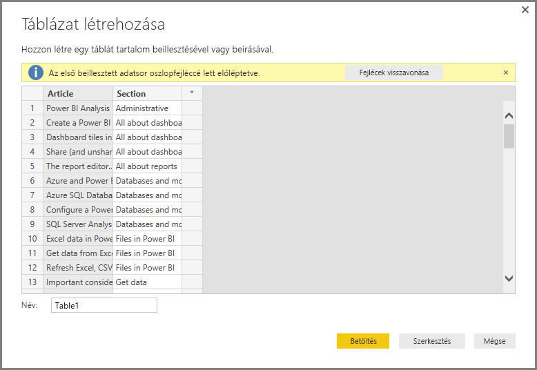

# Adatok közvetlen bevitele a Power BI Desktopban

A Power BI Desktoppal lehetőség van adatok közvetlen bevitelére, amelyeket azután jelentések és vizualizációk készítéséhez használhat fel. Például kimásolhatja egy munkafüzet vagy egy weblap egyes részeit, majd beillesztheti ezeket a Power BI Desktopba.

Ha új tábla formájában szeretne közvetlenül adatokat bevinni a Power BI Desktopba, válassza a **Kezdőlap** **Adatbevitel** lehetőséget.

Előfordulhat, hogy a Power BI Desktop szükség szerint kisebb átalakításokat végez az adatokon, ugyanúgy, mint amikor más forrásból tölt be adatokat. Például a következő esetben a rendszer az adatok első sorát fejlécekké léptette elő.

Ha alakítani szeretné a beírt vagy beillesztett adatokat, a **Lekérdezésszerkesztő** megnyitásához válassza a **Szerkesztés** lehetőséget. A Power BI Desktopba való betöltés előtt átalakíthatja az adatokat. Az adatok jelenlegi állapotában történő importálásához válassza a **Betöltés** lehetőséget.

Ha a **Betöltés** gombra kattint, a Power BI Desktop egy új táblát hoz létre az adataiból, amely ezután elérhető lesz a **Mezők** panelen. Az alábbi képen az látható, hogy a Power BI Desktop megjeleníti az új táblát a *Table1* névvel, valamint a táblában létrehozott két mezőt.

Ezzel készen is van! Ennyire egyszerű az adatbevitel a Power BI Desktopba.

Most már használhatja az adatokat a Power BI Desktopban. Ezeket felhasználhatja vizualizációk és jelentések készítéséhez, vagy más olyan adatokkal való kommunikációhoz, amelyekhez később csatlakozni szeretne vagy amelyeket importálna, mint például Excel táblázatok, adatbázisok vagy más egyéb adatforrás.

## További lépések

A Power BI Desktop használatával számos adatforráshoz csatlakozhat. Az adatforrásokkal kapcsolatos információkért lásd az alábbi forrásanyagokat:

* [Mi az a Power BI Desktop?](../fundamentals/desktop-what-is-desktop.md)
* [Adatforrások a Power BI Desktopban](desktop-data-sources.md)
* [Adatok formázása és kombinálása a Power BI Desktoppal](desktop-shape-and-combine-data.md)
* [Kapcsolódás az Excelhez a Power BI Desktopban](desktop-connect-excel.md)
* [Csatlakozás CSV-fájlokhoz a Power BI Desktopban](desktop-connect-csv.md)
