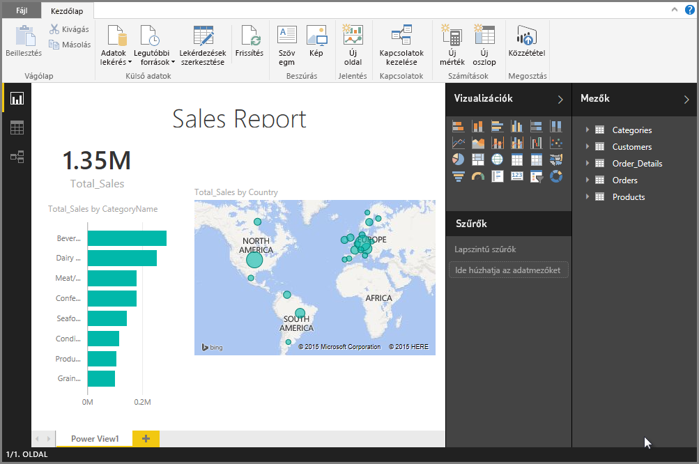

# Excel-munkafüzetek importálása a Power BI Desktopba
A Power BI Desktop segítségével egyszerűen importálhatja a Power Query-lekérdezéseket, Power Pivot-modelleket és Power View-munkalapokat tartalmazó Excel-munkafüzeteket a Power BI Desktopba. A Power BI Desktop automatikusan elkészíti a jelentéseket és a vizualizációkat az Excel-munkafüzet alapján. Ha importálta, tovább is fejlesztheti ezeket a jelentéseket a Power BI Desktoppal a meglévő szolgáltatások és a Power BI Desktop havi frissítéseivel megjelenő új szolgáltatások segítségével.

## Hogyan importálhatok egy Excel-munkafüzetet?
1. Ha egy Excel-munkafüzetet szeretne importálni a Power BI Desktopba, válassza a **Fájl** > **Importálás** > **Power Query, Power Pivot, Power View** lehetőséget.

   

2. A **Megnyitás** ablakban válassza ki az importálni kívánt Excel-munkafüzetet. 

   Jelenleg nincs korlátozás érvényben a munkafüzet méretére vagy a benne található objektumok számára vonatkozóan, de a nagyobb munkafüzetek elemzése és importálása tovább tart a Power BI Desktop számára.

   > [!NOTE]
   > Ha a megosztott OneDrive Vállalati verzió mappáiból vagy a Microsoft 365-csoport mappáiból szeretne Excel-fájlokat betölteni vagy importálni, használja az Excel-fájl URL-jét, és adja meg be a Power BI Desktop webes adatforrásában. Néhány lépést el kell végezni a OneDrive Vállalati verzió URL-jének megfelelő formázásához. További információ és a lépések helyes sorrendje: [OneDrive Vállalati verzióra mutató hivatkozások használata a Power BI Desktopban](desktop-use-onedrive-business-links.md).
   > 
   > 

3. A megjelenő Importálás párbeszédpanelen válassza a **Kezdés** lehetőséget.

   

   A Power BI Desktop elemzi a munkafüzetet, és egy Power BI Desktop-fájllá (.pbix) konvertálja. Ez egy egyszeri esemény. Ha ezen lépéseket követve létrejött a Power BI Desktop-fájl, a továbbiakban már független az eredeti Excel-munkafüzettől, módosíthatja (és mentheti, megoszthatja) anélkül, hogy az hatással lenne az eredeti munkafüzetre.

   Ha elkészült az importálással, megjelenik egy Összegzés lap, amely ismerteti a konvertált elemeket, és felsorolja azokat az elemeket, amelyeket nem sikerült importálni.

   

4. Válassza a **Bezárás** gombot. 

   A Power BI Desktop importálja az Excel-munkafüzetet, és betölt egy jelentést a munkafüzet tartalma alapján.

   

A munkafüzet importálása után tovább dolgozhat a jelentésen. Új vizualizációkat hozhat létre, adatokat adhat hozzá, vagy új jelentésoldalakat hozhat létre a Power BI Desktop bármely funkciójával.

## A munkafüzet mely elemei importálhatók?
A Power BI Desktop az alábbi, az Excelben általában *objektumnak* nevezett elemeket képes importálni.

| Objektum az Excel-munkafüzetben | Végeredmény a Power BI Desktop-fájlban |
| --- | --- |
| Power Query lekérdezések |A rendszer az összes exceles Power Query lekérdezést Power BI Desktop lekérdezéssé konvertálja. Ha az Excel-munkafüzetben meg vannak határozva lekérdezéscsoportok, a Power BI Desktop replikálja ugyanezt a szerkezetet. A rendszer minden kapcsolatot betölt, kivéve azokat, amelyeknek **Csak kapcsolat létrehozása** beállítása van az Excel **Adatok importálása** párbeszédpanelén. A betöltési viselkedés testreszabható a Power BI Desktop Power Query-szerkesztőjének **Kezdőlapján** elérhető **Tulajdonságok** lapon. |
| Power Pivot külső adatkapcsolatok |A rendszer az összes Power Pivot külső adatkapcsolatot Power BI Desktop-lekérdezéssé konvertálja. |
| Hivatkozott táblák vagy a munkafüzet aktuális táblái |Ha az Excel egyik munkalaptáblája az adatmodellhez vagy egy lekérdezéshez kapcsolódik (az M *Táblázatból* vagy *Excel.CurrentWorkbook()* függvénye használatával), az alábbi lehetőségek jelennek meg: <ol><li><b>Tábla importálása a Power BI Desktop-fájlba</b>. Ez a táblázat egy egyszeri pillanatfelvétel az adatokról, amely után a tábla adatai csak olvashatóvá válnak Power BI Desktopban. Az ezzel a lehetőséggel létrehozott táblákra vonatkozik egy 1 millió karakteres korlátozás (a teljes karakterszámot tekintve, oszlopfejlécekkel és cellákkal együtt).</li><li><b>Az eredeti munkafüzettel létesített kapcsolat megőrzése</b>. Egy másik megoldás, ha megtartja a kapcsolatot az eredeti Excel-munkafüzettel, és a Power BI Desktop minden frissítéssel lekéri ennek a táblának a legfrissebb tartalmát, mint minden más, a Power BI Desktopban egy Excel-munkafüzeten létrehozott lekérdezés esetében.</li></ul> |
| Adatmodell számított oszlopai, mértékei, KPI-jei, adatkategóriái és kapcsolatai |Ezeket az adatmodell-objektumokat a rendszer a Power BI Desktop megfelelő objektumaivá konvertálja. Vannak olyan adatkategóriák, amelyek a Power BI Desktopban nem érhetők el, például a Kép. Ezekben az esetekben az adatkategória-adatok alaphelyzetbe állnak vissza a kérdéses oszlopoknál. |
| Power View-munkalapok |Az Excel minden Power View-munkalapjához létrejön egy új jelentésoldal. Ezen jelentésoldalak neve és sorrendje megfelel az eredeti Excel-munkafüzetben találhatónak. |

## Vonatkozik valamilyen korlátozás egy munkafüzet importálására?
Néhány korlátozás vonatkozik egy munkafüzet Power BI Desktopba való importálására:

* **Külső kapcsolatok az SQL Server Analysis Services táblázatos modelljéhez:** Az Excel 2013-ban kapcsolat hozható létre az SQL Server Analysis Services táblázatos modelljeivel, és létrehozhatók Power View-jelentések ezeken a modelleken anélkül, hogy importálni kellene az adatokat. Ez a típusú kapcsolat jelenleg nem támogatott az Excel-munkafüzetek Power BI Desktopba való importálásának részeként. Áthidaló megoldásként ezeket a külső kapcsolatokat újra létre kell hoznia a Power BI Desktopban.
* **Hierarchiák:** Ez a típusú adatmodell-objektum jelenleg nem támogatott a Power BI Desktopban. Ezért a rendszer kihagyja a hierarchiákat az Excel-munkafüzetek Power BI Desktopba való importálása során.
* **Bináris adatoszlopok:** Ez a típusú adatmodell-oszlop jelenleg nem támogatott a Power BI Desktopban. A bináris adatokat tartalmazó oszlopokat a rendszer eltávolítja a Power BI Desktopban kapott táblából.
* **Nem támogatott Power View-elemek:** A Power View néhány szolgáltatása a Power BI Desktopban nem érhető el. Ilyenek a témák és bizonyos típusú vizualizációk (pontdiagram lejátszási tengellyel, részletes elemzési viselkedések és hasonlók). Ezek a nem támogatott vizualizációk *Nem támogatott vizualizáció* üzeneteket eredményeznek a Power BI Desktop jelentés megfelelő helyein. Ezek törölhetők vagy igény szerint újrakonfigurálhatók.
* **A Power Queryben** a ***Táblázatból*** függvényt vagy **az M-ben** ***Excel.CurrentWorkbook*** függvényt használó **névvel ellátott tartományok:** Ezeknek a névvel ellátott tartományoknak a Power BI Desktopba való importálása jelenleg nem támogatott, de az egyik tervezett frissítés tartalmazni fogja. Jelenleg a rendszer ezeket a névvel ellátott tartományokat egy külső Excel-munkafüzetre mutató kapcsolatként tölti be a Power BI Desktopba.
* **PowerPivot – SSRS:** Az SQL Server Reporting Services (SSRS) felé mutató PowerPivot külső kapcsolatok jelenleg nem támogatottak, mert az adatforrás jelenleg nem érhető el a Power BI Desktopban.

