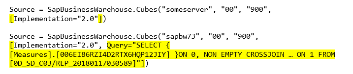
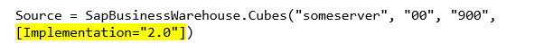

# <a name="use-the-sap-business-warehouse-connector-in-power-bi-desktop"></a>Az SAP Business Warehouse-összekötő használata a Power BI Desktopban

A Power BI Desktopban hozzáférhet az *SAP Business Warehouse (BW)* adataihoz.

Ha szeretné megismerni, milyen előnyökkel jár, ha az ügyfelek a Power BI-t a meglévő SAP B-rendszerükhöz csatlakoztatják, olvassa el a [Power BI-t és az SAP BW-t bemutató tanulmányt](https://aka.ms/powerbiandsapbw). A DirectQuery az SAP BW-vel való használatáról további tudnivalókat a [DirectQuery és SAP Business Warehouse (BW)](desktop-directquery-sap-bw.md) szolgáltatást ismertető cikkben találhat.

A *Power BI Desktop* 2018. júniusi kiadása óta (és a 2018. októbertől általánosan) a SAP BW-összekötőt olyan implementációval használhatja, amelynek teljesítménye és képességei jelentős mértékben javultak. A Microsoft kifejlesztette az SAP BW-összekötő *2.0-s implementációját*. Választhat SAP BW-összekötő 1. verziója és az SAP-összekötő 2.0-ás implementációja között. A következő szakaszok az egyes verziók telepítését mutatják be egymás után. Amikor a Power BI Desktopból az SAP BW-hez kapcsolódik, kiválaszthatja, hogy a kettő közül melyik összekötőt kívánja használni.

Javasoljuk, hogy amikor csak lehetséges, az SAP-összekötő 2.0-s Implementáció lehetőséget válassza.

## <a name="installation-of-version-1-of-the-sap-bw-connector"></a>Az SAP BW-összekötő 1. verziójának telepítése

Javasoljuk, hogy amikor csak lehetséges, az SAP-összekötő 2.0-s Implementáció lehetőséget válassza. Ez a szakasz az SAP BW-összekötő 1. verziójának telepítését ismerteti.

1. Telepítse az *SAP NetWeaver* kódtárat a helyi számítógépen. Az SAP Netweaver kódtárat az SAP-rendszergazdától vagy közvetlenül az [SAP Software Download Center letöltőközpontból](https://support.sap.com/swdc) szerezheti be. Mivel az SAP Software Download Center szerkezete gyakran változik, a helyet nem tudjuk pontosabban meghatározni. Az SAP NetWeaver kódtárat általában az SAP Client Tools telepítése is tartalmazza.

   A legfrissebb verzió letöltései helyének megtalálásához rákereshet a *SAP Note #1025361* jegyzetre. Ügyeljen arra, hogy az (32 vagy 64 bites) SAP NetWeaver-kódtár megfeleljen a Power BI Desktop-verziónak. Telepítse az *SAP NetWeaver RFC SDK* fájljait az SAP-megjegyzés szerint.
2. A Power BI Desktopban válassza az **Adatok lekérése** lehetőséget. Az **Adatbázis** lehetőségei között látható egy *SAP Business Warehouse-alkalmazáskiszolgáló* és egy *SAP Business Warehouse üzenetkezelési kiszolgáló* bejegyzés.

   

## <a name="installation-of-implementation-20-sap-connector"></a>Az SAP-összekötő 2.0-s Implementációjának telepítése

Az SAP-összekötő 2.0-s Implementációjához szükség van az SAP .NET-összekötő 3.0-s verziójára. A letöltéshez való hozzáféréshez érvényes S-felhasználói fiókra van szükség. Az SAP .NET-összekötő 3.0-s verziójának beszerzéséhez vegye fel a kapcsolatot az SAP Basis csapatával.

Az [SAP .NET-összekötő 3.0-t](https://support.sap.com/en/product/connectors/msnet.html) az SAP-ről töltheti le.

Az összekötő 32 bites és 64 bites verzióban érhető el. Azt a verziót válassza, amely megfelel a telepített Power BI Desktopnak. Jelenleg két verzió érhető el a weboldalon (a .NET-keretrendszer 4.0-s verziójához):

* SAP-összekötő Microsoft .NET 3.0.22.0-hoz, 32 bites (x86) Windows rendszerhez zip-fájlként (6896 KB), 2019. június 1.
* SAP-összekötő Microsoft .NET 3.0.22.0-hoz, 64 bites (x64) Windows rendszerhez zip-fájlként (7180 KB), 2019. június 1.

A telepítésekor a **Választható telepítési lépések** területen válassza ki a *Szerelvények telepítése a globális szerelvény-gyorsítótárba* lehetőséget.


> [!NOTE]
> SAP BW-implementáció első verziójához a NetWeaver DLL-fájlokra volt szükség. Ha az SAP-összekötő 2.0-ás implementációját használja, és nem az 1. verziót, akkor a Netweaver DLL-fájlokra nincsen szükség.

## <a name="version-1-sap-bw-connector-features"></a>Az SAP BW-összekötő 1. verziójának funkciói

A Power BI Desktopban található SAP BW-összekötő 1. verziójának használatával adatokat importálhat az *SAP Business Warehouse-kiszolgáló* típusú kockákból, de DirectQuery használatát is lehetővé teszi.

Az SAP BW-összekötőről és annak a DirectQueryvel való használatáról [A DirectQuery és az SAP Business Warehouse (BW)](desktop-directquery-sap-bw.md) című cikkből tájékozódhat.

Csatlakozáskor meg kell adnia a **Kiszolgálót**, a **Rendszer számát** és az **Ügyfél-azonosítót**.


Két további **Speciális beállítást** is megadhat: **A nyelv kódját**, és egy, a megadott kiszolgálón futtatandó egyéni **MDX-utasítást**.


Ha nem ad meg MDX-utasítást, a csatlakozási beállítás megjeleníti a kiszolgálón elérhető kockákat. Az elérhető kockákban részletezés után elemeket választhat ki, így dimenziókat és mértékeket is. A Power BI-ban elérhetőek az [Open Analysis Interface-ben](https://help.sap.com/saphelp_nw70/helpdata/en/d9/ed8c3c59021315e10000000a114084/content.htm) elérhető lekérdezések és kockák.

Amikor kijelöl egy vagy több elemet a kiszolgálón, a kezelő párbeszédpanel létrehozza a kimeneti tábla előnézetét.


A **kezelő** párbeszédpanel emellett a következő megjelenítési beállításokat is megnyitja:

* **Csak a kijelölt elemek megjelenítése**. Alapértelmezés szerint a **kezelő** az összes elemet megjeleníti.  Ez a beállítás a kijelölt elemek végleges halmazának ellenőrzéséhez hasznos. Ezt az Előnézet területen az oszlopnevek kiválasztásával is megtekintheti.
* **Adatok előnézetének engedélyezése**. Ez az alapértelmezett érték. Adatok előnézetét jeleníti meg. Az adatelőnézetek letiltása csökkenti a kiszolgálói hívások számát, mivel a rendszer nem kér le adatokat az előnézetekhez.
* **Technikai nevek**. Az SAP BW támogatja a kockákban lévő objektumokra vonatkozó *technikai nevek* koncepciót. A technikai nevek segítségével a kocka tulajdonosa *felhasználóbarát* nevekkel jelenítheti meg a kockában lévő objektumokat, nem csupán azok *fizikai neveivel*.


Az összes szükséges objektum kijelölése után eldöntheti, hogy mi legyen a következő lépés. A következő lehetőségek közül választhat:

* Ha az összes sort be szeretné tölteni a Power BI Desktop adatmodelljébe, válassza a **Betöltés** lehetőséget. Ekkor megnyílik a **Jelentés** nézet. Megjelenítheti az adatokat, vagy további módosításokat végezhet az **Adat** vagy a **Kapcsolat** nézettel.
* A **Lekérdezésszerkesztő** megnyitásához válassza a **Szerkesztés** lehetőséget. Itt további adatátalakítási és -szűrési lépéseket adhat meg, mielőtt a rendszer a teljes sorkészletet behúzza a Power BI Desktop-adatmodellbe.

Az SAP BW-kockákból importálható adatok mellett adatforrások széles választékából importálhat még adatokat a Power BI Desktopba, és ezeket egyetlen jelentésbe kombinálhatja. Ez számos különféle izgalmas jelentéskészítési és elemzési forgatókönyvet tesz lehetővé az SAP BW-adatokra épülően.

## <a name="using-implementation-20-sap-bw-connector"></a>Az SAP BW-összekötő 2.0-s Implementációjának használata

Hozzon létre egy új kapcsolatot az SAP BW-összekötő 2.0-s Implementációjának használatához. A következő lépések elvégzésével hozhat létre új kapcsolatot:

1. Válassza az **Adatok beolvasása** lehetőséget. Válassza az **SAP Business Warehouse-alkalmazáskiszolgáló** vagy az **SAP Business Warehouse üzenetkezelési kiszolgáló** lehetőségek egyikét, majd csatlakozzon.

2. Az új kapcsolat párbeszédpanelén válassza ki az implementációt. A **2.0-s** **Implementáció** kiválasztása – mint azt a következő ábra is bemutatja – elérhetővé teszi a **Végrehajtási mód**, a **Köteg mérete**, és a **Jellemző struktúrák engedélyezése** lehetőségeket.

    

3. Válassza az **OK** lehetőséget. A folyamat ezután ugyanaz, mint az SAP BW-összekötő [Az SAP BW-összekötő 1. verziójának funkciói](#version-1-sap-bw-connector-features) című szakaszában ismertetett.

### <a name="new-options-for-implementation-20"></a>A 2.0-s Implementáció új beállítási lehetőségei

A 2.0-s Implementáció a következő beállítási lehetőségeket támogatja:

* *ExecutionMode* (Végrehajtási mód) – meghatározza a kiszolgálón lekérdezések végrehajtására használt MDX-felületet. Az alábbi lehetőségek érvényesek:

  * `SapBusinessWarehouseExecutionMode.BasXml`
  * `SapBusinessWarehouseExecutionMode.BasXmlGzip`
  * `SapBusinessWarehouseExecutionMode.DataStream`

    Az alapértelmezett érték `SapBusinessWarehouseExecutionMode.BasXmlGzip`.

    Az `SapBusinessWarehouseExecutionMode.BasXmlGzip` beállítás használata javíthatja a teljesítményt nagy méretű adatkészletek nagy késésű kapcsolattal történő használata esetén.

* *BatchSize* (Köteg mérete) – Meghatározza az MDX-utasítások végrehajtásakor letöltött sorok maximális számát. Kevesebb esetén a nagyobb adatkészletek beolvasásához több hívásra lesz szükség a kiszolgáló felé. Nagy számú sor használata javíthat a teljesítményen, de memóriával kapcsolatos problémákat okozhat a SAP BW-kiszolgálón. Az alapértelmezett érték 50000 sor.

* *EnableStructures* (Struktúrák engedélyezése) – A jellemző struktúrák felismerésének engedélyezését jelzi. A beállítás alapértelmezett értéke false (hamis). Hatással van a kiválasztható objektumok listájára. Natív lekérdezési módban nem támogatott.

A *ScaleMeasures* (Mértékek skálázása) beállítás elavulttá vált ebben az implementációban. A rendszer viselkedése megegyezik a korábbi *ScaleMeasures = false* (Mértékek skálázása = hamis) beállítással, amely mindig méretezés nélkül jelenítette meg az értékeket.

### <a name="additional-improvements-for-implementation-20"></a>További fejlesztések a 2.0-s Implementációban

A következő lista bemutatja az új implementáció néhány további fejlesztett funkcióját:

* Jobb teljesítmény.
* Akár több millió sornyi adat beolvasása és finomhangolhatóság a kötegméret paraméter használatával.
* Kiválasztható végrehajtási mód.
* Tömörített mód támogatása. Különösen hasznos nagy késleltetésű kapcsolatok vagy nagy adatkészletek esetében.
* A `Date` változók továbbfejlesztett észlelése.
* [Kísérleti funkció] A `Date` (DATS ABAP-típusú) és `Time` (TIMS ABAP-típusú) dimenziók dátummá és idővé alakítása szöveges értékek helyett.
* Jobb kivételkezelés. A BAPI-hívásokban esetleg felmerülő hibák megjelennek a felületen.
* Oszlopok összecsukása BasXml és BasXmlGzip módoknál. Ha például a generált MDX-lekérdezés 40 oszlopot kér le, de az aktuális kijelöléshez csak 10 oszlopra van szükség, akkor ez a kérelem továbbításra kerül a kiszolgáló felé, hogy kisebb adatkészlet kerüljön letöltésre.

### <a name="changing-existing-reports-to-use-implementation-20"></a>Meglévő jelentések átállítása a 2.0-s Implementáció használatára

A meglévő jelentések átállítása 2.0-s Implementáció használatára csak Importálás módban lehetséges. Kövesse az alábbi lépéseket:

1. Nyisson meg egy meglévő jelentést, válassza ki a **Lekérdezések szerkesztése** lehetőséget a menüszalagból, ezután pedig válassza ki azt az SAP Business Warehouse-lekérdezést, amelyet frissíteni szeretne.

1. Kattintson jobb gombbal a lekérdezésre, és válassza a **Speciális szerkesztő** lehetőséget.

1. A **Speciális szerkesztőben** módosítsa az `SapBusinessWarehouse.Cubes` hívást a következőképpen:

    Határozza meg, hogy tartalmaz-e már a lekérdezés ahhoz hasonló beállítás-rekordot, mint amilyen a következő példában látható:

    

    Ha igen, adja hozzá az `Implementation` 2.0 beállítást, majd (amennyiben jelen van) távolítsa el a `ScaleMeasures` beállítást:

    

    Ha a lekérdezés még nem tartalmaz beállítás-rekordot, egyszerűen vegyen fel egyet. A következő beállításnál:

    

    Egyszerűen módosítsa a következőre:

    

Az SAP BW-összekötő 2.0-s Implementációjának fejlesztése során mindent megtettünk azért, hogy az kompatibilis maradjon az 1. verzióval. Ennek ellenére előfordulhat néhány különbség, amelyek az eltérő SAP BW MDX végrehajtási módok használatából fakadnak. Az egyezési hibák elhárítása érdekében érdemes lehet a különböző végrehajtási módok között váltani.

## <a name="troubleshooting"></a>Hibaelhárítás

Ez a szakasz hibaelhárítási forgatókönyveket (és megoldásokat) mutat be az SAP BW-összekötő használatához.

1. Az SAP BW numerikus adataiban az ezreselválasztó vessző helyett pont szerepel. Például az 1,000,000 helyett 1.000.000 áll.

   Az SAP BW a tizedes értékeket `,` (vessző) vagy `.` (pont) tizedesjellel adja vissza. Annak meghatározásához, hogy a kettő közül melyiket használja az SAP BW tizedesjelként, a Power BI Desktop által használt illesztő meghívja a `BAPI_USER_GET_DETAIL` függvényt. Ez a hívás a `DEFAULTS` szerkezetet adja vissza, amelynek a `DCPFM` mezője tárolja a *decimális formátum jelölését*. A mező következő értékek egyikét veszi fel:

   * ' ' (szóköz) = a tizedesjel vessző: N.NNN,NN
   * 'X' = a tizedesjel pont: N,NNN.NN
   * 'Y' = a tizedesjel N NNN NNN,NN

   A hibát jelző ügyfelek azt tapasztalták, hogy a `BAPI_USER_GET_DETAIL` meghívásának hibája esetén az adott felhasználó (akinél az adatok nem megfelelően jelennek meg) a következőhöz hasonló hibaüzenetet kap:

   ```xml
    You are not authorized to display users in group TI:
        <item>
            <TYPE>E</TYPE>
            <ID>01</ID>
            <NUMBER>512</NUMBER>
            <MESSAGE>You are not authorized to display users in group TI</MESSAGE>
            <LOG_NO/>
            <LOG_MSG_NO>000000</LOG_MSG_NO>
            <MESSAGE_V1>TI</MESSAGE_V1>
            <MESSAGE_V2/>
            <MESSAGE_V3/>
            <MESSAGE_V4/>
            <PARAMETER/>
            <ROW>0</ROW>
            <FIELD>BNAME</FIELD>
            <SYSTEM>CLNTPW1400</SYSTEM>
        </item>
   ```

   A hiba megoldásához a felhasználónak meg kell kérnie az SAP-rendszergazdát, hogy engedélyezze a Power BI-ban használt SAPBW felhasználó számára a `BAPI_USER_GET_DETAIL` végrehajtását. Azt is érdemes ellenőrizni, hogy a felhasználónál a megfelelő `DCPFM` érték van-e beállítva a jelen hibaelhárítási forgatókönyvben korábban leírtaknak megfelelően.

2. Az SAP BEx lekérdezések kapcsolódási beállításai
   
   A BEx ekérdezések végrehajtásához a Power BI Desktopban engedélyezni kell egy adott tulajdonságot, amint az a következő képen látható:
   
   
   
3. A **Kezelő** ablakban nem az adatok előnézete, hanem ehelyett *Az objektumhivatkozás nincs beállítva semmilyen objektumpéldányra* hibaüzenet jelenik meg.
   
   Az SAP-felhasználóknak meghatározott BAPI-függvénymodulokhoz való hozzáférésre van szükségük a metaadatok beolvasásához és az adatok az SAP BW InfoProvider objektumaiból való lekéréséhez. Ezek a modulok a következők:

   * BAPI_MDPROVIDER_GET_CATALOGS
   * BAPI_MDPROVIDER_GET_CUBES
   * BAPI_MDPROVIDER_GET_DIMENSIONS
   * BAPI_MDPROVIDER_GET_HIERARCHYS
   * BAPI_MDPROVIDER_GET_LEVELS
   * BAPI_MDPROVIDER_GET_MEASURES
   * BAPI_MDPROVIDER_GET_MEMBERS
   * BAPI_MDPROVIDER_GET_VARIABLES
   * BAPI_IOBJ_GETDETAIL

   A probléma megoldásához győződjön meg arról, hogy a felhasználó hozzáfér a különböző MDPROVIDER-modulokhoz, valamint a `BAPI_IOBJ_GETDETAIL` függvénymodulhoz. Ezen vagy hasonló problémák elhárításához engedélyezheti a nyomkövetést. Válassza a **Fájl** > **Lehetőségek és beállítások** > **Beállítások** menüpontot. A **Beállítások** területen válassza a **Diagnosztika**, majd a **Nyomkövetés engedélyezése** lehetőséget. Próbáljon meg aktív nyomkövetés mellett adatokat lekérni az SAP BW-ből, és további részletekért vizsgálja meg a nyomkövetési fájlt.

## <a name="sap-bw-connection-support"></a>Az SAP BW-kapcsolatok támogatása

Az alábbi táblázat az SAP BW aktuális támogatását ismerteti.

|Termék  |Mód  |Hitelesítés  |Összekötő  |SNC-könyvtár  |Támogatott  |
|---------|---------|---------|---------|---------|---------|
|Power BI Desktop     |Bármelyik         | Feléhasználó/jelszó  | Alkalmazáskiszolgáló | N.A.  | Igen  |
|Power BI Desktop     |Bármelyik         | Windows          | Alkalmazáskiszolgáló | sapcrypto + gsskrb5/gx64krb5  | Igen  |
|Power BI Desktop     |Bármelyik         | Windows megszemélyesítésen keresztül | Alkalmazáskiszolgáló | sapcrypto + gsskrb5/gx64krb5  | Igen  |
|Power BI Desktop     |Bármelyik         | Feléhasználó/jelszó        | Üzenetkiszolgáló | N.A.  | Igen  |
|Power BI Desktop     |Bármelyik         | Windows        | Üzenetkiszolgáló | sapcrypto + gsskrb5/gx64krb5  | Igen  |
|Power BI Desktop     |Bármelyik         | Windows megszemélyesítésen keresztül | Üzenetkiszolgáló | sapcrypto + gsskrb5/gx64krb5  | Igen  |
|Power BI-átjáró     |Importálás      | A Power BI Desktoppal egyező |         |   |   |
|Power BI-átjáró     |DirectQuery | Feléhasználó/jelszó        | Alkalmazáskiszolgáló | N.A.  | Igen  |
|Power BI-átjáró     |DirectQuery | Windows megszemélyesítésen keresztül (rögzített felhasználó, nincs SSO) | Alkalmazáskiszolgáló | sapcrypto + gsskrb5/gx64krb5  | Igen  |
|Power BI-átjáró     |DirectQuery | SSO használata Kerberoson keresztül a DirectQuery-lekérdezések választásakor | Alkalmazáskiszolgáló | sapcrypto + gsskrb5/gx64krb5   | Igen  |
|Power BI-átjáró     |DirectQuery | Feléhasználó/jelszó        | Üzenetkiszolgáló | N.A.  | Igen  |
|Power BI-átjáró     |DirectQuery | Windows megszemélyesítésen keresztül (rögzített felhasználó, nincs SSO) | Üzenetkiszolgáló | sapcrypto + gsskrb5/gx64krb5  | Igen  |
|Power BI-átjáró     |DirectQuery | SSO használata Kerberoson keresztül a DirectQuery-lekérdezések választásakor | Üzenetkiszolgáló | gsskrb5/gx64krb5  | Nem  |
|Power BI-átjáró     |DirectQuery | SSO használata Kerberoson keresztül a DirectQuery-lekérdezések választásakor | Üzenetkiszolgáló | sapcrypto  | Igen  |

## <a name="next-steps"></a>Következő lépések

Az SAP-val és a DirectQueryvel kapcsolatos további információkért tekintse meg az alábbi forrásanyagokat:

* [DirectQuery és SAP HANA](desktop-directquery-sap-hana.md)
* [DirectQuery és SAP Business Warehouse (BW)](desktop-directquery-sap-bw.md)
* [DirectQuery használata a Power BI-ban](desktop-directquery-about.md)
* [Adatforrások a Power BI-hoz](power-bi-data-sources.md)
* [Power BI és SAP BW - tanulmány](https://aka.ms/powerbiandsapbw)
