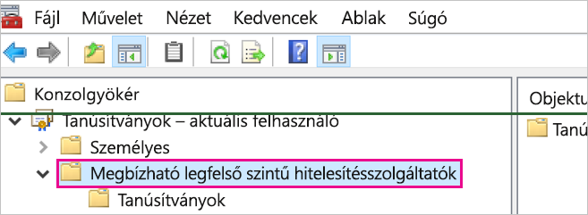
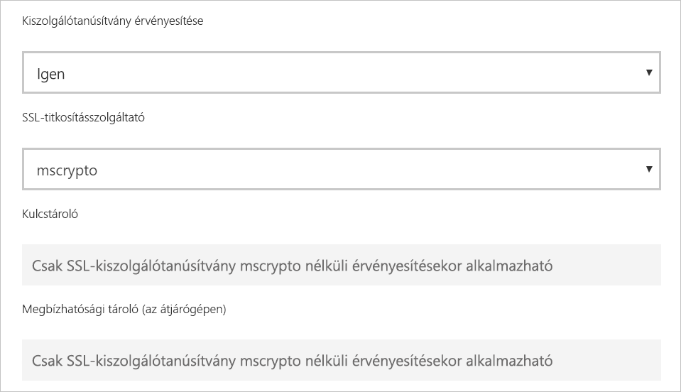

# <a name="enable-encryption-for-sap-hana"></a>Az SAP HANA titkosításának engedélyezése

Az SAP HANA-kiszolgálóhoz a Power BI Desktopból és a Power BI szolgáltatásból létrehozott kapcsolatokat ajánlott titkosítani. A HANA-titkosítást OpenSSL és az SAP saját CommonCryptoLib (korábbi nevén sapcrypto) kódtára használatával is engedélyezheti. Az SAP a CommonCryptoLib használatát ajánlja, de az alapvető titkosítási funkciók mindkét kódtár használatával elérhetők.

Ez a cikk a titkosítás OpenSSL használatával történő engedélyezéséről nyújt áttekintést, és az SAP-dokumentáció néhány megadott szakaszára is hivatkozik. A tartalmat és a hivatkozásokat rendszeresen frissítjük, de átfogó útmutatásért és támogatásért mindig a hivatalos SAP-dokumentációhoz forduljon. Ha OpenSSL helyett a CommonCryptoLib használatával szeretné beállítani a titkosítást, olvassa el a [TLS/SSL konfigurálása az SAP HANA 2.0-ban](https://blogs.sap.com/2018/11/13/how-to-configure-tlsssl-in-sap-hana-2.0/) című blogbejegyzést. Az OpenSSL-ről a CommonCryptoLib-re való áttérés lépéseiről az [SAP Note 2093286](https://launchpad.support.sap.com/#/notes/2093286) bejegyzés nyújt tájékoztatást (s-felhasználó szükséges).

> [!NOTE]
> A titkosítás e cikkben ismertetett beállítási lépései átfedésben vannak az SAML SSO telepítési és konfigurálási lépéseivel. Akár OpenSSL-t, akár a CommonCryptoLib kódtárat választja a HANA-kiszolgáló titkosításszolgáltatójaként, ügyeljen rá, hogy választása megfeleljen az SAML és a titkosítás konfigurációjának.

Az SAP HANA titkosításának OpenSSL használatával való engedélyezése négy szakaszból áll. Az alábbiakban ezt a négy szakaszt ismertetjük.  További információ: [Az SAP HANA Studio és az SAP HANA-kiszolgáló közötti kommunikáció biztonságossá tétele SSL használatával](https://blogs.sap.com/2015/09/28/securing-the-communication-between-sap-hana-studio-and-sap-hana-server-through-ssl/).

## <a name="use-openssl"></a>Az OpenSSL használata

Ellenőrizze, hogy a HANA-kiszolgáló úgy van-e konfigurálva, hogy OpenSSL-t használjon titkosításszolgáltatóként. Az alábbi hiányzó elérés út információ helyére írja be a HANA-kiszolgáló azonosítóját (sid).


## <a name="create-a-certificate-signing-request"></a>Tanúsítvány-aláírási kérelem létrehozása

Hozzon létre X509 tanúsítvány-aláírási kérelmet a HANA-kiszolgálóhoz.

1. SSH használatával kapcsolódjon \<sid\>adm néven a HANA-kiszolgálót futtató Linux rendszerű számítógéphez.

1. Lépjen az _/__usr/sap/\<sid\>/home_ kezdőkönyvtárra.

1. Ha még nem létezik, hozza létre a _.__ssl_ nevű rejtett könyvtárat.

1. Futtassa a következő parancsot:

    ```
    openssl req -newkey rsa:2048 -days 365 -sha256 -keyout Server\_Key.pem -out Server\_Req.pem -nodes
    ```

Ez a parancs egy tanúsítvány-aláírási kérelmet és egy titkos kulcsot hoz létre. Az aláírt tanúsítvány egy évig érvényes (a -days paraméter alapján). Amikor a rendszer a köznapi név (CN) megadását kéri, írja be annak a számítógépnek a teljes tartománynevét (FQDN), amelyre a HANA-kiszolgáló telepítve van.

## <a name="get-the-certificate-signed"></a>A tanúsítvány aláíratása

Szerezze be a tanúsítványt, amelyet olyan hitelesítésszolgáltató (CA) írt alá, amely a HANA-kiszolgálóhoz való csatlakozásra használt ügyfél (ügyfelek) szerint megbízható.

1. Ha már rendelkezik megbízható vállalati hitelesítésszolgáltatóval (az alábbi példában a CA\_Cert.pen és a CA\_Key.pem által megadva), írja alá a hitelesítési kérelmet a következő parancs futtatásával:

    ```
    openssl x509 -req -days 365 -in Server\_Req.pem -sha256 -extfile /etc/ssl/openssl.cnf -extensions usr\_cert -CA CA\_Cert.pem -CAkey CA\_Key.pem -CAcreateserial -out Server\_Cert.pem
    ```

    Ha még nem rendelkezik használható hitelesítésszolgáltatóval, [Az SAP HANA Studio és az SAP HANA-kiszolgáló közötti kommunikáció biztonságossá tétele SSL használatával](https://blogs.sap.com/2015/09/28/securing-the-communication-between-sap-hana-studio-and-sap-hana-server-through-ssl/) című cikkben ismertetett lépésekben hozhat létre saját legfelső szintű tanúsítványt.

1. A HANA-kiszolgáló tanúsítványláncát a kiszolgálói tanúsítvány, a kulcs és a hitelesítésszolgáltató tanúsítványa (SAP HANA esetén ennek egyezményes neve key.pem) kombinálásával hozhatja létre:

    ```
    cat Server\_Cert.pem Server\_Key.pem CA\_Cert.pem \> key.pem
    ```

1. Készítsen egy trust.pem nevű másolatot a CA\_Cert.pem fájlról (SAP HANA esetén a trust.pem név a konvenció):

    ```
    cp CA\_Cert.pem trust.pem
    ```

1. Indítsa újra a HANA-kiszolgálót.

1. Ellenőrizze az ügyfél és az SAP HANA-kiszolgáló tanúsítványának aláírásához használt hitelesítésszolgáltató közötti bizalmi kapcsolatot.

    Az ügyfélnek meg kell bíznia a HANA-kiszolgáló X509 tanúsítványának aláírásához használt hitelesítésszolgáltatóban ahhoz, hogy titkosított kapcsolatot hozzon létre a HANA-kiszolgáló és az ügyfél számítógépe között.

    Ennek a bizalmi kapcsolatnak a megléte többféleképpen ellenőrizhető a Microsoft Management Console (MMC) vagy a parancssor használatával. A hitelesítésszolgáltató X509 tanúsítványát (trust.pem) a kapcsolatot létesítő felhasználó **Megbízható legfelső szintű hitelesítésszolgáltatók** mappájába, vagy igény szerint magának az ügyfélszámítógépnek ebbe a mappájába importálhatja.

    

    A trust.pem fájlt először .crt-fájllá kell konvertálnia, hogy a tanúsítványt a Megbízható legfelső szintű hitelesítésszolgáltatók mappájába importálhassa például a következő OpenSSL-paranccsal:

    ```
    openssl x509 -outform der -in your-cert.pem -out your-cert.crt
    ```
    
    Az OpenSSL használatával végzett konvertálásról az [OpenSSL dokumentációjában](https://www.openssl.org/docs/man1.0.2/man3/x509.html) tájékozódhat.

## <a name="test-the-connection"></a>A kapcsolat tesztelése

Tesztelje a kapcsolatot a Power BI Desktopban vagy a Power BI szolgáltatásban.

1. Az SAP HANA-kiszolgálóhoz való csatlakozás megkísérlése előtt ellenőrizze a Power BI Desktopban vagy a Power BI szolgáltatás **Átjárók kezelése** oldalán, hogy a **Kiszolgálói tanúsítvány érvényesítése** engedélyezve van. **SSL-titkosításszolgáltatóként** válassza az mscrypto lehetőséget, ha az OpenSSL beállítási lépéseit hajtotta végre, vagy a commoncrypto lehetőséget, ha ezt a kódtárat konfigurálta titkosításszolgáltatóként. Az SSL-kulcstároló és az SSL megbízhatósági tároló mezőket hagyja üresen.

    - Power BI Desktop

        

    - Power BI szolgáltatásban

        

1. A kiszolgálóval a **Kiszolgálói tanúsítvány érvényesítése** beállítás engedélyezése mellett sikeresen létrehozott titkosított kapcsolatot úgy ellenőrizheti, hogy adatokat tölt be a Power BI Desktopban, vagy frissít egy közzétett jelentést a Power BI szolgáltatásban.
