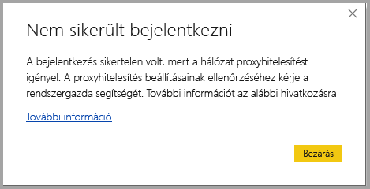
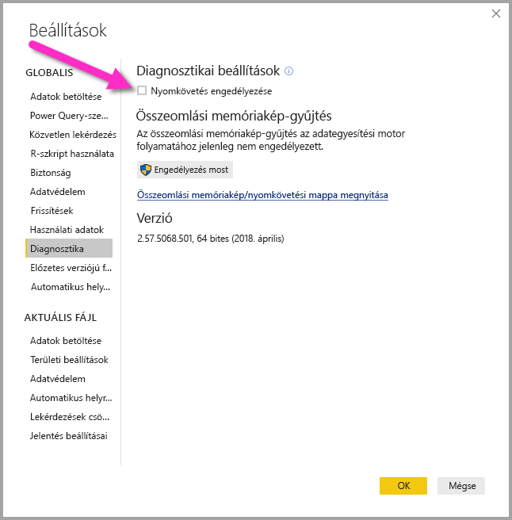
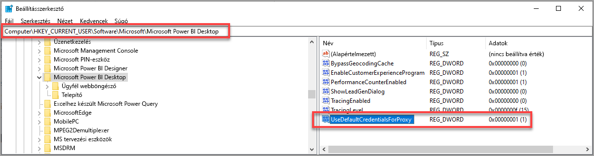

# Bejelentkezés hibaelhárítása a Power BI Desktopban
Előfordulhat, hogy amikor megkísérel bejelentkezni a **Power BI Desktopba**, hibát tapasztal. A bejelentkezési hibáknak két fő oka lehet: **proxy-hitelesítési hibák** és **Nem-HTTPS URL-cím átirányítási hibái**. 

A bejelentkezési hiba okának megállapításához az első lépés kapcsolatba lépni a rendszergazdával, aki megadja a probléma okának meghatározásához szükséges diagnosztikai információkat. A bejelentkezési problémához tartozó hibák nyomon követésével a rendszergazdák el tudják dönteni, hogy a következő hibák melyike következett be Önnél. 

Vegyük sorra ezeket a hibákat. Ennek a cikknek a vége a *nyomkövetési* adatok Power BI-beli rögzítését tárgyalja, amely a problémák felderítésében segíthet.

## Hiba: Proxyhitelesítés szükséges

A következő képernyőkép a *Proxyhitelesítés szükséges* hibára mutat egy példát.

A *Power BI Desktop* nyomkövetési fájljaiban a következő hibák társulnak ehhez a hibához:

* *Microsoft.PowerBI.Client.Windows.Services.PowerBIWebException*
* *HttpStatusCode: ProxyAuthenticationRequired*

Ilyen hiba esetén a legvalószínűbb ok az, hogy a hálózat proxyhitelesítő kiszolgálója blokkolja a **Power BI Desktop** által kiadott webkérelmeket. 

Ha a hálózata proxyhitelesítő kiszolgálót használ, akkor a rendszergazda tudja megoldani ezt a problémát a következő tartományok engedélyezésével a proxyhitelesítő kiszolgálón:

* app.powerbi.com
* api.powerbi.com
* a *.analysis.windows.net névtérben lévő tartományok

A kormányzati felhőhöz tartozó ügyfelek esetében a hiba a következő tartományoknak a proxyhitelesítő kiszolgálón való engedélyezésével oldható meg:

* app.powerbigov.us
* api.powerbigov.us
* a *.analysis.usgovcloudapi.net névtérben lévő tartományok

## Hiba: Nem-HTTPS URL-címekre való átirányítás nem támogatott

A **Power BI Desktop** jelenlegi verziói az Active Directory hitelesítési tár (ADAL) aktuális verzióját használják, amely nem támogatja a nem biztonságos (nem-HTTPS) URL-címekre való átirányítást. 

A *Power BI Desktop* nyomkövetési fájljaiban a következő hibák társulnak ehhez a hibához:

* *Microsoft.IdentityModel.Clients.ActiveDirectory.AdalServiceException: Non-HTTPS url redirect is not supported in webview*
* *ErrorCode: non_https_redirect_failed*

Az *ErrorCode: non_https_redirect_failed* előfordulása azt jelenti, hogy az átirányítási láncban egy vagy több oldal vagy szolgáltató nem HTTPS-védelmű végpont, vagy hogy egy vagy több átirányítás tanúsítványának kibocsátója nem szerepel az eszköz megbízható főtanúsítványai között. A bejelentkezéses átirányítási láncban minden szolgáltatónak HTTPS URL-címet kell használnia. A probléma megoldásához forduljon a rendszergazdához, és kérje, hogy a hitelesítő webhelyeken biztonságos URL-címet használjanak. 

## Nyomkövetési adatok gyűjtése a Power BI Desktopban

Nyomkövetési adatok a következő lépésekkel gyűjthetők a **Power BI Desktopban**:

1. A nyomkövetés a **Power BI Desktopban** a **File > Lehetőségek és beállítások > Beállítások**, majd a bal oldali panel lehetőségei közül a **Diagnosztika** választásával engedélyezhető. A megjelenő panelen jelölje be a következő képen látható **Nyomkövetés engedélyezése** lehetőség melletti jelölőnégyzetet. Lehetséges, hogy újra kell indítania a **Power BI Desktopot**.
   
   

2. Ismételje meg a hibához vezető lépéseket. Amikor bekövetkezik, a **Power BI Desktop** hozzáírja az eseményeket a helyszíni számítógépen tárolt nyomkövetési naplóhoz.

3. Keresse meg a Nyomkövetési adatok (Traces) mappát a számítógépen. A mappára mutató hivatkozás megtalálható a **Diagnosztika** panelen, ahol a nyomkövetést engedélyezte. A fenti képen *Open crash dump/traces folder* (összeomlási memóriakép/nyomkövetési adatok mappa megnyitása) formában látható. A helyszíni számítógépen ez gyakran a következő helyen található:

    `C:\Users/<user name>/AppData/Local/Microsoft/Power BI Desktop/Traces`

A mappa sok nyomkövetési fájlt tartalmazhat. A rendszergazdának csak az utolsó fájlokat küldje el, hogy gyorsan azonosíthassa a hibát. 

## A rendszer alapértelmezett hitelesítő adatainak használata a webproxyhoz

A Power BI Desktop által kiadott webes kérések nem használják a webproxy hitelesítő adatait. A proxykiszolgálót használó hálózatok esetében előfordulhat, hogy a Power BI Desktop nem tud webes kérelmeket létrehozni. 

A Power BI Desktop 2020 márciusi kiadásával kezdődően a rendszer- és hálózatgazdák engedélyezhetik az alapértelmezett rendszerbeli hitelesítő adatok használatát a webproxy-hitelesítéshez. A rendszergazdák létrehozhatnak egy **UseDefaultCredentialsForProxy** nevű beállításjegyzékbeli bejegyzést, az értékét pedig egyre (1) állíthatják az alapértelmezett rendszerhitelesítő adatok webproxy-hitelesítéshez való használatának engedélyezéséhez.

A beállításjegyzék-bejegyzés a következő helyekre kerülhet:

`[HKEY_LOCAL_MACHINE\SOFTWARE\WOW6432Node\Microsoft\Microsoft Power BI Desktop]`
`[HKEY_LOCAL_MACHINE\SOFTWARE\Microsoft\Microsoft Power BI Desktop]`

Nem szükséges mindkét helyen alkalmazni a beállításjegyzék-bejegyzést.

A beállításjegyzék-bejegyzés létrehozása után (amely újraindítást követelhet meg) a Power BI az Internet Explorerben definiált proxybeállításokat használja a webes kérelmekhez. 

A proxybeállítások vagy hitelesítő adatok beállításainak minden módosításához hasonlóan a beállításjegyzékbeli bejegyzése létrehozása és biztonsági következményekkel jár, a rendszergazdáknak így meg kell győződniük arról, hogy megfelelően konfigurálták az Internet Explorer proxyjait a funkció engedélyezése előtt.         

### Az alapértelmezett rendszerbeli hitelesítő adatok használatának korlátozásai és megfontolandó szempontjai

A funkció engedélyezése előtt a rendszergazdáknak számos biztonsági következményt figyelembe kell venniük. 

Ha ügyfeleknek engedélyezi ezt a funkciót, kövesse az alábbi ajánlásokat:

* A proxykiszolgáló hitelesítési sémájaként csak **egyeztetést** használjon, így gondoskodhat arról, hogy az ügyfél csak az Active Directory hálózatához csatlakoztatott proxykiszolgálókat használja. 
* Ne használjon **NTLM-tartalékot** az ezt a funkciót használó ügyfelekhez.
* Ha a felhasználók egy proxy nélküli hálózaton találhatók a funkció engedélyezésekor és a javasolt módon való konfigurálásakor, a rendszer nem próbál meg kapcsolatot felvenni a proxykiszolgálóval, illetve használni az alapértelmezett rendszerhitelesítő adatokat.

[A rendszer alapértelmezett hitelesítő adatainak használata a webproxyhoz](#using-default-system-credentials-for-web-proxy)

