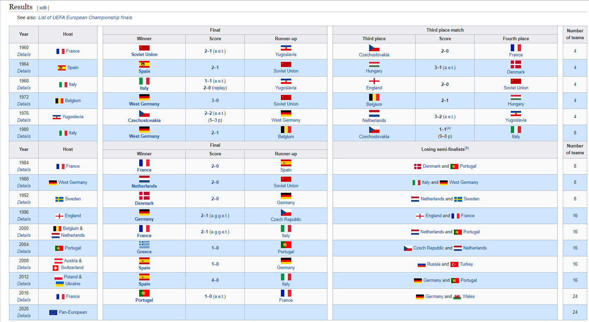

# Oktatóanyag: Weboldalról származó adatok elemzése a Power BI Desktop használatával

Igazi futballrajongóként szeretne jelentést készíteni az UEFA labdarúgó-Európa-bajnokság (Eb) eddigi győzteseiről. A Power BI Desktop használatával az adatokat egy weboldalról egy jelentésbe importálhatja, majd vizualizációs elemek létrehozásával megjelenítheti azokat. Ebben az oktatóanyagban bemutatjuk, hogyan végezheti el a következő feladatokat a Power BI Desktop alkalmazással:

- Kapcsolódás egy webes adatforráshoz és navigálás az elérhető táblák között.
- Adatok formázása és átalakítása a Power Query-szerkesztőben.
- Lekérdezés elnevezése és importálása egy Power BI Desktop-jelentésbe.
- Térképes és tortadiagramos vizualizáció létrehozása és testreszabása.

## Kapcsolódás egy webes adatforráshoz

Az Eb-győztesekre vonatkozó adatokat a labdarúgó-Európa-bajnokság Wikipédia-oldalán található Eredmények nevű táblából töltheti le az alábbi linken: https://en.wikipedia.org/wiki/UEFA_European_Football_Championship. 

A csatlakozó a webes kapcsolatok létrehozásához csak alapszintű hitelesítést használ. Előfordulhat, hogy az egyéb hitelesítést igénylő webhelyek nem fognak megfelelően működni a Web-összekötő használatakor.

Az adatok importálásához a következőket kell tennie:

1. A Power BI Desktop alkalmazásban a **Kezdőlap** szalagfülön kattintson a **Lekérdezés** melletti listanyílra, majd válassza ki a **Web** lehetőséget.

    

   >[!NOTE]
   >Az **Adatok lekérése** elemet kiválaszthatja közvetlenül, vagy kiválaszthatja a Power BI Desktop **Adatok lekérése** Első lépések párbeszédpaneljén is, majd az **Adatok lekérése** párbeszédpanelen válassza a **Web** elemet az **Összes** vagy az **Egyéb** szakaszban, végül pedig válassza a **Kapcsolódás** elemet.

1. A **Webről** párbeszédpanelen illessze be a `https://en.wikipedia.org/wiki/UEFA_European_Football_Championship` URL-címet az **URL-cím** szövegmezőbe, majd válassza az **OK** lehetőséget.

    

   A Wikipédia-weblaphoz történő kapcsolódást követően a **Kezelő** párbeszédpanelje az oldalon elérhető táblák listáját tartalmazza. Az adatok előnézetének megtekintéséhez válassza ki bármelyik tábla nevét. Az **Eredmények[szerkesztés]** tábla tartalmazza azokat az adatokat, amelyekre szüksége van, azonban nem olyan formában, amelyben használni szeretné őket. Az adatokat újra kell formáznia és meg kell tisztítania, mielőtt betöltené őket a jelentésbe.

   

   >[!NOTE]
   >Az **Előnézet** panel a legutoljára kiválasztott táblát mutatja, de az összes kiválasztott tábla betöltődik a Power Query-szerkesztőbe, amikor rákattint az **Adatok átalakítása** vagy a **Betöltés** lehetőségre.

1. Válassza az **Eredmények[szerkesztés]** táblát a **Kezelő** listájában, majd kattintson az **Adatok átalakítása** lehetőségre.

   A **Power Query-szerkesztőben** megnyílik a tábla előnézete, amelyben átalakításokat hajthat végre az adattisztításhoz.

   

## Adatok formázása a Power Query-szerkesztőben

Ha kizárólag az évszámokat és a győztes országokat jeleníti meg, azzal megkönnyítheti az adatok beolvasását. Az adatokat a Power Query-szerkesztő használatával tudja formázni és megtisztítani.

Először távolítson el minden oszlopot a táblából kettőt leszámítva. Nevezze át ezeket az oszlopokat a *Year* (Év) és *Country* (Ország) névre a folyamat későbbi részében.

1. A **Power Query-szerkesztő** rácsában válassza ki az oszlopokat. Több elem kijelölését nyomja le a Ctrl billentyűt.

1. Kattintson a jobb gombbal, és válassza a **További oszlopok eltávolítása** lehetőséget, vagy az **Oszlopok eltávolítása** > **További oszlopok eltávolítása** lehetőséget az **Oszlopok kezelése** csoportban a **Kezdőlap** szalagfülön, hogy minden további oszlopot eltávolítson a táblából.

   

   vagy

   

Ezután távolítsa el a felesleges *Details* (Részletek) szót az oszlop első celláiból.

1. Válassza ki az első oszlopot.

1. Kattintson a jobb gombbal, és válassza az **Értékek lecserélése** lehetőséget, vagy az **Értékek lecserélése** lehetőséget a menüszalag **Kezdőlap** fülének **Átalakítás** csoportjában. Ez a beállítás az **Átalakítás** lap **Bármely oszlop** csoportjában is megtalálható.

    

   vagy

   

1. Az **Értékek lecserélése** párbeszédpanelen írja be a **Részletek** kifejezést a **Keresendő érték** szövegmezőbe, hagyja üresen a **Csere a következőre** szövegmezőt, majd válassza az **OK** lehetőséget, törölve ezáltal a *Részletek* szót az oszlopból.

   

Néhány cella csak az „Év” szót tartalmazza az évszámok helyett. Az oszlop értékeire tud úgy szűrni, hogy csak azok a sorok jelenjenek meg, amelyek nem tartalmazzák az „Év” szót.

1. Kattintson a szűrő listanyílra az oszlopban.

1. A legördülő menüben görgessen lefelé, és törölje a jelet az **Év** lehetőség melletti jelölőnégyzetből, majd válassza a **OK** lehetőséget.

   

Mivel jelenleg csakis a döntő győzteseinek adatait látja, a második oszlopot átnevezheti az **Ország** névre. Az oszlopot a következőképpen nevezheti át:

1. Kattintson duplán vagy koppintson és tartsa lenyomva a második oszlop fejlécét, vagy
   - Kattintson a jobb gombbal az oszlop fejlécére, és válassza az **Átnevezés** lehetőséget, vagy
   - Válassza az **Átnevezés** lehetőséget a **Bármely oszlop** csoportban a menüszalag **Átalakítás** fülén.

    
  
   vagy

   

1. Írja be az **Ország** szót a fejlécbe, majd nyomja le az **ENTER** billentyűt az oszlop átnevezéséhez.

Ezenkívül az olyan sorokat is érdemes kiszűrnie, mint a „2020”-as értékkel rendelkező sor, amelyek az **Ország** oszlopban null értéket tartalmaznak. Ehhez használhatja a szűrő menüt, ahogyan azt az **Év** oszlop értékeivel is tette, vagy ugyanezt megteheti a következő módon:

1. A **2020**-as értékkel rendelkező sorban kattintson a jobb gombbal az **Ország** oszlop cellájára, amely *null* értéket tartalmaz.

1. Válassza ki a **Szövegszűrők** > **Nem egyenlő** lehetőséget a helyi menüből, hogy eltávolítson minden olyan sort, amelyek tartalmazzák ennek a cellának az értékét.

   

## A lekérdezés importálása Jelentés nézetbe

Most, hogy az adatokat az igényeinek megfelelően megformázta, nevezze el a lekérdezését (például „Európa-kupa győztesei”) és importálja azt a jelentésébe.

1. A **Lekérdezési beállítások** ablaktábla **Név** szövegmezőjébe írja be az **Európa-kupa győztesei** szöveget.

   

1. Válassza ki a **Bezárás és alkalmazás** > **Bezárás és alkalmazás** lehetőséget a menüszalag **Kezdőlap** fülén.

   

Miután a lekérdezés betöltődött, a Power BI Desktop *Jelentés* nézetében a **Mezők** ablaktáblán láthatja azt.

   

>[!TIP]
>Mindig visszatérhet a Power Query-szerkesztőbe, ha szerkeszteni vagy finomítani szeretné lekérdezését, amit a következőképpen tehet meg:
>- Válassza a **További beállítások** lehetőséget jelző három pont ( **...** ) lehetőséget az **Európa-kupa győztesei** mező mellett a **Mezők** panelen, majd válassza ki a **Lekérdezés szerkesztése** lehetőséget, vagy
>- Jelentés nézetben válassza ki a **Lekérdezések szerkesztése** > **Lekérdezés szerkesztése** lehetőséget a **Külső adatok** csoportban a **Kezdőlap** szalagfülön. 

## Vizualizáció létrehozása

Vizualizáció létrehozása az adatok alapján:

1. Válassza ki az **Ország** mezőt a **Mezők** ablaktáblán, vagy húzza azt a jelentésvászonra. A Power BI Desktop felismeri, hogy az adatok országnevek, és automatikusan létrehoz egy **Térkép** vizualizációt.

   

1. Húzza a fogópontokat a képernyő sarkai felé, hogy felnagyítsa a térképet és lássa az összes győztes ország nevét.  

   

1. A térkép azonos adatpontokat mutat minden olyan ország esetén, amelyek valaha Európa-bajnokságot nyertek. Ha szeretné, hogy az egyes adatpontok méreteiből kiderüljön, hogy egy adott ország hányszor győzött, húzza az **Év** mezőt az **Ide húzhatja az adatmezőket** feliratra a **Méret** lehetőség alatt, a **Vizualizációs elemek** ablaktábla alsó részén. A mező automatikusan **Évek száma** mezőre változik, a térképen pedig azok az országok, amelyek több bajnokságot is megnyertek, nagyobb adatponttal rendelkeznek majd.

   

## Vizualizáció testreszabása

Ahogyan láthatta, rendkívül egyszerűen tud létrehozni vizualizációkat adatai alapján. Vizualizációs elemeit ugyanilyen könnyedén testre is szabhatja, hogy az adatok úgy jelenjenek meg, ahogy az a leginkább megfelel az Ön számára.

### A térkép formázása

Ha szeretné megváltoztatni egy vizualizációs elem megjelenését, válassza ki az elemet, majd kattintson a **Formázás** (festőhenger) ikonra a **Vizualizációs elemek** ablaktáblán. A „Németország” adatpontok például megtévesztőek lehetnek a térkép vizualizáción, ugyanis Nyugat-Németország két bajnokságot is megnyert, Németország viszont csak egyet, a térkép azonban egymásra helyezi a két pontot ahelyett, hogy különválasztaná vagy egyesítené azokat. Ha szeretné felhívni erre a figyelmet, adjon meg különböző színeket ehhez a két ponthoz. A térképnek még inkább leíró jellegű, vonzó címet is adhat.

1. A vizualizáció kijelölése után kattintson a **Formázás** ikonra, és válassza ki az **Adatszínek** lehetőséget a lehetséges adatszíneket tartalmazó mező kibontásához.

   

1. Az **Összes megjelenítése** lehetőségnél válassza a **Be** opciót, majd kattintson a legördülő menüre **Nyugat-Németország** mellett és válassza ki az egyik sárga színt.

   

1. Kattintson a **Cím** lehetőségre a címbeállítások kibontásához, és a **Címszöveg** mezőbe az aktuális cím helyett írja be az **Európa-kupa győztesei** szöveget.

1. A **Betűszínt** állítsa át pirosra, a **Szövegméretet** állítsa **12**-esre, a **Betűcsaládot** pedig módosítsa a **Segoe (Bold)** lehetőségre.

   

Az Ön térkép vizualizációja jelenleg így néz ki:

### Vizualizáció típusának módosítása

Egy vizualizáció típusának módosításához válassza ki az adott vizualizációt, majd kattintson egy másik ikonra a **Vizualizációk** panelen. Térkép vizualizációja például nem tartalmazza a Szovjetunióra és Csehszlovákiára vonatkozó adatokat, ezek az országok ugyanis már nem szerepelnek a világtérképen. Más típusú vizualizációk, például egy fatérkép vagy egy tortadiagram pontosabb képet adhatnak, mivel ezek minden értéket megjelenítenek.

Ha a térképet tortadiagramra szeretné cserélni, jelölje ki a térképet, majd kattintson a **Tortadiagram** ikonra a **Vizualizációk** panelen.

>[!TIP]
>- Az **Adatszínek** formázási lehetőséggel „Németország” és „Nyugat-Németország” esetén megadhatja ugyanazt a színt. 
>- Ha szeretné csoportosítani a tortadiagramon a legtöbb győzelmet aratott országokat, válassza a három pont ( **...** ) lehetőséget a vizualizáció jobb felső sarkában, majd válassza ki a **Rendezés az Évek száma szerint** lehetőséget.

A Power BI Desktop teljes körű szolgáltatást nyújt, lehetővé téve az adatok számos különféle adatforrásból való beszerzését, az elemzési igényeknek megfelelő átalakítását, valamint látványos és interaktív módon történő megjelenítését. Miután elkészült a jelentés, [felöltheti azt a Power BI-ba](../create-reports/desktop-upload-desktop-files.md), és létrehozhat azon alapuló irányítópultokat, amelyeket más Power BI-felhasználókkal meg is oszthat.

## További információ

* [Olvassa el a többi Power BI Desktop-oktatóanyagot](/power-bi/guided-learning/)
* [Tekintse meg a Power BI Desktop videóit](../fundamentals/desktop-videos.md)
* [Látogasson el a Power BI fórumára](https://go.microsoft.com/fwlink/?LinkID=519326)
* [Látogasson el a Power BI blogra](https://go.microsoft.com/fwlink/?LinkID=519327)
