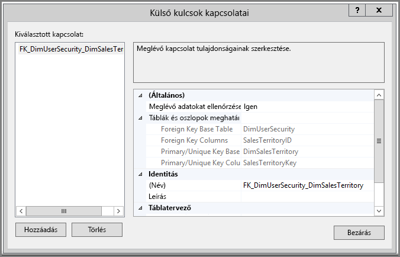
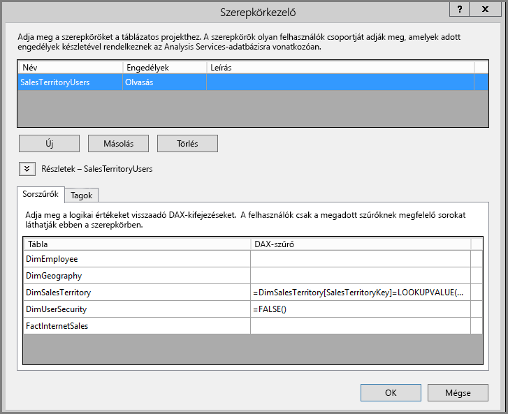
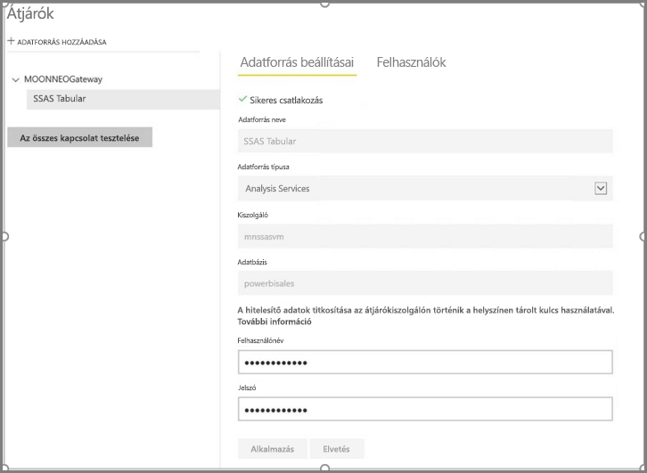
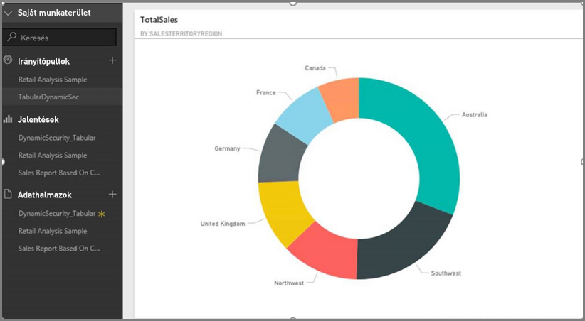

# <a name="implement-row-level-security-in-an-analysis-services-tabular-model"></a>Sorszintű biztonság megvalósítása Analysis Services-beli táblázatos modellel

Az alábbi lépéseket egy minta-adathalmazzal végrehajtva ebből az oktatóanyagból megismerheti a [**sorszintű biztonság**](../admin/service-admin-rls.md) megvalósítását egy *Analysis Services-beli táblázatos modellben*, amelyet aztán felhasználhat egy Power BI-jelentésben.

* Új táblázat létrehozása az [AdventureworksDW2012 adatbázisban](https://github.com/Microsoft/sql-server-samples/releases/tag/adventureworks)
* A táblázatos modell felépítése a szükséges tény- és dimenziótáblákkal
* Felhasználói szerepkörök és engedélyek definiálása
* A modell üzembe helyezése egy *Analysis Services-beli táblázatos* példányon
* A jelentést elérő felhasználóhoz igazított adatokat megjelenítő Power BI Desktop-jelentés készítése
* A modell üzembe helyezése a *Power BI szolgáltatáson*
* Új irányítópult létrehozása a jelentés alapján
* Az irányítópult megosztása munkatársaival

Ehhez az oktatóanyaghoz szüksége lesz az [AdventureworksDW2012 adatbázisra](https://github.com/Microsoft/sql-server-samples/releases/tag/adventureworks).

## <a name="task-1-create-the-user-security-table-and-define-data-relationship"></a>1\. feladat: A felhasználói biztonság tábla létrehozása és az adatkapcsolat meghatározása

Számos cikkben találhat leírást arról, hogy hogyan állítható be a sorszintű dinamikus biztonság az *SQL Server Analysis Services-beli (SSAS) táblázatos* modellel. Ehhez a mintához a [Dinamikus biztonság implementálása sorszűrőkkel](/analysis-services/tutorial-tabular-1200/supplemental-lesson-implement-dynamic-security-by-using-row-filters) című cikket használjuk.

Az itt ismertetett lépésekhez az AdventureworksDW2012 relációs adatbázist kell használnia.

1. Hozza létre a `DimUserSecurity` táblát az AdventureworksDW2012 adatbázisban az alább látható módon. A tábla létrehozásához használhatja az [SQL Server Management Studiót (SSMS)](/sql/ssms/download-sql-server-management-studio-ssms).

   

1. Miután létrehozta és mentette a táblát ki kell alakítania a kapcsolatot a `DimUserSecurity` tábla `SalesTerritoryID` oszlopa és a `DimSalesTerritory` tábla `SalesTerritoryKey` oszlopa között az alább látható módon.

   Az SSMS-ben kattintson a jobb gombbal a **DimUserSecurity** táblára, majd válassza a **Tervezés** menüpontot. Ez után válassza a **Táblatervező** > **Kapcsolatok...** menüpontot. Ha végzett, mentse a táblát.

   

1. Adjon felhasználókat a táblához. Kattintson a jobb gombbal a **DimUserSecurity** táblára, majd válassza az **Első 200 sor szerkesztése** menüpontot. A felhasználók felvétele utána a `DimUserSecurity` táblának az alábbi példához hasonlóan kell megjelennie:

   

   Ezekkel a felhasználókkal a későbbi feladatok során még találkozni fog.

1. A következő lépés egy *belső illesztés* létrehozása a `DimSalesTerritory` táblával, amely a felhasználóhoz társított régió részleteit mutatja. A belső illesztést az alábbi SQL-kód valósítja meg, az ábrán pedig az eredményül kapott tábla látható.

    ```sql
    select b.SalesTerritoryCountry, b.SalesTerritoryRegion, a.EmployeeID, a.FirstName, a.LastName, a.UserName from [dbo].[DimUserSecurity] as a join [dbo].[DimSalesTerritory] as b on a.[SalesTerritoryID] = b.[SalesTerritoryKey]
    ```

   Az illesztett táblában a 2. lépésben létrehozott kapcsolatnak köszönhetően látszik, hogy ki felel az egyes értékesítési régiókért. Látható például, hogy *Rita Santos* felelős *Ausztráliáért*.

## <a name="task-2-create-the-tabular-model-with-facts-and-dimension-tables"></a>2\. feladat: A táblázatos modell létrehozása a tény- és dimenziótáblákkal

Miután a relációs adattárház elérhető, meg kell határoznia a táblázatos modellt. A modellt létrehozhatja az [SQL Server Data Tools](/sql/ssdt/sql-server-data-tools) (SSDT) használatával. További információ: [Új táblázatos modellprojekt létrehozása](/sql/analysis-services/lesson-1-create-a-new-tabular-model-project).

1. Importáljon minden szükséges táblát a modellbe a lent látható módon.

    

1. A szükséges táblák importálása után meg kell határoznia egy Olvasás engedéllyel rendelkező *SalesTerritoryUsers* szerepkört. Az SQL Server Data Toolsban válassza a **Modell** menüt, majd a **Szerepkörök** lehetőséget. A **Szerepkörkezelőben** válassza az **Új** lehetőséget.

1. A **Szerepkörkezelő** **Tagok** lapján vegye fel az [1. feladatban](#task-1-create-the-user-security-table-and-define-data-relationship) a `DimUserSecurity` táblában meghatározott felhasználókat.

    

1. Ezután adja hozzá a megfelelő függvényeket a `DimSalesTerritory` és `DimUserSecurity` táblához a **Sorszűrők** lapon a képen látható módon.

    

1. A `LOOKUPVALUE` függvény annak az oszlopnak az értékeit adja vissza, amelyben a Windows-felhasználónév megegyezik a `USERNAME` függvény által visszaadottal. Ez után a lekérdezéseket leszűkítheti azokra, ahol a `LOOKUPVALUE` által visszaadott értékek megegyeznek az ebben vagy egy kapcsolódó táblában lévőkkel. A **DAX-szűrő** oszlopba írja be a következő képletet:

    ```dax
        =DimSalesTerritory[SalesTerritoryKey]=LOOKUPVALUE(DimUserSecurity[SalesTerritoryID], DimUserSecurity[UserName], USERNAME(), DimUserSecurity[SalesTerritoryID], DimSalesTerritory[SalesTerritoryKey])
    ```

    Ebben a képletben a `LOOKUPVALUE` függvény a `DimUserSecurity[SalesTerritoryID]` oszlop összes értékét visszaadja, ahol a `DimUserSecurity[UserName]` érték megegyezik a bejelentkezett Windows-felhasználó nevével, a `DimUserSecurity[SalesTerritoryID]` érték pedig a `DimSalesTerritory[SalesTerritoryKey]` értékkel.

    > [!IMPORTANT]
    > Sorszintű biztonság használatakor a [USERELATIONSHIP](/dax/userelationship-function-dax) DAX-függvény nem támogatott.

   A `DimSalesTerritory` táblában megjelenített sorok ez után a `LOOKUPVALUE` által visszaadott `SalesTerritoryKey` értékek halmaza alapján van korlátozva. Csak azok a sorok jelennek meg, ahol a `SalesTerritoryKey` értéke megtalálható a `LOOKUPVALUE` függvény által visszaadott azonosítók között.

1. A `DimUserSecurity` tábla **DAX-szűrő** oszlopába szúrja be a következő képletet:

    ```dax
        =FALSE()
    ```

    A képlet alapján minden oszlop `false` értékkel lesz feloldva, tehát a `DimUserSecurity` tábla oszlopait nem lehet lekérdezni.

Most fel kell dolgoznia és üzembe kell helyeznie a modellt. További információ: [Üzembe helyezés](/sql/analysis-services/lesson-13-deploy).

## <a name="task-3-add-data-sources-within-your-on-premises-data-gateway"></a>3\. feladat: Adatforrások hozzáadása a helyszíni adatátjáróban

Miután üzembe helyezte a táblázatos modellt, és az készen áll a használatára, egy adatforrás-kapcsolatot kell hozzáadnia a helyszíni Analysis Services-beli táblázatos kiszolgálóhoz.

1. Annak engedélyezéséhez, hogy a Power BI szolgáltatás hozzáférhessen a helyszíni elemzési szolgáltatáshoz, egy telepített és konfigurált [helyszíni adatátjáróval](service-gateway-onprem.md) kell rendelkeznie a környezetben.

1. Az átjáró helyes konfigurálása után létre kell hoznia egy adatforrás-kapcsolatot az *Analysis Services-beli* táblázatos példányhoz. További információ: [Az adatforrás kezelése – Analysis Services](service-gateway-enterprise-manage-ssas.md).

   

Ha ez az eljárás befejeződött, az átjáró konfigurálva van, és készen áll a helyszíni Analysis Services-adatforrással való kommunikációra.

## <a name="task-4-create-report-based-on-analysis-services-tabular-model-using-power-bi-desktop"></a>4\. feladat: Analysis Services-beli táblázatos modellen alapuló jelentés létrehozása a Power BI Desktop segítségével

1. Indítsa el a Power BI Desktopot, és válassza az **Adatok beolvasása** > **Adatbázis** lehetőséget.

1. Az adatforrások listájából válassza ki az **SQL Server Analysis Services-adatbázist**, majd válassza a **Kapcsolódás** elemet.

   

1. Adja meg az Analysis Services-beli táblázatos példány részleteit, és válassza az **Élő kapcsolat** lehetőséget. Ezután válassza az **OK** gombot.
  
   

   A Power BI szolgáltatással a dinamikus biztonság csak élő kapcsolat esetén működik.

1. Látható, hogy az üzembe helyezett modell az Analysis Services-példányon van. Válassza ki a megfelelő modellt, majd válassza az **OK** gombot.

   A Power BI Desktop az összes elérhető mezőt megjeleníti a vászontól jobbra található **Mezők** panelen.

1. A **Mezők** panelen jelölje ki a **SalesAmount** mértéket a **FactInternetSales** táblából, és a **SalesTerritoryRegion** dimenziót a **SalesTerritory** táblából.

1. A jelentés egyszerűsége érdekében egyelőre nem adunk hozzá több oszlopot. Az adatok kifejezőbb megjelenítéséhez módosítsa **Fánkdiagramra** a vizualizációt.

   

1. Ha elkészült a jelentés, közvetlenül közzé teheti azt a Power BI portálon. A Power BI Desktop **Kezdőlap** menüszalagján válassza a **Közzététel** lehetőséget.

## <a name="task-5-create-and-share-a-dashboard"></a>5\. feladat: Irányítópult létrehozása és megosztása

Létrehozta a jelentést, és közzétette a **Power BI** szolgáltatásban. A korábbi lépésekben létrehozott példát használva most próbára teheti a modell biztonságát.

*Értékesítési vezető* szerepkörében a Grace nevű felhasználó láthatja a különböző értékesítési régiókból származó adatokat. Grace létrehozza ezt a jelentést, és közzéteszi a Power BI szolgáltatásban. A jelentést az eddigi feladatok során már létrehoztuk.

Miután Grace közzétette a jelentést, létrehozza a jelentésen alapuló *TabularDynamicSec* nevű irányítópultot a Power BI szolgáltatásban. Figyelje meg a következő képen, hogy Grace megtekintheti az összes értékesítési régiónak megfelelő adatot.

   

Grace most megosztja az irányítópultot munkatársával, Ritával, aki az ausztráliai régióban történő értékesítésért felelős.

   

Amikor Rita bejelentkezik a Power BI szolgáltatásba, és megtekinti a Grace által létrehozott, megosztott irányítópultot, csak az ausztráliai régió értékesítéseit fogja látni.

Gratulálunk! A Power BI szolgáltatásban a helyszíni Analysis Services-beli táblázatos modellben meghatározott sorszintű biztonság van érvényben. A Power BI az `EffectiveUserName` tulajdonságot használja az aktuális Power BI-felhasználói hitelesítő adatok helyszíni adatforrásokhoz történő elküldésére, hogy azok futtassák a lekérdezéseket.

## <a name="task-6-understand-what-happens-behind-the-scenes"></a>6\. feladat: Ami a színfalak mögött történik

Ez a feladat feltételezi az [SQL Server Profiler](/sql/tools/sql-server-profiler/sql-server-profiler) ismeretét, ugyanis egy SQL Server Profiler-nyomkövetést kell rögzítenie a helyszíni SSAS-beli táblázatos példányon.

A munkamenet inicializálva lesz, amint Rita, a felhasználó eléri az irányítópultot a Power BI szolgáltatásban. Láthatja, hogy a **salesterritoryusers** szerepkör azonnal életbe lép a hatályos felhasználónévvel a következő formában: **<EffectiveUserName>rita@contoso.com</EffectiveUserName>**

       <PropertyList><Catalog>DefinedSalesTabular</Catalog><Timeout>600</Timeout><Content>SchemaData</Content><Format>Tabular</Format><AxisFormat>TupleFormat</AxisFormat><BeginRange>-1</BeginRange><EndRange>-1</EndRange><ShowHiddenCubes>false</ShowHiddenCubes><VisualMode>0</VisualMode><DbpropMsmdFlattened2>true</DbpropMsmdFlattened2><SspropInitAppName>PowerBI</SspropInitAppName><SecuredCellValue>0</SecuredCellValue><ImpactAnalysis>false</ImpactAnalysis><SQLQueryMode>Calculated</SQLQueryMode><ClientProcessID>6408</ClientProcessID><Cube>Model</Cube><ReturnCellProperties>true</ReturnCellProperties><CommitTimeout>0</CommitTimeout><ForceCommitTimeout>0</ForceCommitTimeout><ExecutionMode>Execute</ExecutionMode><RealTimeOlap>false</RealTimeOlap><MdxMissingMemberMode>Default</MdxMissingMemberMode><DisablePrefetchFacts>false</DisablePrefetchFacts><UpdateIsolationLevel>2</UpdateIsolationLevel><DbpropMsmdOptimizeResponse>0</DbpropMsmdOptimizeResponse><ResponseEncoding>Default</ResponseEncoding><DirectQueryMode>Default</DirectQueryMode><DbpropMsmdActivityID>4ea2a372-dd2f-4edd-a8ca-1b909b4165b5</DbpropMsmdActivityID><DbpropMsmdRequestID>2313cf77-b881-015d-e6da-eda9846d42db</DbpropMsmdRequestID><LocaleIdentifier>1033</LocaleIdentifier><EffectiveUserName>rita@contoso.com</EffectiveUserName></PropertyList>

A hatályos felhasználónév-kérés alapján az Analysis Services konvertálja a kérést a tényleges `contoso\rita` hitelesítő adattá a helyi Active Directory lekérdezése után. Amint az Analysis Services megkapja a hitelesítő adatokat, az Analysis Services visszaadja azokat az adatokat, amelyek megtekintésére és elérésére a felhasználó jogosult.

Ha további tevékenység észlelhető az irányítópulton, az SQL Profilerrel Ön egy, az Analysis Servicesbeli táblázatos modellhez DAX-lekérdezésként visszaérkező, erre vonatkozó lekérdezést fog látni. Ha Rita például átlép a mögöttes jelentésre az irányítópultról, az alábbi lekérdezés fut le.

   

Alább a jelentés adatainak feltöltéséhez futtatott DAX-lekérdezést is megtekintheti.
   
   ```dax
   EVALUATE
     ROW(
       "SumEmployeeKey", CALCULATE(SUM(Employee[EmployeeKey]))
     )
   
   <PropertyList xmlns="urn:schemas-microsoft-com:xml-analysis">``
             <Catalog>DefinedSalesTabular</Catalog>
             <Cube>Model</Cube>
             <SspropInitAppName>PowerBI</SspropInitAppName>
             <EffectiveUserName>rita@contoso.com</EffectiveUserName>
             <LocaleIdentifier>1033</LocaleIdentifier>
             <ClientProcessID>6408</ClientProcessID>
             <Format>Tabular</Format>
             <Content>SchemaData</Content>
             <Timeout>600</Timeout>
             <DbpropMsmdRequestID>8510d758-f07b-a025-8fb3-a0540189ff79</DbpropMsmdRequestID>
             <DbPropMsmdActivityID>f2dbe8a3-ef51-4d70-a879-5f02a502b2c3</DbPropMsmdActivityID>
             <ReturnCellProperties>true</ReturnCellProperties>
             <DbpropMsmdFlattened2>true</DbpropMsmdFlattened2>
             <DbpropMsmdActivityID>f2dbe8a3-ef51-4d70-a879-5f02a502b2c3</DbpropMsmdActivityID>
           </PropertyList>
   ```

## <a name="considerations"></a>Megfontolandó szempontok

* Helyszíni sorszintű biztonság a Power BI szolgáltatással csak élő kapcsolattal érhető el.

* A modell feldolgozása után az adatok bármely módosítása azonnal elérhetővé válik a jelentést a Power BI szolgáltatásból élő kapcsolaton keresztül elérő felhasználók számára.
