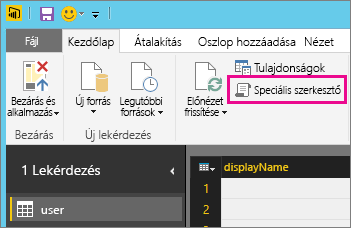

# Nem támogatott adatforrás frissítési hibáinak elhárítása
Előfordulhat, hogy hibaüzenetet tapasztal, amikor egy adatkészletet ütemezett frissítését próbálja konfigurálni.

        You cannot schedule refresh for this dataset because it gets data from sources that currently don’t support refresh.

Ez akkor fordul elő, ha a Power BI Desktopban használt adatkészlet nem támogatja a frissítést. Meg kell keresnie, hogy milyen adatforrást használ, és összevetnie az [Adatok frissítése a Power BI-ban](refresh-data.md) című cikkben található támogatott adatforrások listájával. 

## Adatforrás megkeresése
Ha nem biztos abban, hogy milyen adatforrást használt, akkor a következő lépéseket végrehajtva megkeresheti az adatforrást a Power BI Desktopban.  

1. Győződjön meg arról, hogy a Power BI Desktopban a **Report** (Jelentés) ablaktábla van megnyitva.  
   
2. A menüszalagon válassza az **Edit Queries** (Lekérdezések szerkesztése) lehetőséget.  
   
3. Válassza az **Advanded Editor** (Speciális szerkesztő) lehetőséget.  
   
4. Jegyezze fel a forrásnál látható szolgáltatót.  Ebben a példában az ActiveDirectory a szolgáltató.  
   
5. Vesse össze a szolgáltatót a [Power BI-adatforrások](power-bi-data-sources.md) című cikkben található támogatott adatforrások listájával.

> [!NOTE]
> A dinamikus adatforrásokkal kapcsolatos frissítési problémák esetén, beleértve a kézzel készített lekérdezéseket tartalmazó adatforrásokat is, lásd [a frissítéssel és a dinamikus adatforrásokkal](refresh-data.md#refresh-and-dynamic-data-sources) kapcsolatos részt.

## Következő lépések
[Adatfrissítés](refresh-data.md)  
[Power BI Gateway – Personal](service-gateway-personal-mode.md)  
[On-premises data gateway (Helyszíni adatátjáró)](service-gateway-onprem.md)  
[A Helyszíni adatátjáróval kapcsolatos hibák elhárítása](service-gateway-onprem-tshoot.md)  
[A személyes Power BI Gateway hibáinak elhárítása](service-admin-troubleshooting-power-bi-personal-gateway.md)  

További kérdései vannak? [Kérdezze meg a Power BI közösségét](https://community.powerbi.com/)
