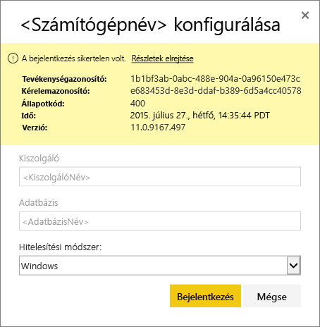
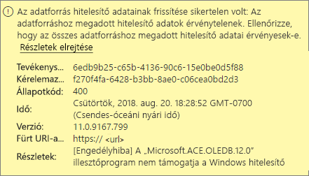
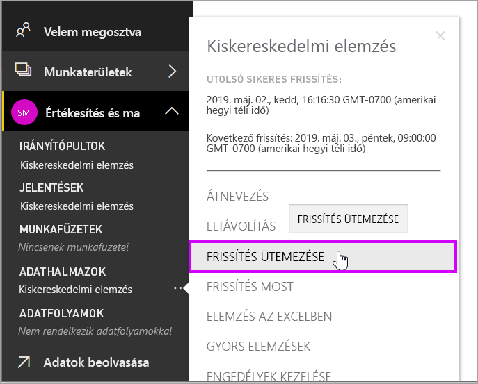
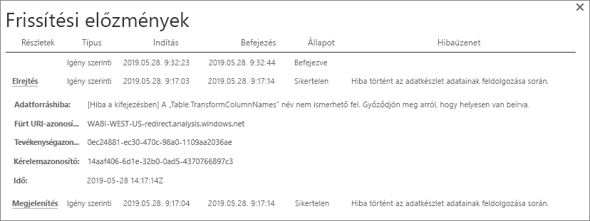
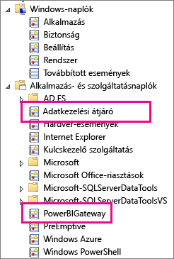
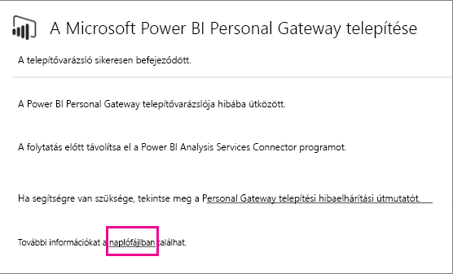

# Privát Power BI-átjáró hibáinak elhárítása

[!INCLUDE [gateway-rewrite](../includes/gateway-rewrite.md)]

A következő szakaszokban áttekintünk néhány a privát helyszíni Power BI-adatátjáró használata kapcsán felmerülő kérdést.

## Frissítés a legújabb verzióra

Az átjáró aktuális, személyes használatú verziója a privát helyszíni adatátjáró. A telepített példányt frissítve térjen át erre a verzióra.

Elavult verziójú átjáró használatakor számos probléma merülhet fel. Általában véve célszerű mindig a legújabb verziót használni. Ha az átjárót már legalább egy hónapja nem frissítette, ajánlott telepíteni az átjáró legújabb verzióját. Ez után nézze meg, hogy jelentkezik-e ugyanaz a probléma.

## Telepítés
**A privát átjáró 64 bites verziókon működik:** Ha az Ön számítógépe 32 bites, nem tudja telepíteni a privát átjárót. Az operációs rendszernek 64 bitesnek kell lennie. Telepítse a Windows 64 bites verzióját, vagy telepítse 64 bites számítógépre a privát átjárót.

**A privát átjárót a számítógép helyi rendszergazdájaként sem tudja szolgáltatásként telepíteni:** A telepítés meghiúsulhat, ha a felhasználó a helyi Rendszergazdák csoport tagja a számítógépen, de a csoportszabályzat nem engedélyezi, hogy ez a felhasználónév szolgáltatásként jelentkezzen be. Ellenőrizze, hogy a csoportszabályzat lehetővé teszi-e, hogy a felhasználó szolgáltatásként jelentkezzen be. Ennek a problémának a javításán még dolgozunk. További információ: [Bejelentkezés szolgáltatásként jogosultság fiókhoz rendelése](https://technet.microsoft.com/library/cc739424.aspx).

**A művelet túllépte az időkorlátot:** Ez az üzenet gyakran megjelenik, ha a számítógép (fizikai vagy virtuális gép), amelyre a privát átjárót telepíti, egymagos processzorral rendelkezik. Zárja be az alkalmazásokat, állítsa le azokat a folyamatokat, melyek nem nélkülözhetetlenek, és próbálja meg újra telepíteni az átjárót.

**Adatkezelési átjáró vagy Analysis Services-összekötő nem telepíthető privát átjáróval azonos számítógépre:** Ha már telepített Analysis Services-összekötőt vagy adatkezelési átjárót, akkor azt először el kell távolítania. Ez után próbálja meg újra telepíteni a privát átjárót.

> [!NOTE]
> Ha a telepítés során problémát észlel, a telepítési napló valószínűleg tartalmaz olyan információt, amely segít megoldani a kérdést. Ezzel kapcsolatban a [telepítési naplókról](#SetupLogs) szóló részben talál további információkat.
> 
> 

 **Proxy-konfiguráció:** Ha olyan környezetet használ, amelyben szükség van proxy használatára, problémák jelentkezhetnek a privát átjáró konfigurálásakor. Ha további információkra van szüksége a proxyadatok konfigurálásával kapcsolatban, tekintse át a [helyszíni adatátjáró proxybeállításainak konfigurálásáról](/data-integration/gateway/service-gateway-proxy) szóló cikket.

## Frissítés ütemezése
**Hiba: The credential stored in the cloud is missing. (A felhőben tárolt hitelesítő adat hiányzik.)**

Ilyen hiba az \<adathalmazok\> beállításainál jelentkezhet, ha az adathalmazhoz korábban megadott ütemezett frissítést, majd eltávolította és újratelepítette a privát átjárót. A privát átjáró eltávolításakor a rendszer eltávolítja az adathalmazok frissítéshez szükséges adatforrás-hitelesítési adatokat a Power BI szolgáltatásból.

**Megoldás:** A Power BI-ban lépjen az adatkészletre vonatkozó beállítások frissítéséhez. Az **Adatforrások kezelése** területen mindegyik hibás adatforrásnál válassza a **Hitelesítő adatok szerkesztése** lehetőséget, majd jelentkezzen be ismét az adatforrásra. Ez után jelentkezzen be újra az adatforrásba.

**Hiba: The credentials provided for the dataset are invalid. (Az adatkészlethez megadott hitelesítő adatok érvénytelenek.) A folytatáshoz először frissítse a hitelesítő adatokat a lap frissítésével vagy az Adatforrás beállításai párbeszédpanelen.**

**Megoldás:** Ha a hitelesítő adatokkal kapcsolatos üzenet jelenik meg, az a következőket jelentheti:

* Az adatforrásokba történő bejelentkezéshez használt felhasználói nevek és jelszavak nem naprakészek. A Power BI-ban lépjen az adatkészlet beállításainak frissítéséhez. Az **Adatforrások kezelése** területen válassza az adatforrás melletti **Hitelesítő adatok szerkesztése** lehetőséget, majd frissítse az adatforráshoz tartozó hitelesítő adatokat.
* Egy felhőbeli forrás és egy helyi forrás egyesített lekérdezése a privát átjárón keresztül nem frissíthető, ha bármelyik forrás OAuth eljárást használ a hitelesítéshez. Ilyen problémával jár például a CRM Online és egy helyi SQL Server-példány egyesítése is. Ebben az esetben az egyesítés azért nem fog sikerülni, mert a CRM Online OAuth-hitelesítést igényel.
  
  Ez a hiba ismert probléma, már foglalkozunk vele. A probléma úgy kerülhető meg, hogy külön lekérdezést használ a felhőbeli forráshoz és a helyszíni adatforráshoz. Ezt követően összefésüléssel vagy összefűzéssel egyesíti az eredményeket.

**Hiba: Unsupported data source. (Nem támogatott adatforrás.)**

**Megoldás:** Ha nem támogatott adatforrásról tájékoztató üzenetet kap a **Frissítések ütemezése** közben, az a következőket jelentheti: 

* Jelenleg Power BI-ban nem támogatott az adatforrás frissítése. 
* Az Excel-munkafüzet nem tartalmaz adatmodellt, csak munkafüzet adatokat. A Power BI jelenleg csak akkor támogatja a frissítést, ha a feltöltött Excel-munkafüzet tartalmaz adatmodellt. Ha az Excelbe a Power Query-t használva importál adatokat, válassza a **Betöltés** lehetőséget az adatok adatmodellbe való betöltéséhez. Ez a lehetőség biztosítja, hogy az adatokat egy adatmodellbe importálja a rendszer. 

**Hiba: [Az adatok nem kombinálhatók] a &lt;lekérdezés rész&gt;/&lt;... &gt;/&lt;... &gt; olyan adatforrásokhoz próbál hozzáférni, melyek különböző adatvédelmi szintjei együtt nem használhatók. Kérjük, építse újra az adategyesítést.**

**Megoldás:** Ezt a hibát az adatvédelmi szintekre vonatkozó korlátozások és az Ön által használt adatforrástípusok okozzák.

**Hiba: Adatforráshiba: We cannot convert the value "\[Table\]" to type Table. (Adatforrás-hiba: A [Tábla] érték nem konvertálható a következő típusra: Tábla.)**

**Megoldás:** Ezt a hibát az adatvédelmi szintekre vonatkozó korlátozások és az Ön által használt adatforrástípusok okozzák.

**Hiba: Nincs elegendő szabad terület ehhez a sorhoz.**

**Megoldás:** Ez a hiba akkor fordul elő, ha egyetlen sor mérete nagyobb 4 MB-nál. Keresse meg az adatforrás érintett sorát, és kísérelje meg kiszűrni vagy csökkenteni a méretét.

## Adatforrások
**Hiányzó adatszolgáltató:** A privát átjáró csak 64 bites verziókon működik. Működéséhez arra van szükség, hogy a számítógépre, amelyen a privát átjáró üzemel, telepítve legyen az adatszolgáltató 64 bites verziója. Például, ha az adatkészletben szereplő adatforrás Microsoft Access típusú, telepítenie kell a 64 bites ACE-szolgáltatót arra a számítógépre, amelyen a privát átjáró is fut. 

>[!NOTE]
>Ha 32 bites Excellel rendelkezik, nem fog tudni 64 bites ACE-szolgáltatót telepíteni a gépre.

**Access-adatbázishoz nem támogatott a Windows-hitelesítés:** Access-adatbázisokhoz a Power BI jelenleg csak a névtelen hitelesítést támogatja.

**Hiba: Bejelentkezési hiba az adatforrásbeli hitelesítő adatok megadásakor:** Amikor megadja a Windowsos hitelesítő adatokat egy adatforráshoz, az alábbihoz hasonló hiba léphet fel: 

  

Lehetséges, hogy még mindig a privát átjáró egy régebbi verzióját használja. 

**Megoldás:** További információ: [A privát Power BI-átjáró legújabb verziójának telepítése](https://powerbi.microsoft.com/gateway/).

**Hiba: Bejelentkezési hiba a Windows-hitelesítés kiválasztásakor ACE OLEDB-t használó adatforrásnál:** ACE OLEDB szolgáltatót használó adatforrás esetén az alábbi hiba léphet fel az adatforrásbeli hitelesítő adatok megadásakor:

A Power BI jelenleg nem támogatja a Windows-hitelesítést ACE OLEDB szolgáltatót használó adatforrások esetén.

**Megoldás:** A hiba elkerülése érdekében válassza a **Névtelen hitelesítést**. A hagyományos ACE OLEDB szolgáltatók esetén a Névtelen hitelesítő adatok megegyeznek a Windows-hitelesítő adatokkal.

## Csempefrissítés
Ha irányítópult-csempék frissítésekor kap hibaüzenetet, a [Csempék hibaelhárítása](refresh-troubleshooting-tile-errors.md) című dokumentum nyújthat segítséget.

## Hibaelhárítási eszközök
### Frissítési előzmények
A **Frissítési előzmények** segítségével áttekintheti az előfordult hibákat, és hasznos adatokat találhat arra az esetre, ha a támogatást nyújtó ügyfélszolgálathoz kellene fordulnia. Itt az ütemezett és az igény szerinti frissítéseket is láthatja. A **Frissítési előzmények** oldalra az alábbiak szerint juthat el.

1. A Power BI navigációs paneljének **Adathalmazok** területén válasszon ki egy adathalmazt. Nyissa meg a menüt, majd válassza a **Frissítés ütemezése** lehetőséget.

   
1. A **Beállítások:...** területem válassza a **Frissítési előzmények** lehetőséget. 

   
   
   

### Eseménynaplók
Több eseménynapló is nyújthat információkat. Az első kettőt, a **Data Management Gateway** (Adatkezelési átjáró) és a **PowerBIGateway** (PowerBI átjáró) naplókat akkor láthatja, ha Ön rendszergazda a számítógépen. Ha ön nem rendszergazda, és a privát adatátjárót használja, a naplóbejegyzéseket az **Alkalmazásnaplóban** tudja megtekinteni.

A **Data Management Gateway** (Adatkezelési átjáró) és **PowerBIGateway** naplók az **Alkalmazás- és szolgáltatásnaplók** között találhatók.

### Nyomon követés a Fiddlerrel
A [Fiddler](https://www.telerik.com/fiddler) a Telerik ingyenes eszköze, amely a HTTP-adatforgalom figyelésére használható. Nyomon követheti a Power BI szolgáltatás és az ügyfélszámítógép közötti kommunikációt. A kommunikációban hibaüzenetek és egyéb, kapcsolódó információk is megjelenhetnek.

### Telepítési naplók
Ha a privát átjárót nem tudja telepíteni, megjelenik egy hivatkozás, melynek segítségével megjelenítheti a telepítési naplót. A telepítési naplóban további információkat talál a hibával kapcsolatban. Ezek naplók windowsos telepítési naplók, más néven MSI-naplók. Ezek a bejegyzések meglehetősen összetettek és nehezen olvashatók. A hiba rendszerint alul olvasható, ugyanakkor a hiba okát nem egyszerű megállapítani. Ez lehet egy másik naplóban található hibák következménye. Lehet a napló magasabb szintjén szereplő egyik hiba eredménye is.

Másik lehetőségként megnyithatja a Temp mappát (%temp%), és megkeresheti a *Power\_BI\_* sztringgel kezdődő fájlokat.

> [!NOTE]
> Elképzelhető, hogy a %temp% használatával a Temp mappa egyik almappájába kerül. A *Power\_BI\_* fájlok a Temp mappa gyökerében találhatók. Ehhez esetleg egy vagy két szinttel feljebb kell lépnie.
> 
> 

## Következő lépések
- [Helyszíni adatátjáró proxybeállításainak konfigurálása](/data-integration/gateway/service-gateway-proxy)- [Adatfrissítés](refresh-data.md)  
- [Privát Power BI-átjáró](service-gateway-personal-mode.md)  
- [Csempékkel kapcsolatos hibák elhárítása](refresh-troubleshooting-tile-errors.md)  
- [A helyszíni átjáró hibaelhárítása](service-gateway-onprem-tshoot.md) 
 
További kérdései vannak? Forduljon a [Power BI közösségéhez](https://community.powerbi.com/).
