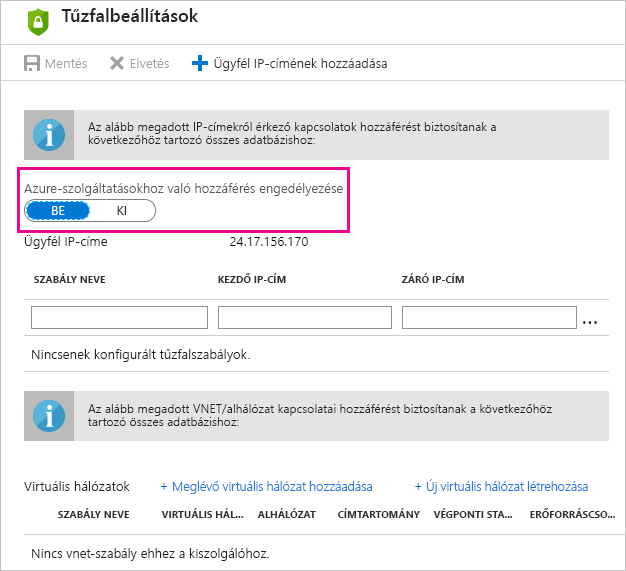

# Az Azure SQL Database ütemezett frissítésének hibaelhárítása a Power BI-ban

A frissítésről az [Adatfrissítés a Power BI-ban](refresh-data.md) és az [Ütemezett frissítés konfigurálása](refresh-scheduled-refresh.md) című cikkekben talál részletes információkat.

Amikor ütemezett frissítést hoz létre egy Azure SQL-adatbázishoz, és 400-as kódú hibaüzenetet kap a hitelesítő adatok szerkesztésekor, a következő módon állíthatja be a megfelelő tűzfalszabályt:

1. Jelentkezzen be az [Azure Portal](https://portal.azure.com) webhelyre.

1. Nyissa meg azt az Azure SQL-adatbázist, amelyhez a frissítést konfigurálja.

1. Az **Áttekintés** panel felső részén válassza a **Kiszolgálói tűzfal beállítása**.

1. A **Tűzfalbeállítások** panelen ellenőrizze, hogy **BE** van-e kapcsolva az **Azure-szolgáltatásokhoz való hozzáférés engedélyezése**.

      

Több kérdése van? [Kérdezze meg a Power BI közösségét](https://community.powerbi.com/)
