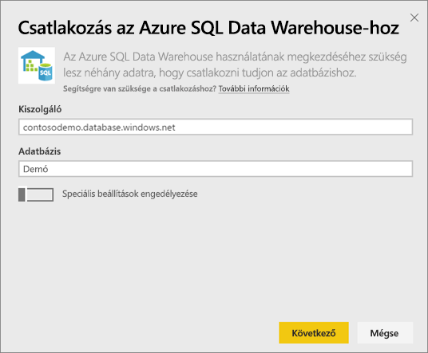
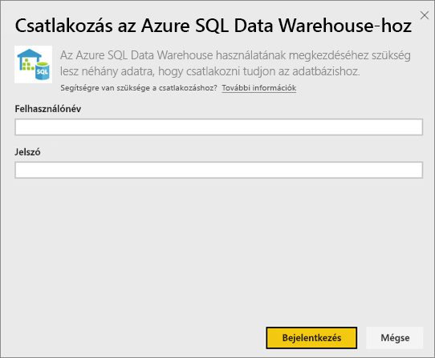
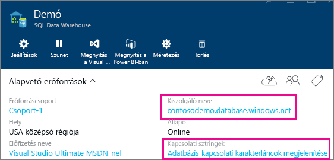

# Az Azure SQL Data Warehouse DirectQueryvel

Ha DirectQueryvel csatlakozik az Azure SQL Data Warehouse-hoz, dinamikus jelentéseket hozhat létre az Azure SQL Data Warehouse-ban tárolt adatokat és metrikákat használva. DirectQuery használata esetén a rendszer valós idejű lekérdezéseket küld az Azure SQL Data Warehouse-ba az adatok feltárásakor. A valós idejű lekérdezések és az SQL Data Warehouse mérete lehetővé teszi, hogy percek alatt létrehozzon dinamikus jelentéseket akár több terabájtnyi adatból is. Ezenkívül a **Megnyitás Power BI-ban** gomb lehetővé teszi, hogy a felhasználók közvetlenül is csatlakoztathassák a Power BI-t az SQL Data Warehouse-hoz anélkül, hogy külön be kellene írniuk az ehhez szükséges információt.

Az SQL Data Warehouse-összekötő használatakor:

* A kapcsolódáskor a teljes szervernevet adja meg (részletes információkat lejjebb talál)
* Győződjön meg arról, hogy a kiszolgálóra vonatkozó tűzfalszabályok között konfigurálva van az „Azure-szolgáltatások hozzáférésének engedélyezése”
* A rendszer minden olyan művelet végrehajtásakor, mint amilyen például az oszlopok vagy szűrők felvétele, közvetlenül az adattárházat kérdezi le
* A csempéket körülbelül 15 percenként frissíti. A frissítést nem szükséges ütemezni.  A frissítésen a csatlakozáskor lehet módosítani, a Speciális beállítások között.
* A Q&A nem érhető el a DirectQuery-adatkészletek esetén.
* A rendszer nem követi automatikusan a sémák változásait.

Ezek a korlátozások és figyelmeztetések a felhasználói felületek fejlesztésével változhatnak. Alább láthatók a kapcsolódás lépéseinek részletei.

## A „Megnyitás Power BI-ban” gomb használata

> [!Important]
> Továbbfejlesztettük az Azure SQL Data Warehouse-kapcsolódást.  Az Azure SQL Data Warehouse-beli adatforráshoz való kapcsolódás leghatékonyabb módja a Power BI Desktop használata.  Miután elkészítette a modellt és a jelentést, közzéteheti a Power BI szolgáltatásban.  Az Azure SQL Data Warehouse-nak a Power BI szolgáltatásban használt közvetlen összekötője elavult.

Az SQL Data Warehouse és a Power BI között a legegyszerűbben az Azure Portalon elérhető **Megnyitás Power BI-ban** gombot használva mozoghat. Ez a gomb lehetővé teszi, hogy fennakadások nélkül kezdhessen új irányítópultokat létrehozni a Power BI-t használva.

1. Kiindulásképpen lépjen az SQL Data Warehouse-példányhoz az Azure Portalon. Megjegyzendő, hogy az SQL Data Warehouse jelenleg csak az Azure Portalon található meg.

2. Kattintson a **Megnyitás Power BI-ban** gombra

    

3. Ha a rendszer nem tudja közvetlenül beléptetni, vagy nem rendelkezik Power BI-fiókkal, akkor be kell jelentkeznie.

4. Ezután az SQL Data Warehouse kapcsolódási oldalára kerül, ahol a különböző mezők már ki lesznek töltve az SQL Data Warehouse adataival. Adja meg hitelesítő adatait, majd a kapcsolat létrehozásához kattintson a Kapcsolódás lehetőségre.

## Kapcsolódás Power BI-jal

Az SQL Data Warehouse a Power BI Adatok lekérése oldaláról is elérhető. 

1. Kattintson az **Adatok lekérése** elemre a navigációs panel alján.  

    

2. Az **Adatbázisok** csempén kattintson a **Beolvasás** lehetőségre.

    

3. Válassza az **SQL Data Warehouse** \> **Csatlakozás** lehetőséget.

    

4. Adja meg a kapcsolódáshoz szükséges információkat. A **Paraméterek megkeresése** szakaszban olvashat arról, hol találja meg a szükséges adatokat az Azure Portalon.

    

    

    

   > [!NOTE]
   > A felhasználónévnek az Azure SQL Data Warehouse-példányhoz definiált egyik felhasználó nevének kell lennie.

5. Az új csempére vagy a csillaggal jelölt újonnan létrehozott adatkészletre kattintva kezdje meg az adatkészlet feltárását. Az adatkészlet neve meg fog egyezni az adatbázis nevével.

    

6. Ön mindegyik táblát és oszlopot feltárhatja. Amikor kiválaszt egy oszlopot, a rendszer egy lekérdezést küld az adatforráshoz, és dinamikusan létrehozza a vizualizációt. A szűrőket szintén az adattárházba küldött lekérdezésekké alakítja a rendszer. Ezek a vizualizációk menthetők egy új jelentésbe, és kitűzhetők az irányítópultra.

    

## Paraméterértékek megkeresése

A teljes kiszolgálónevet és adatbázisnevet az Azure Portalon találhatja meg. Megjegyzendő, hogy az SQL Data Warehouse jelenleg csak az Azure Portalon található meg.

> [!NOTE]
> Ha a Power BI-bérlője ugyanabban a régióban található, mint az Azure SQL Data Warehouse, akkor nem kell kimenő forgalmi díjat fizetnie. A Power BI-bérlője helyének ellenőrzéséhez [kövesse ezeket az utasításokat](https://docs.microsoft.com/power-bi/service-admin-where-is-my-tenant-located).

[!INCLUDE [direct-query-sso](../includes/direct-query-sso.md)]

## Következő lépések

* [Mi az a Power BI?](../fundamentals/power-bi-overview.md)  
* [Power BI – Adatok lekérése](service-get-data.md)  
* [Az Azure SQL Data Warehouse](/azure/sql-data-warehouse/sql-data-warehouse-overview-what-is/)

További kérdései vannak? [Kérdezze meg a Power BI közösségét](https://community.powerbi.com/)
