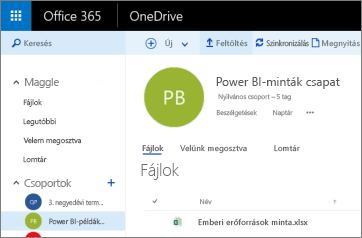
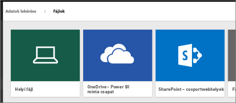
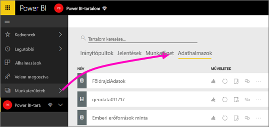
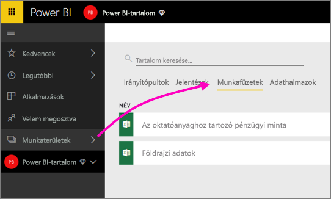

# Csatlakozás a Power BI-munkaterülethez tartozó OneDrive-ban tárolt fájlokhoz
Miután [létrehozott egy munkaterületet a Power BI-ban](../collaborate-share/service-create-distribute-apps.md), a Power BI-munkaterülethez tartozó OneDrive Vállalati verzióban tárolhatja az Excel-, CSV- és Power BI Desktop-fájlokat. A OneDrive-ban tárolt fájljait továbbra is frissítheti. A frissítések automatikusan megjelennek a fájlokon alapuló Power BI-jelentésekben és irányítópultokon. 

> [!NOTE]
> Az új felhasználói felületű munkaterületen megváltozik a Power BI-munkaterületek és az Office 365-csoportok közötti kapcsolat. A rendszer nem hoz automatikusan létre Office 365-csoportokat minden alkalommal, amikor egy új munkaterület jön létre. Tudnivalók [az új munkaterületek létrehozásáról](../collaborate-share/service-create-the-new-workspaces.md)

A fájlokat két lépésben adhatja hozzá a munkaterülethez: 

1. Az első lépésben [töltse fel a fájlokat a OneDrive Vállalati verzióba](service-connect-to-files-in-app-workspace-onedrive-for-business.md#1-upload-files-to-the-onedrive-for-business-for-your-workspace), amely a munkaterülethez tartozik.
2. A második lépésben [csatlakozzon a fájlokhoz a Power BI-ból](service-connect-to-files-in-app-workspace-onedrive-for-business.md#2-import-excel-files-as-datasets-or-as-excel-online-workbooks).

> [!NOTE]
> A munkaterületek csak a [Power BI Próban](../fundamentals/service-features-license-type.md) érhetők el.
> 

## 1 Fájlok feltöltése a munkaterülethez tartozó OneDrive Vállalati verzióba
1. A Power BI szolgáltatásban válassza a Munkaterületek elem melletti nyilat, majd a munkaterület neve melletti három pontot ( **...** ). 
   
   
2. Válassza a **Fájlok** elemet a munkaterülethez tartozó OneDrive Vállalati verzió Office 365-ben való megnyitásához.
   
   > [!NOTE]
   > Ha a munkaterület menüjében nem jelenik meg a **Fájlok** lehetőség, a munkaterülethez tartozó OneDrive Vállalati verzió megnyitásához kattintson a **Tagok** lehetőségre. Itt kattintson a **Fájlok** elemre. Az Office 365 beállít egy OneDrive-tárhelyet az alkalmazás csoportos munkaterületének fájljai számára. Ez a folyamat hosszabb időbe telhet. 
   > 
   > 
3. Itt feltöltheti a fájlokat a munkaterülethez tartozó OneDrive Vállalati verzióba. Kattintson a **Feltöltés** elemre, és keresse meg a fájlokat.
   
   

## 2 Excel-fájlok importálása adatkészletek vagy Excel Online-munkafüzetek formájában
Miután a fájlok bekerültek a munkaterülethez tartozó OneDrive Vállalati verzióba, kétféleképpen dönthet. A következőket teheti: 

* [Adatkészletként importálhatja az adatokat az Excel-munkafüzetből](service-get-data-from-files.md). Használatukkal jelentéseket és irányítópultokat hozhat létre, amelyeket webböngészőben vagy mobileszközökön tekinthet meg.
* Vagy [csatlakozhat egy teljes Excel-munkafüzethez a Power BI-ban](service-excel-workbook-files.md), és pontosan olyan formában jelenítheti meg, ahogy az Excel Online-ban látható.

### Fájlok importálása vagy csatlakozás hozzájuk a munkaterületen
1. A Power BI-ban váltson a munkaterületre; ekkor megjelenik a munkaterület neve a bal felső sarokban. 
2. Kattintson az **Adatok lekérése** elemre a navigációs panel alján. 
   
   
3. A **Fájlok** mezőben válassza a **Beolvasás** lehetőséget.
   
   
4. Válassza a **OneDrive** - *Munkaterület neve* lehetőséget.
   
    
5. Válassza ki a kívánt fájlt > **Csatlakozás**.
   
    Itt döntheti el, hogy [importálja az adatokat az Excel-munkafüzetből](service-get-data-from-files.md), vagy [teljes Excel-munkafüzetekhez csatlakozik](service-excel-workbook-files.md).
6. Válassza az **Importálás** vagy a **Csatlakozás** lehetőséget.
   
    
7. Ha az **Importálás** lehetőséget választja, akkor a munkafüzet az **Adatkészletek** lapon jelenik meg. 
   
    
   
    Ha a **Csatlakozás** lehetőséget választja, akkor a munkafüzet a **Munkafüzetek** lapon jelenik meg.
   
    

## További lépések
* [Alkalmazások és munkaterületek létrehozása a Power BI-ban](../collaborate-share/service-create-distribute-apps.md)
* [Adatok importálása Excel-munkafüzetekből](service-get-data-from-files.md)
* [Csatlakozás teljes Excel-munkafüzetekhez](service-excel-workbook-files.md)
* Több kérdése van? [Kérdezze meg a Power BI közösségét](https://community.powerbi.com/)
* Visszajelzést szeretne küldeni? Keresse fel a [Power BI Ideas](https://ideas.powerbi.com/forums/265200-power-bi) fórumot.
