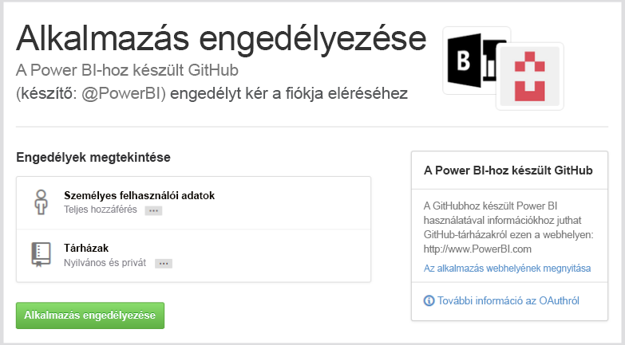
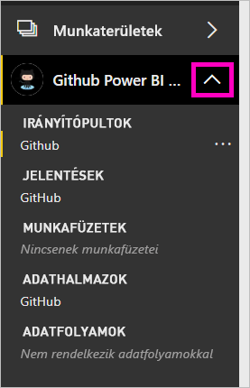
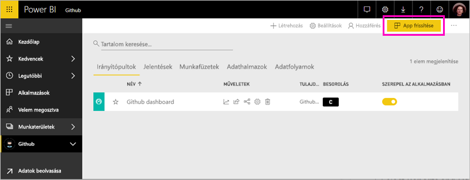

# Csatlakozás a GitHubhoz a Power BI használatával
Ez a cikk bemutatja, hogyan kérhet le adatokat a GitHub-fiókjáról egy Power BI-sablonalkalmazással. A sablonalkalmazás egy irányítópulttal, több jelentéssel, és egy adathalmazzal rendelkező munkaterületet, amely segítségével elemezheti és megismerheti a GitHub-adatokat. A Power BI-hoz készült GitHub alkalmazással betekintést nyerhet GitHub-adattárakba, amelyek hozzájárulásokra, problémákra, lekéréses kérelmekre és aktív felhasználókra vonatkozó adatokat tartalmaznak.

A sablonalkalmazás telepítése után módosíthatja az irányítópultot és a jelentést. Ezután alkalmazásként terjesztheti a szervezeti munkatársai között.

Csatlakozzon a [GitHub-sablonalkalmazáshoz](https://app.powerbi.com/groups/me/getapps/services/pbi-contentpacks.pbiapps-github), vagy olvasson még arról, hogy miképpen jön létre [a GitHub integrációja](https://powerbi.microsoft.com/integrations/github) a Power BI szolgáltatással.

Kipróbálhatja a [GitHub-oktatóanyagot](service-tutorial-connect-to-github.md)is. Ez valós, a Power BI-dokumentáció nyilvános adattárairól szóló GitHub-adatokat telepít.

>[!NOTE]
>A sablonalkalmazás használatához a GitHub-fióknak hozzá kell férnie az adattárhoz. A követelményekről alább talál további információkat.
>
>Ez a sablonalkalmazás nem támogatja a GitHub Enterprise-t. 

## Csatlakozás
[!INCLUDE [powerbi-service-apps-get-more-apps](../includes/powerbi-service-apps-get-more-apps.md)]
   
3. Válassza a **GitHub** \> **Letöltés most** lehetőséget.
4. A **Telepíti ezt a Power BI-alkalmazást?** területen válassza a **Telepítés** lehetőséget.
4. Az **Alkalmazások** területen válassza a **GitHub** csempét.

    

6. **Az új alkalmazás használatának első lépései** résznél válassza az **Csatlakozás** lehetőséget.

    

5. Adja meg az adattár nevét és tulajdonosát. A [paraméterek fellelhetőségével](#FindingParams) kapcsolatos információt lásd alább.
   
    

5. Adja meg a GitHub-hitelesítő adatait. (Ha már bejelentkezett a böngészőjében, akkor lehet, hogy ez a lépés kimarad). 
6. A **Hitelesítési módszer** értékeként válassza az **oAuth2** lehetőséget \> **Bejelentkezés**. 
7. Kövesse a GitHub-hitelesítés lépéseit. Engedélyezze a hozzáférést a Power BI-hoz készült GitHub-sablonalkalmazás részére a GitHub-adatokhoz.
   
   
   
    A Power BI csatlakozik a GitHubhoz és az adataihoz.  Az adatok naponta egyszer frissülnek. Miután a Power BI importálta az adatokat, megjelenik az új GitHub-munkaterület tartalma.

## Az alkalmazás módosítása és terjesztése

Telepítette a GitHub-sablonalkalmazást. Ez azt jelenti, hogy létrehozta a GitHub-munkaterületet is. A munkaterületen módosíthatja a jelentést és az irányítópultot, majd *alkalmazásként* terjesztheti azt a szervezet munkatársainak. 

1. Kattintson a munkaterület neve melletti nyílra a navigációs panelen. Láthatja, hogy a munkaterület egy irányítópultot és egy jelentést tartalmaz.

    

8. Válassza ki az új [GitHub-irányítópultot](https://powerbi.microsoft.com/integrations/github).    
    

3. Az új GitHub-munkaterület tartalmának megtekintéséhez a navigációs ablaktáblán válassza a **Munkaterületek** > **GitHub** lehetőséget.
 
   

    Ez a nézet a munkaterület tartalomlistája. A jobb felső sarokban látható az **App frissítése** elem. Ha készen áll terjeszteni az alkalmazást a munkatársainak, nekiláthat. 

    

2. Válassza a **Jelentések** és az **Adatkészletek** lehetőséget a munkaterület egyéb elemeinek megtekintéséhez.

    További információ az [alkalmazások terjesztéséről](../collaborate-share/service-create-distribute-apps.md).

## Az alkalmazás tartalma
A GitHubból az alábbi adatok érhetők el a Power BI szolgáltatásban:     

| Table name (Táblázat neve) | Description (Leírás) |
| --- | --- |
| Közreműködések |A hozzájárulások táblázata a hozzájárulóktól származó összes kiegészítést, törlést és véglegesítést tartalmazza heti összesítésben. A táblázatban az első 100 hozzájáruló szerepel. |
| Issues (Problémák) |Listázza a kijelölt adattárban szereplő összes problémát, továbbá olyan adatokat, mint a problémák megoldására fordított összes és átlagos idő, az összes nyitott probléma és az összes megoldott probléma. A táblázat üres, ha nincsenek problémák az adattárban. |
| Pull requests (Lekéréses kérelmek) |Ebben a táblázatban szerepel az adattár összes lekéréses kérelme és a kérelmezők neve. Számított adatokat is tartalmaz, mint például a nyitott és a lezárt lekéréses kérelmek száma, az összes lekéréses kérelem, az egyes kérelmek lekéréséhez szükséges idő és az átlagos kérelemlekérési idő. A táblázat üres, ha nincsenek problémák az adattárban. |
| Felhasználók |Ez a táblázat azokat a GitHub-felhasználókat és -közreműködőket tartalmazza, akik közreműködtek, vagy lekéréses kérelmeket iktattak vagy oldottak meg a kiválasztott adattárban. |
| Milestones (Mérföldkövek) |A kiválasztott adattár összes mérföldkövét tartalmazza. |
| DateTable (Dátumtáblázat) |Ez a táblázat a mai dátumtól kezdve akár több évre is visszamenőleg tartalmazza a dátumokat, amelyek segítségével dátum szerint elemezheti GitHub-adatait. |
| ContributionPunchCard (Közreműködői pontgyűjtés) |Ez a táblázat közreműködők pontgyűjtésének vezetésére használatható a kijelölt adattárban. A hozzájárulásokat nap és időpont szerint jeleníti meg. Ez a tábla nem kapcsolódik a modell többi táblájához. |
| RepoDetails (Adattár adatai) |Ez a táblázat a kiválasztott adattár adatait tartalmazza. |

## System requirements (Rendszerkövetelmények)
* A GitHub-fiók, amely hozzáfér az adattárhoz.  
* Engedély megadása a GitHubhoz készült Power BI alkalmazásnak az első bejelentkezéskor. Az engedély visszavonásának módját alább találja.  
* Elegendő API-hívás az adatok lekéréséhez és frissítéséhez.
>[!NOTE]
>Ez a sablonalkalmazás nem támogatja a GitHub Enterprise-t.

### A Power BI engedélyének visszavonása
Ha vissza szeretné vonni a Power BI-nak a GitHub-adattár elérésére kiadott engedélyt, ezt a GitHubban teheti meg. További információt ebben a [GitHub súgótémakörben](https://help.github.com/articles/keeping-your-ssh-keys-and-application-access-tokens-safe/#reviewing-your-authorized-applications-oauth) talál.

## Paraméterek helye
A tulajdonos és az adattár közvetlenül az adattárból állapítható meg a GitHubban:

Az első rész, az „Azure” a tulajdonos, a második rész, az „azure-sdk-for-php” pedig maga az adattár.  Ugyanez a két elem megtalálható az adattár URL-jében is:

    <https://github.com/Azure/azure-sdk-for-php> .

## Hibaelhárítás
Ha szükséges, ellenőrizheti a GitHub-hitelesítő adatait.  

1. Egy másik böngészőablakban navigáljon a GitHub weboldalára, és jelentkezzen be. Ha bejelentkezett, azt a GitHub oldalának jobb felső sarkában láthatja.    
2. A GitHub webhelyen navigáljon annak az adattárnak az URL-címére, amelyet el kíván érni a Power BI-ból. Példa: https://github.com/dotnet/corefx.  
3. A Power BI-ba visszatérve próbáljon csatlakozni a GitHubhoz. A GitHub beállítása párbeszédpanelen adja meg a szóban forgó adattár nevét és tulajdonosát.  

## Következő lépések

* [Oktatóanyag: Csatlakozás GitHub-adattárhoz a Power BI segítségével](service-tutorial-connect-to-github.md)
* [Új munkaterületek létrehozása a Power BI-ban](../collaborate-share/service-create-the-new-workspaces.md)
* [Alkalmazások telepítése és használata a Power BI-ban](../consumer/end-user-apps.md)
* [Csatlakozás külső szolgáltatások Power BI-alkalmazásaihoz](service-connect-to-services.md)
* Kérdése van? [Kérdezze meg a Power BI közösségét](https://community.powerbi.com/)
