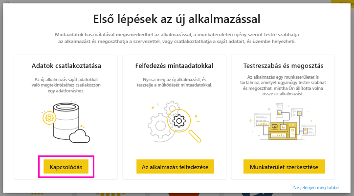

# Kapcsolódás a Smartsheethez a Power BI-jal
Ez a cikk részletesen bemutatja, hogyan kérhet le adatokat a Smartsheet-fiókjából egy Power BI-sablonalkalmazással. A Smartsheet könnyen használható platformot kínál az együttműködéshez és fájlmegosztáshoz. A Power BI-hoz készült Smartsheet-sablonalkalmazás a Smartsheet-fiók áttekintését biztosító irányítópultot, jelentéseket és adathalmazt nyújt. A fiók egyes lapjaihoz közvetlenül is kapcsolódhat a [Power BI Desktop](desktop-connect-to-data.md) használatával. 

A sablonalkalmazás telepítése után módosíthatja az irányítópultot és a jelentést. Ezután alkalmazásként terjesztheti a szervezeti munkatársai között.

Kapcsolódjon a Power BI-hoz készült [Smartsheet-sablonalkalmazáshoz](https://app.powerbi.com/groups/me/getapps/services/pbi-contentpacks.pbiapps-smartsheet).

>[!NOTE]
>A Power BI-sablonalkalmazás betöltéséhez és csatlakoztatásához rendszergazdai fiók szükséges a Smartsheet szolgáltatásban, mivel annak további hozzáférési engedélyei vannak.

## Csatlakozás

[!INCLUDE [powerbi-service-apps-get-more-apps](../includes/powerbi-service-apps-get-more-apps.md)]

3. Válassza a **Smartsheet** \> **Letöltés most** lehetőséget.
4. A **Telepíti ezt a Power BI-alkalmazást?** területen válassza a **Telepítés** lehetőséget.
4. Az **Alkalmazások** panelen válassza a **Smartsheet** lehetőséget.

    

6. **Az új alkalmazás használatának első lépései** résznél válassza az **Csatlakozás** lehetőséget.

    

4. A Hitelesítési módszernél válassza az **oAuth2 \> Bejelentkezés** lehetőséget.
   
   Amikor a rendszer kéri, adja meg saját Smartsheet-beli hitelesítő adatait, majd haladjon végig a hitelesítési folyamaton.
   
   
   
   

5. Miután a Power BI importálja az adatokat, megnyílik a Smartsheet irányítópultja.
   
   

## Az alkalmazás módosítása és terjesztése

Telepítette a Smartsheet-sablonalkalmazást. Ez azt jelenti, hogy létrehozott egy Smartsheet-munkaterületet is. A munkaterületen módosíthatja a jelentést és az irányítópultot, majd *alkalmazásként* terjesztheti azt a szervezet munkatársainak. 

1. Az új Smartsheet-munkaterület tartalmának megtekintéséhez a navigációs ablaktáblán válassza a **Munkaterületek** > **Smartsheet** lehetőséget. 

    

    Ez a nézet a munkaterület tartalomlistája. A jobb felső sarokban látható az **App frissítése** elem. Ha készen áll terjeszteni az alkalmazást a munkatársainak, nekiláthat. 

    

2. Válassza a **Jelentések** és az **Adatkészletek** lehetőséget a munkaterület egyéb elemeinek megtekintéséhez.

    További információ az [alkalmazások terjesztéséről](../collaborate-share/service-create-distribute-apps.md).

## Tartalom
A Power BI-hoz készült Smartsheet-sablonalkalmazás tartalmazza a Smartsheet-fiók áttekintését, például a munkaterületek, jelentések és lapok számát, ezek módosításának időpontját stb. A rendszergazdák számára a rendszer felhasználóira vonatkozó információk is megjelennek, például a legtöbb lapot létrehozó felhasználók.  

Egyéni lapokhoz való közvetlen kapcsolódáshoz a fiókban használhatja a Smartsheet-összekötőt a [Power BI Desktop](desktop-connect-to-data.md) alkalmazásban.  

## Következő lépések

* [Új munkaterületek létrehozása a Power BI-ban](../collaborate-share/service-create-the-new-workspaces.md)
* [Alkalmazások telepítése és használata a Power BI-ban](../consumer/end-user-apps.md)
* [Csatlakozás külső szolgáltatásokhoz készült Power BI-alkalmazásokhoz](service-connect-to-services.md)
* Kérdése van? [Kérdezze meg a Power BI közösségét](https://community.powerbi.com/)