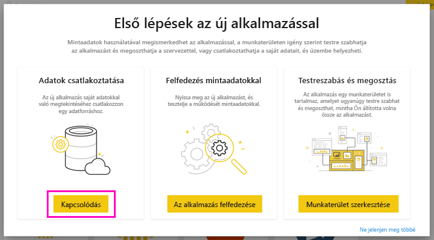
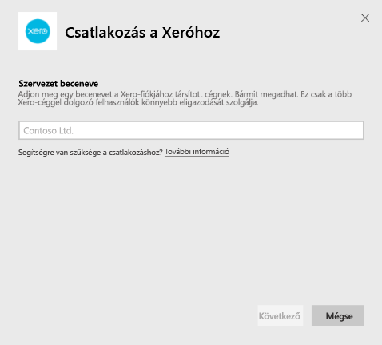
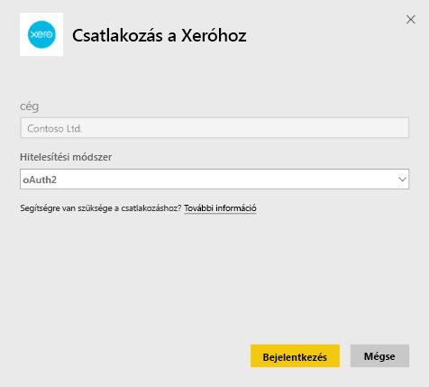
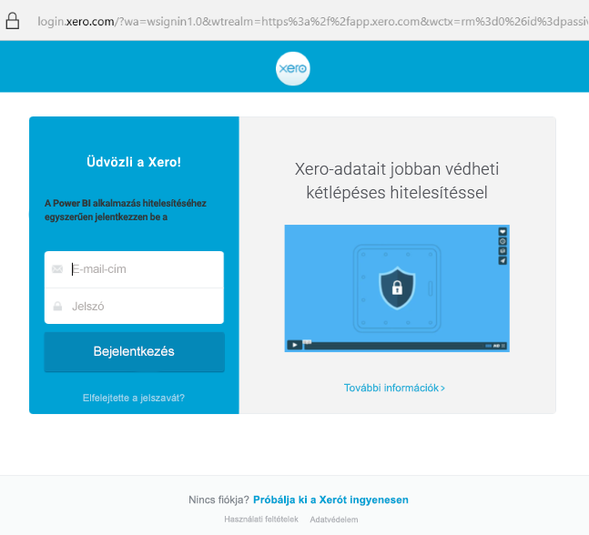

# Csatlakozás a Xerohoz a Power BI szolgáltatással
A Xero egy egyszerűen használható online számlázóprogram, amelyet kifejezetten kisvállalkozások számára terveztek. Ezzel a Power BI-sablonalkalmazással lenyűgöző vizualizációkat készíthet a Xero pénzügyi adatai alapján. Az alapértelmezett irányítópulton számos kisvállalati mérőszám található, többek között a likviditás, a bevétel és kiadások, az eredménytrend, a kintlévőség-behajtási arányszám és a megtérülés.

Kapcsolódjon a Power BI-hoz készült [Xero-sablonalkalmazáshoz](https://app.powerbi.com/getdata/services/xero), vagy tudjon meg többet a [Xero és a Power BI](https://help.xero.com/Power-BI) integrációjáról.

## Csatlakozás

[!INCLUDE [powerbi-service-apps-get-more-apps](../includes/powerbi-service-apps-get-more-apps.md)]

3. Válassza a **Xero** \> **Letöltés most** lehetőséget.
4. A **Telepíti ezt a Power BI-alkalmazást?** területen válassza a **Telepítés** lehetőséget.

    

4. Az **Alkalmazások** panelen válassza a **Xero** csempét.

   

6. **Az új alkalmazás használatának első lépései** résznél válassza az **Csatlakozás** lehetőséget.

    

4. Adjon meg egy becenevet a Xero-fiókjához társított szervezetnek. Bármit megadhat, ez csak a több Xero-szervezettel dolgozó felhasználók könnyebb eligazodását szolgálja. A [paraméterek keresésével](#FindingParams) kapcsolatos részleteket a cikk későbbi részében találja.

    

5. A **Hitelesítési módszer** értékeként válassza az **OAuth** lehetőséget. Amikor a rendszer kéri, jelentkezzen be a Xero-fiókjába, majd válassza ki azt a szervezetet, amelyhez kapcsolódni szeretne. A bejelentkezés után válassza a **Bejelentkezés** lehetőséget a betöltés megkezdéséhez.
   
    
   
    
6. A jóváhagyás után automatikusan megkezdődik az importálási folyamat. Ha befejeződött, a navigációs ablaktáblán megjelenik egy új irányítópult, jelentés és modell. Válassza ki az irányítópultot az importált adatok megtekintéséhez.
   
     

**Mi a következő lépés?**

* [Kérdéseket tehet fel a Q&A mezőben](../consumer/end-user-q-and-a.md) az irányítópult tetején.
* [Módosíthatja az irányítópult csempéit](../create-reports/service-dashboard-edit-tile.md).
* [Kiválaszthatja valamelyik csempét](../consumer/end-user-tiles.md) a mögöttes jelentés megnyitásához.
* Noha az adatkészlet napi frissítésre van ütemezve, módosíthatja a frissítési ütemezést, vagy igény szerint frissíthet az **Azonnali frissítés** gombbal.

## Tartalom
A sablonalkalmazásban lévő irányítópulton több területet felölelő csempék és metrikák találhatóak, a hozzájuk tartozó, további tájékoztatást nyújtó jelentésekkel:  

| Terület | Irányítópult csempéi | Jelentés |
| --- | --- | --- |
| Pénz |Napi pénzforgalom  Bevétel  Kiadás  Számlánkénti záróegyenleg  Mai záróegyenleg |Bankszámlák |
| Ügyfél |Számlázott eladások  Számlázott eladások ügyfelenként  Számlázott eladások növekedési trendje  Esedékes számlák  Függőben lévő követelések  Lejárt követelések |Ügyfél  Leltár |
| Szállító |Számlázott beszerzések  Számlázott beszerzések szállító szerint  Számlázott beszerzések növekedési trendje   Esedékes számlák  Függőben lévő kötelezettségek  Lejárt kötelezettségek |Szállítók  Leltár |
| Leltár |Havi eladott mennyiség termékenként |Leltár |
| Eredmény |Havi eredmény  Nettó nyereség ebben a pénzügyi évben  Nettó nyereség ebben a hónapban  Legnagyobb költségszámlák |Eredmény |
| Mérleg |Eszközök összesen  Kötelezettségek összesen  Tőke |Mérleg |
| Egészség |Aktuális arány  Bruttó nyereség százalékban   Megtérülés az összes eszközön  Az összes kötelezettség és a tőke aránya |Egészség  Szószedet és technikai megjegyzések |

Az adatkészlet a következő táblákat is tartalmazza a jelentések és irányítópultok testre szabásához:  

* Címek  
* Riasztások  
* Banki kivonat napi egyenlege  
* Banki kivonatok  
* Kapcsolattartók  
* Kiadási jogcímek  
* Értékesítési számlasor-elemek  
* Számlák  
* Elemek  
* Hónap vége  
* Szervezet  
* Főkönyvi kivonat  
* Xero-fiókok

## Rendszerkövetelmények
A Xero-sablonalkalmazás eléréséhez a következő szerepkörök szükségesek: „Standard + Reports” vagy „Advisor”.

## Paraméterek helye
Adjon meg egy nevet, amelyen a szervezetet nyomon tudja követni a Power BI-ban. Egyedi név használata esetén több különböző szervezethez is kapcsolódhat. Nem kapcsolódhat többször ugyanahhoz a szervezethez, mert ez befolyással van az ütemezett frissítésre.   

## Hibaelhárítás
* A Xero-felhasználóknak a következő szerepkörökkel kell rendelkezniük a Power BI-hoz készült Xero-sablonalkalmazás eléréséhez: „Standard + Reports” vagy „Advisor”. A sablonalkalmazás a felhasználói engedélyektől függően biztosít hozzáférést a jelentésadatokhoz a Power BI-ban.
* A betöltés idejére az irányítópult csempéi általános betöltési állapotba kerülnek. A betöltés teljes befejeződéséig az állapotuk nem változik. Ha megkapja az értesítést a betöltés befejezéséről, de a csempék továbbra is töltést jeleznek, akkor próbálja meg frissíteni az irányítópult csempéit a jobb felső sarokban lévő három pont (...) használatával.
* Ha a sablonalkalmazás frissítése sikertelen, ellenőrizze, hogy nem kapcsolódott-e többször ugyanahhoz a szervezethez a Power BI-ban. A Xero csak egy aktív kapcsolatot engedélyez egy adott szervezettel, és ha többször kapcsolódik ugyanahhoz a szervezethez, akkor megjelenhet egy hibaüzenet, amely szerint a hitelesítő adatai nem érvényesek.  
* A Power BI-hoz készült Xero-sablonalkalmazás kapcsolódásakor tapasztalt probléma, például hibaüzenet vagy lassú betöltés esetén először ürítse ki a gyorsítótárat/törölje a cookie-kat, indítsa újra a böngészőt, majd kapcsolódjon újra a Power BI-hoz.  

Más, tartósan fennálló probléma esetén küldjön hibajegyet a https://support.powerbi.com webhelyen.

## Következő lépések
[Első lépések a Power BI-ban](../fundamentals/service-get-started.md)

[Adatok lekérése a Power BI-ban](service-get-data.md)
