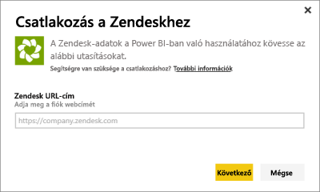
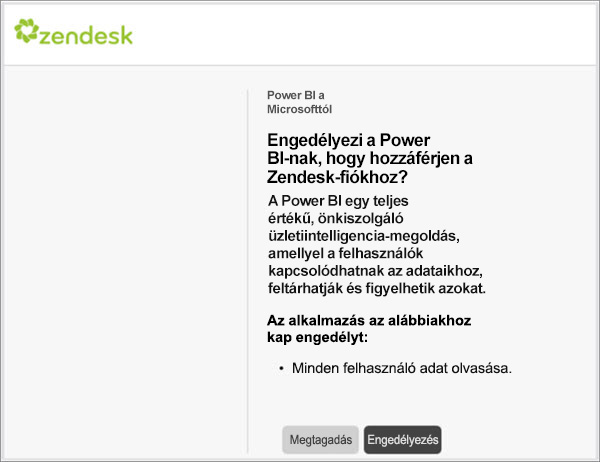

# Csatlakozás a Zendeskhez a Power BI segítségével

Ez a cikk részletesen bemutatja, hogyan kérhet le adatokat a Zendesk-fiókjáról egy Power BI-sablonalkalmazással. A Zendesk-alkalmazás egy Power BI-irányítópultot és néhány Power BI-jelentést kínál, amelyek hibajegyek és ügynöki teljesítmények elemzésében segítenek. Az adatokat naponta egyszer automatikusan frissíti a rendszer. 

A sablonalkalmazás telepítése után az irányítópultot és a jelentést személyre is szabhatja, hogy az Ön számára legfontosabb információk legyenek kiemelve. Ezután alkalmazásként terjesztheti a szervezeti munkatársai között.

Csatlakozzon a [Zendesk-sablonalkalmazáshoz](https://app.powerbi.com/getdata/services/zendesk), vagy olvasson még többet a [Zendesk](https://powerbi.microsoft.com/integrations/zendesk) és a Power BI integrációjáról.

A sablonalkalmazás telepítése után módosíthatja az irányítópultot és a jelentést. Ezután alkalmazásként terjesztheti a szervezeti munkatársai között.

>[!NOTE]
>A csatlakozáshoz Zendesk-rendszergazdai fiók szükséges. A [követelményekkel](#system-requirements) kapcsolatos további információkat lásd alább.

## Csatlakozás

[!INCLUDE [powerbi-service-apps-get-more-apps](../includes/powerbi-service-apps-get-more-apps.md)]

3. Válassza a **Zendesk** \> **Letöltés most** lehetőséget.
4. A **Telepíti ezt a Power BI-alkalmazást?** területen válassza a **Telepítés** lehetőséget.
4. Az **Alkalmazások** panelen válassza a **Zendesk** csempét.

    

6. **Az új alkalmazás használatának első lépései** résznél válassza az **Csatlakozás** lehetőséget.

    

4. Adja meg a fiókjához társított URL-címet. Az URL-cím formátuma a következő: **https://company.zendesk.com** . A [paraméterek fellelhetőségével](#finding-parameters) kapcsolatos információt lásd alább.
   
   

5. Amikor a rendszer kéri, adja meg Zendesk-fiókja hitelesítő adatait.  Válassza ki az **oAuth 2** hitelesítési mechanizmust, és kattintson a **Bejelentkezés** elemre. Kövesse a Zendesk hitelesítési folyamatát. (Ha már bejelentkezett a Zendeskbe a böngészőjében, akkor a rendszer nem feltétlenül kéri a hitelesítő adatait.)
   
   > [!NOTE]
   > Ez a sablonalkalmazás megköveteli, hogy egy Zendesk-rendszergazdai fiókkal csatlakozzon. 
   > 
   
   
6. Zendesk-adatai eléréséhez kattintson az **Engedélyezés** gombra.
   
   
7. Az importálás megkezdéséhez kattintson a **Csatlakozás** lehetőségre. 
8. Miután a Power BI importálta az adatokat, megjelenik a Zendesk alkalmazás tartalomlistája: egy új irányítópult, jelentés és adathalmaz.
9. A feltárási folyamat elindításához válassza ki az irányítópultot.

    
   
## Az alkalmazás módosítása és terjesztése

Telepítette a Zendesk-sablonalkalmazást. Ez azt jelenti, hogy létrehozta a Zendesk-munkaterületet is. A munkaterületen módosíthatja a jelentést és az irányítópultot, majd *alkalmazásként* terjesztheti azt a szervezet munkatársainak. 

1. Az új Zendesk-munkaterület teljes tartalmának megtekintéséhez a navigációs ablaktáblán válassza a **Munkaterületek** > **Zendesk** lehetőséget. 

    

    Ez a nézet a munkaterület tartalomlistája. A jobb felső sarokban látható az **App frissítése** elem. Ha készen áll terjeszteni az alkalmazást a munkatársainak, nekiláthat. 

    

2. Válassza a **Jelentések** és az **Adatkészletek** lehetőséget a munkaterület egyéb elemeinek megtekintéséhez.

    További információ az [alkalmazások terjesztéséről](../collaborate-share/service-create-distribute-apps.md).

## Rendszerkövetelmények
A Zendesk-sablonalkalmazás eléréséhez Zendesk-rendszergazdai fiók szükséges. Ha Ön ügynök vagy végfelhasználó, és szeretné megtekinteni Zendesk-adatait, írja meg javaslatát, és értékelje a [Power BI Desktop](desktop-connect-to-data.md) Zendesk-összekötőjét.

## Paraméterek helye
A Zendesk-URL-cím megegyezik azzal, amelyet a Zendesk-fiókjába való belépéshez használ. Ha nem biztos a Zendesk-URL-címében, használhatja a Zendesk [bejelentkezési súgóját](https://www.zendesk.com/login/).

## Hibaelhárítás
Ha csatlakozási problémába ütközik, ellenőrizze Zendesk-URL-címét, és győződjön meg arról, hogy Zendesk-rendszergazdai fiókot használ.

## Következő lépések

* [Új munkaterületek létrehozása a Power BI-ban](../collaborate-share/service-create-the-new-workspaces.md)
* [Alkalmazások telepítése és használata a Power BI-ban](../consumer/end-user-apps.md)
* [Csatlakozás külső szolgáltatásokhoz készült Power BI-alkalmazásokhoz](service-connect-to-services.md)
* Kérdése van? [Kérdezze meg a Power BI közösségét](https://community.powerbi.com/)
