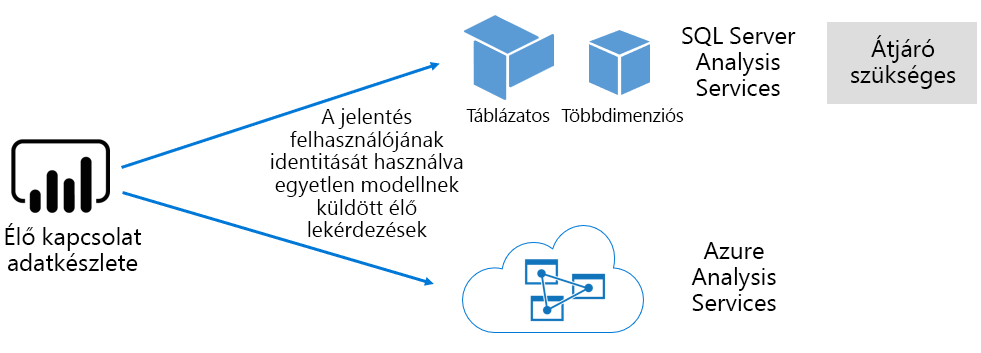

# Adathalmazok a Power BI szolgáltatásban

Ez a cikk a Power BI-adathalmazok technikai ismertetését nyújtja.

## Adathalmaz-típusok

A Power BI-adathalmazok a jelentések és vizualizációk készítéshez alkalmas adatforrásokat képviselik. Az öt különböző adathalmaz-típus a következő módokon hozható létre:

- Csatlakozás olyan meglévő adatmodellhez, amely nem Power BI-kapacitásban van üzemeltetve
- Modellt tartalmazó Power BI Desktop-fájl feltöltése
- Excel-munkafüzet feltöltése (amely egy vagy több Excel-táblázatot és/vagy munkafüzet-adatmodellt tartalmaz), vagy CSV- (vesszővel tagolt értékeket tartalmazó) fájl feltöltése
- [Leküldéses adathalmaz](../developer/automation/walkthrough-push-data.md) létrehozása a Power BI szolgáltatással
- [Streamelési vagy hibrid streamelési adathalmaz](service-real-time-streaming.md) létrehozása a Power BI szolgáltatással

A streamelési adathalmazok kivételével az adathalmazok egy adatmodellt képviselnek, amely az [Analysis Services](/analysis-services/analysis-services-overview) kiforrott modellezési technológiáit hasznosítja.

> [!NOTE]
> A dokumentáció az _adathalmaz_ és a _modell_ kifejezést olykor felcserélhető értelemben használja. Általánosságban a Power BI szolgáltatás szempontjából **adathalmaznak**, fejlesztési szempontból pedig **modellnek** nevezzük őket. A dokumentációban ezek szinte teljesen ugyanazt jelentik.

### Külső üzemeltetésű modellek

A külső üzemeltetetésű modelleknek két típusa van: SQL Server Analysis Services és [Azure Analysis Services](/azure/analysis-services/analysis-services-overview).

Egy SQL Server Analysis Services-modellhez való csatlakozáshoz telepíteni kell a [helyszíni adatátjárót](service-gateway-onprem.md), akár helyszíni, akár virtuális gépen üzemeltetett szolgáltatott infrastruktúra (IaaS). Az Azure Analysis Services nem igényel átjárót.

Gyakran érdemes az Analysis Serviceshez csatlakozni akkor, ha már léteznek kidolgozott modellek, általában egy vállalati adattárház (EDW) részeként. A Power BI képes _élő kapcsolatot_ létrehozni az Analysis Servicesszel, a Power BI-jelentés felhasználójának identitásával érvényesítve az adatokra vonatkozó engedélyeket. Az SQL Server Analysis Serviceshez a többdimenziós modellek (kockák) és táblázatos modellek is támogatottak. Ahogyan az alábbi ábrán látható, az élő kapcsolatú adathalmaz külső üzemeltetetésű modelleknek ad át lekérdezéseket.

### A Power BI Desktopban kifejlesztett modellek

A Power BI Desktop – egy Power BI-fejlesztésre szánt ügyfélalkalmazás – felhasználható modell fejlesztésére. A modell lényegében egy táblázatos Analysis Services-modell. Modellek fejleszthetők adatok adatfolyamokból való importálásával, majd külső adatforrásokkal való integrálásával. Bár a modellkészítés kivitelezésének részletei kívül esnek ennek a cikknek a témakörén, fontos tisztában lenni azzal, hogy a Power BI Desktop használatával fejleszthető modelleknek három különböző típusa vagy _módja_ létezik. Ezek a módok határozzák meg, hogy az adatok importálva vannak-e a modellbe, vagy az adatforrásban maradnak. Ez a három mód a következő: Importálás, DirectQuery és Összetett. Az egyes módokról az [Adathalmaz-módok a Power BI szolgáltatásban](service-dataset-modes-understand.md) című cikk ír bővebben.

A külső üzemeltetésű modellek és a Power BI Desktop-modellek sorszintű biztonság (RLS) érvényesítésével korlátozhatják az egyes felhasználók által lekérhető adatok körét. Az **Értékesítők** biztonsági csoporthoz rendelt felhasználók például csak annak az értékesítési körzetnek a jelentésadatait tekinthetik meg, amelyhez hozzá vannak rendelve. Az RLS-szerepkörök lehetnek _dinamikusak_ és _statikusak_. A dinamikus szerepkörök a jelentés felhasználója szerint szűrnek, a statikus szerepkörök viszont ugyanazt a szűrőt alkalmazzák a szerepkörhöz rendelt összes felhasználónál. További információ: [Sorszintű biztonság (RLS) a Power BI-ban](../admin/service-admin-rls.md).

### Excel-munkafüzet-modellek

Adathalmaz [Excel-munkafüzetek](service-excel-workbook-files.md) vagy [CSV-fájlok](service-comma-separated-value-files.md) alapján történő létrehozása együtt jár egy modell automatikus létrehozásával. A modell tábláinak létrehozásához az Excel-táblázatok és a CSV-fájlok adatai lesznek importálva, az Excel-munkafüzet adatmodellje pedig transzponálva lesz a Power BI-modell létrehozásához. A fájlokban lévő adatok minden esetben a modellbe lesznek importálva.

## Összefoglalás

A modelleket képviselő Power BI-adathalmazok között a fentiek szerinti megkülönböztetéseket tehetjük:

- Vagy a Power BI szolgáltatásban vannak üzemeltetve, vagy külsőleg az Analysis Services által.
- Tárolhatnak importált adatokat, kiadhatnak továbbított lekérdezéseket a mögöttes adatforrásoknak, vagy használhatják e kettőt vegyesen.

Az alábbiakban összefoglaljuk a modelleket képviselő Power BI-adathalmazokkal kapcsolatos fontos tényeket:

- Az SQL Server Analysis Services által üzemeltetett modellek átjárót igényelnek az élő kapcsolatú lekérdezések végrehajtásához.
- A Power BI által üzemeltetett, az adatokat importáló modellek:
  - Csak a memóriába teljesen betöltve kérdezhetők le.
  - Frissítést igényelnek az adatok naprakészen tartásához, és átjáróra van szükség hozzájuk, ha a forrásadatok nem érhetők el közvetlenül az interneten.
- A Power BI által üzemeltetett, [DirectQuery](desktop-directquery-about.md) tárolási módot használó modelleknek szükségük van a forrásadatokkal való kapcsolatra. A modell lekérdezésekor a Power BI a forrásadatokhoz küldött lekérdezésekkel kér le aktuális adatokat. Ehhez a módhoz átjárókra van szükség, ha a forrásadatok nem érhetők el közvetlenül az interneten.
- A modellek RLS-szabályok használatával az egyes felhasználók adathozzáférését korlátozó szűrőket juttathatnak érvényre.

## Megfontolandó szempontok

A Power BI sikeres üzembe helyezéséhez és felügyeletéhez fontos tisztában lenni a modellek üzemeltetési helyével, tárolási módjukkal, az átjáróktól való függőségekkel, az importált adatok mennyiségével, valamint a frissítés típusával és gyakoriságával. Ezek a konfigurációk mind jelentős hatással lehetnek a Power BI-kapacitás erőforrásaira. Ezen felül a szempontok közé sorolandó a modell kivitele, beleértve az adatelőkészítési lekérdezéseket, kapcsolatokat és számításokat.

Azt is fontos tudni, hogy a Power BI által üzemeltetett Importálás módú modellek frissítése történhet ütemezés szerint, vagy indítható igény szerint a felhasználó által a Power BI szolgáltatásban.

## Következő lépések

- [Adathalmaz-módok a Power BI szolgáltatásban](service-dataset-modes-understand.md)
- További kérdései vannak? [Kérdezze meg a Power BI közösségét](https://community.powerbi.com/)
