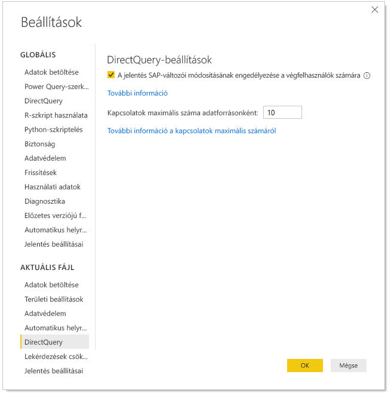
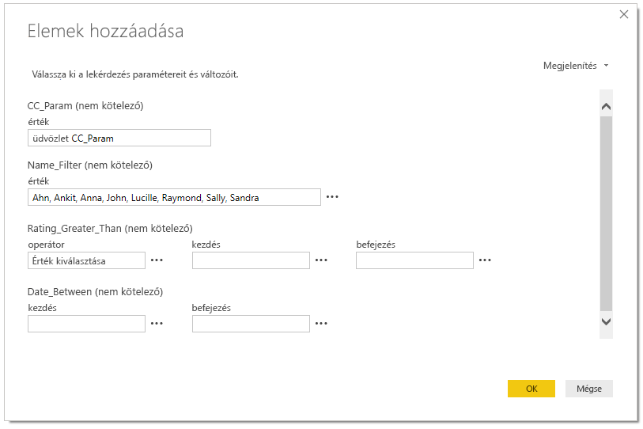
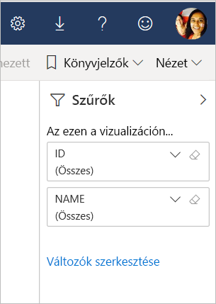

# SAP-változók szerkesztése a Power BI szolgáltatásban

Az SAP Business Warehouse vagy az SAP HANA DirectQueryvel való használatakor a jelentéskészítők mostantól szerkeszteni tudják az SAP-változókat a **Power BI szolgáltatásban** prémium szintű és megosztott munkaterületek esetén. Ez a funkció NEM működik a Saját munkaterület Velem megosztva lapján lévő jelentéseknél, valamint a V1 munkaterületekről létrehozott alkalmazásoknál. 

Ez a dokumentum a változók Power BI-beli szerkesztésének feltételeit, a funkció engedélyezését és a Power BI szolgáltatás változók szerkesztésére alkalmas részét ismerteti.

## SAP-változók szerkesztésének előfeltételei

Az SAP-változók szerkesztésére alkalmas funkció használatának van néhány előfeltétele. A következő lista ezeket a követelményeket sorolja fel.

**Szükséges az új szűrési felület** – a jelentéshez engedélyezve kell lennie az [új szűrési felületnek](../create-reports/power-bi-report-filter.md). Ezt a következőképpen engedélyezheti a jelentéshez a Power BI Desktopban:
- A Power BI Desktopban válassza a **Fájl** > **Lehetőségek és beállítások** > **Beállítások** lehetőséget.
- A navigációs panelen az **Aktuális fájl** területen válassza a **Jelentésbeállítások** szakaszt.
- A **Szűrési felület** területen válassza a **Frissített szűrőpanel engedélyezése** lehetőséget.

**DirectQuery-kapcsolatok szükségesek** – az SAP-adatforráshoz DirectQuery használatával kell kapcsolódni. Az Importálás módú kapcsolódás nem támogatott.

**SSO beállítása szükséges** – a funkció működéséhez konfigurálva kell lennie az egyszeri bejelentkezésnek (SSO). További információt az [egyszeri bejelentkezés (SSO) áttekintésében](service-gateway-sso-overview.md) talál.

**Új átjáró-összetevők szükségesek** – Töltse le a legújabb átjárót és frissítse a meglévő átjárót. További információt a [szolgáltatás-átjáró](service-gateway-onprem.md) leírásában talál.

**SAP HANA esetén többdimenziós forrás szükséges** – SAP HANA esetén az SAP-változók szerkesztésének funkciója csak többdimenziós modellekkel működik, relációs forrásokkal nem.

**Szuverén felhőkben nem támogatott** – A Power Query Online jelenleg nem érhető el szuverén felhőben, ezért ez a funkció szuverén felhőkben nem támogatott.

## A funkció engedélyezése

Az **SAP-változók szerkesztése** funkció engedélyezéséhez csatlakozzon egy SAP HANA- vagy SAP BW-adatforráshoz a Power BI Desktopban. Ez után nyissa meg a **Fájl > Lehetőségek és beállítások > Beállítások** panelt, és a bal oldali panel aktuális fájl szakaszában válassza a **DirectQuery** lehetőséget. Ennek kiválasztásakor a jobb oldali panelen megjelennek a DirectQuery beállítási lehetőségei, és egy **A végfelhasználók módosíthatják az SAP-változókat a jelentésben** jelölőnégyzetet, ahogyan az alábbi ábrán látható.

## SAP-változók szerkesztése a Power BI Desktopban

A Power BI Desktopban az SAP-változók szerkesztése funkcióval úgy szerkesztheti a változókat, hogy a Változók szerkesztése elemet választja a menüszalagon a **Lekérdezések szerkesztése** menüből. Ezzel megnyílik az alábbi párbeszédpanel. Ez a funkció a Power BI Desktopban már elérhető egy ideje. A jelentéskészítők az alábbi párbeszédpanelen választhatják ki a változókat a jelentéshez.

## SAP-változók szerkesztése a szolgáltatásban

A jelentés Power BI szolgáltatásban történő közzétételét követően a felhasználók már láthatják a **Változók szerkesztése** hivatkozást az új Szűrés panelen. Ha először teszi közzé a jelentést, akár 5 perc is eltelhet a Változók szerkesztése hivatkozás megjelenéséig. Ha a hivatkozás nem jelenik meg, akkor manuálisan kell frissítenie az adathalmazt.
Ezt a következő módon teheti meg:

1. A Power BI szolgáltatásban válassza az **Adathalmazok** fület egy munkaterület tartalomlistájában.

2. Keresse meg az adathalmazt, amelyet frissítenie kell, majd válassz a **Frissítés** ikont.

    

3. A Változók szerkesztése hivatkozás kiválasztásakor megnyílik a **Változók szerkesztése** párbeszédablak, amelyben a felhasználók felülírhatják a változókat. Az **Alaphelyzetbe állítás** gomb visszaállítja a változók eredeti értékeit, amelyek a párbeszédpanel megnyitásakor jelentek meg.

    

4. A **Változók szerkesztése** panelen végzett módosítások csak az aktuális felhasználó számára maradnak meg (a Power BI többi megőrzési viselkedéséhez hasonlóan). Az alábbi képen bemutatott **Alapértelmezések visszaállítása** lehetőség választása visszaállítja a jelentés készítője által kialakított állapotot a változókkal együtt.

    

Ha SAP HANA-t vagy SAP BW-t használó közzétett jelentésen dolgozik a Power BI szolgáltatásban, és a **Változók szerkesztése** funkció engedélyezve van, a jelentés tulajdonosa megváltoztathatja ezeket az alapértelmezéseket. A jelentés tulajdonosa szerkesztési módban módosíthatja a változókat, majd a jelentés mentésével engedélyezi, hogy ezek a beállítások legyenek a jelentés *új alapértelmezett beállításai*. A jelentéshez az annak tulajdonosa által végrehajtott ilyen módosítás után hozzáférő többi felhasználó az új beállításokat fogja látni alapértelmezettként.

## Következő lépések

Az SAP HANA-val, az SAP BW-vel és a DirectQueryvel kapcsolatos további információkat talál az alábbi cikkekben:

- [Az SAP HANA használata a Power BI Desktopban](desktop-sap-hana.md)
- [DirectQuery és SAP Business Warehouse (BW)](desktop-directquery-sap-bw.md)
- [DirectQuery és SAP HANA](desktop-directquery-sap-hana.md)
- [DirectQuery használata a Power BI-ban](desktop-directquery-about.md)
