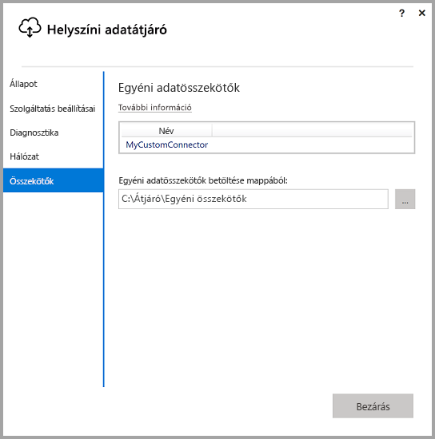
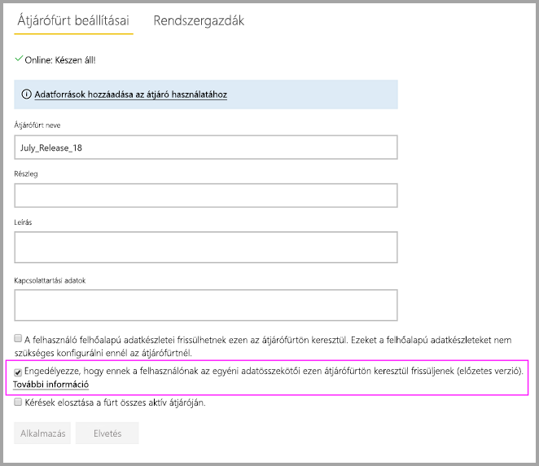

# Egyéni adatösszekötők használata a helyszíni adatátjáróval

[!INCLUDE [gateway-rewrite](../includes/gateway-rewrite.md)]

A Power BI-hoz készült adatösszekötőkkel alkalmazásokból, szolgáltatásokból vagy adatforrásokból származó adatokhoz csatlakozhat és férhet hozzá. Egyéni adatösszekötőket készíthet, és használhatja azokat a Power BI Desktopban.

Egyéni adatösszekötők Power BI-hoz való fejlesztéséről a [Data Connector SDK GitHub-oldalán](https://aka.ms/dataconnectors) olvashat. Ez a webhely az első lépésekre vonatkozó információkat, valamint a Power BI-hoz és a Power Queryhez készült mintákat tartalmazza.

Ha egyéni adatösszekötőket használó jelentéseket készít a Power BI Desktopban, akkor azokat a helyszíni adatátjáró használatával frissítheti a Power BI szolgáltatásból.

## A képesség engedélyezése és használata

A helyszíni adatátjáró 2018. júliusi vagy újabb verziójának telepítése során egy **Összekötők** lapot talál a helyszíni adatátjáró alkalmazásban. Az **Egyéni adatösszekötők betöltése mappából** mezőben megadhat egy mappát, amelyből az egyéni összekötők be lesznek töltve. Az alapértelmezett felhasználó *NT SERVICE\PBIEgwService*. Az átjáró automatikusan betölti az ebben a mappában található egyéni összekötőfájlokat. Ezek az adatösszekötők listájában jelennek meg.

Ha a (privát) helyszíni adatátjárót használja, akkor fel tudja tölteni Power BI-jelentését a Power BI szolgáltatásba, és frissítheti azt az átjáró használatával.

A helyszíni adatátjáró esetén az egyéni összekötőhöz létre kell hozni egy adatforrást. A Power BI szolgáltatás Átjáróbeállítások oldalán az átjárófürt kijelölésekor meg kell jelennie egy lehetőségnek, amellyel engedélyezheti egyéni összekötők használatát a fürthöz. Ez a beállítás csak akkor lesz elérhető, ha a fürthöz tartozó összes átjáró rendelkezik a 2018. júliusi vagy annál újabb frissítéssel. A lehetőség bejelölésével engedélyezi az egyéni összekötők használatát a fürthöz.

Ha ezt a beállítást engedélyezte, akkor egyéni összekötői megjelennek az átjárófürt alatt létrehozható adatforrásként. Miután létrehoz egy adatforrást az új egyéni összekötővel, már használhatja ezt az egyéni összekötőt a Power BI szolgáltatásban a Power BI-jelentések frissítésére.

## Megfontolandó szempontok és korlátozások

* Gondoskodjon arról, hogy háttérbeli átjárószolgáltatás hozzáférjen a létrehozott mappához. A felhasználók Windows-mappáin belüli mappák és a rendszermappák általában nem lesznek hozzáférhetők. A helyszíni adatátjáró alkalmazás üzenetet jelenít meg, ha a mappa nem érhető el. Ez az utasítás a (privát) helyszíni adatátjáróra nem vonatkozik.
* Ahhoz, hogy egy egyéni összekötő működjön a helyszíni adatátjáróval, a kódjában lennie kell egy „TestConnection” szakasznak. Ez a szakasz nem szükséges akkor, ha az egyéni összekötőt a Power BI Desktoppal használja. Éppen ezért létezhet olyan összekötő, amely a Power BI Desktoppal működik, az átjáróval viszont nem. A TestConnection szakasz megírásáról [ebből a dokumentációból](https://github.com/Microsoft/DataConnectors/blob/master/docs/m-extensions.md#implementing-testconnection-for-gateway-support) tájékozódhat.
* Az átjárókon keresztül üzemeltetett egyéni összekötőkhöz egyelőre csak az átjárók rendszergazdái használhatják az OAuth protokollt, más adatforrás-felhasználók nem.

## További lépések

* [Adatforrások kezelése – Analysis Services](service-gateway-enterprise-manage-ssas.md)  
* [Az adatforrás kezelése – SAP HANA](service-gateway-enterprise-manage-sap.md)  
* [Adatforrások kezelése – SQL Server](service-gateway-enterprise-manage-sql.md)  
* [Adatforrások kezelése – Oracle](service-gateway-onprem-manage-oracle.md)  
* [Adatforrások kezelése – Importálás/ütemezett frissítés](service-gateway-enterprise-manage-scheduled-refresh.md)
* [Helyszíni adatátjáró proxybeállításainak konfigurálása](/data-integration/gateway/service-gateway-proxy)
* [A Kerberos használata a Power BI-ból a helyszíni adatforrásokba történő egyszeri bejelentkezéshez (SSO)](service-gateway-sso-kerberos.md)  

Több kérdése van? Forduljon a [Power BI közösségéhez](https://community.powerbi.com/).
