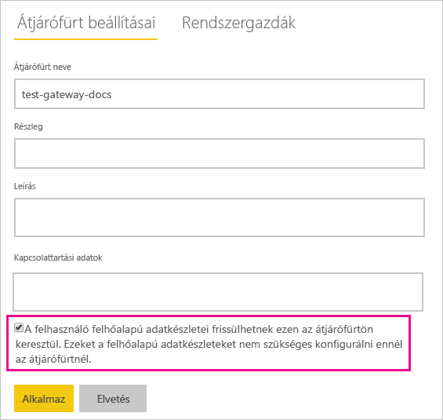

# Helyszíni és felhőbeli adatforrások egyesítése vagy összefűzése

[!INCLUDE [gateway-rewrite](../includes/gateway-rewrite.md)]

A helyszíni adatátjáró használata a helyszíni és a felhőbeli adatforrások egyesítésére vagy összeűzésére egyetlen lekérdezésbe. Ez a megoldás olyankor hasznos, ha különböző adatforrásokból kíván adatokat egyesíteni, de nem szeretne több külön lekérdezést használni.

>[!NOTE]
>Ez a cikk csak olyan adatkészletekre vonatkozik, amelyekben egyesítve vagy hozzáfűzve, egyetlen lekérdezésben szerepelnek a felhőbeli és a helyszíni adatforrások. A különálló lekérdezéseket (egy helyszíni, illetve egy felhőbeli adatforráshoz csatlakozó lekérdezést) tartalmazó adatkészletek esetén a felhőbeli adatforrást alkalmazó lekérdezést a rendszer nem az átjárón keresztül hajtja végre.

## Előfeltételek

- A helyi számítógépen [telepített átjáró](/data-integration/gateway/service-gateway-install).
- Egy Power BI Desktop-fájl, amely helyszíni és felhőbeli adatforrásokat kombináltan használó lekérdezéseket tartalmaz.

>[!NOTE]
>A felhőbeli adatforrások eléréséhez biztosítania kell az átjárónak az adatforrásokhoz való hozzáférést.

1. Válassza a Power BI szolgáltatás jobb felső sarkában lévő fogaskerék ikont  > **Átjárók kezelése**.

    

2. Válassza ki a konfigurálni kívánt átjárót.

3. Az **Átjárófürt beállításai** fülön válassza **Az ezen átjárófürtön keresztüli frissítés engedélyezése a felhasználó felhőalapú adatforrásai számára** > **Alkalmaz** lehetőséget.

    

4. Az átjárófürtnél vegye fel a lekérdezésekben használt [helyszíni adatforrásokat](service-gateway-enterprise-manage-scheduled-refresh.md#add-a-data-source). A felhőbeli adatforrásokat nem szükséges itt megadnia.

5. Töltse fel a helyszíni és felhőbeli adatforrásokat kombináltan használó lekérdezéseket tartalmazó Power BI Desktop-fájlt a Power BI szolgáltatásba.

6. Az új adathalmazhoz tartozó **Adathalmaz beállításai** lapon:

   - A helyszíni adatforrásnál válassza ki az adatforráshoz társított átjárót.
   - Az **Adatforrás azonosító adatai** szakasznál szükség szerint módosítsa az adatforrás azonosító adatait.

    Ügyeljen arra, hogy a felhőbeli és a helyszíni adatforrások adatvédelmi szintje is megfelelően legyen beállítva, így az összekapcsolások kezelése biztonságos maradhat.

     

7. Most, hogy beállította a felhőbeli hitelesítéseket, a **Frissítés most** lehetőség választásával azonnal frissítheti az adathalmazt. De ütemezhet rendszeres frissítést is.

## További lépések

Az átjárók adatfrissítésével kapcsolatban további információt [Az adatforrás használata ütemezett frissítéshez](service-gateway-enterprise-manage-scheduled-refresh.md#use-the-data-source-for-scheduled-refresh) című cikkben talál.
