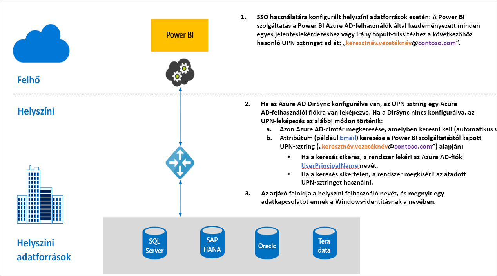

# Az egyszeri bejelentkezés (SSO) áttekintése a Power BI-ban található átjárókhoz

A helyszíni adatátjáró konfigurálásával zökkenőmentes egyszeri bejelentkezési kapcsolatot hozhat létre, amely lehetővé teszi a Power BI-jelentések és -irányítópultok valós idejű frissítését a helyszíni adatokból. Lehetősége van az átjáró konfigurálására a [Kerberos](service-gateway-sso-kerberos.md) korlátozott delegálással vagy a Security Assertion Markup Language ([SAML](service-gateway-sso-saml.md)) használatával. A helyszíni adatátjáró a helyszíni adatforrásokhoz csatlakozó [DirectQuery](desktop-directquery-about.md) használatával vagy frissítéshez támogatja az SSO-t. 

A Power BI az alábbi adatforrásokat támogatja:

* SQL Server (Kerberos)
* SAP HANA (Kerberos és SAML)
* SAP BW Application Server (Kerberos)
* SAP BW Message Server (Kerberos) 
* Oracle (Kerberos) 
* Teradata (Kerberos)
* Spark (Kerberos)
* Impala (Kerberos)

Az egyszeri bejelentkezés jelenleg nincs támogatva az [M-bővítményeknél](https://github.com/microsoft/DataConnectors/blob/master/docs/m-extensions.md).

Ha egy felhasználó DirectQuery-jelentést használ a Power BI szolgáltatásban, az összes keresztszűrő, szeletelő, rendezés és szerkesztési művelet olyan lekérdezéseket eredményezhet, amelyek az alapul szolgáló helyszíni adatforrásból dolgoznak. Ha az egyszeri bejelentkezés konfigurálva van az adatforráshoz, akkor a Power BI-t használó felhasználó identitása alatt futnak a lekérdezések (vagyis a webtartalmakon vagy a Power BI-mobilalkalmazásokon keresztül). Ezért minden felhasználó pontosan azokat az adatokat látja, amelyekhez engedélye van az alapul szolgáló adatforrásban. 

Olyan jelentést is konfigurálhat SSO használatára, amely a Power BI szolgáltatásban van beállítva frissítéshez. Ha ilyen adatforráshoz konfigurál SSO-t, a lekérdezések az adathalmaz tulajdonosának identitása alatt fognak futni a Power BI-ban. A frissítés ezért az adathalmaz tulajdonosának a mögöttes adatforrásbeli engedélyei alapján történik meg. Az SSO-t használó frissítés jelenleg csak a korlátozott [Kerberos](service-gateway-sso-kerberos.md)-delegálást használó adatforrásokhoz van engedélyezve 

## A lekérdezés lépései SSO futtatása esetén

Az SSO-val futó lekérdezés három lépésből áll, az alábbi ábrán látható módon.

További információk az egyes lépésekről:

1. Az egyes lekérdezésekhez a Power BI szolgáltatás hozzárendeli az *egyszerű felhasználónevet (ez a UPN*, vagyis a Power BI szolgáltatásba bejelentkezett felhasználó felhasználói neve), amikor elküldi a lekérdezési kérést a konfigurált átjáróra.

2. Az átjárónak le kell képeznie az Azure Active Directory UPN-jét egy helyi Active Directory-identitásra:

   a. Ha az Azure AD DirSync (más néven *Azure AD Connect*) konfigurálva van, akkor a leképezés automatikusan működik az átjáróban.

   b.  Ellenkező esetben az átjáró kikeresheti és leképezheti az Azure AD UPN-jét egy helyi AD-felhasználóra a helyi Active Directory-tartományra irányuló keresés végrehajtásával.

3. Az átjárószolgáltatás folyamata megszemélyesíti a leképezett helyi felhasználót, megnyitja a kapcsolatot az alapul szolgáló adatbázishoz, és elküldi a lekérdezést. Az átjárót nem kell ugyanarra a gépre telepíteni, mint az adatforrást.

## További lépések

Most, hogy megismerte az SSO átjárón történő engedélyezésének alapjait, a Kerberos és az SAML használatával kapcsolatos részletesebb információkért olvassa el az alábbi cikkeket:

* [Egyszeri bejelentkezés (SSO) – Kerberos](service-gateway-sso-kerberos.md)
* [Egyszeri bejelentkezés (SSO) – SAML](service-gateway-sso-saml.md)
